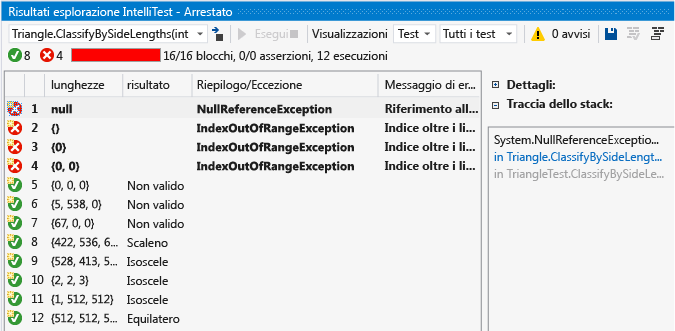
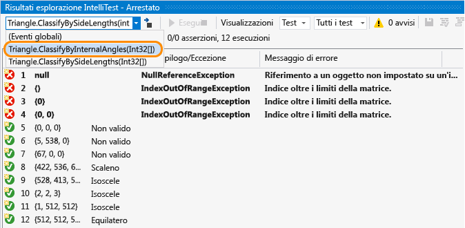
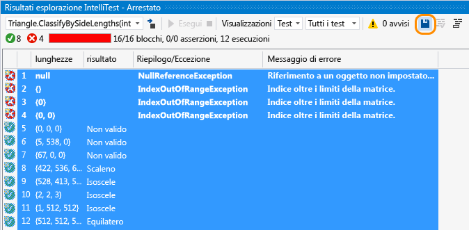
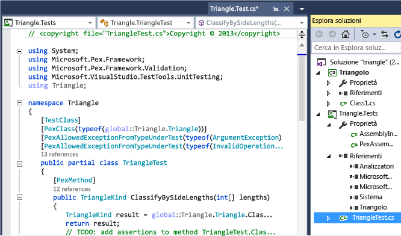
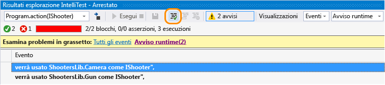
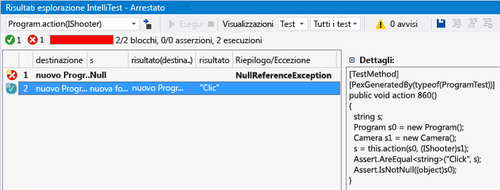

# Generare unit test per il codice con IntelliTest
[!INCLUDE[vs2017banner](../code-quality/includes/vs2017banner.md)]

IntelliTest esplora il codice .NET per generare dati di test e un gruppo di unit test. Per ogni istruzione nel codice viene generato un input di test che eseguirà l'istruzione. Viene eseguita un'analisi del caso per ogni ramo condizionale nel codice. Vengono ad esempio analizzate le istruzioni if, le asserzioni e tutte le operazioni che possono generare eccezioni. Questa analisi viene usata per generare dati di test per uno unit test con parametri per ognuno dei metodi, creando unit test con un elevato code coverage.  
  
 Quando si esegue IntelliTest, è possibile visualizzare facilmente i test non superati e aggiungere l'eventuale codice necessario per correggerli. È possibile scegliere quali dei test generati salvare in un progetto di test per fornire un gruppo di regressione. Quando si modifica il codice, eseguire nuovamente IntelliTest per mantenere i test generati sincronizzati con le modifiche apportate al codice.  
  
 IntelliTest è disponibile solo per C\# e non supporta la configurazione x64.  
  
## Introduzione a IntelliTest  
 È necessario Visual Studio Enterprise.  
  
### Esplorare: usare IntelliTest per esplorare il codice e generare unit test  
 Per generare unit test, i tipi devono essere pubblici. In caso contrario, [creare unit test](#NoRun) prima di generarli.  
  
1.  Aprire la soluzione in Visual Studio. Aprire quindi il file di classe contenente i metodi da testare.  
  
2.  Fare clic con il pulsante destro del mouse nel codice e scegliere **Esegui IntelliTest** per generare gli unit test per il codice nel metodo.  
  
       
  
     IntelliTest esegue il codice più volte con input diversi. Ogni esecuzione viene rappresentata nella tabella che mostra i dati di test di input e l'output o l'eccezione risultante.  
  
       
  
     Per generare unit test per tutti i metodi pubblici di una classe, è sufficiente fare clic con il pulsante destro del mouse nella classe invece che in un metodo specifico. Quindi, scegliere **Esegui IntelliTest**. Usare l'elenco a discesa nella finestra Risultati esplorazione per visualizzare gli unit test e i dati di input per ogni metodo della classe.  
  
       
  
     Per i test che vengono superati verificare che i risultati indicati nella colonna dei risultati corrispondano a quanto previsto per il codice. Per i test che non vengono superati correggere il codice nel modo appropriato. Eseguire quindi di nuovo IntelliTest per verificare le correzioni.  
  
### Rendere persistenti: salvare gli unit test come gruppo di regressione  
  
1.  Selezionare le righe dei dati da salvare con lo unit test con parametri in un progetto di test.  
  
       
  
     È possibile visualizzare il progetto di test e lo unit test con parametri creato. I singoli unit test, corrispondenti alle singole righe, vengono salvati nel file con estensione g.cs nel progetto di test e uno unit test con parametri viene salvato nel file con estensione cs corrispondente. È possibile eseguire gli unit test e visualizzare i risultati da Esplora test come se si trattasse di unit test creati manualmente.  
  
       
  
     Al progetto di test vengono aggiunti anche gli eventuali riferimenti necessari.  
  
     Se il codice del metodo viene modificato, eseguire di nuovo IntelliTest per mantenere gli unit test sincronizzati con le modifiche apportate.  
  
### Fornire assistenza: usare IntelliTest per concentrarsi sull'esplorazione del codice  
  
1.  In presenza di codice più complesso, IntelliTest consente di concentrarsi sull'esplorazione del codice. Se ad esempio si ha un metodo che contiene un'interfaccia come parametro ed è presente più di una classe che implementa tale interfaccia, IntelliTest trova tali classi e segnala un avviso.  
  
     Visualizzare gli avvisi per decidere le azioni da intraprendere.  
  
       
  
2.  Dopo aver esaminato il codice e aver compreso le parti da testare, è possibile correggere l'avviso per consentire la scelta delle classi da usare per testare l'interfaccia.  
  
       
  
     La scelta viene quindi aggiunta nel file PexAssemblyInfo.cs.  
  
     `[assembly: PexUseType(typeof(Camera))]`  
  
3.  A questo punto è possibile eseguire di nuovo IntelliTest per generare uno unit test con parametri e dati di test usando solo la classe che è stata corretta.  
  
       
  
### Specificare: usare IntelliTest per convalidare le proprietà di correttezza specificate nel codice  
 Specificare la relazione generale tra input e output da verificare con gli unit test generati. Questa specifica viene incapsulata in un metodo simile a un metodo di test, ma universalmente quantificato. Si tratta del metodo di unit test con parametri e tutte le asserzioni effettuate devono essere mantenute per tutti i possibili valori di input che IntelliTest può generare.  
  
##   Domande e risposte  
  
### D: È possibile usare IntelliTest per il codice non gestito?  
 **R:** No, IntelliTest funziona solo con codice gestito.  
  
### D: Quando un test generato viene considerato superato o non superato?  
 **R:** Viene considerato superato come qualsiasi altro unit test se non si verificano eccezioni. Viene invece considerato non superato in caso di errori dell'asserzione o se il codice analizzato genera un'eccezione non gestita.  
  
 Se un test può essere considerato superato se vengono generate determinate eccezioni, è possibile impostare uno dei seguenti attributi in base ai requisiti a livello di metodo di test, classe di test o di assembly:  
  
-   **PexAllowedExceptionAttribute**  
  
-   **PexAllowedExceptionFromTypeAttribute**  
  
-   **PexAllowedExceptionFromTypeUnderTestAttribute**  
  
-   **PexAllowedExceptionFromAssemblyAttribute**  
  
### D: È possibile aggiungere presupposti allo unit test con parametri?  
 **R:** Sì, usare i presupposti per specificare quali dati di test non sono obbligatori per lo unit test relativo a un metodo specifico. Per aggiungere presupposti, usare la classe <xref:Microsoft.Pex.Framework.PexAssume>. Ad esempio, è possibile aggiungere un presupposto per indicare che la variabile lengths è non Null come nell'esempio seguente.  
  
 `PexAssume.IsNotNull(lengths);`  
  
 Se si aggiunge un presupposto e si esegue di nuovo IntelliTest, i dati di test che non sono più rilevanti verranno rimossi.  
  
### D: È possibile aggiungere asserzioni allo unit test con parametri?  
 **R:** Sì, IntelliTest verificherà che quanto asserito nell'istruzione è di fatto corretto durante l'esecuzione degli unit test. Per aggiungere asserzioni, usare la classe <xref:Microsoft.Pex.Framework.PexAssert> o l'API di asserzione fornita con il framework di test. Ad esempio, è possibile aggiungere un'asserzione per indicare che due variabili sono uguali.  
  
 `PexAssert.AreEqual(a, b);`  
  
 Se si aggiunge un'asserzione e si esegue di nuovo IntelliTest, verrà verificata la validità dell'asserzione e il test verrà considerato non superato se l'asserzione non è valida.  
  
###   D: È possibile generare unit test con parametri senza eseguire prima IntelliTest?  
 **R:** Sì, fare clic con il pulsante destro del mouse nella classe o nel metodo, quindi scegliere **Crea IntelliTest**.  
  
   
  
 Accettare il formato predefinito per generare i test o modificare la modalità di denominazione del progetto e dei test. È possibile creare un nuovo progetto di test o salvare i test in un progetto esistente.  
  
   
  
### D: È possibile usare altri framework di unit test con IntelliTest?  
 **R:** Sì, seguire questa procedura per [trovare e installare altri framework](../test/install-third-party-unit-test-frameworks.md). Dopo aver riavviato Visual Studio e riaperto la soluzione, fare doppio clic nella classe o nel metodo, quindi scegliere **Crea IntelliTest**. Selezionare qui il framework installato:  
  
   
  
 Eseguire quindi IntelliTest per generare i singoli unit test nei relativi file con estensione g.cs.  
  
### D: È possibile reperire maggiori informazioni sulla modalità di generazione dei test?  
 **R:** Sì, per ottenere una panoramica dettagliata, leggere questo [post di blog](http://blogs.msdn.com/b/visualstudioalm/archive/2015/07/05/intellitest-one-test-to-rule-them-all.aspx).