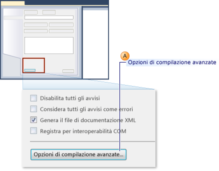
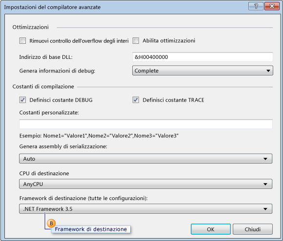
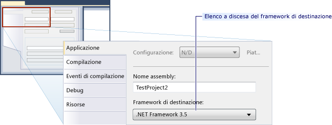

# Procedura: configurare unit test destinati a una versione precedente di .NET Framework
[!INCLUDE[vs2017banner](../code-quality/includes/vs2017banner.md)]

Quando si crea un progetto di test in Microsoft Visual Studio, la versione più recente di .NET Framework è impostata come destinazione per impostazione predefinita.  Inoltre, se si aggiornano progetti di test da versioni precedenti di Visual Studio, vengono aggiornati per l'utilizzo della versione più recente di .NET Framework.  Modificando le proprietà dei progetti, è possibile impostare in modo esplicito versioni precedenti di .NET Framework come nuova destinazione.  
  
 È possibile creare progetti di unit test destinati a versioni specifiche di .NET Framework.  La versione di destinazione deve essere 3,5 o successiva e non può essere una versione client.  Visual Studio consente di abilitare il supporto di base seguente per gli unit test con specifiche versioni come destinazione:  
  
-   Possibilità di creare progetti di unit test e impostare come destinazione versioni specifiche di .NET Framework.  
  
-   Da Visual Studio, è possibile eseguire unit test che hanno come destinazione una versione specifica del .NET Framework sul computer locale.  
  
-   È possibile eseguire unit test che hanno una versione specifica di .NET Framework tramite MSTest.exe dal prompt dei comandi.  
  
-   Possibilità di eseguire unit test in un agente di compilazione come parte di una compilazione.  
  
 **Test delle applicazioni di SharePoint**  
  
 Le funzionalità sopra elencate consentono inoltre di scrivere unit test e test di integrazione per applicazioni di SharePoint tramite Visual Studio.  [!INCLUDE[crabout](../test/includes/crabout_md.md)] come sviluppare applicazioni di SharePoint tramite Visual Studio [Creare soluzioni di SharePoint](/office-dev/office-dev/create-sharepoint-solutions), vedere [Compilazione e debug delle soluzioni SharePoint](/office-dev/office-dev/building-and-debugging-sharepoint-solutions), [Verifica e debug del codice di SharePoint](/office-dev/office-dev/verifying-and-debugging-sharepoint-code).  
  
 **Limiti**  
  
 Ai contesti in cui si reindirizza la destinazione dei progetti di test per l'utilizzo di versioni precedenti di .NET Framework, si applicano le limitazioni seguenti:  
  
-   In .NET Framework 3.5 viene supportato il multitargeting per progetti di test che contengono solo unit test.  .NET Framework 3.5 non supporta alcun altro tipo di test, ad esempio test di carico o test codificati dell'interfaccia utente.  Il reindirizzamento della destinazione risulta bloccato per i tipi di test diversi da unit test.  
  
-   L'esecuzione dei test che vengono indirizzati a una versione precedente di .NET Framework è supportata solo nell'adattatore host predefinito.  Non è invece supportata nell'adattatore host ASP.NET.  Le applicazioni ASP.NET che devono essere eseguite nel contesto del server di sviluppo ASP.NET devono essere compatibili con la versione corrente di .NET Framework.  
  
-   Il supporto della raccolta dei dati risulta disabilitato quando si eseguono test che supportano il multitargeting di .NET Framework 3.5.  È possibile eseguire code coverage tramite gli strumenti da riga di comando di Visual Studio.  
  
-   Non è possibile eseguire su un computer remoto unit test che utilizzano .NET Framework 3.5.  
  
-   Non è possibile utilizzare unit test con delle versioni client precedenti del framework.  
  
### Reindirizzamento a una specifica versione del .NET Framework 3.5 per i progetti di unit test di Visual Basic  
  
1.  Creare un nuovo progetto di unit test in Visual Basic.  Scegliere **Nuovo** dal menu **File**, quindi scegliere **Progetto**.  
  
     Verrà visualizzata la finestra di dialogo **Nuovo progetto**.  
  
2.  In **Modelli installati** espandere **Visual Basic**.  Selezionare **Test** e quindi selezionare il modello **Progetto di test**.  
  
3.  Nella casella di testo **Nome** digitare un nome per il progetto di test di Visual Basic e quindi fare clic su **OK**.  
  
4.  In Esplora soluzioni, scegliere **Proprietà** dal menu di scelta rapida del nuovo progetto di test Visual Basic.  
  
     Verranno visualizzate le proprietà del progetto di test di Visual Basic.  
  
5.  Nella scheda **Compila** scegliere **Opzioni di compilazione avanzate** come illustrato di seguito.  
  
       
  
6.  Utilizzare l'elenco a discesa **Framework di destinazione \(tutte le configurazioni\)** per modificare il framework di destinazione a **.NET Framework 3.5** o versioni successive, come indicato nella didascalia B dell'illustrazione seguente.  Non specificare una versione client.  
  
       
  
### Reindirizzamento della destinazione verso una versione specifica di .NET Framework per progetti di unit test Visual C\#  
  
1.  Creare un nuovo progetto di unit test in Visual C\#  Scegliere **Nuovo** dal menu **File**, quindi scegliere **Progetto**.  
  
     Verrà visualizzata la finestra di dialogo **Nuovo progetto**.  
  
2.  In **Modelli installati** espandere **Visual C\#**.  Selezionare **Test** e quindi selezionare il modello **Progetto di test**.  
  
3.  Nella casella di testo **Nome** digitare un nome per il progetto di test Visual C\# e quindi scegliere su **OK**.  
  
4.  In Esplora soluzioni, scegliere **Proprietà** dal menu di scelta rapida del nuovo progetto di test Visual C\#.  
  
     Verranno visualizzate le proprietà del progetto di test di Visual C\#.  
  
5.  Nella scheda **Applicazione**, selezionare **Framework di destinazione** e quindi selezionare **.NET Framework 3.5** o versioni successive dal menu di scelta rapida per modificare il framework di destinazione, come indicato nell'illustrazione seguente.  Non specificare una versione client.  
  
       
  
### Reindirizzamento di una versione specifica di .NET Framework per progetti unit test C\+\+\/CLI  
  
1.  Creare un nuovo progetto di unit test in C\+\+.  Dal menu **File** selezionare **Nuovo**, quindi fare clic su **Progetto**.  
  
     Verrà visualizzata la finestra di dialogo **Nuovo progetto**.  
  
    > [!WARNING]
    >  Per sviluppare unit test C\+\+\/CLI per una versione precedente di .NET Framework per Visual C\+\+, è necessario utilizzare la versione corrispondente di Visual Studio.  Ad esempio, per scegliere come destinazione .NET Framework 3.5, è necessario installare [!INCLUDE[vs_orcas_long](../debugger/includes/vs_orcas_long_md.md)] e [!INCLUDE[vs_orcas_long](../debugger/includes/vs_orcas_long_md.md)] Service Pack 1.  
  
2.  In **Modelli installati** espandere **Visual C\+\+**.  Selezionare **Test** e quindi selezionare il modello **Progetto di test**.  
  
3.  Nella casella di testo **Nome** digitare un nome per il progetto di test Visual C\+\+ e quindi fare clic su **OK**.  
  
4.  In Esplora soluzioni scegliere **Scarica progetto** dal nuovo progetto di test Visual C\+\+  
  
5.  In Esplora soluzioni scegliere il progetto di test di Visual C\+\+ scaricato, quindi selezionare **Modifica \<nome progetto\>.vcxproj**.  
  
     Verrà aperto il file con estensione .vcxproj nell'editor.  
  
6.  Impostare la `TargetFrameworkVersion` alla versione 3,5 o successiva in `PropertyGroup` contrassegnata come `"Globals"`.  Non specificare una versione client:  
  
    ```  
    <PropertyGroup Label="Globals">  
        <TargetName>DefaultTest</TargetName>  
        <ProjectTypes>{3AC096D0-A1C2-E12C-1390-A8335801FDAB};{8BC9CEB8-8B4A-11D0-8D11-00A0C91BC942}</ProjectTypes>  
        <ProjectGUID>{CE16D77A-E364-4ACD-948B-1EB6218B0EA3}</ProjectGUID>  
        <TargetFrameworkVersion>3.5</TargetFrameworkVersion>  
        <Keyword>ManagedCProj</Keyword>  
        <RootNamespace>CPP_Test</RootNamespace>  
      </PropertyGroup>  
  
    ```  
  
7.  Salvare e chiudere il file con estensione .vcxproj.  
  
8.  In Esplora soluzioni, scegliere **Ricarica progetto** dal menu di scelta rapida del nuovo progetto di test Visual C\+\+.  
  
## Vedere anche  
 [Creating and Running Unit Tests for Existing Code](http://msdn.microsoft.com/it-it/e8370b93-085b-41c9-8dec-655bd886f173)   
 [Creare soluzioni di SharePoint](/office-dev/office-dev/create-sharepoint-solutions)   
 [Compilazione e debug delle soluzioni SharePoint](/office-dev/office-dev/building-and-debugging-sharepoint-solutions)   
 [Finestra di dialogo Impostazioni del compilatore avanzate \(Visual Basic\)](../ide/reference/advanced-compiler-settings-dialog-box-visual-basic.md)