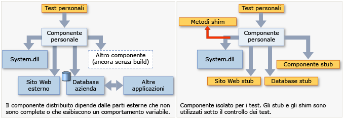

# <a name="isolating-code-under-test-with-microsoft-fakes"></a>Isolamento del codice sottoposto a test con Microsoft Fakes
Microsoft Fakes consente di isolare il codice di cui si sta eseguendo il test sostituendo altre parti dell'applicazione con *stub* o *shim*. Si tratta di frammenti di codice che rientrano nel controllo dei test. Isolando il codice per il test, si avrà la certezza che se il test non viene superato, la causa è presente in tale codice e non in un altro punto. Anche gli stub e gli shim consentono di testare il codice anche se altre parti dell'applicazione ancora non funzionano.  
  
 Fakes è di due tipi:  
  
-   Uno [stub](#stubs) sostituisce una classe con un componente di dimensioni ridotte che implementa la stessa interfaccia.  Per usare gli stub, è necessario progettare l'applicazione in modo che ogni componente dipenda solo dalle interfacce e non da altri componenti. Il termine "componente" indica una classe o un gruppo di classi progettate e aggiornate insieme che sono generalmente contenute in un assembly.  
  
-   Uno [shim](#shims) modifica il codice compilato dell'applicazione in fase di esecuzione in modo tale che, invece di effettuare la chiamata al metodo specificato, esegue il codice dello shim fornito dal test. Gli shim possono essere usati per sostituire le chiamate agli assembly che non si possono modificare, ad esempio gli assembly .NET.  
  
   
  
 **Requisiti**  
  
-   Visual Studio Enterprise  
  
## <a name="choosing-between-stub-and-shim-types"></a>Scelta tra i tipi stub e shim  
 In genere, un progetto di Visual Studio viene considerato un componente perché le classi vengono sviluppate e aggiornate contemporaneamente. Considerare l'uso di stub e shim per le chiamate che il progetto effettua ad altri progetti della soluzione o ad altri assembly a cui fa riferimento.  
  
 In generale, è consigliabile usare gli stub per le chiamate all'interno della soluzione di Visual Studio e gli shim per le chiamate ad altri assembly a cui si fa riferimento. Questo perché all'interno di una soluzione è consigliabile separare i componenti definendo le interfacce secondo le regole di esecuzione dello stub. Gli assembly esterni, ad esempio System.dll, invece in genere non vengono forniti con definizioni di interfaccia separate e pertanto è necessario usare gli shim.  
  
 Altre considerazioni:  
  
 **Prestazioni.** Gli shim sono più lenti perché riscrivono il codice in fase di esecuzione. Gli stub non incorrono in questo sovraccarico delle prestazioni e sono veloci al pari dei metodi virtuali.  
  
 **Metodi statici, tipi sealed.** È possibile usare solo gli stub per implementare le interfacce. Di conseguenza, i tipi stub non possono essere usati per metodi statici, metodi non virtuali, metodi virtuali sealed, metodi con tipi sealed e così via.  
  
 **Tipi interni.** È possibile usare sia tipi stub che tipi shim con tipi interni che sono stati resi accessibili con l'attributo di assembly <xref:System.Runtime.CompilerServices.InternalsVisibleToAttribute>.  
  
 **Metodi privati.** Gli shim possono sostituire le chiamate ai metodi privati se tutti i tipi sono visibili nella firma del metodo. Gli stub possono sostituire solo i metodi visibili.  
  
 **Interfacce e metodi astratti.** Gli stub forniscono implementazioni di interfacce e metodi astratti che possono essere utilizzati nel test. Gli shim non possono instrumentare interfacce e metodi astratti perché sono privi del corpo del metodo.  
  
 In generale, è consigliabile usare i tipi stub per l'isolamento dalle dipendenze nella codebase. A tale scopo è possibile nascondere i componenti dietro le interfacce. I tipi shim possono essere usati per l'isolamento da componenti di terze parti che non forniscono un'API testabile.  
  
##  <a name="stubs"></a> Introduzione agli stub  
 Per una descrizione più dettagliata, vedere [Uso di stub per isolare le parti dell'applicazione tra loro per gli unit test](../test/using-stubs-to-isolate-parts-of-your-application-from-each-other-for-unit-testing.md).  
  
1.  **Inserire le interfacce**  
  
     Per usare gli stub, è necessario scrivere il codice che si desidera testare in modo che non menzioni esplicitamente le classi in un altro componente dell'applicazione. Il termine "componente" indica una o più classi sviluppate e aggiornate insieme che in genere sono contenute in un solo progetto di Visual Studio. Le variabili e i parametri devono essere dichiarati tramite le interfacce e le istanze di altri componenti devono essere passate o create tramite una factory. Ad esempio, se StockFeed è una classe in un altro componente dell'applicazione, allora questa viene considerata non valida:  
  
     `return (new StockFeed()).GetSharePrice("COOO"); // Bad`  
  
     Definire invece un'interfaccia che può essere implementata dall'altro componente e che può essere anche implementata da uno stub a scopo di test:  
  
    ```c#  
    public int GetContosoPrice(IStockFeed feed)  
    { return feed.GetSharePrice("COOO"); }  
  
    ```  
  
    ```vb#  
    Public Function GetContosoPrice(feed As IStockFeed) As Integer  
     Return feed.GetSharePrice("COOO")  
    End Function  
  
    ```  
  
2.  **Aggiungere l'assembly Fakes**  
  
    1.  In Esplora soluzioni espandere l'elenco di riferimento del progetto di test. Se si usa Visual Basic, scegliere **Mostra tutti i file** per visualizzare l'elenco dei riferimenti.  
  
    2.  Selezionare il riferimento all'assembly in cui è definita l'interfaccia (ad esempio IStockFeed). Nel menu di scelta rapida del riferimento scegliere **Aggiungi assembly Fakes**.  
  
    3.  Ricompilare la soluzione.  
  
3.  Nei test, creare le istanze dello stub e fornire il codice per i relativi metodi:  
  
    ```c#  
    [TestClass]  
    class TestStockAnalyzer  
    {  
        [TestMethod]  
        public void TestContosoStockPrice()  
        {  
          // Arrange:  
  
            // Create the fake stockFeed:  
            IStockFeed stockFeed =   
                 new StockAnalysis.Fakes.StubIStockFeed() // Generated by Fakes.  
                     {  
                         // Define each method:  
                         // Name is original name + parameter types:  
                         GetSharePriceString = (company) => { return 1234; }  
                     };  
  
            // In the completed application, stockFeed would be a real one:  
            var componentUnderTest = new StockAnalyzer(stockFeed);  
  
          // Act:  
            int actualValue = componentUnderTest.GetContosoPrice();  
  
          // Assert:  
            Assert.AreEqual(1234, actualValue);  
        }  
        ...  
    }  
    ```  
  
    ```vb#  
    <TestClass()> _  
    Class TestStockAnalyzer  
  
        <TestMethod()> _  
        Public Sub TestContosoStockPrice()  
            ' Arrange:  
            ' Create the fake stockFeed:  
            Dim stockFeed As New StockAnalysis.Fakes.StubIStockFeed  
            With stockFeed  
                .GetSharePriceString = Function(company)  
                                           Return 1234  
                                       End Function  
            End With  
            ' In the completed application, stockFeed would be a real one:  
            Dim componentUnderTest As New StockAnalyzer(stockFeed)  
            ' Act:  
            Dim actualValue As Integer = componentUnderTest.GetContosoPrice  
            ' Assert:  
            Assert.AreEqual(1234, actualValue)  
        End Sub  
    End Class  
  
    ```  
  
     Il particolare speciale qui è la classe `StubIStockFeed`. Per ogni interfaccia nell'assembly di riferimento, il meccanismo Microsoft Fakes genera una classe stub. Il nome della classe stub è derivato dal nome dell'interfaccia, con "`Fakes.Stub`" come prefisso, e i nomi dei tipi di parametro accodati.  
  
     Gli stub vengono generati per i metodi GET e SET di proprietà, per gli eventi e per i metodi generici. Per altre informazioni, vedere [Uso di stub per isolare le parti dell'applicazione tra loro per gli unit test](../test/using-stubs-to-isolate-parts-of-your-application-from-each-other-for-unit-testing.md).  
  
##  <a name="shims"></a> Introduzione agli shim  
 Per una descrizione più dettagliata, vedere [Uso di shim per isolare l'applicazione da altri assembly per gli unit test](../test/using-shims-to-isolate-your-application-from-other-assemblies-for-unit-testing.md).  
  
 Si supponga che il componente contenga delle chiamate a `DateTime.Now`:  
  
```c#  
// Code under test:  
    public int GetTheCurrentYear()  
    {  
       return DateTime.Now.Year;  
    }  
  
```  
  
 Durante un test, si desidera rendere shim la proprietà `Now` perché la versione reale utile restituisce in modo non conveniente un valore diverso a ogni chiamata.  
  
 Per usare gli shim, non è necessario modificare il codice dell'applicazione o scriverlo in un modo particolare.  
  
1.  **Aggiungere l'assembly Fakes**  
  
     In Esplora soluzioni aprire i riferimenti del progetto di unit test e selezionare il riferimento all'assembly che contiene il metodo che si desiderare camuffare. In questo esempio la classe `DateTime` si trova in **System.dll**.  Per visualizzare i riferimenti in un progetto di Visual Basic, scegliere **Mostra tutti i file**.  
  
     Scegliere **Aggiungi assembly Fakes**.  
  
2.  **Inserire uno shim in uno ShimsContext**  
  
    ```c#  
    [TestClass]  
    public class TestClass1  
    {   
            [TestMethod]  
            public void TestCurrentYear()  
            {  
                int fixedYear = 2000;  
  
                // Shims can be used only in a ShimsContext:  
                using (ShimsContext.Create())  
                {  
                  // Arrange:  
                    // Shim DateTime.Now to return a fixed date:  
                    System.Fakes.ShimDateTime.NowGet =   
                    () =>  
                    { return new DateTime(fixedYear, 1, 1); };  
  
                    // Instantiate the component under test:  
                    var componentUnderTest = new MyComponent();  
  
                  // Act:  
                    int year = componentUnderTest.GetTheCurrentYear();  
  
                  // Assert:   
                    // This will always be true if the component is working:  
                    Assert.AreEqual(fixedYear, year);  
                }  
            }  
    }  
  
    ```  
  
    ```vb#  
    <TestClass()> _  
    Public Class TestClass1  
        <TestMethod()> _  
        Public Sub TestCurrentYear()  
            Using s = Microsoft.QualityTools.Testing.Fakes.ShimsContext.Create()  
                Dim fixedYear As Integer = 2000  
                ' Arrange:  
                ' Detour DateTime.Now to return a fixed date:  
                System.Fakes.ShimDateTime.NowGet = _  
                    Function() As DateTime  
                        Return New DateTime(fixedYear, 1, 1)  
                    End Function  
  
                ' Instantiate the component under test:  
                Dim componentUnderTest = New MyComponent()  
                ' Act:  
                Dim year As Integer = componentUnderTest.GetTheCurrentYear  
                ' Assert:   
                ' This will always be true if the component is working:  
                Assert.AreEqual(fixedYear, year)  
            End Using  
        End Sub  
    End Class  
    ```  
  
     I nomi delle classi shim vengono creati aggiungendo un prefisso `Fakes.Shim` al nome del tipo originale. I nomi dei parametri vengono aggiunti al nome del metodo. Non è necessario aggiungere riferimenti ad assembly a System.Fakes.  
  
 Nell'esempio precedente viene usato uno shim come metodo statico. Per usare uno shim per un metodo di istanza, scrivere `AllInstances` tra il nome del tipo e il nome del metodo:  
  
```  
System.IO.Fakes.ShimFile.AllInstances.ReadToEnd = ...  
```  
  
 Non è presente un assembly "System.IO.Fakes" a cui fare riferimento. Lo spazio dei nomi viene generato dal processo di creazione di shim. È tuttavia possibile usare istruzioni "using" o "Import" nel modo consueto.  
  
 È inoltre possibile creare shim per istanze, costruttori e proprietà specifiche. Per altre informazioni, vedere [Uso di shim per isolare l'applicazione da altri assembly per gli unit test](../test/using-shims-to-isolate-your-application-from-other-assemblies-for-unit-testing.md).  
  
## <a name="in-this-section"></a>In questa sezione  
 [Uso di stub per isolare le parti dell'applicazione tra loro per gli unit test](../test/using-stubs-to-isolate-parts-of-your-application-from-each-other-for-unit-testing.md)  
  
 [Uso di shim per isolare l'applicazione da altri assembly per gli unit test](../test/using-shims-to-isolate-your-application-from-other-assemblies-for-unit-testing.md)  
  
 [Generazione del codice, compilazione e convenzioni di denominazione in Microsoft Fakes](../test/code-generation-compilation-and-naming-conventions-in-microsoft-fakes.md)

