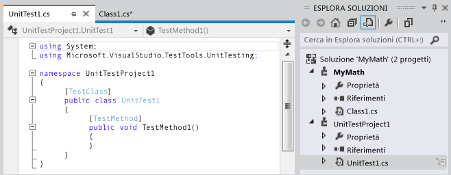
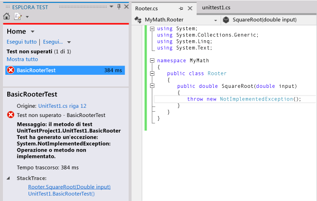
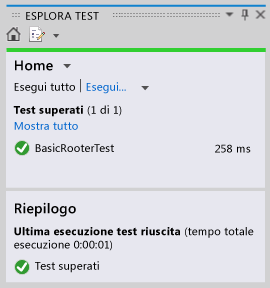
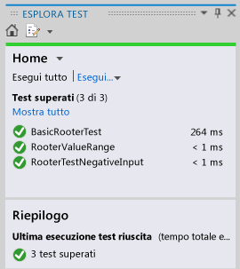

# <a name="quick-start-test-driven-development-with-test-explorer"></a>Guida introduttiva allo sviluppo basato su test con Esplora test
Si consiglia di creare unit test per garantire il corretto funzionamento del codice attraverso i vari passaggi incrementali dello sviluppo. Esistono diversi framework che possono essere utilizzati per scrivere unit test, tra i quali alcuni sviluppati da terze parti. Alcuni framework di test sono specializzati per il testing in diversi linguaggi o piattaforme. Esplora test fornisce una singola interfaccia per gli unit test per uno qualsiasi di questi framework. Gli adattatori sono disponibili per i framework comunemente più utilizzati ed è possibile scrivere i propri adattatori per altri framework.  
  
 Esplora test sostituisce le finestre di unit test presenti nelle versioni precedenti di Visual Studio. I vantaggi comprendono:  
  
-   Possibilità di eseguire test .NET, non gestiti, di database e di altro tipo usando una singola interfaccia.  
  
-   Possibilità di usare il framework di unit test preferito, ad esempio NUnit o MSTest.  
  
-   Possibilità di visualizzare in un'unica finestra tutte le informazioni necessarie.  
  
## <a name="using-test-explorer"></a>Utilizzo di Esplora test  
 ")  
  
#### <a name="to-run-unit-tests-by-using-test-explorer"></a>Per eseguire lo unit test utilizzando Esplora test  
  
1.  Creare gli unit test che utilizzano i framework di test scelti.  
  
     Ad esempio, per creare un test che utilizza il framework MSTest:  
  
    1.  Creare un progetto di test.  
  
         Nella finestra di dialogo **Nuovo progetto** espandere **Visual Basic**, **Visual C#**o **Visual C++**e quindi scegliere **Test**.  
  
         Selezionare **Progetto unit test**.  
  
    2.  Scrivere ogni unit test come un metodo. Aggiungere come prefisso a ogni metodo di test l'attributo `[TestMethod]`.  
  
2.  Se i singoli test non hanno dipendenze che ne impediscono l'esecuzione in qualsiasi ordine, attivare l'esecuzione parallela dei test con l'interruttore  sulla barra degli strumenti. Questo può ridurre notevolmente il tempo impiegato per eseguire tutti i test.  
  
3.  Sulla barra dei menu scegliere **Test**, **Esegui unit test**, **Tutti i test**.  
  
     La soluzione verrà compilata e i test verranno eseguiti.  
  
     Esplora test aprirà e visualizzerà un riepilogo dei risultati.  
  
 **Per visualizzare un elenco completo dei test:** scegliere **Mostra tutto** in qualsiasi categoria.  
  
 **Per visualizzare i dettagli dei risultati di un test:** selezionare il test in Esplora test per visualizzare dettagli quali messaggi di eccezione nell'apposito riquadro.  
  
 **Per spostarsi all'interno del codice di un test:** fare doppio clic sul test in Esplora test o scegliere **Apri test** nel menu di scelta rapida.  
  
 **Per eseguire il debug di un test:** aprire il menu di scelta rapida per uno o più test, quindi scegliere **Debug test selezionati**.  
  
> [!IMPORTANT]
>  I risultati che vengono visualizzati sono in ordine dal più recente che è stato eseguito. La barra colorata dei risultati mostra solo i risultati per i test che sono stati eseguiti. Ad esempio, se si eseguono più test e alcuni di essi falliscono, e quindi successivamente si eseguono solo i test superati, la barra dei risultati li visualizzerà tutti in verde.  
  
> [!NOTE]
>  Se nessun test viene visualizzato, verificare di aver installato un adattatore per connettere Esplora test al framework di test in uso. Per ulteriori informazioni, vedere [Utilizzare differenti framework di test con Esplora test](#frameworks).  
  
##  <a name="walkthrough"></a> Procedura dettagliata: Uso di unit test per sviluppare un metodo  
 In questa procedura dettagliata viene illustrato come sviluppare un metodo testato in C# utilizzando il framework per unit test di Microsoft. È possibile adattarlo in modo semplice per altri linguaggi e per utilizzare altri framework di test come NUnit. Per ulteriori informazioni, vedere [Utilizzare diversi framework di test](#frameworks).  
  
#### <a name="creating-the-test-and-method"></a>Creare il test e il metodo  
  
1.  Creare un progetto di libreria di classi di Visual C#. Questo progetto conterrà il codice da produrre. In questo esempio è denominata `MyMath`.  
  
2.  Creare un progetto di test.  
  
    -   Nella finestra di dialogo **Nuovo progetto**, scegliere **Visual C#**, **Test** e quindi scegliere **Progetto unit test**.  
  
           
  
3.  Scrivere un metodo di test di base. Verificare il risultato ottenuto con un input specifico:  
  
    ```c#  
  
    [TestMethod]  
    public void BasicRooterTest()  
    {  
      // Create an instance to test:  
      Rooter rooter = new Rooter();  
      // Define a test input and output value:  
      double expectedResult = 2.0;  
      double input = expectedResult * expectedResult;  
      // Run the method under test:  
      double actualResult = rooter.SquareRoot(input);  
      // Verify the result:  
      Assert.AreEqual(expectedResult, actualResult,  
          delta: expectedResult / 100);  
    }  
    ```  
  
4.  Generare il metodo dal test.  
  
    1.  Posizionare il cursore su `Rooter`, quindi dal menu di scelta rapida scegliere **Genera**, **Nuovo tipo**.  
  
    2.  Nella finestra di dialogo **Genera nuovo tipo**, impostare **Progetto** con il progetto di libreria di classi. In questo esempio si tratta di `MyMath`.  
  
    3.  Posizionare il cursore su `SquareRoot`, quindi dal menu di scelta rapida scegliere **Genera**, **Stub metodo**.  
  
5.  Eseguire lo unit test.  
  
    1.  Nel menu **Test** scegliere **Esegui unit test**, **Tutti i test**.  
  
         La soluzione verrà compilata ed eseguita.  
  
         Esplora test aprirà e visualizzerà i risultati.  
  
         Il test viene inserito in **Test non superati**.  
  
6.  Selezionare il nome del test.  
  
     I dettagli del test vengono visualizzati nella parte inferiore di Esplora test.  
  
7.  Selezionare gli elementi in **Traccia dello Stack** per visualizzare dove i test hanno avuto esito negativo.  
  
   
  
 A questo punto, si è creato un test e uno stub che verrà modificato in modo che il test possa essere superato.  
  
#### <a name="after-every-change-make-all-the-tests-pass"></a>Dopo ogni modifica, tutti i test hanno esito positivo  
  
1.  In `MyMath\Rooter.cs`migliorare il codice di `SquareRoot`:  
  
    ```c#  
    public double SquareRoot(double input)  
     {  
       return input / 2;  
     }  
    ```  
  
2.  In Esplora test scegliere **Esegui tutto**.  
  
     Il codice verrà compilato e i test verranno eseguiti.  
  
     Il test ha esito positivo.  
  
       
  
#### <a name="add-tests-to-extend-the-range-of-inputs"></a>Aggiungere test per estendere l'intervallo degli input  
  
1.  Per assicurarsi che il codice venga eseguito in tutti i casi, aggiungere dei test che utilizzino una più vasta gamma di valori in input.  
  
    > [!TIP]
    >  Evitare di modificare i test esistenti che hanno avuto successo. Piuttosto, aggiungere nuovi test. Modificare i test esistenti solo in caso di variazione dei requisiti dell'utente. Questo criterio assicura che le funzionalità esistenti non vadano perse mentre si lavora per estendere il codice.  
  
     Nella classe di test, aggiungere il seguente test, che prova un intervallo di valori di input:  
  
    ```c#  
    [TestMethod]  
    public void RooterValueRange()  
    {  
      // Create an instance to test:  
      Rooter rooter = new Rooter();  
      // Try a range of values:  
      for (double expectedResult = 1e-8;  
          expectedResult < 1e+8;  
          expectedResult = expectedResult * 3.2)  
      {  
        RooterOneValue(rooter, expectedResult);  
      }  
    }  
  
    private void RooterOneValue(Rooter rooter, double expectedResult)  
    {  
      double input = expectedResult * expectedResult;  
      double actualResult = rooter.SquareRoot(input);  
      Assert.AreEqual(expectedResult, actualResult,  
          delta: expectedResult / 1000);  
    }  
    ```  
  
2.  In Esplora test scegliere **Esegui tutto**.  
  
     Il nuovo test ha esito negativo nonostante il primo test abbia comunque esito positivo.  
  
     Per trovare il punto di errore, selezionare il test non superato e quindi nella parte inferiore di Esplora test, selezionare l'elemento più in alto della **Traccia dello stack**.  
  
3.  Controllare il metodo sottoposto a test per vedere quale potrebbe essere l'errore. Nella classe `MyMath.Rooter` riscrivere il codice:  
  
    ```  
    public double SquareRoot(double input)  
    {  
      double result = input;  
      double previousResult = -input;  
      while (Math.Abs(previousResult - result) > result / 1000)  
      {  
        previousResult = result;  
        result = result - (result * result - input) / (2 * result);  
      }  
      return result;  
    }  
    ```  
  
4.  In Esplora test scegliere **Esegui tutto**.  
  
     Ora entrambi i test avranno esito positivo.  
  
#### <a name="add-tests-for-exceptional-cases"></a>Aggiungere test per i casi eccezionali  
  
1.  Aggiungere un test per gli input negativi:  
  
    ```c#  
    [TestMethod]  
     public void RooterTestNegativeInputx()  
     {  
         Rooter rooter = new Rooter();  
         try  
         {  
             rooter.SquareRoot(-10);  
         }  
         catch (ArgumentOutOfRangeException e)  
         {  
             return;  
         }  
         Assert.Fail();  
     }  
    ```  
  
2.  In Esplora test scegliere **Esegui tutto**.  
  
     Il metodo sottoposto a test entra in un ciclo e deve essere annullato manualmente.  
  
3.  Scegliere **Annulla**.  
  
     Il test si interrompe dopo 10 secondi.  
  
4.  Correggere il codice del metodo:  
  
    ```c#  
  
    public double SquareRoot(double input)  
    {  
      if (input <= 0.0)   
      {  
        throw new ArgumentOutOfRangeException();  
      }   
    ...  
    ```  
  
5.  In Esplora test scegliere **Esegui tutto**.  
  
     Tutti i test avranno esito positivo.  
  
#### <a name="refactor-without-changing-tests"></a>Effettuare il refactoring senza modificare i test  
  
1.  Semplificare il codice, ma non modificare i test.  
  
    > [!TIP]
    >  Il *refactoring* è una modifica che consente di migliorare le prestazioni o rendere il codice più facile da comprendere. Non è concepito per modificare il comportamento del codice e pertanto i test non vengono modificati.  
    >   
    >  Si consiglia di effettuare le operazioni di refactoring separatamente dai passaggi che estendono le funzionalità. Mantenendo i test invariati ci si assicura che non siano stati introdotti accidentalmente bug durante il refactoring.  
  
    ```c#  
    public class Rooter  
    {  
      public double SquareRoot(double input)  
      {  
        if (input <= 0.0)   
        {  
          throw new ArgumentOutOfRangeException();  
        }  
        double result = input;  
        double previousResult = -input;  
        while (Math.Abs(previousResult - result) > result / 1000)  
        {  
          previousResult = result;  
          result = (result + input / result) / 2;  
          //was: result = result - (result * result - input) / (2*result);  
        }  
        return result;  
      }  
    }  
    ```  
  
2.  Scegliere **Esegui tutto**.  
  
     Tutti i test hanno ancora esito positivo.  
  
     

