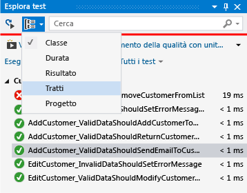
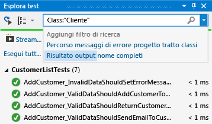
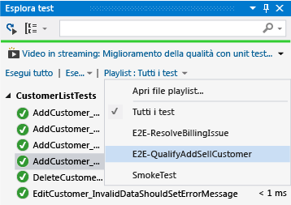

# <a name="run-unit-tests-with-test-explorer"></a>Eseguire unit test con Esplora test
Esplora Test consente di eseguire unit test da Visual Studio o progetti unit test di terze parti, raggruppare i test in categorie, filtrare l'elenco dei test, nonché creare, salvare ed eseguire playlist di test. È anche possibile eseguire il debug dei test e analizzare code coverage e prestazioni dei test.  
  
##  <a name="BKMK_Contents"></a> Sommario  
 [Framework di unit test e progetti di test](#BKMK_Unit_test_frameworks_and_test_projects)  
  
 [Eseguire test in Esplora test](#BKMK_Run_tests_in_Test_Explorer)  
  
 [Visualizzare i risultati dei test](#BKMK_View_test_results)  
  
 [Raggruppare e filtrare l'elenco dei test](#BKMK_Group_and_filter_the_test_list)  
  
 [Creare playlist personalizzate](#BKMK_Create_custom_playlists)  
  
 [Eseguire il debug e l'analisi di unit test](#BKMK_Debug_and_analyze_unit_tests)  
  
 [Risorse esterne](#BKMK_External_resources)  
  
##  <a name="BKMK_Unit_test_frameworks_and_test_projects"></a> Framework unit test e progetti di test  
 Visual Studio include i framework di unit test Microsoft sia per il codice gestito sia per quello nativo. Esplora test può tuttavia eseguire anche qualsiasi framework di unit test in cui sia implementato un adattatore di Esplora test. Per altre informazioni sull'installazione di framework di unit test di terze parti, vedere [Installare framework di unit test di terze parti](../test/install-third-party-unit-test-frameworks.md).  
  
 Esplora test può eseguire test da più progetti di test in una soluzione e da classi di test appartenenti a progetti di codice di produzione. I progetti di test possono usare framework di unit test diversi. Se il codice sottoposto a test è scritto per .NET Framework, il progetto di test può essere scritto in qualsiasi linguaggio destinato anche a .NET Framework, indipendentemente dal linguaggio del codice di destinazione. I progetti in codice C/C++ nativo devono essere testati tramite un framework di unit test C++.  
  
  [Sommario](#BKMK_Contents)  
  
##  <a name="BKMK_Run_tests_in_Test_Explorer"></a> Eseguire test in Esplora test  
 [Eseguire i test](#BKMK_Run_tests) **&#124;** [Eseguire i test dopo ogni compilazione](#BKMK_Run_tests_after_every_build)  
  
 Quando si compila il progetto di test, i test vengono visualizzati in Esplora test. Se Esplora test non è visualizzato, scegliere **Test** dal menu di Visual Studio, quindi scegliere **Windows**e infine **Esplora test**.  
  
   
  
 Quando si eseguono, si scrivono e si rieseguono i test, Esplora test mostra i risultati nei gruppi predefiniti **Test non superati**, **Test superati**, **Test ignorati** e **Test non eseguiti**. È possibile modificare la modalità con cui Esplora test raggruppa i test.  
  
 È possibile eseguire molte delle operazioni di ricerca, organizzazione ed esecuzione dei test dalla barra degli strumenti di Esplora test.  
  
   
  
  [Sommario](#BKMK_Contents)  
  
###  <a name="BKMK_Run_tests"></a> Eseguire i test  
 È possibile eseguire tutti i test nella soluzione, tutti i test in un gruppo o un set di test selezionati. Eseguire una delle operazioni seguenti:  
  
-   Per eseguire tutti i test in una soluzione, scegliere **Esegui tutto**.  
  
-   Per eseguire tutti i test in un gruppo predefinito, scegliere **Esegui...** e quindi scegliere il gruppo dal menu.  
  
-   Selezionare i singoli test da eseguire, aprire il menu di scelta rapida per un test selezionato e quindi scegliere **Esegui test selezionati**.  
  
-   Se i singoli test non hanno dipendenze che ne impediscono l'esecuzione in qualsiasi ordine, attivare l'esecuzione parallela dei test con l'interruttore  sulla barra degli strumenti. Questo può ridurre notevolmente il tempo impiegato per eseguire tutti i test.  
  
 Mentre il test viene eseguito, la barra Superato/Non superato nella parte superiore della finestra Esplora test mostra un'animazione. Al termine dell'esecuzione del test, la barra Superato/Non superato diventa verde se tutti i test sono stati superati o rossa se un test non è stato superato.  
  
  [Sommario](#BKMK_Contents)  
  
###  <a name="BKMK_Run_tests_after_every_build"></a> Eseguire i test dopo ogni compilazione  
  
> [!WARNING]
>  L'esecuzione di unit test dopo ogni compilazione è supportata in Visual Studio Enterprise.  
  
|||  
|-|-|  
||Per eseguire gli unit test dopo ogni compilazione locale, scegliere **Test** dal menu standard e quindi scegliere **Esegui test dopo compilazione** sulla barra degli strumenti di Esplora test.|  
  
  [Sommario](#BKMK_Contents)  
  
##  <a name="BKMK_View_test_results"></a> Visualizzare i risultati dei test  
 [Visualizzare i dettagli dei test](#BKMK_View_test_details) **&#124;** [Visualizzare il codice sorgente di un metodo di test](#BKMK_View_the_source_code_of_a_test_method)  
  
 Quando si eseguono, si scrivono e si rieseguono i test, Esplora test mostra i risultati nei gruppi **Test non superati**, **Test superati**, **Test ignorati** e **Test non eseguiti**. Il riquadro dei dettagli nella parte inferiore della finestra Esplora Test mostra un riepilogo dell'esecuzione dei test.  
  
###  <a name="BKMK_View_test_details"></a> Visualizzare i dettagli dei test  
 Per visualizzare i dettagli di un singolo test, selezionare il test.  
  
   
  
 Il riquadro dei dettagli del test mostra le informazioni seguenti:  
  
-   Nome del file di origine e numero di riga del metodo di test.  
  
-   Stato del test.  
  
-   Tempo impiegato per l'esecuzione del metodo di test.  
  
 Se il test non viene superato, il riquadro dei dettagli mostra anche le informazioni seguenti:  
  
-   Messaggio restituito dal framework di unit test per il test.  
  
-   Analisi dello stack al momento del mancato superamento del test.  
  
  [Sommario](#BKMK_Contents)  
  
###  <a name="BKMK_View_the_source_code_of_a_test_method"></a> Visualizzare il codice sorgente di un metodo di test  
 Per visualizzare il codice sorgente per un metodo di test nell'editor di Visual Studio, selezionare il test e quindi scegliere **Apri Test** dal menu di scelta rapida (tastiera: F12).  
  
  [Sommario](#BKMK_Contents)  
  
##  <a name="BKMK_Group_and_filter_the_test_list"></a> Raggruppare e filtrare l'elenco dei test  
 [Raggruppamento dell'elenco di test](#BKMK_Grouping_the_test_list) **&#124;** [Raggruppare per tratti](#BKMK_Group_by_traits) **&#124;** [Eseguire ricerche e applicare filtri nell'elenco dei test](#BKMK_Search_and_filter_the_test_list)  
  
 Esplora test consente di raggruppare i test in categorie predefinite. La maggior parte dei framework di unit test eseguiti in Esplora Test consente di definire categorie personalizzate e coppie categoria/valore per raggruppare i test. È anche possibile filtrare l'elenco dei test in base a stringhe corrispondenti nelle proprietà dei test.  
  
###  <a name="BKMK_Grouping_the_test_list"></a> Raggruppamento dell'elenco di test  
 Per modificare la modalità di organizzazione dei test, scegliere la freccia rivolta verso il basso accanto al pulsante **Raggruppa**  e selezionare un nuovo criterio di raggruppamento.  
  
   
  
### <a name="test-explorer-groups"></a>Gruppi di Esplora test  
  
|Gruppo|Descrizione|  
|-----------|-----------------|  
|**Durata**|Raggruppa i test in base al tempo di esecuzione: **Veloce**, **Medio**e **Lento**.|  
|**Risultato**|Raggruppa i test in base ai risultati di esecuzione: **Test non superati**, **Test ignorati**, **Test superati**.|  
|**Tratti**|Raggruppa i test in base a coppie categoria/valore definite. La sintassi per specificare i valori e le categorie dei tratti è definita dal framework di unit test.|  
|**Progetto**|Raggruppa i test in base al nome dei progetti.|  
  
  [Sommario](#BKMK_Contents)  
  
###  <a name="BKMK_Group_by_traits"></a> Raggruppare per tratti  
 Una tratto è in genere una coppia nome/valore di una categoria, ma può anche essere una singola categoria. I tratti possono essere assegnati ai metodi identificati come metodi di test dal framework di unit test. Un framework di unit test può definire le categorie dei tratti. È possibile aggiungere valori alle categorie dei tratti per definire coppie nome/valore personalizzate per le categorie. La sintassi per specificare i valori e le categorie dei tratti è definita dal framework di unit test.  
  
 **Tratti nel framework di unit test Microsoft per il codice gestito**  
  
 Nel framework di unit test Microsoft per le app gestite, una coppia nome/valore di un tratto viene definita in un attributo <xref:Microsoft.VisualStudio.TestTools.UnitTesting.TestPropertyAttribute>. Il framework di test contiene anche i tratti predefiniti seguenti:  
  
|Tratto|Descrizione|  
|-----------|-----------------|  
|<xref:Microsoft.VisualStudio.TestTools.UnitTesting.OwnerAttribute>|La categoria Owner è definita dal framework di unit test e richiede di specificare un valore di stringa relativo al proprietario.|  
|<xref:Microsoft.VisualStudio.TestTools.UnitTesting.PriorityAttribute>|La categoria Priority è definita dal framework di unit test e richiede di specificare un valore integer relativo alla priorità.|  
|<xref:Microsoft.VisualStudio.TestTools.UnitTesting.TestCategoryAttribute>|L'attributo TestCategory consente di specificare una categoria senza un valore. Una categoria definita dall'attributo TestCategory può anche essere la categoria di un attributo TestProperty.|  
|<xref:Microsoft.VisualStudio.TestTools.UnitTesting.TestPropertyAttribute>|L'attributo TestProperty consente di definire una coppia categoria/valore di un tratto.|  
  
 **Tratti nel framework di unit test Microsoft per C++**  
  
 Per definire un tratto, usare la macro `TEST_METHOD_ATTRIBUTE`. Ad esempio, per definire un tratto denominato `TEST_MY_TRAIT`:  
  
```cpp  
#define TEST_MY_TRAIT(traitValue) TEST_METHOD_ATTRIBUTE(L"MyTrait", traitValue)  
```  
  
 Per usare il tratto definito negli unit test:  
  
```  
BEGIN_TEST_METHOD_ATTRIBUTE(Method1)  
    TEST_OWNER(L"OwnerName")  
    TEST_PRIORITY(1)  
    TEST_MY_TRAIT(L"thisTraitValue")  
END_TEST_METHOD_ATTRIBUTE()  
  
TEST_METHOD(Method1)  
{     
    Logger::WriteMessage("In Method1");  
    Assert::AreEqual(0, 0);  
}  
```  
  
### <a name="c-trait-attribute-macros"></a>Macro di attributo di tratto C++  
  
|Macro|Descrizione|  
|-----------|-----------------|  
|`TEST_METHOD_ATTRIBUTE(attributeName, attributeValue)`|Usare la macro TEST_METHOD_ATTRIBUTE per definire un tratto.|  
|`TEST_OWNER(ownerAlias)`|Usare il tratto Owner predefinito per specificare un proprietario del metodo di test.|  
|`TEST_PRIORITY(priority)`|Usare il tratto Priority predefinito per assegnare priorità relative ai metodi di test.|  
  
  [Sommario](#BKMK_Contents)  
  
###  <a name="BKMK_Search_and_filter_the_test_list"></a> Eseguire ricerche e applicare filtri nell'elenco dei test  
 È possibile usare i filtri di Esplora Test per limitare i metodi di test nei progetti che vengono visualizzati ed eseguiti.  
  
 Quando si digita una stringa nella casella di ricerca di Esplora Test e si preme INVIO, l'elenco dei test viene filtrato per visualizzare solo i test i cui nomi completi contengono la stringa.  
  
 Per filtrare in base a un criterio diverso:  
  
1.  Aprire l'elenco a discesa a destra della casella di ricerca.  
  
2.  Scegliere un nuovo criterio.  
  
3.  Immettere il valore di filtro tra virgolette.  
  
   
  
> [!NOTE]
>  Le ricerche non fanno distinzione tra maiuscole e minuscole e consentono di trovare la corrispondenza tra la stringa specificata e qualsiasi parte del valore del criterio.  
  
|Qualificatore|Descrizione|  
|---------------|-----------------|  
|**Tratto**|Cerca le corrispondenze sia nel valore sia nella categoria dei tratti. La sintassi per specificare i valori e le categorie dei tratti è definita dal framework di unit test.|  
|**Progetto**|Cerca le corrispondenze nei nomi dei progetti di test.|  
|**Messaggio di errore**|Cerca le corrispondenze nei messaggi di errore definiti dall'utente restituiti da asserzioni non riuscite.|  
|**Percorso file**|Cerca le corrispondenze nel nome file completo dei file di origine test.|  
|**Nome completo**|Cerca le corrispondenze nel nome file completo di spazi dei nomi, classi e metodi di test.|  
|**Output**|Cerca nei messaggi di errore definiti dall'utente che vengono scritti in stdout (standard output) o stderr (stderr). La sintassi per specificare i messaggi di output è definita dal framework di unit test.|  
|**Risultato**|Cerca le corrispondenze nei nomi delle categorie di Esplora test: **Test non superati**, **Test ignorati**, **Test superati**.|  
  
 Per escludere un subset dei risultati di un filtro, usare la sintassi seguente:  
  
```  
FilterName:"Criteria" -FilterName:"SubsetCriteria"  
```  
  
 Di seguito è riportato un esempio:  
  
```  
FullName:"MyClass" - FullName:"PerfTest"  
```  
  
 restituisce tutti i test che includono "MyClass" nel nome, ad eccezione dei test che includono anche "PerfTest" nel nome.  
  
  [Sommario](#BKMK_Contents)  
  
##  <a name="BKMK_Create_custom_playlists"></a> Creare playlist personalizzate  
 È possibile creare e salvare un elenco di test da eseguire o visualizzare come gruppo. Quando si seleziona una playlist, i test inclusi nell'elenco saranno visualizzati in Esplora test. È possibile aggiungere un test a più playlist e tutti i test del progetto saranno disponibili quando si sceglie la playlist predefinita **Tutti i test**.  
  
   
  
 **Per creare una playlist**, scegliere uno o più test in Esplora Test. Scegliere **Aggiungi a playlist**, **Nuova playlist**dal menu di scelta rapida. Salvare il file con il nome e il percorso specificati nella finestra di dialogo **Crea nuova playlist**.  
  
 **Per aggiungere test a una playlist**, scegliere uno o più test in Esplora Test. Scegliere **Aggiungi a playlist**dal menu di scelta rapida e quindi scegliere la playlist a cui aggiungere i test.  
  
 **Per aprire una playlist**, scegliere Test, Playlist dal menu di Visual Studio e quindi scegliere nell'elenco delle playlist usate di recente oppure scegliere Apri playlist per specificare il nome e il percorso della playlist.  
  
 Se i singoli test non hanno dipendenze che ne impediscono l'esecuzione in qualsiasi ordine, attivare l'esecuzione parallela dei test con l'interruttore  sulla barra degli strumenti. Questo può ridurre notevolmente il tempo impiegato per eseguire tutti i test.  
  
  [Sommario](#BKMK_Contents)  
  
##  <a name="BKMK_Debug_and_analyze_unit_tests"></a> Eseguire il debug e l'analisi di unit test  
 [Eseguire il debug di unit test](#BKMK_Debug_unit_tests) **&#124;** [Diagnosticare i problemi di prestazioni dei metodi di test](#BKMK_Diagnose_test_method_performance_issues) **&#124;** [Analizzare il code coverage di unit test](#BKMK_Analyzeunit_test_code_coverage)  
  
###  <a name="BKMK_Debug_unit_tests"></a> Eseguire il debug di unit test  
 È possibile usare Esplora test per avviare una sessione di debug per i test. Esaminando con facilità il codice grazie al debugger di Visual Studio è possibile spostarsi in avanti e indietro tra gli unit test e i progetti da testare. Per avviare il debug:  
  
1.  Nell'editor di Visual Studio impostare un punto di interruzione in uno o più metodi di test di cui si vuole eseguire il debug.  
  
    > [!NOTE]
    >  Poiché i metodi di test possono essere eseguiti in qualsiasi ordine, impostare punti di interruzione in tutti i metodi di test di cui si vuole eseguire il debug.  
  
2.  In Esplora test selezionare i metodi di test e quindi scegliere **Esegui debug test selezionati** dal menu di scelta rapida.  
  
 Per altre informazioni sul debugger, vedere [Debugging in Visual Studio](../debugger/debugging-in-visual-studio.md).  
  
  [Sommario](#BKMK_Contents)  
  
###  <a name="BKMK_Diagnose_test_method_performance_issues"></a> Diagnosticare i problemi di prestazioni dei metodi di test  
 Per diagnosticare il motivo per cui un metodo di test richiede troppo tempo, selezionare il metodo in Esplora Test e quindi scegliere Profilo dal menu di scelta rapida. Vedere [Esplora prestazioni](../profiling/performance-explorer.md).  
  
###  <a name="BKMK_Analyzeunit_test_code_coverage"></a> Analizzare il code coverage di unit test  
  
> [!NOTE]
>  Il code coverage di unit test è disponibile solo in Visual Studio Enterprise.  
  
 È possibile determinare la quantità di codice del prodotto sottoposta effettivamente a test dagli unit test usando lo strumento per il code coverage di Visual Studio. È possibile eseguire il code coverage su test selezionati oppure su tutti i test in una soluzione.  
  
 Per eseguire il code coverage per i metodi di test in una soluzione:  
  
1.  Scegliere **Test** dal menu di Visual Studio e quindi scegliere **Analizza code coverage**.  
  
2.  Scegliere uno dei comandi seguenti dal sottomenu:  
  
    -   **Test selezionati** esegue i metodi di test selezionati in Esplora test.  
  
    -   **Tutti i test** esegue tutti i metodi di test nella soluzione.  
  
 La finestra Risultati code coverage mostra la percentuale di blocchi di codice del prodotto esaminati in base a riga, funzione, classe, spazio dei nomi e modulo.  
  
 Per altre informazioni, vedere [Uso di code coverage per determinare la quantità di codice testato](../test/using-code-coverage-to-determine-how-much-code-is-being-tested.md).  
  
  [Sommario](#BKMK_Contents)  
  
##  <a name="BKMK_External_resources"></a> Risorse esterne  
  
###  <a name="BKMK_Guidance"></a> Materiale sussidiario  
 [Testing for Continuous Delivery with Visual Studio 2012 - Chapter 2: Unit Testing: Testing the Inside](http://go.microsoft.com/fwlink/?LinkID=255188) (Test per la distribuzione continua con Visual Studio 2012 - Capitolo 2: Testing unità: Test interni)  
  
## <a name="see-also"></a>Vedere anche  
 [Eseguire unit test del codice](../test/unit-test-your-code.md)   
 [Eseguire uno unit test come processo a 64 bit](../test/run-a-unit-test-as-a-64-bit-process.md)

