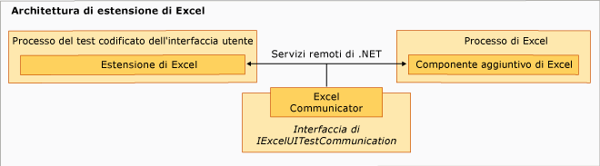

# Estensione di esempio per i test codificati dell&#39;interfaccia utente per Excel
[!INCLUDE[vs2017banner](../code-quality/includes/vs2017banner.md)]

Il componente di estensione dell'esempio viene eseguito nel processo del test codificato dell'interfaccia utente di [!INCLUDE[vsprvs](../code-quality/includes/vsprvs_md.md)] e presenta una struttura di tipo gerarchico con la classe `ExtensionPackage` alla base.  Le classi `TechnologyManager`, `ActionFilter` e `PropertyProvider` sono al livello successivo, mentre gli elementi di controllo sono al primo livello.  
  
   
Architettura dell'estensione di Excel  
  
## Punti di estensione  
 Queste classi rappresentano i punti di estensione implementati nell'esempio per abilitare il test codificato dell'interfaccia utente per [!INCLUDE[ofprexcel](../test/includes/ofprexcel_md.md)].  
  
### ExtensionPackage  
 Ereditato dalla classe <xref:Microsoft.VisualStudio.TestTools.UITest.Extension.UITestExtensionPackage>, è il punto di ingresso per l'estensione del test codificato dell'interfaccia utente.  L'implementazione di questa classe astratta consente al framework del test codificato dell'interfaccia utente di accedere internamente al gestore tecnologia del test dell'interfaccia utente personalizzato, al provider delle proprietà del test dell'interfaccia utente e al filtro dell'azione di test dell'interfaccia utente per il test della nuova interfaccia utente.  Per ulteriori informazioni, vedere [Classe ExtensionPackage](../test/sample-excel-extension-extensionpackage-class.md).  
  
### TechnologyManager  
 Ereditata dalla classe <xref:Microsoft.VisualStudio.TestTools.UITest.Extension.UITechnologyManager>, questa classe fornisce un gestore tecnologia per la registrazione e la riproduzione del test.  Per ulteriori informazioni, vedere [Classe TechnologyManager](../test/sample-excel-extension-technologymanager-class.md).  
  
### ActionFilter  
 Ereditata dalla classe <xref:Microsoft.VisualStudio.TestTools.UITest.Common.UITestActionFilter>, questa classe fornisce una classe di base per aggregare risultati di azioni di test simili in un singolo risultato del test.  Per ulteriori informazioni, vedere [Classe ActionFilter](../test/sample-excel-extension-actionfilter-class.md).  
  
### Elementi della tecnologia  
 Una classe di base ereditata dalla classe <xref:Microsoft.VisualStudio.TestTools.UITest.Extension.UITechnologyElement> fornisce la base per gli elementi della tecnologia nei test dell'interfaccia utente che possono essere registrati e riprodotti.  Per ulteriori informazioni, vedere [Classi Element](../test/sample-excel-extension-element-classes.md).  
  
### PropertyProvider  
 Ereditata dalla classe <xref:Microsoft.VisualStudio.TestTools.UITesting.UITestPropertyProvider>, questa classe fornisce una classe di base per supportare le proprietà degli elementi dell'interfaccia utente per la registrazione e la riproduzione del test.  Per ulteriori informazioni, vedere [Classe PropertyProvider](../test/sample-excel-extension-propertyprovider-class.md).  
  
## Vedere anche  
 <xref:Microsoft.VisualStudio.TestTools.UITesting.UITestPropertyProvider>   
 <xref:Microsoft.VisualStudio.TestTools.UITest.Extension.UITechnologyElement>   
 <xref:Microsoft.VisualStudio.TestTools.UITest.Common.UITestActionFilter>   
 <xref:Microsoft.VisualStudio.TestTools.UITest.Extension.UITestExtensionPackage>   
 [Classe ExtensionPackage](../test/sample-excel-extension-extensionpackage-class.md)   
 [Classe TechnologyManager](../test/sample-excel-extension-technologymanager-class.md)   
 [Classe ActionFilter](../test/sample-excel-extension-actionfilter-class.md)   
 [Classi Element](../test/sample-excel-extension-element-classes.md)   
 [Classe PropertyProvider](../test/sample-excel-extension-propertyprovider-class.md)