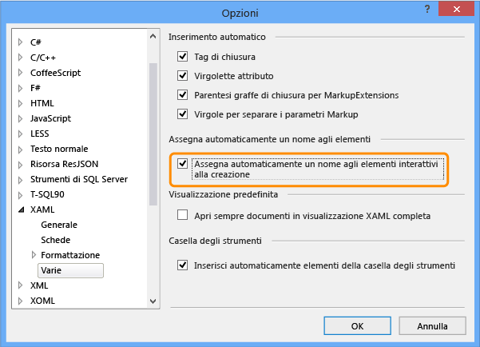
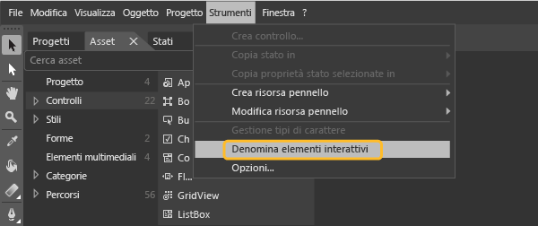
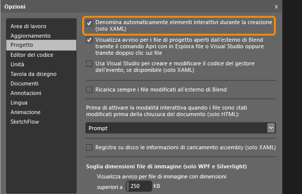

# Impostare una propriet&#224; di automazione univoca dei controlli Windows Store per il test
[!INCLUDE[vs2017banner](../code-quality/includes/vs2017banner.md)]

Se si desidera eseguire test codificati dell'interfaccia utente per l'applicazione di Windows Store basata su XAML, è necessario avere una proprietà di automazione univoca che identifica ciascun controllo.  
  
 È possibile assegnare una proprietà di automazione univoca basata sul tipo di controllo XAML nell'applicazione.  Ecco come assegnare questa proprietà di automazione univoca nelle seguenti situazioni:  
  
-   [Definizione XAML statica dei controlli](#UniquePropertyWindowsStoreControlsStaticXAML)  
  
-   [Assegnare le proprietà di automazione univoche utilizzando Visual Studio o Blend per Visual Studio](#UniquePropertyWindowsStoreControlsExpressionBlend)  
  
-   [Utilizzo di un elemento DataTemplate](#UniquePropertyWindowsStoreControlsDataTemplate)  
  
-   [Utilizzo di modello dei controlli](#UniquePropertyWindowsStoreControlsControlTemplate)  
  
-   [Controlli dinamici](#UniquePropertyWindowsStoreControlsDynamicControls)  
  
## Usare metodi per assegnare una proprietà di automazione univoca  
  
###  <a name="UniquePropertyWindowsStoreControlsStaticXAML"></a> Definizione XAML statica  
 Per specificare una proprietà di automazione univoca per un controllo definito nel file XAML, è possibile impostare AutomationProperties.AutomationId o AutomationProperties.Name in modo implicito o esplicito, come illustrato negli esempi riportati di seguito.  Impostando uno di questi valori si fornisce al controllo una proprietà di automazione univoca che può essere utilizzata per identificare il controllo quando si crea un test codificato dell'interfaccia utente o una registrazione delle azioni.  
  
 **Impostare la proprietà in modo implicito**  
  
 Impostare AutomationProperties.AutomationId su ButtonX utilizzando la proprietà Name nell'XAML per il controllo.  
  
```xaml  
<Button Name="ButtonX" Height="31" HorizontalAlignment="Left" Margin="23,26,0,0"  VerticalAlignment="Top" Width="140" Click="ButtonX_Click" />  
  
```  
  
 Impostare AutomationProperties.Name su ButtonY utilizzando la proprietà Content nell'XAML per il controllo.  
  
```xaml  
<Button Content="ButtonY" Height="31" HorizontalAlignment="Left" Margin="23,76,0,0" VerticalAlignment="Top" Width="140" Click="ButtonY_Click" />  
  
```  
  
 **Impostare la proprietà in modo esplicito**  
  
 Impostare AutomationProperties.AutomationId su ButtonX in modo esplicito nell'XAML per il controllo.  
  
```xaml  
<Button AutomationProperties.AutomationId=“ButtonX” Height="31" HorizontalAlignment="Left" Margin="23,26,0,0"  VerticalAlignment="Top" Width="140" Click="ButtonX_Click" />  
  
```  
  
 Impostare AutomationProperties.Name su ButtonY in modo esplicito nell'XAML per il controllo.  
  
```  
<Button AutomationProperties.Name="ButtonY" Height="31" HorizontalAlignment="Left" Margin="23,76,0,0" VerticalAlignment="Top" Width="140" Click="ButtonY_Click" />  
```  
  
###  <a name="UniquePropertyWindowsStoreControlsExpressionBlend"></a> Assegnare le proprietà di automazione univoche utilizzando Visual Studio o Blend per Visual Studio  
 È inoltre possibile utilizzare Visual Studio o Blend per Visual Studio per assegnare i nomi univoci agli elementi interattivi quali pulsanti, caselle di riepilogo, caselle combinate e caselle di testo.  Ciò fornisce al controllo un valore univoco per AutomationProperties.Name.  
  
 **Visual Studio:** Nel menu **Strumenti** scegliere **Opzioni** e quindi scegliere **Editor di testo**, quindi **XAML** e alla fine **Varie**.  
  
 Selezionare **Assegnare automaticamente un nome agli elementi interattivi al momento della creazione** e quindi scegliere **OK**.  
  
   
  
 **Blend per Visual Studio:** Utilizzare uno dei metodi seguenti per eseguire questa operazione da Blend per Visual Studio.  
  
> [!NOTE]
>  È possibile utilizzare il metodo solo per i controlli creati in modo statico utilizzando l'XAML.  
  
 **Per assegnare un nome univoco ai controlli esistenti**  
  
 Nel menu **Strumenti**, scegliere **Denomina elementi interattivi**, come illustrato di seguito:  
  
   
  
 **Per assegnare automaticamente un nome univoco ai controlli creati**  
  
 Dal menu **Strumenti** scegliere **Opzioni**, quindi **Progetto**.  Selezionare **Assegnare automaticamente un nome agli elementi interattivi al momento della creazione** e quindi scegliere **OK**, come mostrato qui:  
  
   
  
###  <a name="UniquePropertyWindowsStoreControlsDataTemplate"></a> Utilizzare un modello di dati  
 È possibile definire un modello semplice mediante ItemTemplate per associare i valori di una casella di riepilogo a variabili utilizzando il seguente XAML.  
  
```xaml  
  
<ListBox Name="listBox1" ItemsSource="{Binding Source={StaticResource employees}}">  
   <ListBox.ItemTemplate>  
      <DataTemplate>  
         <StackPanel Orientation="Horizontal">  
            <TextBlock Text="{Binding EmployeeName}" />  
            <TextBlock Text="{Binding EmployeeID}" />  
         </StackPanel>  
      </DataTemplate>  
   </ListBox.ItemTemplate>  
</ListBox>  
```  
  
 È inoltre possibile utilizzare un modello con ItemContainerStyle per associare i valori alle variabili con l'XAML seguente.  
  
```xaml  
  
      <ListBox Name="listBox1" ItemsSource="{Binding Source={StaticResource employees}}">  
            <ListBox.ItemContainerStyle>  
                <Style TargetType="ListBoxItem">  
                    <Setter Property="Template">  
                        <Setter.Value>  
                            <ControlTemplate TargetType="ListBoxItem">  
                                <Grid>  
                                    <Button Content="{Binding EmployeeName}" AutomationProperties.AutomationId="{Binding EmployeeID}"/>  
                                </Grid>  
                            </ControlTemplate>  
                        </Setter.Value>  
                    </Setter>  
                </Style>  
            </ListBox.ItemContainerStyle>           
        </ListBox>  
  
```  
  
 Per entrambi questi esempi, è quindi necessario eseguire l'override del metodo ToString\(\) di ItemSource, come indicato utilizzando il codice seguente.  Questo codice verifica che il valore di AutomationProperties.Name sia impostato e univoco, perché non è possibile impostare una proprietà di automazione univoca per ogni elemento dell'elenco con associazione a dati mediante l'associazione.  In questo caso è sufficiente impostare un valore univoco per l'automazione di Properties.Name.  
  
> [!NOTE]
>  Utilizzando questo approccio, anche il contenuto interno dell'elemento di elenco può essere impostato su una stringa nella classe Employee tramite l'associazione.  Come mostrato nell'esempio, il controllo del pulsante all'interno di ogni elemento di elenco viene assegnato un ID di automazione univoco che è l'ID del dipendente.  
  
```  
  
Employee[] employees = new Employee[]   
{  
   new Employee("john", "4384"),  
   new Employee("margaret", "7556"),  
   new Employee("richard", "8688"),  
   new Employee("george", "1293")  
};  
  
listBox1.ItemsSource = employees;  
  
public override string ToString()  
{  
    return EmployeeName + EmployeeID; // Unique Identification to be set as the AutomationProperties.Name  
}  
  
```  
  
###  <a name="UniquePropertyWindowsStoreControlsControlTemplate"></a> Utilizzo di modello dei controlli  
 È possibile utilizzare un modello dei controlli in modo che ogni istanza di un tipo specifico ottenga una proprietà di automazione univoca quando viene definita nel codice.  È necessario creare il modello, in modo che AutomationProperty si associ a un ID univoco nell'istanza del controllo.  Il codice XAML riportato di seguito indica un approccio per creare questa associazione con un modello dei controlli.  
  
```xaml  
  
<Style x:Key="MyButton" TargetType="Button">  
<Setter Property="Template">  
   <Setter.Value>  
<ControlTemplate TargetType="Button">  
   <Grid>  
      <CheckBox HorizontalAlignment="Left" AutomationProperties.AutomationId="{TemplateBinding Content}"></CheckBox>  
      <Button Width="90" HorizontalAlignment="Right" Content="{TemplateBinding Content}" AutomationProperties.AutomationId="{TemplateBinding Content}"></Button>  
   </Grid>  
</ControlTemplate>  
   </Setter.Value>  
</Setter>  
</Style>  
  
```  
  
 Quando si definiscono due istanze di un pulsante utilizzando questo modello dei controlli, l'ID di automazione è impostato sulla stringa di contenuto univoca per i controlli del modello, come illustrato nel seguente esempio di codice XAML.  
  
```xaml  
  
<Button Content=”Button1” Style="{StaticResource MyButton}" Width="140"/>  
<Button Content=”Button2” Style="{StaticResource MyButton}" Width="140"/>  
```  
  
###  <a name="UniquePropertyWindowsStoreControlsDynamicControls"></a> Controlli dinamici  
 Se si dispone di controlli creati in modo dinamico dal codice e non creati in modo statico o in base ai modelli in un file XAML, è necessario impostare le proprietà del nome o del contenuto del controllo.  Ciò garantisce che ogni controllo dinamico disponga di una proprietà di automazione univoca.  Ad esempio, se si dispone di una casella di controllo che deve essere visualizzata quando si seleziona un elemento dell'elenco, è possibile impostare queste proprietà, come mostrato qui:  
  
```c#  
  
private void CreateCheckBox(string txt, StackPanel panel)  
   {  
      CheckBox cb = new CheckBox();  
      cb.Content = txt; // Sets the AutomationProperties.Name  
      cb.Height = 50;  
      cb.Width = 100;  
      cb.Name = "DynamicCheckBoxAid"+ txt; // Sets the AutomationProperties.AutomationId  
      panel.Children.Add(cb);  
    }  
  
```  
  
## Vedere anche  
 [Eseguire test codificati dell'interfaccia utente sulle app di Windows Store 8.1](../test/test-windows-store-8-1-apps-with-coded-ui-tests.md)