# Eseguire test codificati dell&#39;interfaccia utente sulle app di Windows Phone 8.1
[!INCLUDE[vs2017banner](../code-quality/includes/vs2017banner.md)]

Usare test codificati dell'interfaccia utente per testare le app per Windows Phone.  
  
## Creare una semplice app per Windows Phone  
  
1.  Creare un nuovo progetto per un'app per Windows Phone vuota, usando un modello di Visual C\# o Visual Basic.  
  
     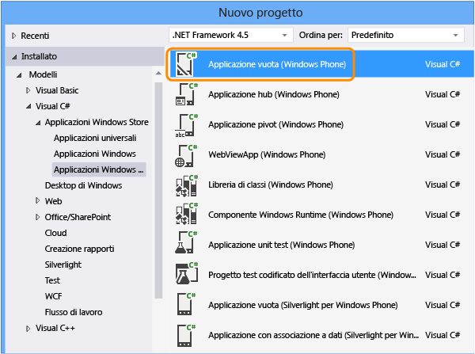  
  
2.  In Esplora soluzioni aprire il file MainPage.xaml. Dalla casella degli strumenti trascinare un controllo Button e un controllo Textbox nell'area di progettazione.  
  
       
  
3.  Nella finestra Proprietà assegnare un nome al controllo Button.  
  
     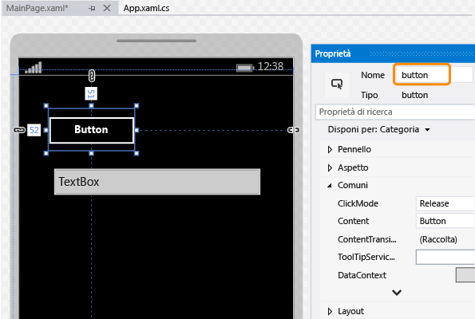  
  
4.  Assegnare un nome al controllo TextBox.  
  
     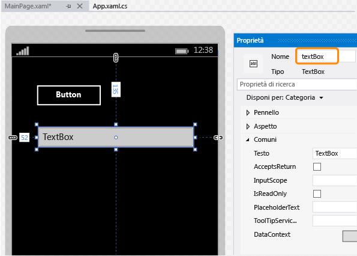  
  
5.  Nell'area di progettazione fare doppio clic sul controllo Button e aggiungere il codice seguente:  
  
    ```c#  
    private void button_Click_1(object sender, RoutedEventArgs e) { this.textBox.Text = this.button.Name; }  
  
    ```  
  
    ```vb#  
    Public NotInheritable Class MainPage Inherits Page Private Sub button_Click(sender As Object, e As RoutedEventArgs) Handles Button.Click Me.textBox.Text = Me.button.Name End Sub End Class  
    ```  
  
6.  Premere F5 per eseguire l'app per Windows Phone nell'emulatore e verificare che funzioni.  
  
     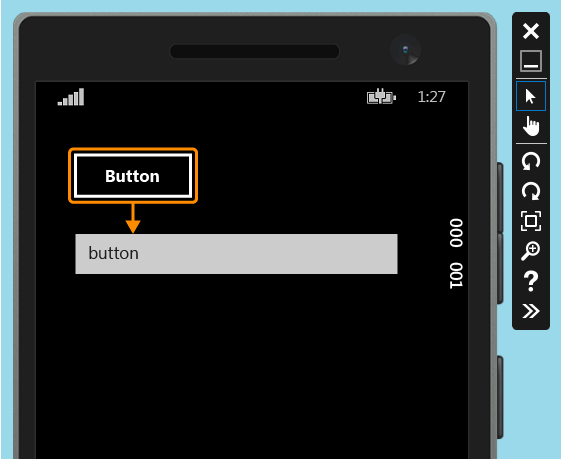  
  
7.  Uscire dall'emulatore.  
  
## Distribuire l'app per Windows Phone  
  
1.  Prima che un test codificato dell'interfaccia utente possa mappare i controlli di un'app, è necessario distribuirla.  
  
     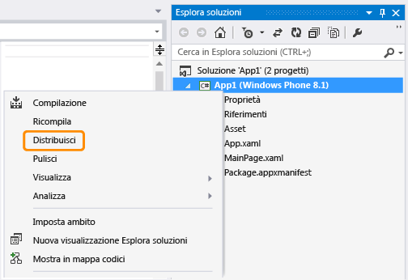  
  
     L'emulatore si avvia. È ora possibile testare l'app.  
  
       
  
     Mantenere l'emulatore in esecuzione durante la creazione del test codificato dell'interfaccia utente.  
  
## Creare un test codificato dell'interfaccia utente per l'app per Windows Phone  
  
1.  Aggiungere un nuovo progetto di test codificato dell'interfaccia utente alla soluzione contenente l'app per Windows Phone.  
  
     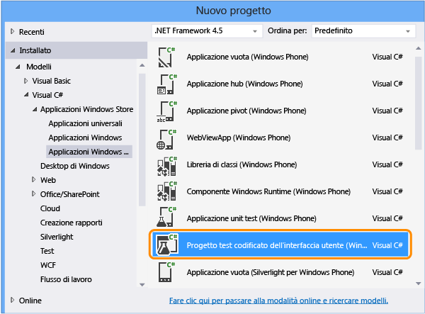  
  
2.  Scegliere di modificare la mappa dell'interfaccia utente usando lo strumento selettore di precisione.  
  
       
  
3.  Usare lo strumento selettore di precisione per selezionare l'app, quindi copiare il valore per la proprietà **AutomationId** dell'app, che verrà usato successivamente per avviare l'app durante il test.  
  
     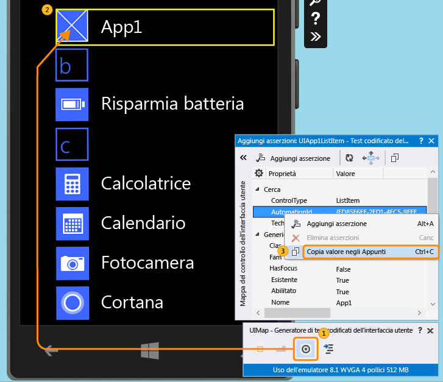  
  
4.  Nell'emulatore avviare l'app e usare lo strumento selettore di precisione per selezionare il controllo Button. Aggiungere quindi il controllo Button alla mappa di controllo dell'interfaccia utente.  
  
     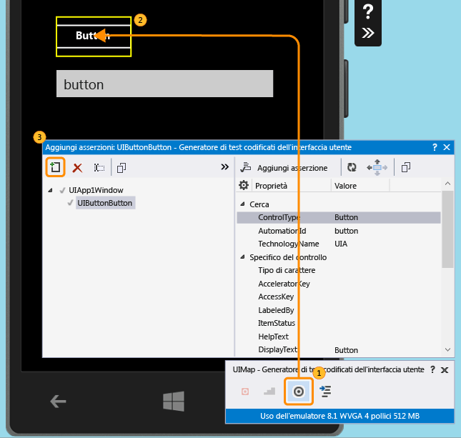  
  
5.  Per aggiungere il controllo TextBox alla mappa di controllo dell'interfaccia utente, ripetere il passaggio precedente.  
  
     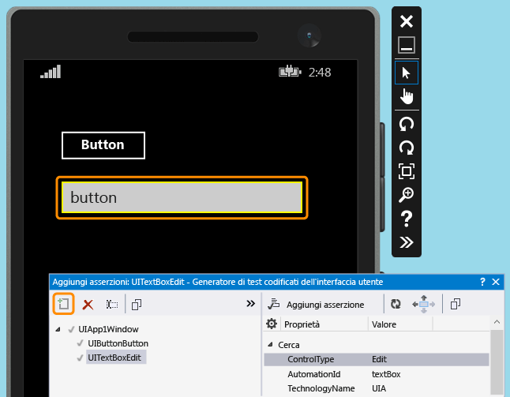  
  
6.  Generare il codice per creare il codice per le modifiche alla mappa di controllo dell'interfaccia utente.  
  
     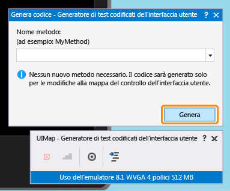  
  
7.  Usare lo strumento selettore di precisione per selezionare il controllo TextBox e quindi selezionare la proprietà **Text**.  
  
     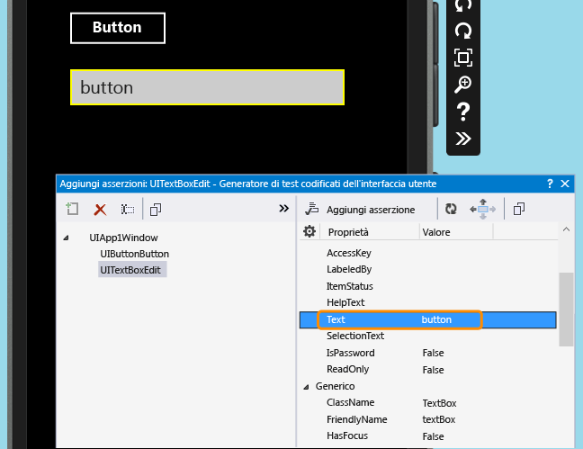  
  
8.  Aggiungere un'asserzione. Verrà usata nel test per verificare che il valore sia corretto.  
  
     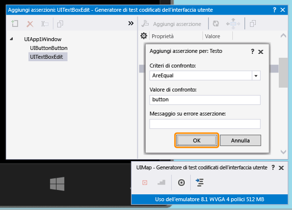  
  
9. Aggiungere e generare il codice per il metodo Assert.  
  
     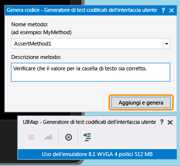  
  
10. **Visual C\#**  
  
     In Esplora soluzioni aprire il file UIMap.Designer.cs per visualizzare il codice appena aggiunto per il metodo Assert e i controlli.  
  
     **Visual Basic**  
  
     In Esplora soluzioni aprire il file CodedUITest1.vb. Nel codice del metodo di test CodedUITestMethod1\(\) fare clic con il pulsante destro sulla chiamata al metodo di asserzione `Me.UIMap.AssertMethod1()` automaticamente aggiunto e scegliere **Vai a definizione**. Verrà aperto il file UIMap.Designer.vb nell'editor del codice per visualizzare il codice aggiunto per il metodo di asserzione e i controlli.  
  
    > [!WARNING]
    >  Non modificare direttamente il file UIMap.designer.cs o UIMap.Designer.vb perché, così facendo, le modifiche apportate al file verrebbero sovrascritte ogni volta che viene generato il test.  
  
     **Metodo Assert**  
  
    ```c#  
    public void AssertMethod1() { #region Variable Declarations XamlEdit uITextBoxEdit = this.UIApp1Window.UITextBoxEdit; #endregion // Verify that the 'Text' property of 'textBox' text box equals 'button' Assert.AreEqual(this.AssertMethod1ExpectedValues.UITextBoxEditText, uITextBoxEdit.Text); }  
    ```  
  
    ```vb#  
    Public Sub AssertMethod1() Dim uITextBoxEdit As XamlEdit = Me.UIApp1Window.UITextBoxEdit 'Verify that the 'Text' property of 'textBox' text box equals 'button' Assert.AreEqual(Me.AssertMethod1ExpectedValues.UITextBoxEditText, uITextBoxEdit.Text) End Sub  
    ```  
  
     **Controlli**  
  
    ```c#  
    #region Properties public virtual AssertMethod1ExpectedValues AssertMethod1ExpectedValues { get { if ((this.mAssertMethod1ExpectedValues == null)) { this.mAssertMethod1ExpectedValues = new AssertMethod1ExpectedValues(); } return this.mAssertMethod1ExpectedValues; } } public UIApp1Window UIApp1Window { get { if ((this.mUIApp1Window == null)) { this.mUIApp1Window = new UIApp1Window(); } return this.mUIApp1Window; } } #endregion #region Fields private AssertMethod1ExpectedValues mAssertMethod1ExpectedValues; private UIApp1Window mUIApp1Window; #endregion  
    ```  
  
    ```vb#  
    #Region "Properties" Public ReadOnly Property UIButtonButton() As XamlButton Get If (Me.mUIButtonButton Is Nothing) Then Me.mUIButtonButton = New XamlButton(Me) Me.mUIButtonButton.SearchProperties(XamlButton.PropertyNames.AutomationId) = "button" End If Return Me.mUIButtonButton End Get End Property Public ReadOnly Property UITextBoxEdit() As XamlEdit Get If (Me.mUITextBoxEdit Is Nothing) Then Me.mUITextBoxEdit = New XamlEdit(Me) Me.mUITextBoxEdit.SearchProperties(XamlEdit.PropertyNames.AutomationId) = "textBox" End If Return Me.mUITextBoxEdit End Get End Property #End Region #Region "Fields" Private mUIButtonButton As XamlButton Private mUITextBoxEdit As XamlEdit #End Region  
    ```  
  
11. In Esplora soluzioni aprire il file CodedUITest1.cs o CodedUITest1.vb. È ora possibile aggiungere il codice al metodo CodedUTTestMethod1 per le azioni necessarie per l'esecuzione del test. Usare i controlli aggiunti alla mappa dell'interfaccia utente per aggiungere il codice seguente:  
  
    1.  Avviare l'app per Windows Phone usando la proprietà automationID copiata in precedenza negli Appunti:  
  
        ```c#  
        XamlWindow myAppWindow = XamlWindow.Launch("ed85f6ff-2fd1-4ec5-9eef-696026c3fa7b_cyrqexqw8cc7c!App");  
        ```  
  
        ```vb#  
        XamlWindow.Launch("ed85f6ff-2fd1-4ec5-9eef-696026c3fa7b_cyrqexqw8cc7c!App");  
        ```  
  
    2.  Aggiungere un gesto tocco per il controllo Button:  
  
        ```c#  
        Gesture.Tap(this.UIMap.UIApp1Window.UIButtonButton);  
        ```  
  
        ```vb#  
        Gesture.Tap(Me.UIMap.UIApp1Window.UIButtonButton)  
        ```  
  
    3.  Verificare che la chiamata al metodo Assert generato automaticamente avvenga dopo l'avvio dell'app e del gesto tocco sul pulsante:  
  
        ```c#  
        this.UIMap.AssertMethod1();  
        ```  
  
        ```vb#  
        Me.UIMap.AssertMethod1()  
        ```  
  
     Dopo avere aggiunto il codice, il metodo di test CodedUITestMethod1 dovrebbe avere un aspetto simile al seguente:  
  
    ```c#  
    [TestMethod] public void CodedUITestMethod1() { // To generate code for this test, select "Generate Code for Coded UI Test" from the shortcut menu and select one of the menu items. // Launch the app. XamlWindow myAppWindow = XamlWindow.Launch("ed85f6ff-2fd1-4ec5-9eef-696026c3fa7b_cyrqexqw8cc7c!App"); // Tap the button. Gesture.Tap(this.UIMap.UIApp1Window.UIButtonButton); this.UIMap.AssertMethod1(); }  
    ```  
  
    ```vb#  
    <CodedUITest> Public Class CodedUITest1 <TestMethod()> Public Sub CodedUITestMethod1() ' ' To generate code for this test, select "Generate Code for Coded UI Test" from the shortcut menu and select one of the menu items. ' ' Launch the app. XamlWindow.Launch("ed85f6ff-2fd1-4ec5-9eef-696026c3fa7b_cyrqexqw8cc7c!App") '// Tap the button. Gesture.Tap(Me.UIMap.UIApp1Window.UIButtonButton) Me.UIMap.AssertMethod1() End Sub  
    ```  
  
## Eseguire il test codificato dell'interfaccia utente  
  
1.  Compilare ed eseguire il test con Esplora test.  
  
     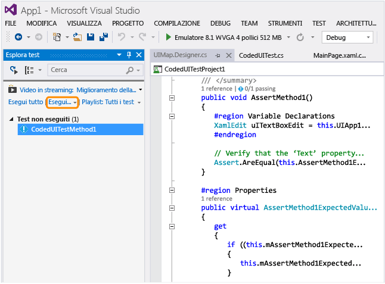  
  
     L'app per Windows Phone viene avviata, l'azione per il tocco del pulsante è completata e la proprietà Text della casella di testo è popolata e convalidata tramite il metodo Assert.  
  
       
  
     Al termine dell'operazione, Esplora test conferma che il test è stato superato.  
  
     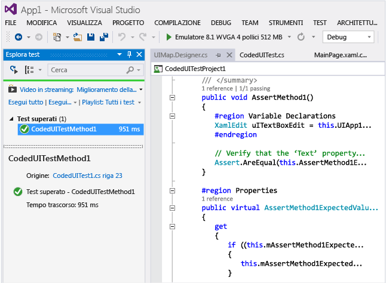  
  
##  <a name="TestingPhoneAppsCodedUI_DataDriven"></a> Usare test codificati dell'interfaccia utente basati sui dati sulle app per Windows Phone  
 Per testare varie condizioni, è possibile eseguire un test codificato dell'interfaccia utente più volte con diversi set di dati.  
  
 I test codificati dell'interfaccia utente basati sui dati per Windows Phone sono definiti tramite l'uso dell'attributo DataRow su un metodo di test. Nell'esempio seguente x e y usano i valori di 1 e 2 per la prima iterazione e di \-1 e \-2 per la seconda iterazione del test.  
  
```  
[DataRow(1, 2, DisplayName = "Add positive numbers")] [DataRow(-1, -2, DisplayName = "Add negative numbers")] [TestMethod] public void DataDrivingDemo_MyTestMethod(int x, int y)  
  
```  
  
## Domande e risposte  
  
### D: È necessario distribuire l'app per Windows Phone nell'emulatore per poter mappare i controlli dell'interfaccia utente?  
 **R**: Sì, il generatore di test codificati dell'interfaccia utente richiede che l'emulatore sia in esecuzione e che l'app venga distribuita in esso. In caso contrario, verrà restituito un messaggio di errore che indica che non è stato trovato alcun emulatore in esecuzione.  
  
###  <a name="TestingPhoneAppsCodedUI_EmulatorDevice"></a> D: È possibile eseguire i test solo nell'emulatore o si può usare anche un dispositivo fisico?  
 **R**: Entrambe le opzioni sono supportate. La destinazione per l'esecuzione del test si seleziona modificando il tipo di emulatore o selezionando un dispositivo nella barra degli strumenti del dispositivo. Se si seleziona Dispositivo, è necessario collegare un dispositivo Phone Blue a una delle porte USB del computer.  
  
 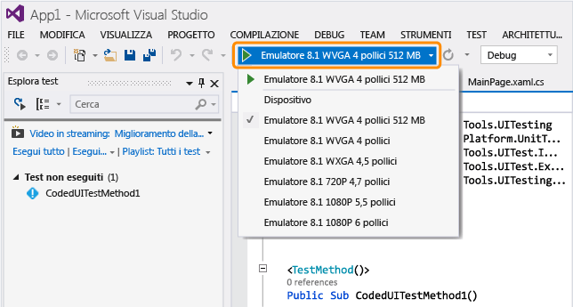  
  
### D: Perché non è presente un'opzione per registrare il test codificato dell'interfaccia utente nella finestra di dialogo Genera codice per test codificato dell'interfaccia utente?  
 **R**: L'opzione per la registrazione non è supportata per le app per Windows Phone.  
  
### Q: È possibile creare un test codificato dell'interfaccia utente per le app per Windows Phone basate su WinJS, Silverlight o HTML5?  
 **R**: No, sono supportate solo le app basate su XAML.  
  
### D: È possibile creare test codificati dell'interfaccia utente per le app di Windows Phone in un sistema che non esegue Windows 8.1 o Windows 10?  
 **R**: No, i modelli di progetto per i test codificati dell'interfaccia utente sono disponibili solo in Windows 8.1 e Windows 10. Per creare l'automazione per le app UWP \(Universal Windows Platform\), sarà necessario Windows 10.  
  
### D: Come si creano i test codificati dell'interfaccia utente per le app UWP \(Universal Windows Platform\)?  
 **A**: A seconda della piattaforma dove si sta testando l'app UWP, creare un progetto di test codificato dell'interfaccia utente in uno di questi modi:  
  
-   Un'app della piattaforma UWP in esecuzione in un computer locale verrà eseguita come app di Windows Store. Per testarla, è necessario usare il modello **Progetto di test codificato dell'interfaccia utente \(Windows\)**. Per trovare questo modello quando si crea un nuovo progetto, andare al nodo **Universal**, **Windows** oppure in alternativa andare al nodo **Windows**, **Windows 8**, **Windows**.  
  
-   Un'app della piattaforma UWP in esecuzione su un dispositivo mobile ed emulatore verrà eseguita come app per Windows Phone. Per testarla, è necessario usare il modello **Progetto di test codificato dell'interfaccia utente \(Windows Phone\)**. Per trovare questo modello quando si crea un nuovo progetto, andare al nodo **Universal**, **Windows** oppure in alternativa andare al nodo **Windows**, **Windows 8**, **Windows Phone**.  
  
 Dopo aver creato il progetto, la creazione di un test è uguale a quella descritta in precedenza.  
  
### D: È possibile selezionare controlli esterni all'emulatore?  
 **R**: No, in quanto il generatore non sarà in grado di rilevarli.  
  
### D: È possibile usare il generatore di test codificati dell'interfaccia utente per mappare i controlli usando un telefono fisico?  
 **R**: No, il generatore può mappare gli elementi dell'interfaccia utente solo se l'app è stata distribuita nell'emulatore.  
  
### D: Perché non è possibile modificare il codice nel file UIMap.Designer?  
 **R**: Qualsiasi modifica del codice apportata nel file UIMapDesigner.cs verrà sovrascritta ogni volta che si genera codice usando UIMap \- Generatore di test codificati dell'interfaccia utente. Se è necessario modificare un metodo registrato, copiarlo nel file UIMap.cs e rinominarlo. Il file UIMap.cs può essere usato per eseguire l'override dei metodi e delle proprietà contenuti nel file UIMapDesigner.cs. È necessario rimuovere il riferimento al metodo originale nel file Coded UITest.cs e sostituirlo con il nome del metodo rinominato.  
  
### D: È possibile eseguire un test codificato dell'interfaccia utente sull'app per Windows Phone dalla riga di comando?  
 **R**: Sì, usando un file con estensione runsettings per specificare il dispositivo di destinazione per l'esecuzione del test. Ad esempio:  
  
 **vstest.console.exe “pathToYourCodedUITestDll” \/settings:devicetarget.runsettings**  
  
 File con estensione runsettings di esempio:  
  
```  
<?xml version="1.0" encoding="utf-8"?> <RunSettings> <MSPhoneTest> <!--to specify test execution on device, use a TargetDevice option as follows--> <TargetDevice>Device</TargetDevice> <!--to specify an emulator instead, use a TargetDevice option like below--> <!--<TargetDevice>Emulator 8.1 WVGA 4 inch 512MB</TargetDevice>--> </MSPhoneTest> </RunSettings>  
```  
  
### D: Quali sono le differenze tra i test codificati dell'interfaccia utente per app di Windows Store e le app per Windows Phone basate su XAML?  
 **R**: Ecco alcune delle differenze principali:  
  
|Funzionalità|App di Windows Store|App di Windows Phone|  
|------------------|--------------------------|--------------------------|  
|Destinazione per l'esecuzione di test|Computer locale o remoto. È possibile specificare i computer quando si usa un test case automatizzato per l'esecuzione dei test. Vedere [Automatizzare un test case in Microsoft Test Manager](/devops-test-docs/test/automate-a-test-case-in-microsoft-test-manager).|Emulatore o dispositivo. Vedere, [D: È possibile eseguire i test solo nell'emulatore o si può usare anche un dispositivo fisico?](#TestingPhoneAppsCodedUI_EmulatorDevice) in questo argomento.|  
|Esecuzione dalla riga di comando|File di impostazioni non necessario per specificare la destinazione.|File con estensione runsettings necessario per specificare la destinazione.|  
|Classi specializzate per controlli della shell|<xref:Microsoft.VisualStudio.TestTools.UITesting.DirectUIControls.DirectUIControl>|<xref:Microsoft.VisualStudio.TestTools.UITesting.UITestControl>|  
|Controllo WebView in un'app XAML|Supportato se si usano classi specializzate Html\* per interagire con gli elementi HTML. Vedere <xref:Microsoft.VisualStudio.TestTools.UITesting.HtmlControls>.|Non supportato.|  
|Esecuzione di test automatizzati da MTM|Supportata.|Non supportata.|  
|Test basati su dati|Per informazioni sull'uso di origini dati esterne e sull'uso dell'attributo DataSource su un metodo di test, vedere [Test basati sui dati](../test/creating-a-data-driven-coded-ui-test.md).|I dati sono specificati inline, usando l'attributo DataRow su un metodo di test. Vedere [Usare test codificati dell'interfaccia utente basati sui dati sulle app per Windows Phone](#TestingPhoneAppsCodedUI_DataDriven) in questo argomento.|  
  
 Per informazioni sui test codificati dell'interfaccia utente per le app di Windows Store, vedere [Eseguire test codificati dell'interfaccia utente sulle app di Windows Store 8.1](../test/test-windows-store-8-1-apps-with-coded-ui-tests.md).  
  
## Risorse esterne  
 Post del blog di Microsoft Visual Studio Application Lifecycle Management relativo [all'uso dell'interfaccia utente codificata per testare le app di Windows Phone basate su XAML](http://blogs.msdn.com/b/visualstudioalm/archive/2014/04/05/using-coded-ui-to-test-xaml-based-windows-phone-apps.aspx?PageIndex=2#comments)  
  
## Vedere anche  
 [Usare l'automazione dell'interfaccia utente per testare il codice](../test/use-ui-automation-to-test-your-code.md)