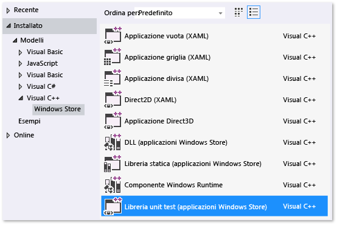
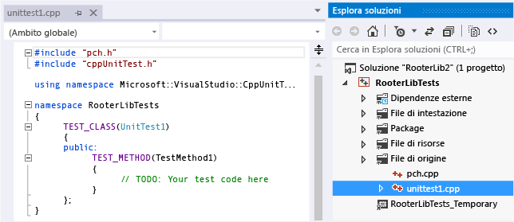
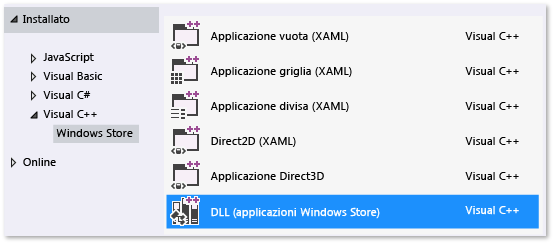
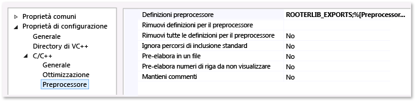

# <a name="unit-testing-a-visual-c-dll-for-store-apps"></a>Testing unità di una DLL di Visual C++ per le app dello Store
Questo argomento descrive come creare unit test per una DLL in C++ per app di Windows Store. La DLL RooterLib ricorda vagamente la teoria dei limiti di calcolo, implementando una funzione che calcola una stima della radice quadrata di un numero specificato. La DLL può quindi essere inclusa in un'app di Windows Store che mostra a un utente il lato divertente della matematica.  
  
 Questo argomento illustra come usare unit test come primo passaggio dell'attività di sviluppo Secondo questo approccio devi innanzitutto scrivere un metodo di test che verifica il comportamento specifico del sistema che stai testando, quindi scriverai il codice che supera il test. Apportando modifiche nell'ordine in cui sono presentate le procedure riportate di seguito, puoi invertire questa strategia scrivendo per primo il codice che vuoi testare, quindi gli unit test.  
  
 In questo argomento si creerà inoltre una soluzione di Visual Studio e progetti distinti per gli unit test e la DLL da testare. Puoi anche includere gli unit test direttamente nel progetto DLL oppure creare soluzioni separate per gli unit test e la DLL. Per suggerimenti sulla struttura da usare, vedere [Aggiunta di unit test alle applicazioni C++ esistenti](../test/unit-testing-existing-cpp-applications-with-test-explorer.md).  
  
##  <a name="BKMK_In_this_topic"></a> Contenuto dell'argomento  
 Questo argomento descrive come eseguire le attività seguenti:  
  
 [Creare la soluzione e il progetto unit test](#BKMK_Create_the_solution_and_the_unit_test_project)  
  
 [Verificare che i test siano eseguiti in Esplora test](#BKMK_Verify_that_the_tests_run_in_Test_Explorer)  
  
 [Aggiungere il progetto di DLL alla soluzione](#BKMK_Add_the_DLL_project_to_the_solution)  
  
 [Abbinare il progetto di test al progetto di DLL](#BKMK_Couple_the_test_project_to_the_dll_project)  
  
 [Incrementare i test in maniera iterativa e fare in modo che siano superati](#BKMK_Iteratively_augment_the_tests_and_make_them_pass)  
  
 [Eseguire il debug di un test non superato](#BKMK_Debug_a_failing_test)  
  
 [Effettuare il refactoring del codice senza modificare i test](#BKMK_Refactor_the_code_without_changing_tests)  
  
##  <a name="BKMK_Create_the_solution_and_the_unit_test_project"></a> Creare la soluzione e il progetto unit test  
  
1.  Scegliere **Nuovo** dal menu **File**, quindi **Nuovo progetto**.  
  
2.  Nella finestra di dialogo Nuovo progetto espandere **Installato**, espandere **Visual C++** e quindi scegliere **Windows Store**. Scegli quindi **Libreria unit test (applicazioni Windows Store)** dall'elenco di modelli di progetto.  
  
       
  
3.  Assegnare al progetto il nome `RooterLibTests`, specificare il percorso, assegnare alla soluzione il nome `RooterLib` e verificare che l'opzione **Crea directory per soluzione** sia selezionata.  
  
       
  
4.  Nel nuovo progetto aprire **unittest1.cpp**.  
  
       
  
     Tenere presente quanto segue:  
  
    -   Ogni test è definito tramite `TEST_METHOD(YourTestName){...}`.  
  
         Non è necessario scrivere una firma della funzione formale. La firma viene creata dalla macro TEST_METHOD. La macro genera un'istanza a una funzione che restituisce un valore nullo. Viene inoltre generata una funzione statica che restituisce informazioni sul metodo di test. Queste informazioni consentono ad Esplora test di individuare il metodo.  
  
    -   I metodi dei test vengono raggruppati in classi usando `TEST_CLASS(YourClassName){...}`.  
  
         Quando vengono eseguiti i test, viene creata un'istanza di ogni classe di test. I metodi di test vengono chiamati in un ordine non specificato. È possibile definire metodi speciali che vengono richiamati prima e dopo ogni modulo, classe, o metodo. Per altre informazioni, vedere [Uso di Microsoft.VisualStudio.TestTools.CppUnitTestFramework](../test/using-microsoft-visualstudio-testtools-cppunittestframework.md) in MSDN Library.  
  
##  <a name="BKMK_Verify_that_the_tests_run_in_Test_Explorer"></a> Verificare che i test siano eseguiti in Esplora test  
  
1.  Inserire il codice di test:  
  
    ```cpp  
    TEST_METHOD(TestMethod1)  
    {  
        Assert::AreEqual(1,1);  
    }  
    ```  
  
     Si noti che la classe `Assert` fornisce diversi metodi statici che è possibile usare per verificare i risultati nei metodi di test.  
  
2.  Scegliere **Esegui** dal menu **Test**, quindi **Esegui tutto**.  
  
     Il progetto di test viene compilato ed eseguito. Verrà visualizzata la finestra di Esplora test con il test elencato in **Test superati**. Nel riquadro di riepilogo nella parte inferiore della finestra sono disponibili ulteriori dettagli sul test selezionato.  
  
       
  
##  <a name="BKMK_Add_the_DLL_project_to_the_solution"></a> Aggiungere il progetto di DLL alla soluzione  
  
1.  In Esplora soluzioni scegliere il nome della soluzione. Dal menu di scelta rapida scegliere **Aggiungi** e quindi **Aggiungi nuovo progetto**.  
  
       
  
2.  Nella finestra di dialogo **Aggiungi nuovo progetto** scegliere **DLL (app di Windows Store)**.  
  
3.  Aggiungere il seguente codice al file **RooterLib.h**:  
  
    ```cpp  
    // The following ifdef block is the standard way of creating macros which make exporting   
    // from a DLL simpler. All files within this DLL are compiled with the ROOTERLIB_EXPORTS  
    // symbol defined on the command line. This symbol should not be defined on any project  
    // that uses this DLL. This way any other project whose source files include this file see   
    // ROOTERLIB_API functions as being imported from a DLL, whereas this DLL sees symbols  
    // defined with this macro as being exported.  
    #ifdef ROOTERLIB_EXPORTS  
    #define ROOTERLIB_API  __declspec(dllexport)  
    #else  
    #define ROOTERLIB_API __declspec(dllimport)  
    #endif //ROOTERLIB_EXPORTS  
  
    class ROOTERLIB_API CRooterLib {  
    public:  
        CRooterLib(void);  
        double SquareRoot(double v);  
    };  
    ```  
  
     I commenti spiegano il blocco ifdef non solo allo sviluppatore della DLL, ma a chiunque faccia riferimento alla DLL nel progetto. È possibile aggiungere il simbolo di ROOTERLIB_EXPORTS alla riga di comando usando le proprietà di progetto della DLL.  
  
     La classe `CRooterLib` dichiara un costruttore e il metodo estimativo `SqareRoot`.  
  
4.  Aggiungere il simbolo di ROOTERLIB_EXPORTS alla riga di comando.  
  
    1.  In Esplora soluzioni selezionare il progetto **RooterLib** e quindi scegliere **Proprietà** dal menu di scelta rapida.  
  
           
  
    2.  Nella finestra di dialogo Pagina delle proprietà di RooterLib Property espandere **Proprietà di configurazione**, espandere **C++** e scegliere **Preprocessore**.  
  
    3.  Scegliere **\<Modifica>** nell'elenco **Definizioni preprocessore** e quindi aggiungere `ROOTERLIB_EXPORTS` nella finestra di dialogo Definizioni preprocessore.  
  
5.  Aggiungere implementazioni minime delle funzioni dichiarate. Aprire **RooterLib.cpp** e aggiungere il codice seguente:  
  
    ```  
    // constructor  
    CRooterLib::CRooterLib()  
    {  
    }  
  
    // Find the square root of a number.  
    double CRooterLib::SquareRoot(double v)  
    {  
        return 0.0;  
    }  
  
    ```  
  
##  <a name="BKMK_Couple_the_test_project_to_the_dll_project"></a> Abbinare il progetto di test al progetto di DLL  
  
1.  Aggiungere RooterLib al progetto RooterLibTests.  
  
    1.  In Esplora soluzioni selezionare il progetto **RooterLibTests** e quindi scegliere **Riferimenti** dal menu di scelta rapida.  
  
    2.  Nella finestra di dialogo delle proprietà del progetto RooterLib espandere **Proprietà comuni** e scegliere **Framework e riferimenti**.  
  
    3.  Scegliere **Aggiungi nuovo riferimento**.  
  
    4.  Nella finestra di dialogo **Aggiungi riferimento** espandere **Soluzione** e quindi scegliere **Progetti**. Selezionare quindi l'elemento **RouterLib**.  
  
2.  Includere il file di intestazione RooterLib in **unittest1.cpp**.  
  
    1.  Aprire **unittest1.cpp**.  
  
    2.  Aggiungere il codice seguente sotto la riga `#include "CppUnitTest.h"`:  
  
        ```cpp  
        #include "..\RooterLib\RooterLib.h"  
        ```  
  
3.  Aggiungere un test che usa la funzione importata. Aggiungere il codice seguente a **unittest1.cpp**:  
  
    ```  
    TEST_METHOD(BasicTest)  
    {  
        CRooterLib rooter;  
        Assert::AreEqual(  
            // Expected value:  
            0.0,   
            // Actual value:  
            rooter.SquareRoot(0.0),   
            // Tolerance:  
            0.01,  
            // Message:  
            L"Basic test failed",  
            // Line number - used if there is no PDB file:  
            LINE_INFO());  
    }  
  
    ```  
  
4.  Compilare la soluzione.  
  
     Il nuovo test viene visualizzato in Esplora test nel nodo **Test non eseguiti**.  
  
5.  In Esplora test scegliere **Esegui tutto**.  
  
       
  
 È stato installato il test e i progetti di codice, e verificato che sia possibile eseguire test che eseguono funzioni nel progetto di codice. Ora è possibile iniziare a scrivere test e codici reali.  
  
##  <a name="BKMK_Iteratively_augment_the_tests_and_make_them_pass"></a> Aumentare i test in maniera iterativa e farli passare  
  
1.  Aggiungere un nuovo test:  
  
    ```  
    TEST_METHOD(RangeTest)  
    {  
        CRooterLib rooter;  
        for (double v = 1e-6; v < 1e6; v = v * 3.2)  
        {  
            double expected = v;  
            double actual = rooter.SquareRoot(v*v);  
            double tolerance = expected/1000;  
            Assert::AreEqual(expected, actual, tolerance);  
        }  
    };  
  
    ```  
  
    > [!TIP]
    >  È consigliabile non modificare i test che siano stati superati. Al contrario, aggiungere un nuovo test, aggiornare il codice in modo che il test passi e quindi aggiungere un altro test, e così via.  
    >   
    >  Quando gli utenti modificano i requisiti, disabilitare i test che non sono più corretti. Scrivere nuovi test e farli funzionare uno alla volta, nello stesso modo incrementale.  
  
2.  In Esplora test scegliere **Esegui tutto**.  
  
3.  Il test ha esito negativo.  
  
       
  
    > [!TIP]
    >  Verificare che ogni test non venga superato subito dopo averlo scritto. Questo consente di evitare il semplice errore di scrivere un test che riesce sempre.  
  
4.  Modifica il codice sottoposto a test in modo che il nuovo test venga superato. Aggiungere quanto segue a **RooterLib.cpp**:  
  
    ```cpp  
    #include <math.h>  
    ...  
    // Find the square root of a number.  
    double CRooterLib::SquareRoot(double v)  
    {  
        double result = v;  
        double diff = v;  
        while (diff > result/1000)  
        {  
            double oldResult = result;  
            result = result - (result*result - v)/(2*result);  
            diff = abs (oldResult - result);  
        }  
        return result;  
    }  
  
    ```  
  
5.  Compilare la soluzione e quindi in Esplora test, scegliere **Esegui tutto**.  
  
     Entrambi i test vengono superati.  
  
> [!TIP]
>  Sviluppare il codice aggiungendo un test alla volta. Assicurarsi che tutti i test vengano superati dopo ogni iterazione.  
  
##  <a name="BKMK_Debug_a_failing_test"></a> Debug di un test non superato  
  
1.  Aggiungere un altro test a **unittest1.cpp**:  
  
    ```  
    // Verify that negative inputs throw an exception.  
     TEST_METHOD(NegativeRangeTest)  
     {  
       wchar_t message[200];  
       CRooterLib rooter;  
       for (double v = -0.1; v > -3.0; v = v - 0.5)  
       {  
         try   
         {  
           // Should raise an exception:  
           double result = rooter.SquareRoot(v);  
  
           swprintf_s(message, L"No exception for input %g", v);  
           Assert::Fail(message, LINE_INFO());  
         }  
         catch (std::out_of_range ex)  
         {  
           continue; // Correct exception.  
         }  
         catch (...)  
         {  
           swprintf_s(message, L"Incorrect exception for %g", v);  
           Assert::Fail(message, LINE_INFO());  
         }  
       }  
    };  
  
    ```  
  
2.  In Esplora test scegliere **Esegui tutto**.  
  
     Il test ha esito negativo. Scegli il nome del test in Esplora test. L'asserzione fallita viene evidenziata. Il messaggio di errore è visibile nel riquadro dei dettagli di Esplora test.  
  
       
  
3.  Per capire perché il test non riesce, scorrere la funzione:  
  
    1.  Imposta un punto di interruzione all'inizio della funzione `SquareRoot`.  
  
    2.  Dal menu di scelta rapida del test non superato, scegliere **Esegui debug test selezionati**.  
  
         Quando l'esecuzione si arresta in corrispondenza del punto di interruzione, eseguire il codice un'istruzione alla volta.  
  
    3.  Aggiungere codice a **RooterLib.cpp** per intercettare l'eccezione:  
  
        ```  
        #include <stdexcept>  
        ...  
        double CRooterLib::SquareRoot(double v)  
        {  
            //Validate the input parameter:  
            if (v < 0.0)   
            {  
              throw std::out_of_range("Can't do square roots of negatives");  
            }  
        ...  
  
        ```  
  
    1.  In Esplora test scegliere **Esegui tutto** per testare il metodo corretto e assicurarsi di non aver introdotto una regressione.  
  
 Tutti i test vengono ora superati.  
  
   
  
##  <a name="BKMK_Refactor_the_code_without_changing_tests"></a> Eseguire il refactoring del codice senza modificare i test  
  
1.  Semplificare il calcolo centrale nella funzione `SquareRoot`:  
  
    ```  
    // old code  
    //result = result - (result*result - v)/(2*result);  
    // new code  
    result = (result + v/result) / 2.0;  
  
    ```  
  
2.  Scegliere **Esegui tutto** per testare il metodo di cui è stato eseguito il refactoring e assicurarsi di non aver introdotto una regressione.  
  
    > [!TIP]
    >  Un set stabile di unit test corretti indica con sufficiente sicurezza che non sono stati introdotti bug in fase di modifica del codice.  
    >   
    >  Mantenere il refactoring separato da altre modifiche.

