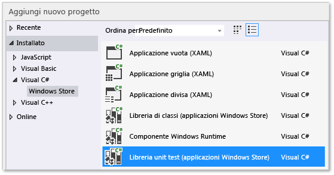
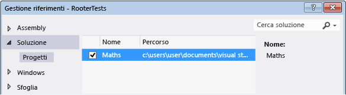
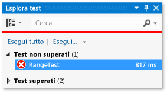
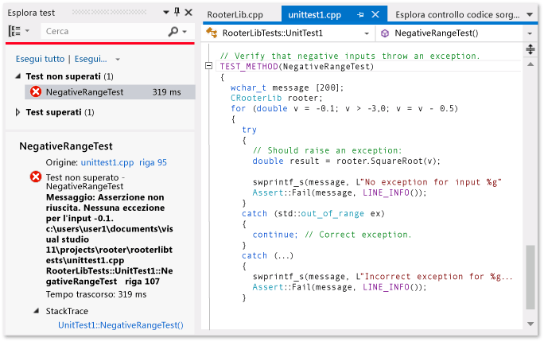
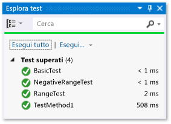

# <a name="unit-testing-visual-c-code-in-a-store-app"></a>Esecuzione di unit test di codice Visual C# in un'app dello Store
Questo argomento descrive come creare unit test per una classe Visual C# in un'app di Windows Store. La classe Rooter rammenta vagamente la teoria dei limiti di calcolo implementando una funzione che calcola una stima della radice quadrata di un numero specificato. Nell'app Maths questa funzione può quindi essere utilizzata per illustrare all'utente le varie operazioni che si possono eseguire con questa funzione matematica.  
  
 In questo argomento viene illustrato come utilizzare unit test come primo passaggio dell'attività di sviluppo. Secondo questo approccio devi innanzitutto scrivere un metodo di test che verifica il comportamento specifico del sistema che stai testando, quindi scriverai il codice che supera il test. Apportando modifiche nell'ordine in cui sono presentate le procedure riportate di seguito, è possibile invertire questa strategia scrivendo prima il codice da testare e quindi gli unit test.  
  
 In questo argomento si creerà inoltre una soluzione di Visual Studio e progetti distinti per gli unit test e la DLL da testare. È anche possibile includere gli unit test direttamente nel progetto DLL oppure creare soluzioni separate per gli unit test e la DLL.  
  
> [!NOTE]
>  Community di Visual Studio, Enterprise e Professional includono funzionalità aggiuntive per gli unit test.  
>   
>  -   Usare un framework di unit test open source o di terze parti che abbia creato un adattatore come componente aggiuntivo per Esplora test Microsoft. È anche possibile analizzare e visualizzare le informazioni di code coverage per i test.  
> -   Eseguire i test dopo ogni compilazione.  
> -   VS Enterprise include anche Microsoft Fakes, un framework di isolamento per il codice gestito che ti permette di concentrare i test sul tuo codice sostituendo il codice di test per la funzionalità di sistema e di terze parti.  
>   
>  Per altre informazioni, vedere [Verifica del codice tramite unit test](http://msdn.microsoft.com/library/dd264975.aspx) in MSDN Library.  
  
##  <a name="BKMK_In_this_topic"></a> Contenuto dell'argomento  
 [Creare la soluzione e il progetto di unit test](#BKMK_Create_the_solution_and_the_unit_test_project)  
  
 [Verificare che i test siano eseguiti in Esplora test](#BKMK_Verify_that_the_tests_run_in_Test_Explorer)  
  
 [Aggiungere la classe Rooter al progetto Maths](#BKMK_Add_the_Rooter_class_to_the_Maths_project)  
  
 [Abbinare il progetto di test al progetto di app](#BKMK_Couple_the_test_project_to_the_app_project)  
  
 [Incrementare i test in maniera iterativa e fare in modo che siano superati](#BKMK_Iteratively_augment_the_tests_and_make_them_pass)  
  
 [Eseguire il debug di un test non superato](#BKMK_Debug_a_failing_test)  
  
 [Eseguire il refactoring del codice](#BKMK_Refactor_the_code_)  
  
##  <a name="BKMK_Create_the_solution_and_the_unit_test_project"></a> Creare la soluzione e il progetto di unit test  
  
1.  Scegliere **Nuovo** dal menu **File**, quindi **Nuovo progetto**.  
  
2.  Nella finestra di dialogo **Nuovo progetto** espandere **Installato**, **Visual C#** e scegliere **Windows Store**. Scegliere quindi **App vuota** dall'elenco di modelli di progetto.  
  
3.  Assegnare al progetto il nome `Maths` e verificare che l'opzione **Crea directory per soluzione** sia selezionata.  
  
4.  In Esplora soluzioni selezionare il nome della soluzione, scegliere **Aggiungi** dal menu di scelta rapida e quindi **Nuovo progetto**.  
  
5.  Nella finestra di dialogo **Nuovo progetto** espandere **Installato**, **Visual C#** e quindi scegliere **Windows Store**. Scegli quindi **Libreria unit test (applicazioni Windows Store)** dall'elenco di modelli di progetto.  
  
       
  
6.  Apri UnitTest1.cs nell'editor di Visual Studio.  
  
    ```c#  
  
    using System;  
    using System.Collections.Generic;  
    using System.Linq;  
    using System.Text;  
    using Microsoft.VisualStudio.TestPlatform.UnitTestFramework;  
    using Maths;  
  
    namespace RooterTests  
    {  
        [TestClass]  
        public class UnitTest1  
  
            [TestMethod]  
            public void TestMethod1()  
            {  
  
            }  
  
    ```  
  
     Come si può notare:  
  
    1.  Ogni test viene definito tramite `[TestMethod]`. Un metodo di test deve restituire void e non può avere parametri.  
  
    2.  I metodi di test devono appartenere a una classe decorata con l'attributo `[TestClass]`.  
  
         Quando si eseguono i test, viene creata un'istanza di ogni classe di test. I metodi di test vengono chiamati in un ordine non specificato.  
  
    3.  È possibile definire metodi speciali che vengono richiamati prima e dopo ogni modulo, classe, o metodo. Per altre informazioni, vedere [Uso di membri Microsoft.VisualStudio.TestTools.UnitTesting](../test/using-microsoft-visualstudio-testtools-unittesting-members-in-unit-tests.md) in MSDN Library.  
  
##  <a name="BKMK_Verify_that_the_tests_run_in_Test_Explorer"></a> Verificare che i test siano eseguiti in Esplora test  
  
1.  Inserire codice di test in `TestMethod1` del file **UnitTest1.cs**:  
  
    ```c#  
  
    [TestMethod]  
    public void TestMethod1()  
    {  
        Assert.AreEqual(0, 0);  
    }  
  
    ```  
  
     Si noti che la classe `Assert` fornisce diversi metodi statici che è possibile usare per verificare i risultati nei metodi di test.  
  
2.  Scegliere **Esegui** dal menu **Test**, quindi **Esegui tutto**.  
  
     Il progetto di test viene compilato ed eseguito. Verrà visualizzata la finestra di Esplora test con il test elencato in **Test superati**. Nel riquadro di riepilogo nella parte inferiore della finestra sono disponibili ulteriori dettagli sul test selezionato.  
  
       
  
##  <a name="BKMK_Add_the_Rooter_class_to_the_Maths_project"></a> Aggiungere la classe Rooter al progetto Maths  
  
1.  In Esplora soluzioni selezionare il nome del progetto **Maths**. Scegliere **Aggiungi** dal menu di scelta rapida e quindi **Classe**.  
  
2.  Assegnare il nome `Rooter.cs` al file di classe.  
  
3.  Aggiungere il codice seguente al file **Rooter.cs** della classe Rooter:  
  
    ```c#  
  
    public Rooter()  
    {  
    }  
  
    // estimate the square root of a number  
    public double SquareRoot(double x)  
    {  
        return 0.0;  
    }  
  
    ```  
  
     La classe `Rooter` dichiara un costruttore e il metodo estimativo `SqareRoot`.  
  
4.  Il metodo `SqareRoot` è solo un'implementazione minima, sufficiente per testare la struttura di base della configurazione di test.  
  
##  <a name="BKMK_Couple_the_test_project_to_the_app_project"></a> Abbinare il progetto di test al progetto di app  
  
1.  Aggiungi un riferimento all'app Maths al progetto RooterTests.  
  
    1.  In Esplora soluzioni scegliere il progetto **RooterTests** e quindi **Aggiungi** dal menu di scelta rapida.  
  
    2.  Nella finestra di dialogo **Aggiungi riferimento - RooterTests** espandere **Soluzione** e scegliere **Progetti**. Selezionare quindi l'elemento **Maths**.  
  
           
  
2.  Aggiungi un'istruzione using al file UnitTest1.cs:  
  
    1.  Aprire **UnitTest1.cs**.  
  
    2.  Aggiungi questo codice sotto la riga `using Microsoft.VisualStudio.TestPlatform.UnitTestFramework;`:  
  
        ```c#  
        using Maths;  
        ```  
  
3.  Aggiungi un test che utilizza la funzione Rooter. Aggiungere il codice seguente a **UnitTest1.cpp**:  
  
    ```c#  
    [TestMethod]  
    public void BasicTest()  
    {  
        Maths.Rooter rooter = new Rooter();  
        double expected = 0.0;  
        double actual = rooter.SquareRoot(expected * expected);  
        double tolerance = .001;  
        Assert.AreEqual(expected, actual, tolerance);  
    }  
  
    ```  
  
4.  Compilare la soluzione.  
  
     Il nuovo test viene visualizzato in Esplora test nel nodo **Test non eseguiti**.  
  
5.  In Esplora test scegliere **Esegui tutto**.  
  
       
  
 È stato installato il test e i progetti di codice, e verificato che sia possibile eseguire test che eseguono funzioni nel progetto di codice. Ora è possibile iniziare a scrivere test e codici reali.  
  
##  <a name="BKMK_Iteratively_augment_the_tests_and_make_them_pass"></a> Aumentare i test in maniera iterativa e farli passare  
  
1.  Aggiungere un nuovo test:  
  
    ```c#  
    [TestMethod]  
    public void RangeTest()  
    {  
        Rooter rooter = new Rooter();  
        for (double v = 1e-6; v < 1e6; v = v * 3.2)  
        {  
            double expected = v;  
            double actual = rooter.SquareRoot(v*v);  
            double tolerance = ToleranceHelper(expected);  
            Assert.AreEqual(expected, actual, tolerance);  
        }  
    }  
  
    ```  
  
    > [!TIP]
    >  È consigliabile non modificare i test che siano stati superati. Al contrario, aggiungere un nuovo test, aggiornare il codice in modo che il test passi e quindi aggiungere un altro test, e così via.  
    >   
    >  Quando gli utenti modificano i requisiti, disabilitare i test che non sono più corretti. Scrivere nuovi test e farli funzionare uno alla volta, nello stesso modo incrementale.  
  
2.  In Esplora test scegliere **Esegui tutto**.  
  
3.  Il test ha esito negativo.  
  
       
  
    > [!TIP]
    >  Subito dopo averlo scritto, verifica che ogni test abbia esito negativo. Questo consente di evitare il semplice errore di scrivere un test che riesce sempre.  
  
4.  Modifica il codice sottoposto a test in modo che il nuovo test venga superato. Modificare la funzione `SqareRoot` in **Rooter.cs** nel modo seguente:  
  
    ```c#  
    public double SquareRoot(double x)  
    {  
        double estimate = x;  
        double diff = x;  
        while (diff > estimate / 1000)  
        {  
            double previousEstimate = estimate;  
            estimate = estimate - (estimate * estimate - x) / (2 * estimate);  
            diff = Math.Abs(previousEstimate - estimate);  
        }  
        return estimate;  
    }  
  
    ```  
  
5.  Compilare la soluzione e quindi in Esplora test, scegliere **Esegui tutto**.  
  
     Ora tutti e tre i test vengono superati.  
  
> [!TIP]
>  Sviluppare il codice aggiungendo un test alla volta. Assicurarsi che tutti i test vengano superati dopo ogni iterazione.  
  
##  <a name="BKMK_Debug_a_failing_test"></a> Debug di un test non superato  
  
1.  Aggiungere un altro test a **UnitTest1.cpp**:  
  
    ```c#  
    // Verify that negative inputs throw an exception.  
    [TestMethod]  
    public void NegativeRangeTest()  
    {  
        string message;  
        Rooter rooter = new Rooter();  
        for (double v = -0.1; v > -3.0; v = v - 0.5)  
        {  
            try  
            {  
                // Should raise an exception:  
                double actual = rooter.SquareRoot(v);  
  
                message = String.Format("No exception for input {0}", v);  
                Assert.Fail(message);  
            }  
            catch (ArgumentOutOfRangeException ex)  
            {  
                continue; // Correct exception.  
            }  
            catch (Exception e)  
            {  
                message = String.Format("Incorrect exception for {0}", v);  
                Assert.Fail(message);  
            }  
        }  
    }  
  
    ```  
  
2.  In Esplora test scegliere **Esegui tutto**.  
  
     Il test ha esito negativo. Scegli il nome del test in Esplora test. L'asserzione fallita viene evidenziata. Il messaggio di errore è visibile nel riquadro dei dettagli di Esplora test.  
  
       
  
3.  Per capire perché il test non riesce, scorrere la funzione:  
  
    1.  Imposta un punto di interruzione all'inizio della funzione `SquareRoot`.  
  
    2.  Dal menu di scelta rapida del test non superato, scegliere **Esegui debug test selezionati**.  
  
         Quando l'esecuzione si arresta in corrispondenza del punto di interruzione, eseguire il codice un'istruzione alla volta.  
  
    3.  Aggiungi codice al metodo Rooter per intercettare l'eccezione:  
  
        ```c#  
        public double SquareRoot(double x)  
        {  
            if (x < 0.0)  
            {  
                throw new ArgumentOutOfRangeException();  
        }  
  
        ```  
  
    1.  In Esplora test scegliere **Esegui tutto** per testare il metodo corretto e assicurarsi di non aver introdotto una regressione.  
  
 Tutti i test vengono ora superati.  
  
   
  
##  <a name="BKMK_Refactor_the_code_"></a> Eseguire il refactoring del codice  
 **Semplificare il calcolo centrale nella funzione SquareRoot.**  
  
1.  Modifica l'implementazione del risultato  
  
    ```c#  
    // old code  
    //result = result - (result*result - v)/(2*result);  
    // new code  
    result = (result + v/result) / 2.0;  
  
    ```  
  
2.  Scegliere **Esegui tutto** per testare il metodo di cui è stato eseguito il refactoring e assicurarsi di non aver introdotto una regressione.  
  
> [!TIP]
>  Un set stabile di unit test corretti indica con sufficiente sicurezza che non sono stati introdotti bug in fase di modifica del codice.  
  
 **Eseguire il refactoring del codice di test per eliminare il codice duplicato.**  
  
 Come noterai, il metodo `RangeTest` imposta come hardcoded il denominatore della variabile di tolleranza utilizzata nel metodo `Assert`. Se prevedi di aggiungere altri test che utilizzano lo stesso calcolo di tolleranza, l'uso di un valore hardcoded in più posizioni potrebbe causare l'insorgere di errori.  
  
1.  Aggiungi un metodo private alla classe Unit1Test per calcolare il valore di tolleranza e chiamare quindi tale metodo.  
  
    ```c#  
    private double ToleranceHelper(double expected)  
    {  
        return expected / 1000;  
    }  
  
    ...  
  
    [TestMethod]  
    public void RangeTest()  
    {  
        ...  
        // old code  
        // double tolerance = expected/1000;  
        // new code  
        double tolerance = ToleranceHelper(expected);  
        Assert.AreEqual(expected, actual, tolerance);  
    }  
    ...  
  
    ```  
  
2.  Scegliere **Esegui tutto** per testare il metodo di cui è stato eseguito il refactoring e assicurarsi di non aver introdotto un errore.  
  
> [!NOTE]
>  Per aggiungere un metodo di supporto a una classe di test, non aggiungere l'attributo `[TestMethod]` al metodo. Esplora test non registra il metodo da eseguire.

