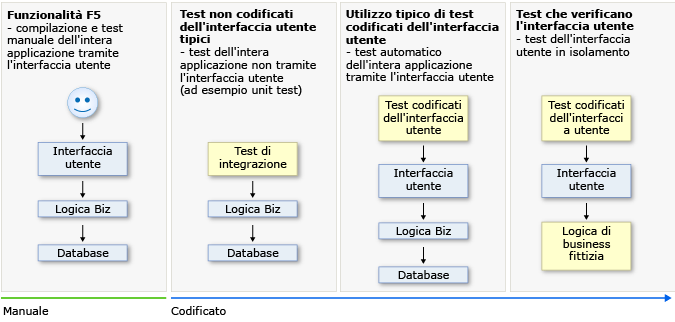
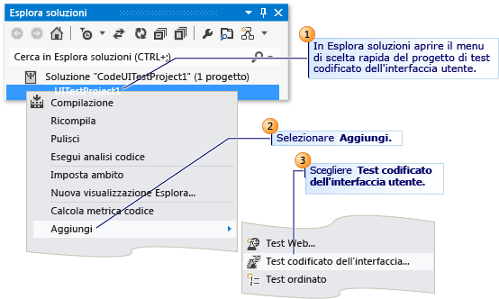
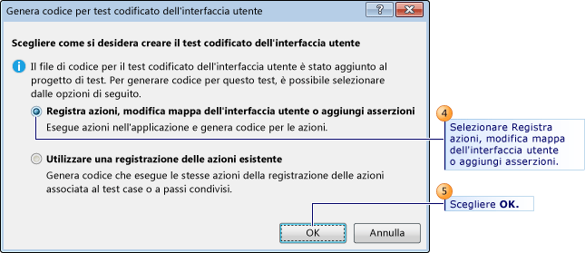
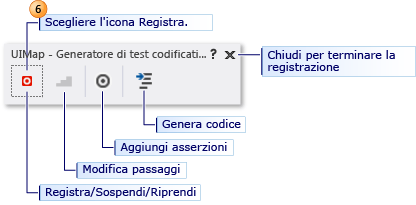
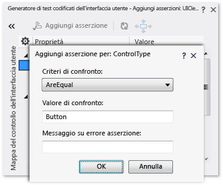
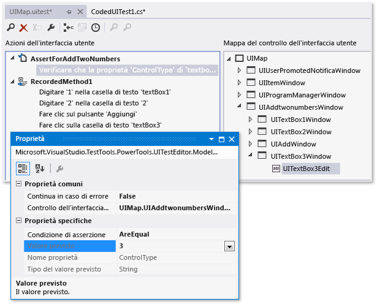
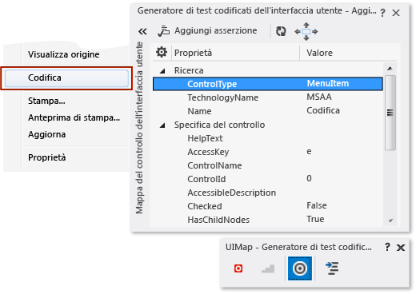
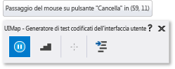

# <a name="use-ui-automation-to-test-your-code"></a>Usare l'automazione dell'interfaccia utente per testare il codice
I test automatizzati che eseguono operazioni sull'applicazione tramite l'interfaccia utente sono noti come *test codificati dell'interfaccia utente* (CUIT). Questi test includono test funzionali dei controlli dell'interfaccia utente e consentono di verificare il corretto funzionamento dell'intera applicazione, compresa l'interfaccia utente. I test codificati dell'interfaccia utente sono particolarmente utili quando l'interfaccia utente contiene codice di convalida o logica di altro tipo, come ad esempio in una pagina Web. Sono spesso usati anche per automatizzare un test manuale esistente.  
  
 Come mostrato nell'illustrazione seguente, in una procedura di sviluppo tipica si può iniziare semplicemente compilando l'applicazione (F5) e poi facendo clic sui vari controlli dell'interfaccia utente per verificare che il funzionamento sia corretto. Si può quindi decidere di creare un test codificato per non continuare a testare l'applicazione manualmente. In base alla specifica funzionalità da testare nell'applicazione, si può scrivere codice per un test funzionale o per un test di integrazione, che può includere o meno il testing a livello di interfaccia utente. Se si vuole semplicemente accedere alla logica di business, si può scrivere il codice di uno unit test. In alcuni casi, tuttavia, può essere utile includere il testing dei vari controlli dell'interfaccia utente nell'applicazione. Un test codificato dell'interfaccia utente può automatizzare lo scenario iniziale (F5), verificando che la varianza del codice non incida sul funzionamento dell'applicazione.  
  
   
  
 Creare un test codificato dell'interfaccia utente è semplice. Basta eseguire il test manualmente mentre il Generatore di test codificati dell'interfaccia utente è in esecuzione in background. È anche possibile specificare i valori che devono apparire in specifici campi. Il Generatore di test codificati dell'interfaccia utente registra le azioni e genera codice dalla registrazione. Dopo aver creato il test, è possibile modificarlo in un editor specializzato che consente di modificare la sequenza di azioni.  
  
 In alternativa, se si dispone di un test case registrato in Microsoft Test Manager, si può generare codice a partire da esso. Per altre informazioni, vedere [Registrare e riprodurre test manuali](/devops-test-docs/test/record-and-play-back-manual-tests).  
  
 L'editor specializzato e il Generatore di test codificati dell'interfaccia utente agevolano la creazione e la modifica di test codificati dell'interfaccia utente, anche se proprie competenze principali sono orientate al testing piuttosto che alla scrittura di codice. Per gli sviluppatori che vogliono estendere i test in modo più avanzato, tuttavia, il codice è strutturato in modo da essere estremamente semplice da copiare e adattare. Ad esempio, si può registrare un test per l'acquisto di un articolo in un sito Web e quindi modificare il codice generato per aggiungere un ciclo che acquista molti articoli.  
  
 **Requirements**  
  
-   Visual Studio Enterprise  
  
 Per altre informazioni sulle piattaforme e sulle configurazioni supportate dai test codificati dell'interfaccia utente, vedere [Configurazioni e piattaforme supportate per i test codificati dell'interfaccia utente e le registrazioni delle azioni](../test/supported-configurations-and-platforms-for-coded-ui-tests-and-action-recordings.md).  
  
 **Contenuto dell'argomento**  
  
-   [Creazione di test codificati dell'interfaccia utente](#VerifyingCodeUsingCUITCreate)  
  
    -   [Procedura principale](#VerifyingCodeUsingCUITCreate)  
  
    -   [Avvio e arresto dell'applicazione](#starting)  
  
    -   [Convalida delle proprietà dei controlli dell'interfaccia utente](#VerifyingCodeUsingCUITGenerateAssertions)  
  
-   [Personalizzazione del test codificato dell'interfaccia utente](#VerifyingCodeCUITModify)  
  
    -   [Codice generato](#generatedCode)  
  
    -   [Codifica di azioni e proprietà del controllo dell'interfaccia utente](#actions)  
  
    -   [Debug](#debugging)  
  
-   [Argomenti successivi](#VerifyCodeUsingCUITWhatsNext)  
  
##  <a name="VerifyingCodeUsingCUITCreate"></a> Creazione di test codificati dell'interfaccia utente  
  
1.  **Creare un progetto di test codificato dell'interfaccia utente.**  
  
     I test codificati dell'interfaccia utente devono essere contenuti in un progetto di test codificato dell'interfaccia utente. Se non si dispone di un progetto di test codificato dell'interfaccia utente, crearne uno. In **Esplora soluzioni** scegliere **Aggiungi**, **Nuovo progetto** dal menu di scelta rapida della soluzione e quindi selezionare **Visual Basic** o **Visual C#**. Scegliere quindi **Test**, **Test codificato dell'interfaccia utente**.  
  
    -   *I modelli di progetto di **test codificato dell'interfaccia utente** non sono visualizzati.*  
  
         È possibile che si usi una versione di Visual Studio che non supporta i test codificati dell'interfaccia utente. Per creare test codificati dell'interfaccia utente, è necessario usare Visual Studio Enterprise.  
  
2.  **Aggiungere un file di test codificato dell'interfaccia utente.**  
  
     Se è stato appena creato un progetto di test codificato dell'interfaccia utente, il primo file di test codificato dell'interfaccia utente viene aggiunto automaticamente. Per aggiungere un altro file di test, aprire il menu di scelta rapida nel progetto di test codificato dell'interfaccia utente, scegliere **Aggiungi** e quindi **Test codificato dell'interfaccia utente**.  
  
       
  
     Nella finestra di dialogo **Genera codice per test codificato dell'interfaccia utente** scegliere **Registra azioni, modifica mappa dell'interfaccia utente o aggiungi asserzioni**.  
  
       
  
     Verrà visualizzato Generatore di test codificati dell'interfaccia utente e Visual Studio verrà ridotto a icona.  
  
       
  
3.  **Registrare una sequenza di azioni**.  
  
     **Per avviare la registrazione**, scegliere l'icona **Registra**. Eseguire le azioni da testare nell'applicazione, incluso l'avvio dell'applicazione se necessario.  
  
     Ad esempio, se si sta testando un'applicazione Web, si potrebbe avviare un browser, passare al sito Web e accedere all'applicazione.  
  
     **Per sospendere la registrazione**, ad esempio per controllare la posta elettronica, scegliere **Sospendi**.  
  
    > [!WARNING]
    >  Tutte le azioni eseguite sul desktop verranno registrate. Sospendere la registrazione se si eseguono azioni che possono comportare l'inserimento di dati sensibili nella registrazione.  
  
     **Per eliminare le azioni** registrate per errore, scegliere **Modifica azioni**.  
  
     **Per generare codice** che replicherà le azioni, scegliere l'icona **Genera codice** e digitare un nome per il metodo del test codificato dell'interfaccia utente.  
  
4.  **Verificare i valori nei campi dell'interfaccia utente, ad esempio le caselle di testo**.  
  
     Scegliere **Aggiungi asserzioni** nel Generatore di test codificati dell'interfaccia utente e quindi scegliere un controllo dell'interfaccia utente nell'applicazione in esecuzione. Nell'elenco delle proprietà visualizzato selezionare una proprietà, ad esempio **Testo**, in una casella di testo. Scegliere **Aggiungi asserzione** dal menu di scelta rapida. Nella finestra di dialogo selezionare l'operatore di confronto, il valore di confronto e il messaggio di errore.  
  
     Chiudere la finestra delle asserzioni e scegliere **Genera codice**.  
  
       
  
    > [!TIP]
    >  Passare alternativamente dalla registrazione delle azioni alla verifica dei valori. Generare il codice al termine di ogni sequenza di azioni o verifiche. Se necessario, sarà possibile inserire nuove azioni e verifiche in un secondo momento.  
  
     Per informazioni dettagliate, vedere [Convalida delle proprietà dei controlli](#VerifyingCodeUsingCUITGenerateAssertions).  
  
5.  **Visualizzare il codice di test generato**.  
  
     Per visualizzare il codice di test generato, chiudere la finestra del Generatore di test codificati dell'interfaccia utente. Nel codice è possibile visualizzare i nomi assegnati a ogni passaggio. Il codice si trova nel test codificato dell'interfaccia utente creato:  
  
    ```c#  
    [CodedUITest]  
    public class CodedUITest1  
    { ...  
      [TestMethod]  
      public void CodedUITestMethod1()  
      {  
          this.UIMap.AddTwoNumbers();  
          this.UIMap.VerifyResultValue();  
          // To generate more code for this test, select   
          // "Generate Code" from the shortcut menu.  
      }  
    }  
    ```  
  
6.  **Aggiungere altre azioni e asserzioni**.  
  
     Posizionare il cursore nel punto appropriato nel metodo di test e quindi scegliere **Genera codice per test codificato dell'interfaccia utente** dal menu di scelta rapida. Il nuovo codice verrà inserito nel punto specificato.  
  
7.  **Modificare i dettagli delle azioni di test e delle asserzioni**.  
  
     Aprire UIMap.uitest. Il file verrà aperto nell'Editor di test codificati dell'interfaccia utente, in cui è possibile modificare qualsiasi sequenza di azioni registrate e modificare le asserzioni.  
  
       
  
     Per altre informazioni, vedere [Modifica di test codificati dell'interfaccia utente usando l'Editor di test codificati dell'interfaccia utente](../test/editing-coded-ui-tests-using-the-coded-ui-test-editor.md).  
  
8.  **Eseguire il test**.  
  
     Usare Esplora test o aprire il menu di scelta rapida nel metodo di test e scegliere **Esegui test**. Per altre informazioni sull'esecuzione dei test, vedere [Eseguire unit test con Esplora test](../test/run-unit-tests-with-test-explorer.md) e *Usare l'automazione dell'interfaccia utente per testare il codice* nella sezione [Argomenti successivi](#VerifyCodeUsingCUITWhatsNext) alla fine di questo argomento.  
  
 Le sezioni rimanenti di questo argomento offrono informazioni più dettagliate sui passaggi di questa procedura.  
  
 Per un esempio più dettagliato, vedere [Procedura dettagliata: Creazione, modifica e gestione di un test codificato dell'interfaccia utente](../test/walkthrough-creating-editing-and-maintaining-a-coded-ui-test.md). In questa procedura dettagliata verrà creata una semplice applicazione Windows Presentation Foundation (WPF) per dimostrare come creare, modificare e gestire un test codificato dell'interfaccia utente. Nella procedura dettagliata vengono fornite le soluzioni per correggere i test interrotti da vari problemi di temporizzazione e dal refactoring del controllo.  
  
###  <a name="starting"></a> Avvio e arresto dell'applicazione sottoposta a test  
 *Non si vuole avviare e interrompere separatamente l'applicazione, il browser o il database per ogni test. Come evitare il problema.*  
  
-    Se non si vogliono registrare le azioni per avviare l'applicazione sottoposta a test, è necessario avviare l'applicazione prima di fare clic sull'icona **Registra**.  
  
-   Alla fine di un test, il processo in cui viene eseguito il test viene terminato. Se l'applicazione è stato avviata nel test, in genere viene chiusa.  Se non si vuole che il test chiuda l'applicazione all'uscita, è necessario aggiungere un file .runsettings alla soluzione e usare l'opzione `KeepExecutorAliveAfterLegacyRun`. Per altre informazioni, vedere [Configurare unit test usando un file con estensione runsettings](../test/configure-unit-tests-by-using-a-dot-runsettings-file.md).  
  
-    È possibile aggiungere un metodo Initialize del test, identificato da un attributo [TestInitialize], che esegua il codice all'inizio di ogni metodo di test. Ad esempio, si può avviare l'applicazione dal metodo TestInitialize.  
  
-    È possibile aggiungere un metodo Cleanup del test, identificato da un attributo [TestCleanup], che esegua il codice alla fine di ogni metodo di test. Ad esempio, il metodo per chiudere l'applicazione potrebbe essere chiamato dal metodo TestCleanup.  
  
###  <a name="VerifyingCodeUsingCUITGenerateAssertions"></a> Convalida delle proprietà dei controlli dell'interfaccia utente  
 Si può usare il **Generatore di test codificati dell'interfaccia utente** per aggiungere un controllo dell'interfaccia utente a <xref:Microsoft.VisualStudio.TestTools.UITest.Common.UIMap.UIMap> per il test o per generare codice per un metodo di convalida che usa un'asserzione per un controllo dell'interfaccia utente.  
  
 Per generare asserzioni per i controlli dell'interfaccia utente, scegliere lo strumento **Aggiungi asserzioni** nel Generatore di test codificati dell'interfaccia utente e trascinarlo sul controllo dell'applicazione sottoposta a test da verificare. Quando il controllo risulta delimitato da una casella, rilasciare il mouse. Il codice della classe di controllo viene creato immediatamente nel file `UIMap.Designer.cs`.  
  
   
  
 Le proprietà per questo controllo sono ora elencate nella finestra di dialogo **Aggiungi asserzioni**.  
  
 Un altro modo per passare a un particolare controllo consiste nel fare clic sulla freccia **(<<)** per espandere la visualizzazione della **mappa del controllo dell'interfaccia utente**. Per trovare un controllo padre, di pari livello o figlio, fare clic in qualsiasi punto della mappa e usare i tasti di direzione per spostarsi all'interno dell'albero.  
  
   
  
-   *Quando si seleziona un controllo nell'applicazione non vengono visualizzate proprietà o il controllo non viene visualizzato nella mappa del controllo dell'interfaccia utente.*  
  
     Nel codice dell'applicazione, il controllo da verificare deve avere un ID univoco, ad esempio un attributo ID HTML o un UId WPF. Per aggiungere questi ID può essere necessario aggiornare il codice dell'applicazione.  
  
 Aprire quindi il menu di scelta rapida della proprietà del controllo dell'interfaccia utente da verificare e scegliere **Aggiungi asserzione**. Nella finestra di dialogo **Aggiungi asserzione** selezionare i **Criteri di confronto** per l'asserzione, ad esempio <xref:Microsoft.VisualStudio.TestTools.UnitTesting.Assert.AreEqual%2A> e quindi digitare il valore per l'asserzione in **Valore di confronto**.  
  
   
  
 Dopo avere aggiunto tutte le asserzioni per il test, fare clic su **OK**.  
  
 Per generare codice per le asserzioni e aggiungere il controllo alla mappa dell'interfaccia utente, fare clic sull'icona **Genera codice**. Digitare un nome e una descrizione per il metodo del test codificato dell'interfaccia utente, che verranno aggiunti come commenti per il metodo. Scegliere **Aggiungi e genera**. Fare clic sull'icona **Chiudi** per chiudere il **Generatore di test codificati dell'interfaccia utente**. Verrà generato codice simile al seguente. Ad esempio, se il nome immesso è `AssertForAddTwoNumbers`, il codice sarà simile a quello di questo esempio:  
  
-   Aggiunge una chiamata al metodo di asserzione AssertForAddTwoNumbers al metodo di test nel file del test codificato dell'interfaccia utente:  
  
    ```  
    [TestMethod]  
    public void CodedUITestMethod1()  
    {  
        this.UIMap.AddTwoNumbers();  
        this.UIMap.AssertForAddTwoNumbers();  
    }  
    ```  
  
     È possibile modificare questo file per modificare l'ordine dei passaggi e delle asserzioni o per creare nuovi metodi di test. Per aggiungere codice, posizionare il cursore sul metodo di test e scegliere **Genera codice per test codificato dell'interfaccia utente** dal menu di scelta rapida.  
  
-   Aggiunge un metodo denominato `AssertForAddTwoNumbers` alla mappa dell'interfaccia utente (UIMap.uitest). Il file viene aperto nell'Editor di test codificati dell'interfaccia utente, in cui è possibile modificare le asserzioni.  
  
       
  
     Per altre informazioni, vedere [Modifica di test codificati dell'interfaccia utente usando l'Editor di test codificati dell'interfaccia utente](../test/editing-coded-ui-tests-using-the-coded-ui-test-editor.md).  
  
     È anche possibile visualizzare il codice generato del metodo di asserzione nel file UIMap.Designer.cs. Tuttavia, è consigliabile non modificare questo file. Se si vuole creare una versione modificata del codice, copiare i metodi in un altro file, ad esempio UIMap.cs, rinominare i metodi e modificarli in quel file.  
  
    ```  
    public void AssertForAddTwoNumbers()  
    {  
        ...  
    }  
    ```  
  
 *Il controllo da selezionare perde lo stato attivo e scompare quando si cerca di selezionare lo strumento Aggiungi asserzioni dal Generatore di test codificati dell'interfaccia utente. Come selezionare il controllo.*  
 **Selezione di un controllo nascosto tramite tastiera**  
  
 A volte, durante l'[aggiunta di controlli e la convalida delle proprietà](#VerifyingCodeUsingCUITGenerateAssertions), può essere necessario usare la tastiera. Ad esempio, quando si tenta di registrare un test codificato dell'interfaccia utente che usa un controllo del menu di scelta rapida, l'elenco delle voci di menu nel controllo perderà lo stato attivo e sparirà quando si cerca di selezionare lo strumento Aggiungi asserzioni dal Generatore di test codificati dell'interfaccia utente. Questa situazione è illustrata nella figura seguente, in cui il menu di scelta rapida in Internet Explorer perde lo stato attivo e scompare quando si cerca di selezionarlo con lo strumento Aggiungi asserzioni.  
  
   
  
 Per usare la tastiera per selezionare un controllo dell'interfaccia utente, passare il puntatore del mouse sul controllo. Tenere premuti contemporaneamente **CTRL** e **I**. Rilasciare i tasti. Il controllo viene registrato dal Generatore di test codificati dell'interfaccia utente.  
  
> [!WARNING]
>  Se si usa Microsoft Lync, è necessario chiudere Lync prima di avviare il Generatore di test codificati dell'interfaccia utente. Microsoft Lync interferisce con la scelta rapida da tastiera **CTRL+I**.  
  
 *Non è possibile registrare un passaggio del mouse su un controllo. Come risolvere il problema.*  
 **Registrazione manuale dei passaggi del mouse**  
  
 In alcuni casi un particolare controllo usato in un test codificato dell'interfaccia utente può richiedere l'uso della tastiera per registrare manualmente gli eventi di passaggio del mouse. Ad esempio, quando si testa un Windows Form o un'applicazione Windows Presentation Foundation (WPF) può essere presente codice personalizzato oppure può essere stato definito un comportamento speciale definito per il passaggio del puntatore su un controllo, ad esempio l'espansione di un nodo dell'albero. Per testare casi come questi, è necessario notificare manualmente al Generatore di test codificati dell'interfaccia utente che si sta passando il puntatore sul controllo premendo specifici tasti.  
  
 Quando si esegue il test codificato dell'interfaccia utente, passare il puntatore sul controllo. Quindi, tenere contemporaneamente premuti CTRL, MAIUSC e R. Rilasciare i tasti. Il Generatore di test codificati dell'interfaccia utente registrerà un evento di passaggio del mouse.  
  
   
  
 Dopo aver generato il metodo di test, al file UIMap.Desinger.cs verrà aggiunto codice simile a quello riportato nell'esempio seguente:  
  
```c#  
// Mouse hover '1' label at (87, 9)  
Mouse.Hover(uIItem1Text, new Point(87, 9));  
  
```  
  
 *La scelta rapida da tastiera assegnata all'acquisizione degli eventi di passaggio del mouse è già in uso nell'ambiente. Come modificare scelta rapida da tastiera predefinita.*  
 **Configurazione della scelta rapida da tastiera per il passaggio del mouse**  
  
 Se necessario, è possibile modificare la scelta rapida da tastiera CTRL+MAIUSC+R usata per applicare gli eventi di passaggio del mouse nei test codificati dell'interfaccia utente, in modo da usare tasti diversi.  
  
> [!WARNING]
>  In circostanze normali, non è necessario modificare la scelta rapida da tastiera per gli eventi di passaggio del mouse. Prestare attenzione nella riassegnazione dei tasti. La scelta rapida da tastiera potrebbe essere già in uso in Visual Studio o nell'applicazione sottoposta a test.  
  
 Per modificare le scelte rapida da tastiera è necessario modificare il file di configurazione seguente:  
  
 `<drive letter:>\Program Files (x86)\Microsoft Visual Studio 11.0\Common7\IDE\CodedUITestBuilder.exe.config`  
  
 Nel file di configurazione modificare i valori per i tasti `HoverKeyModifier` e `HoverKey` per modificare la scelta rapida da tastiera:  
  
```  
<!-- Begin : Background Recorder Settings -->  
<!-- HoverKey to use. -->  
<add key="HoverKeyModifier" value="Control, Shift"/>  
<add key="HoverKey" value="R"/>  
  
```  
  
 *Non si riescono a registrare gli eventi di passaggio del mouse in un sito Web. Come risolvere il problema.*  
 **Impostazione di eventi di passaggio del mouse impliciti per il Web browser**  
  
 In molti siti Web, quando si passa il puntatore su un particolare controllo, questo si espande per visualizzare ulteriori dettagli. In genere, nelle applicazioni desktop, questi vengono visualizzati come menu. Poiché si tratta di un comportamento comune, i test codificati dell'interfaccia utente consentono gli eventi di passaggio del mouse impliciti per l'esplorazione Web. Ad esempio, se si registrano passaggi del mouse in Internet Explorer, viene generato un evento. Questi eventi possono causare la registrazione di passaggi del mouse ridondanti. Per questo motivo, gli eventi di passaggio del mouse impliciti vengono registrati nel file di configurazione del test dell'interfaccia utente con `ContinueOnError` impostato su `true`. In questo modo, in caso di errore di un evento di passaggio del mouse, la riproduzione continua.  
  
 Per abilitare la registrazione degli eventi di passaggio del mouse impliciti in un Web browser, aprire il file di configurazione:  
  
 `<drive letter:>\Program Files (x86)\Microsoft Visual Studio 11.0\Common7\IDE\CodedUITestBuilder.exe.config`  
  
 Verificare che nel file di configurazione il tasto `RecordImplicitiHovers` sia impostato sul valore `true`, come mostrato nell'esempio seguente:  
  
```  
<!--Use this to enable/disable recording of implicit hovers.-->  
<add key="RecordImplicitHover" value="true"/>  
  
```  
  
##  <a name="VerifyingCodeCUITModify"></a> Personalizzazione del test codificato dell'interfaccia utente  
 Dopo aver creato il test codificato dell'interfaccia utente, è possibile modificarlo usando uno qualsiasi degli strumenti seguenti in Visual Studio:  
  
-   **Generatore di test codificati dell'interfaccia utente:** usare il Generatore di test codificati dell'interfaccia utente per aggiungere controlli e convalida ai test. Vedere la sezione [Aggiunta di controlli e la convalida delle proprietà](#VerifyingCodeUsingCUITGenerateAssertions) in questo argomento.  
  
-   **Editor di test codificati dell'interfaccia utente:** l'Editor di test codificati dell'interfaccia utente consente di modificare facilmente i test. Con l'Editor di test codificati dell'interfaccia utente è possibile individuare, visualizzare e modificare i metodi di test. È anche possibile modificare le azioni dell'interfaccia utente e i relativi controlli associati nella mappa di controllo dell'interfaccia utente. Per altre informazioni, vedere [Modifica di test codificati dell'interfaccia utente usando l'Editor di test codificati dell'interfaccia utente](../test/editing-coded-ui-tests-using-the-coded-ui-test-editor.md).  
  
-   **Editor di codice:**  
  
    -   Aggiungere manualmente il codice per i controlli nel test come descritto nella sezione [Codifica di azioni e proprietà del controllo dell'interfaccia utente](#VerifyingCodeCUITActionsandProperties) in questo argomento.  
  
    -   Dopo aver creato un test codificato dell'interfaccia utente, è possibile modificarlo in modo che sia basato sui dati. Per altre informazioni, vedere [Creazione di un test codificato dell'interfaccia utente basato sui dati](../test/creating-a-data-driven-coded-ui-test.md).  
  
    -   Nella riproduzione di un test codificato dell'interfaccia utente è possibile fare in modo che il test attenda che si verifichino determinati eventi, ad esempio che venga visualizzata finestra, venga nascosto l'indicatore di stato e così via. A questo scopo, usare il metodo UITestControl.WaitForControlXXX() appropriato. Per un elenco completo dei metodi disponibili, vedere [Impostazione dei test codificati dell'interfaccia utente per l'attesa di eventi specifici durante la riproduzione](../test/making-coded-ui-tests-wait-for-specific-events-during-playback.md). Per un esempio di test codificato dell'interfaccia utente, in cui si attende che un controllo venga abilitato usando il metodo WaitForControlEnabled, vedere [Procedura dettagliata: Creazione, modifica e gestione di un test codificato dell'interfaccia utente](../test/walkthrough-creating-editing-and-maintaining-a-coded-ui-test.md).  
  
    -   I test codificati dell'interfaccia utente includono il supporto per alcuni dei controlli HTML5 inclusi in Internet Explorer 9 e Internet Explorer 10. Per altre informazioni, vedere [Uso dei controlli HTML5 nei test codificati dell'interfaccia utente](../test/using-html5-controls-in-coded-ui-tests.md).  
  
    -   **Informazioni aggiuntive sui test codificati dell'interfaccia utente:**  
  
        -   [Composizione di un test codificato dell'interfaccia utente](../test/anatomy-of-a-coded-ui-test.md)  
  
        -   [Procedure consigliate per i test codificati dell'interfaccia utente](../test/best-practices-for-coded-ui-tests.md)  
  
        -   [Test di un'applicazione di grandi dimensioni con più mappe dell'interfaccia utente](../test/testing-a-large-application-with-multiple-ui-maps.md)  
  
        -   [Configurazioni e piattaforme supportate per i test codificati dell'interfaccia utente e le registrazioni delle azioni](../test/supported-configurations-and-platforms-for-coded-ui-tests-and-action-recordings.md)  
  
###  <a name="generatedCode"></a> Codice generato  
 Quando si sceglie **Genera codice**, vengono create diverse parti di codice:  
  
-   **Una riga nel metodo di test.**  
  
    ```c#  
    [CodedUITest]  
    public class CodedUITest1  
    { ...  
      [TestMethod]  
      public void CodedUITestMethod1()  
      {  
          this.UIMap.AddTwoNumbers();  
          // To generate more code for this test, select   
          // "Generate Code" from the shortcut menu.      }  
    }  
    ```  
  
     Facendo con il pulsante destro del mouse sul metodo è possibile aggiungere altre azioni registrate e verifiche, nonché modificarlo manualmente per estendere o modificare il codice. Ad esempio, si può racchiudere parte del codice in un ciclo.  
  
     È anche possibile aggiungere nuovi metodi di test e aggiungere codice nello stesso modo. Tutti i metodi di test devono disporre dell'attributo `[TestMethod]`.  
  
-   **Un metodo in UIMap.uitest**  
  
     Questo metodo include i dettagli delle azioni registrate o il valore verificato. Per modificare questo codice, aprire UIMap.uitest. Il file verrà aperto in un editor specializzato, in cui è possibile eliminare o effettuare il refactoring delle azioni registrate.  
  
     È anche possibile visualizzare il metodo generato UIMap.Designer.cs. Questo metodo esegue le azioni registrate durante l'esecuzione del test.  
  
    ```c#  
    // File: UIMap.Designer.cs  
    public partial class UIMap  
    {  
      /// <summary>  
      /// Add two numbers  
      /// </summary>  
      public void AddTwoNumbers()  
      { ...   }  
    }  
    ```  
  
    > [!WARNING]
    >  È consigliabile non modificare questo file, perché verrà rigenerato quando si creano ulteriori test.  
  
     È possibile creare versioni modificate di questi metodi copiandoli in UIMap.cs. Si può ad esempio creare una versione con parametri che può essere chiamata da un metodo di test:  
  
    ```c#  
    // File: UIMap.cs  
    public partial class UIMap // Same partial class  
    {  
      /// <summary>  
      /// Add two numbers - parameterized version  
      /// </summary>  
      public void AddTwoNumbers(int firstNumber, int secondNumber)  
      { ...   // Code modified to use parameters.  
      }  
    }  
    ```  
  
-   **Dichiarazioni in UIMap.uitest**  
  
     Queste dichiarazioni rappresentano i controlli dell'interfaccia utente dell'applicazione usata dal test. Vengono usate dal codice generato per azionare i controlli e accedere alle relative proprietà.  
  
     Possono essere usate anche per la scrittura di codice personalizzato. Ad esempio, si può fare in modo che il metodo di test faccia clic su un collegamento ipertestuale in un'applicazione Web, digiti un valore in una casella di testo o crei rami ed esegua azioni di test diverse in base a un valore di un campo.  
  
     È possibile aggiungere più test codificati dell'interfaccia utente, oggetti della mappa dell'interfaccia utente e file per semplificare il test di un'applicazione di grandi dimensioni. Per altre informazioni, vedere [Test di un'applicazione di grandi dimensioni con più mappe dell'interfaccia utente](../test/testing-a-large-application-with-multiple-ui-maps.md).  
  
 Per altre informazioni sul codice generato, vedere [Composizione di un test codificato dell'interfaccia utente](../test/anatomy-of-a-coded-ui-test.md).  
  
###  <a name="actions"></a> Codifica di azioni e proprietà del controllo dell'interfaccia utente  
 Quando si usano i controlli di test dell'interfaccia utente nei test codificati dell'interfaccia utente, questi sono suddivisi in due parti: azioni e proprietà.  
  
-   La prima parte consiste in azioni che è possibile eseguire sui controlli di test dell'interfaccia utente. Ad esempio, i test codificati dell'interfaccia utente possono simulare i clic del mouse su un controllo di test dell'interfaccia utente o i tasti premuti sulla tastiera per agire su un controllo di test dell'interfaccia utente.  
  
-   La seconda parte consente di ottenere e impostare proprietà in un controllo di test dell'interfaccia utente. Ad esempio, i test codificati dell'interfaccia utente possono ottenere il conteggio di elementi in un elemento `ListBox` oppure impostare un elemento `CheckBox` sullo stato selezionato.  
  
 **Accesso alle azioni dei controlli di test dell'interfaccia utente**  
  
 Per eseguire azioni su controlli di test dell'interfaccia utente, ad esempio clic del mouse o azioni della tastiera, usare i metodi delle classi <xref:Microsoft.VisualStudio.TestTools.UITesting.Mouse> e <xref:Microsoft.VisualStudio.TestTools.UITesting.Keyboard>:  
  
-   Per eseguire un'azione orientata al mouse, ad esempio un clic del mouse, su un controllo di test dell'interfaccia utente, usare <xref:Microsoft.VisualStudio.TestTools.UITesting.Mouse.Click%2A>.  
  
     `Mouse.Click(buttonCancel);`  
  
-   Per eseguire un'azione orientata alla tastiera, ad esempio la digitazione in un controllo di modifica, usare <xref:Microsoft.VisualStudio.TestTools.UITesting.Keyboard.SendKeys%2A>.  
  
     `Keyboard.SendKeys(textBoxDestination, @"C:\Temp\Output.txt");`  
  
 **Accesso alle proprietà dei controlli di test dell'interfaccia utente**  
  
 Per ottenere e impostare valori di proprietà specifiche del controllo dell'interfaccia utente, è possibile ottenere o impostare direttamente i valori delle proprietà di un controllo oppure usare i metodi <xref:Microsoft.VisualStudio.TestTools.UITesting.UITestControl.GetProperty%2A?displayProperty=fullName> e <xref:Microsoft.VisualStudio.TestTools.UITesting.UITestControl.SetProperty%2A?displayProperty=fullName> con il nome della specifica proprietà che si vuole ottenere o impostare.  
  
 <xref:Microsoft.VisualStudio.TestTools.UITesting.UITestControl.GetProperty%2A> restituisce un oggetto di cui è possibile eseguire il cast nell'oggetto <xref:System.Type> appropriato. <xref:Microsoft.VisualStudio.TestTools.UITesting.UITestControl.SetProperty%2A> accetta un oggetto per il valore della proprietà.  
  
##### <a name="to-get-or-set-properties-from-ui-test-controls-directly"></a>Per ottenere e impostare proprietà direttamente dai controlli di test dell'interfaccia utente  
  
-   Con i controlli che derivano da T:Microsoft.VisualStudio.TestTools.UITesting.UITestControl, ad esempio T:Microsoft.VisualStudio.TestTools.UITesting.HtmlControls.HtmlList o T:Microsoft.VisualStudio.TestTools.UITesting.WinControls.WinComboBox, è possibile ottenere o impostare i valori di proprietà direttamente, come illustrato di seguito:  
  
    ```  
    int i = myHtmlList.ItemCount;  
    myWinCheckBox.Checked = true;  
    ```  
  
##### <a name="to-get-properties-from-ui-test-controls"></a>Per ottenere proprietà dai controlli di test dell'interfaccia utente  
  
-   Per ottenere un valore di proprietà da un controllo, usare <xref:Microsoft.VisualStudio.TestTools.UITesting.UITestControl.GetProperty%2A>.  
  
-   Per specificare la proprietà del controllo da ottenere, usare la stringa appropriata dalla classe `PropertyNames` in ogni controllo come parametro del metodo <xref:Microsoft.VisualStudio.TestTools.UITesting.UITestControl.GetProperty%2A>.  
  
-   <xref:Microsoft.VisualStudio.TestTools.UITesting.UITestControl.GetProperty%2A> restituisce il tipo di dati appropriato, ma questo valore restituito viene sottoposto a cast come <xref:System.Object>. È quindi necessario eseguire il cast dell'oggetto <xref:System.Object> restituito nel tipo di dati appropriato.  
  
     Esempio:  
  
     `int i = (int)GetProperty(myHtmlList.PropertyNames.ItemCount);`  
  
##### <a name="to-set-properties-for-ui-test-controls"></a>Per impostare proprietà per i controlli di test dell'interfaccia utente  
  
-   Per impostare una proprietà in un controllo, usare <xref:Microsoft.VisualStudio.TestTools.UITesting.UITestControl.SetProperty%2A>.  
  
-   Per specificare la proprietà del controllo da impostare, usare la stringa appropriata dalla classe `PropertyNames` come primo parametro del metodo <xref:Microsoft.VisualStudio.TestTools.UITesting.UITestControl.SetProperty%2A>, con il valore di proprietà come secondo parametro.  
  
     Esempio:  
  
     `SetProperty(myWinCheckBox.PropertyNames.Checked, true);`  
  
###  <a name="debugging"></a> Debug  
 È possibile analizzare i test codificati dell'interfaccia utente usando i log dei test codificati dell'interfaccia utente. I log dei test codificati dell'interfaccia utente filtrano e registrano informazioni importanti sulle esecuzioni dei test codificati dell'interfaccia utente. Il formato dei log consente di eseguire rapidamente il debug dei problemi. Per altre informazioni, vedere [Analisi dei test codificati dell'interfaccia utente usando i log dei test codificati dell'interfaccia utente](../test/analyzing-coded-ui-tests-using-coded-ui-test-logs.md).  
  
##  <a name="VerifyCodeUsingCUITWhatsNext"></a> Argomenti successivi  
 **Opzioni aggiuntive per l'esecuzione di test codificati dell'interfaccia utente:** come descritto in precedenza in questo argomento, è possibile eseguire test codificati dell'interfaccia utente direttamente da Visual Studio. In più, è possibile eseguire test automatizzati dell'interfaccia utente da [!INCLUDE[TCMext](../misc/includes/tcmext_md.md)] o da [!INCLUDE[esprbuild](../misc/includes/esprbuild_md.md)]. A differenza di altri test automatizzati, i test codificati dell'interfaccia utente automatizzati devono interagire con il desktop quando vengono eseguiti.  
  
-   [Procedura: Eseguire test da Microsoft Visual Studio](http://msdn.microsoft.com/Library/1a1207a9-2a33-4a1e-a1e3-ddf0181b1046)  
  
-   [Esecuzione di test automatizzati in Microsoft Test Manager](http://msdn.microsoft.com/en-us/0632f265-63fe-4859-a413-9bb934c66835)  
  
-   [Procedura: Configurare ed eseguire test pianificati dopo avere compilato l'applicazione](http://msdn.microsoft.com/en-us/32acfeb1-b1aa-4afb-8cfe-cc209e6183fd)  
  
-   [Eseguire test nel processo di compilazione](http://msdn.microsoft.com/Library/d05743a1-c5cf-447e-bed9-bed3cb595e38)  
  
-   [Esecuzione di test automatizzati dalla riga di comando](/devops-test-docs/test/running-automated-tests-from-the-command-line)  
  
-   [Procedura: Configurare l'agente di test per eseguire test che interagiscono con il desktop](http://msdn.microsoft.com/Library/3a94dd07-6d17-402c-ae8f-7947143755c9)  
  
-   [&#91;ritirato&#93; Uso di test codificati dell'interfaccia utente nei test di carico](/devops-test-docs/test_notintoc/using-coded-ui-tests-in-load-tests)  
  
 **Aggiunta del supporto per controlli personalizzati:** il framework dei test codificati dell'interfaccia utente non supporta ogni possibile interfaccia utente e potrebbe non supportare l'interfaccia utente da testare. Ad esempio, non si può creare immediatamente un test codificato per l'interfaccia utente di [!INCLUDE[ofprexcel](../test/includes/ofprexcel_md.md)]. Tuttavia, è possibile creare un'estensione al framework dei test codificati dell'interfaccia utente che supporterà un controllo personalizzato.  
  
-   [Abilitare il test codificato dell'interfaccia utente per i controlli](../test/enable-coded-ui-testing-of-your-controls.md)  
  
-   [Estensione di test codificati dell'interfaccia utente e registrazioni delle azioni per supportare Microsoft Excel](../test/extending-coded-ui-tests-and-action-recordings-to-support-microsoft-excel.md)  
  
 I test codificati dell'interfaccia utente vengono spesso usati per automatizzare i test manuali. Per altro materiale sussidiario, vedere [Testing for Continuous Delivery with Visual Studio 2012 - Chapter 5: Automating System Tests](http://go.microsoft.com/fwlink/?LinkID=255196) (Test per la distribuzione continua con Visual Studio 2012 - Capitolo 5: automazione dei test di sistema). Per altre informazioni sui test manuali, vedere [&#91;ritirato&#93; Creazione di test case manuali mediante Microsoft Test Manager](/devops-test-docs/test_notintoc/creating-manual-test-cases-using-microsoft-test-manager). Per altre informazioni sui test di sistema automatizzati, vedere [Creazione di test automatizzati mediante Microsoft Test Manager](http://msdn.microsoft.com/en-us/7b5075ee-ddfe-411d-b1d4-94283550a5d0).  
  
## <a name="external-resources"></a>Risorse esterne  
  
### <a name="guidance"></a>Materiale sussidiario  
 [Testing for Continuous Delivery with Visual Studio 2012 - Chapter 2: Unit Testing: Testing the Inside](http://go.microsoft.com/fwlink/?LinkID=255188) (Test per la distribuzione continua con Visual Studio 2012 - Capitolo 2: Testing unità: Test interni)  
  
 [Testing for Continuous Delivery with Visual Studio 2012 - Chapter 5: Automating System Tests](http://go.microsoft.com/fwlink/?LinkID=255196) (Test per il recapito continuo con Visual Studio 2012 - Capitolo 5: automazione dei test di sistema)  
  
### <a name="faq"></a>Domande frequenti  
 [Domande frequenti sui test codificati dell'interfaccia utente - 1](http://go.microsoft.com/fwlink/?LinkID=230576)  
  
 [Domande frequenti sui test codificati dell'interfaccia utente - 2](http://go.microsoft.com/fwlink/?LinkID=230578)  
  
### <a name="forum"></a>Forum  
 [Test di automazione dell'interfaccia utente di Visual Studio (include CodedUI)](http://go.microsoft.com/fwlink/?LinkID=224497)  
  
## <a name="see-also"></a>Vedere anche  
 <xref:Microsoft.VisualStudio.TestTools.UITest.Common.UIMap.UIMap>   
 <xref:Microsoft.VisualStudio.TestTools.UnitTesting.Assert>   
 [Migliorare la qualità del codice](../test/improve-code-quality.md)   
 [Procedura dettagliata: Creazione, modifica e gestione di un test codificato dell'interfaccia utente](../test/walkthrough-creating-editing-and-maintaining-a-coded-ui-test.md)   
 [Composizione di un test codificato dell'interfaccia utente](../test/anatomy-of-a-coded-ui-test.md)   
 [Procedure consigliate per i test codificati dell'interfaccia utente](../test/best-practices-for-coded-ui-tests.md)   
 [Test di un'applicazione di grandi dimensioni con più mappe dell'interfaccia utente](../test/testing-a-large-application-with-multiple-ui-maps.md)   
 [Modifica di test codificati dell'interfaccia utente usando l'editor di test codificato dell'interfaccia utente](../test/editing-coded-ui-tests-using-the-coded-ui-test-editor.md)   
 [Configurazioni e piattaforme supportate per i test codificati dell'interfaccia utente e le registrazioni delle azioni](../test/supported-configurations-and-platforms-for-coded-ui-tests-and-action-recordings.md)   
 [Aggiornamento dei test codificati dell'interfaccia utente da Visual Studio 2010](../test/upgrading-coded-ui-tests-from-visual-studio-2010.md)   
 [Generazione di un test codificato dell'interfaccia utente da una registrazione delle azioni esistente](/devops-test-docs/test/generating-a-coded-ui-test-from-an-existing-action-recording)

