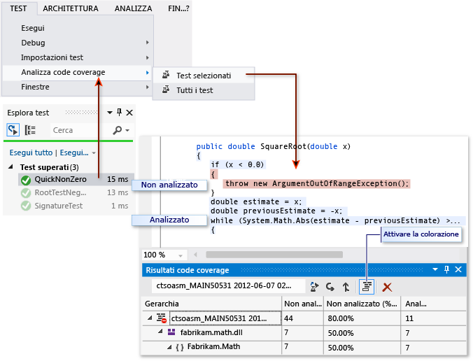

# <a name="using-code-coverage-to-determine-how-much-code-is-being-tested"></a>Uso di code coverage per determinare la quantità di codice testato
Per determinare quale percentuale del codice del progetto viene effettivamente testata dai test codificati come unit test, è possibile utilizzare la funzionalità code coverage di Visual Studio. Per una protezione efficace dai bug, i test devono analizzare o "coprire" gran parte del codice.  
  
 L'analisi di code coverage può essere applicata sia al codice gestito (CLI) che a quello non gestito (nativo).  
  
 Il code coverage è un'opzione per l'esecuzione dei metodi di test utilizzando Esplora test. Nella tabella dei risultati viene illustrata la percentuale di codice che è stata eseguita per ogni assembly, classe e metodo. Inoltre, nell'editor standard viene visualizzato il codice testato.  
  
   
  
 **Requirements**  
  
-   Visual Studio Enterprise  
  
### <a name="to-analyze-code-coverage-on-unit-tests-in-test-explorer"></a>Per analizzare il code coverage su unit test in Esplora test  
  
1.  Scegliere **Analizza code coverage** dal menu **Test**.  
  
2.  Per vedere quali righe sono state eseguite, scegliere l'icona **Mostra colorazione code coverage**.  
  
     Per modificare i colori o per usare il grassetto, scegliere **Strumenti**, **Opzioni**, **Ambiente**, **Tipi di carattere e colori**, **Visualizza impostazioni per: Editor di testo**. In **Elementi visualizzati** regolare gli elementi di code coverage.  
  
3.  Se i risultati mostrano un code coverage basso, esaminare quali parti del codice non vengono analizzate e scrivere altri test per includerle nel code coverage. I team di sviluppo in genere mirano a coprire l'80% del code coverage. In alcune situazioni, un code coverage basso è accettabile. Ad esempio, un code coverage basso è accettabile quando il codice viene generato da un modello standard.  
  
> [!TIP]
>  Per ottenere risultati accurati:  
>   
>  -   Assicurarsi che l'ottimizzazione del compilatore sia disattivata.  
>   
>      Se si utilizza codice non gestito (nativo), utilizzare una compilazione di debug.  
> -   Assicurarsi che vengano generati i file con estensione pdb (simbolo) per ogni assembly.  
>   
>  Se non si ottengono i risultati previsti, vedere [Risoluzione dei problemi di code coverage](../test/troubleshooting-code-coverage.md). . Ricordarsi di eseguire nuovamente il code coverage dopo aver aggiornato il codice. I risultati di code coverage e la colorazione del codice non vengono aggiornati automaticamente dopo aver modificato il codice o quando si eseguono i test.  
  
## <a name="reporting-in-blocks-or-lines"></a>Creazione rapporti in blocchi o righe  
 Il code coverage viene conteggiato in *blocchi*. Un blocco è un frammento di codice con esattamente un solo punto di ingresso e di uscita.  Se il flusso di controllo del programma passa attraverso un blocco durante l'esecuzione di un test, il blocco viene considerato analizzato. Il numero di volte che il blocco viene utilizzato non influisce sul risultato.  
  
 È inoltre possibile visualizzare i risultati in termini di righe scegliendo **Aggiungi/Rimuovi colonne** nell'intestazione della tabella. Se l'esecuzione del test analizza tutti i blocchi di codice in una riga di codice, viene conteggiata una sola riga. Quando una riga contiene blocchi di codice analizzati e non analizzati, viene conteggiata una riga parziale.  
  
 Alcuni utenti preferiscono il conteggio delle righe in quanto le percentuali più corrispondono alla dimensione dei frammenti presenti nel codice sorgente. Un lungo blocco di calcolo verrebbe conteggiato come un singolo blocco anche se occupa più righe.  
  
## <a name="managing-code-coverage-results"></a>Gestione dei risultati di code coverage  
 Nella finestra Risultati code coverage in genere viene visualizzato il risultato dell'esecuzione più recente. I risultati variano se si modificano i dati di test o se ogni volta vengono eseguiti solo alcuni testi.  
  
 La finestra di code coverage può inoltre essere utilizzata per visualizzare i risultati precedenti o i risultati ottenuti in altri computer.  
  
 È possibile eseguire il merge dei risultati di esecuzioni diverse, ad esempio le esecuzioni che utilizzano dati di test diversi.  
  
-   **Per visualizzare un precedente set di risultati**, sceglierlo dal menu a discesa. Nel menu viene visualizzato un elenco temporaneo che viene cancellato quando si apre una nuova soluzione.  
  
-   **Per visualizzare i risultati da una sessione precedente**, scegliere **Import Code Coverage Results** (Importa risultati di code coverage), passare alla cartella TestResults nella soluzione e importare un file con estensione coverage.  
  
     La colorazione del code coverage potrebbe non essere corretta se il codice sorgente è stato modificato dopo la generazione del file con estensione coverage.  
  
-   **Per rendere i risultati leggibili come testo**, scegliere **Export Code Coverage Results** (Esporta risultati di code coverage). Viene generato un file leggibile con estensione coveragexml che può essere elaborato con altri strumenti o facilmente inviato per posta elettronica.  
  
-   **Per inviare i risultati a un altro utente**, inviare un file con estensione coverage o un file esportato con estensione coveragexml. L'utente potrà quindi importare il file. Se l'utente dispone della stessa versione del codice sorgente, potrà vedere la colorazione del code coverage.  
  
## <a name="merging-results-from-different-runs"></a>Merge dei risultati di esecuzioni diverse  
 In alcune situazioni, verranno utilizzati blocchi di codice diversi a seconda dei dati di test. Pertanto, è necessario combinare i risultati delle diverse esecuzioni di test.  
  
 Ad esempio, si supponga che quando si esegue un test con input "2 ", si rileva che viene analizzato il 50% di una particolare funzione e quando si esegue il test una seconda volta con l'input "- 2 ", si rileva nella visualizzazione della colorazione di code coverage che viene analizzato l'altro 50% della funzione. A questo punto viene eseguito il merge dei risultati delle due esecuzioni dei test e nel report e nella visualizzazione della colorazione di code coverage viene indicato che il 100% della funzione è stato analizzato.  
  
 A questo scopo, usare l'**merge dei risultati di code coverage**. È possibile scegliere qualsiasi combinazione di esecuzioni recenti o risultati importati. Per combinare i risultati esportati, è necessario prima importarli.  
  
 Usare **Export Code Coverage Results** (Esporta risultati di code coverage) per salvare i risultati di un'operazione di merge.  
  
### <a name="limitations-in-merging"></a>Limitazioni del merge  
  
-   Se si esegue il merge dei dati di code coverage di versioni differenti del codice, vengono visualizzati i risultati separati ma non combinati. Per ottenere risultati combinati, utilizzare la stessa compilazione del codice, cambiando solo i dati di test.  
  
-   Se si esegue il merge di un file di risultati che è stato esportato e poi importato, è possibile visualizzare solo i risultati per riga e non per blocco. Usare il comando **Aggiungi/Rimuovi colonne** per visualizzare i dati della riga.  
  
-   Se si esegue il merge dei risultati dei test di un progetto ASP.NET, vengono visualizzati i risultati dei test separati ma non combinati. Si applica solo agli elementi ASP.NET: i risultati per tutti gli altri assembly vengono combinati.  
  
## <a name="excluding-elements-from-the-code-coverage-results"></a>Esclusione di elementi dai risultati di code coverage  
 Potrebbe essere necessario escludere specifici elementi nel codice dai risultati di code coverage, ad esempio se il codice viene generato da un modello di testo. Aggiungere l'attributo `System.Diagnostics.CodeAnalysis.ExcludeFromCodeCoverage` a uno dei seguenti elementi di codice: classe, struct, metodo, proprietà, metodo Set o Get di proprietà, evento. Si noti che l'esclusione di una classe non esclude le relative classi derivate.  
  
 Ad esempio:  
  
```c#  
  
using System.Diagnostics.CodeAnalysis;   
...  
public class ExampleClass1  
{   
    [ExcludeFromCodeCoverage]  
    void ExampleMethod() {...}  
  
    [ExcludeFromCodeCoverage] // exclude property  
    int ExampleProperty1   
    { get {...} set{...}}  
  
    int ExampleProperty2  
    {  
        get  
        {  
            ...  
        }  
        [ExcludeFromCodeCoverage] // exclude setter  
        set  
        {  
            ...  
        }  
    }  
  
}  
[ExcludeFromCodeCoverage]  
class ExampleClass2 { ... }  
  
```  
  
```vb#  
Imports System.Diagnostics.CodeAnalysis  
  
Class ExampleClass1          
    <ExcludeFromCodeCoverage()>  
    Public Sub ExampleSub1()  
        ...  
    End Sub  
  
    ' Exclude property  
    < ExcludeFromCodeCoverage()>  
    Property ExampleProperty1 As Integer  
        ...  
    End Property  
  
    ' Exclude setter  
    Property ExampleProperty2 As Integer  
        Get  
            ...  
        End Get  
        <ExcludeFromCodeCoverage()>  
        Set(ByVal value As Integer)  
            ...  
        End Set  
    End Property  
End Class  
  
<ExcludeFromCodeCoverage()>  
Class ExampleClass2  
...  
End Class  
  
```  
  
```cpp#  
// A .cpp file compiled as managed (CLI) code.  
using namespace System::Diagnostics::CodeAnalysis;  
...  
public ref class ExampleClass1  
{  
  public:  
    [ExcludeFromCodeCoverage]  
    void ExampleFunction1() { ... }  
  
    [ExcludeFromCodeCoverage]  
    property int ExampleProperty2 {...}  
  
    property int ExampleProperty2 {  
      int get() { ... }  
     [ExcludeFromCodeCoverage]  
      void set(int value) { ...  }  
   }  
  
}  
  
[ExcludeFromCodeCoverage]  
public ref class ExampleClass2  
{ ... }  
  
```  
  
### <a name="excluding-elements-in-native-c-code"></a>Esclusione di elementi nel codice C++ nativo  
 Per escludere gli elementi non gestiti (nativi) nel codice C++:  
  
```cpp  
  
#include <CodeCoverage\CodeCoverage.h>  
...  
  
// Exclusions must be compiled as unmanaged (native):  
#pragma managed(push, off)  
  
// Exclude a particular function:  
ExcludeFromCodeCoverage(Exclusion1, L"MyNamespace::MyClass::MyFunction");  
  
// Exclude all the functions in a particular class:  
ExcludeFromCodeCoverage(Exclusion2, L"MyNamespace::MyClass2::*");  
  
// Exclude all the functions generated from a particular template:   
ExcludeFromCodeCoverage(Exclusion3, L"*::MyFunction<*>");  
  
// Exclude all the code from a particular .cpp file:  
ExcludeSourceFromCodeCoverage(Exclusion4, L"*\\unittest1.cpp");  
  
// After setting exclusions, restore the previous managed/unmanaged state:  
#pragma managed(pop)  
  
```  
  
 Utilizzare le seguenti macro:  
  
 `ExcludeFromCodeCoverage(` *NomeEsclusione* `, L"` *NomeFunzione* `");`  
  
 `ExcludeSourceFromCodeCoverage(` *NomeEsclusione* `, L"` *PercorsoFileOrigine* `");`  
  
-   *NomeEsclusione* è un nome univoco.  
  
-   *NomeFunzione* è un nome completo di funzione. Si possono utilizzare i caratteri jolly. Ad esempio, per escludere tutte le funzioni di una classe, scrivere `MyNamespace::MyClass::*`  
  
-   *PercorsoFileOrigine* è il percorso locale o UNC di un file con estensione cpp. Si possono utilizzare i caratteri jolly. L'esempio seguente esclude tutti i file in una directory specifica: `\\MyComputer\Source\UnitTests\*.cpp`  
  
-   `#include <CodeCoverage\CodeCoverage.h>`  
  
-   Effettuare le chiamate alle macro di esclusione nello spazio dei nomi globale e non in uno spazio dei nomi o una classe qualsiasi.  
  
-   È possibile inserire le esclusioni nel file di codice dello unit test oppure nel file di codice dell'applicazione.  
  
-   Le esclusione devono essere compilate come codice non gestito (nativo), impostando l'opzione del compilatore oppure utilizzando `#pragma managed(off)`.  
  
> [!NOTE]
>  Per escludere funzioni nel codice gestito C++/CLI applicare l'attributo `[System::Diagnostics::CodeAnalysis::ExcludeFromCodeCoverage]` alla funzione. L'operazione è uguale in C#.  
  
### <a name="including-or-excluding-additional-elements"></a>Inclusione o esclusione di elementi aggiuntivi  
 L'analisi di code coverage viene eseguita solo su assembly caricati, per i quali è disponibile un file con estensione pdb nella stessa directory del file con estensione dll oppure del file con estensione exe. Pertanto in alcune circostanze, è possibile estendere il set di assembly che viene incluso per ottenere copie dei file con estensione pdb appropriati.  
  
 Per l'analisi di code coverage è possibile esercitare un maggiore controllo sugli assembly e sugli elementi che sono selezionati scrivendo un file con estensione runsettings. Ad esempio, è possibile escludere particolari tipi di assembly senza dover aggiungere attributi alle classi. Per altre informazioni, vedere [Personalizzazione dell'analisi code coverage](../test/customizing-code-coverage-analysis.md).  
  
## <a name="analyzing-code-coverage-in-the-build-service"></a>Analisi di code coverage nel servizio di compilazione  
 Quando si controlla il codice, i test vengono eseguiti sul server di compilazione insieme a tutti gli altri test degli altri membri del team. Se questo aspetto non è ancora stato configurato, vedere [Eseguire test nel processo di compilazione](http://msdn.microsoft.com/Library/d05743a1-c5cf-447e-bed9-bed3cb595e38). È utile analizzare il code coverage nel servizio di compilazione perché viene offerta un'immagine aggiornata e completa del code coverage dell'intero progetto. Vengono anche inclusi i test di sistema automatizzati e altri test codificati che normalmente non vengono eseguiti nei computer di sviluppo.  
  
1.  In Team Explorer aprire **Compilazioni** e aggiungere o modificare una definizione di compilazione.  
  
2.  Nella pagina **Processo** espandere **Test automatizzati**, **Origine test**, **Impostazioni esecuzione test**. Impostare **Tipo di file di impostazioni esecuzione test** su **Code coverage abilitato**.  
  
     Se si dispone di più di una definizione di origine del test, ripetere questo passaggio per ciascuna di esse.  
  
    -   *Non è presente alcun campo denominato **Tipo di file di impostazioni esecuzione test**.*  
  
         In **Test automatizzati** selezionare **Assembly di test** e premere il pulsante con i puntini di sospensione **[...]** alla fine della riga. Nella finestra di dialogo **Aggiungi/Modifica esecuzione dei test** in **Test Runner** scegliere **Visual Studio Test Runner**.  
  
   
  
 Dopo la compilazione, i risultati di code coverage sono associati all'esecuzione dei test e vengo visualizzati nel riepilogo compilazione.  
  
## <a name="analyzing-code-coverage-in-a-command-line"></a>Analisi di code coverage in una riga di comando  
 Per eseguire un test dalla riga di comando usare vstest.console.exe. Il code coverage è un'opzione di questa utilità. Per altre informazioni, vedere [Opzioni della riga di comando di VSTest.Console.exe](/devops-test-docs/test/vstest-console-exe-command-line-options).  
  
1.  Avviare il prompt dei comandi di Visual Studio Developer:  
  
     Nel menu **Start** di Windows scegliere **Tutti i programmi**, **Microsoft Visual Studio**, **Strumenti di Visual Studio**, **Prompt dei comandi per gli sviluppatori**.  
  
2.  Eseguire:  
  
     `vstest.console.exe MyTestAssembly.dll /EnableCodeCoverage`  
  
## <a name="troubleshooting"></a>Risoluzione dei problemi  
 Se non si ottengono i risultati previsti, vedere [Risoluzione dei problemi di code coverage](../test/troubleshooting-code-coverage.md).  
  
## <a name="external-resources"></a>Risorse esterne  
  
### <a name="guidance"></a>Materiale sussidiario  
 [Testing for Continuous Delivery with Visual Studio 2012 - Chapter 2: Unit Testing: Testing the Inside](http://go.microsoft.com/fwlink/?LinkID=255188) (Test per la distribuzione continua con Visual Studio 2012 - Capitolo 2: Testing unità: Test interni)  
  
## <a name="see-also"></a>Vedere anche  
 [Customizing Code Coverage Analysis](../test/customizing-code-coverage-analysis.md)  (Personalizzazione dell'analisi del code coverage)  
 [Risoluzione dei problemi di code coverage](../test/troubleshooting-code-coverage.md)   
 [Eseguire unit test del codice](../test/unit-test-your-code.md)

