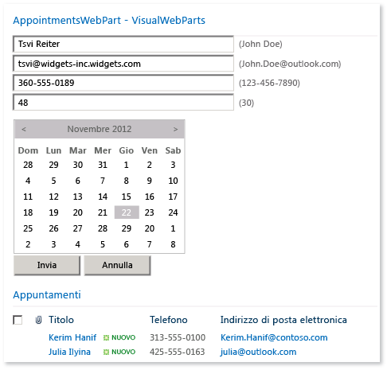
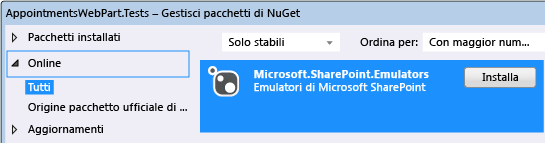
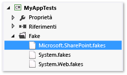
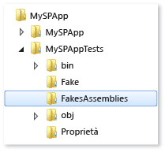

# <a name="using-emulators-to-isolate-unit-tests-for-sharepoint-2010-applications"></a>Uso di emulatori per isolare gli unit test per le applicazioni di SharePoint 2010
Il pacchetto Microsoft.SharePoint.Emulators fornisce un set di librerie che consentono di creare unit test isolati per le applicazioni di Microsoft SharePoint 2010. Gli emulatori usano [shim](../test/using-shims-to-isolate-your-application-from-other-assemblies-for-unit-testing.md) del framework di isolamento di [Microsoft Fakes](../test/isolating-code-under-test-with-microsoft-fakes.md) per creare oggetti in memoria leggeri che simulano gli oggetti e i metodi più comuni dell'API di SharePoint. Quando un metodo di SharePoint non viene emulato o quando si desidera modificare il comportamento predefinito di un emulatore, è possibile creare shim Fakes per fornire i risultati desiderati.  
  
 Le classi e i metodi di test esistenti possono essere facilmente convertiti per essere eseguiti nel contesto dell'emulatore. Questa funzionalità consente di creare test a doppio uso. Un test a doppio uso consente di passare tra test di integrazione eseguiti sull'API di SharePoint reale e unit test isolati che usano gli emulatori.  
  
##  <a name="BKMK_In_this_topic"></a> Contenuto dell'argomento  
 [Requisiti](#BKMK_Requirements)  
  
 [Esempio di AppointmentsWebPart](#BKMK_The_AppointmentsWebPart_example)  
  
 [Conversione di un test esistente](#BKMK_Converting_an_existing_test)  
  
-   [Aggiunta del pacchetto di emulatori a un progetto di test](#BKMK_Adding_the_Emulators_package_to_a_test_project)  
  
-   [Esecuzione di un metodo di test con l'emulazione](#BKMK__Running_a_test_method_in_the_emulation_context)  
  
 [Creazione di metodi e classi a doppio uso](#BKMK_Creating_dual_use_classes_and_methods)  
  
 [Uso degli attributi TestInitialize e TestCleanup per creare una classe di test a doppio uso](#BKMK_Using_TestInitialize_and_TestCleanup_attributes_to_create_a_dual_use_test_class)  
  
 [Gestione dei metodi non emulati di SharePoint](#BKMK_Handling_non_emulated_SharePoint_methods)  
  
 [Scrittura di test di emulazione da zero e riepilogo](#BKMK_Writing_emulation_tests_from_scratch__and_a_summary)  
  
 [Esempio](#BKMK_Example)  
  
 [Tipi emulati di SharePoint](#BKMK_Emulated_SharePoint_types)  
  
##  <a name="BKMK_Requirements"></a> Requisiti  
  
-   Microsoft SharePoint 2010 (SharePoint 2010 Server o SharePoint 2010 Foundation)  
  
-   Microsoft Visual Studio Enterprise  
  
-   Pacchetto NuGet di emulatori di Microsoft SharePoint  
  
 È inoltre necessario avere familiarità con le [nozioni di base sul testing unità in Visual Studio](../test/unit-test-basics.md) e una discreta conoscenza di [Microsoft Fakes](../test/isolating-code-under-test-with-microsoft-fakes.md).  
  
##  <a name="BKMK_The_AppointmentsWebPart_example"></a> Esempio di AppointmentsWebPart  
 AppointmentsWebPart consente di visualizzare e gestire un elenco SharePoint di appuntamenti.  
  
   
  
 In questo esempio verranno testati due metodi della web part:  
  
-   Il metodo `ScheduleAppointment` convalida i valori degli elementi dell'elenco passati al metodo e crea una nuova voce in un elenco in un sito Web SharePoint specificato.  
  
-   Il metodo `GetAppointmentsForToday` restituisce i dettagli degli appuntamenti del giorno.  
  
 [Contenuto dell'argomento](#BKMK_In_this_topic)  
  
##  <a name="BKMK_Converting_an_existing_test"></a> Conversione di un test esistente  
 In un test tipico di un metodo in un componente di SharePoint, il metodo di test crea un sito temporaneo in SharePoint Foundation e aggiunge al sito i componenti di SharePoint richiesti dal codice sottoposto a test. Il metodo di test quindi crea e usa un'istanza del componente. Alla fine del test, il sito viene eliminato.  
  
 Il metodo `ScheduleAppointment` del codice sottoposto a test è probabilmente uno dei primi metodi scritti per il componente:  
  
```  
// method under test  
public bool ScheduleAppointment(SPWeb web, string listName, string name,   
    string phone, string email, string age, DateTime date, out string errorMsg)  
{  
    errorMsg = string.Empty;  
    var badFormat = this.checkInput(name, phone, email, age);  
    if (badFormat)  
    {  
        errorMsg = "Bad Format";  
        return false;  
    }  
    var exists = this.CheckDuplicate(listName, web, name, phone, email, age, date);  
    if (exists)  
    {  
        errorMsg = "Item already exists";  
        return false;  
    }  
    SPListItemCollection items = web.Lists[listName].Items;  
    // create item and populate fields  
    SPListItem item = items.Add();  
    item["Name"] = name;  
    item["Phone"] = phone;  
    item["Email"] = email;  
    item["Age"] = age;  
    item["Date"] = date.ToString("D");  
    item.Update();  
    return true;  
}  
  
```  
  
 Il primo test della funzionalità nel metodo `ScheduleAppointment` può essere simile a quanto segue:  
  
```csharp  
  
[TestMethod]  
public void ScheduleAppointmentReturnsTrueWhenNewAppointmentIsCreated()  
{  
    using( var site = new SPSite("http://localhost"))  
    using (var webPart = new BookAnAppointmentWebPart())  
    {  
        // Arrange  
        string errorMsg = string.Empty;  
        DateTime date = DateTime.Now;  
        SPList list = AddListToSiteHelper(site);  
  
        // Act  
        bool success = webPart.ScheduleAppointment(site.RootWeb, list.Title,  
            "Raisa Pokrovskaya", "425-555-0163", "raisa@outlook.com", "55", date,   
            out errorMsg);  
        list.Delete();  
  
        // Assert  
        Assert.IsTrue(success);  
    }  
}  
```  
  
 Sebbene questo metodo di test consenta di verificare che il metodo `ScheduleAppointment` aggiunga correttamente una nuova voce all'elenco, si tratta più un test di integrazione della web part che di un test del comportamento specifico del codice. Le dipendenze esterne a SharePoint e all'API di SharePoint possono causare un errore del test per motivi diversi dal codice utente nel metodo `ScheduleAppointment`. Il sovraccarico dovuto alla creazione e all'eliminazione del sito SharePoint può inoltre rendere il test eccessivamente lento per l'esecuzione come parte normale del processo di codifica. La configurazione e l'eliminazione del sito per ogni metodo di test complicano solo la creazione di unit test efficaci per gli sviluppatori.  
  
 Gli emulatori di Microsoft SharePoint forniscono un set di oggetti e metodi "doppi" che simulano il comportamento delle API di SharePoint più comuni. I metodi emulati sono implementazioni leggere dell'API di SharePoint che non richiedono l'esecuzione di SharePoint. Usando Microsoft Fakes per deviare le chiamate all'API di SharePoint al metodo doppio degli emulatori di SharePoint, è possibile isolare i test e assicurarsi di testare il codice desiderato. Quando si chiamano metodi di SharePoint non emulati, è possibile usare direttamente Fakes per creare il comportamento desiderato.  
  
 [Contenuto dell'argomento](#BKMK_In_this_topic)  
  
###  <a name="BKMK_Adding_the_Emulators_package_to_a_test_project"></a> Aggiunta del pacchetto di emulatori a un progetto di test  
 Per aggiungere gli emulatori SharePoint a un progetto di test:  
  
1.  Selezionare il progetto di test in Esplora soluzioni.  
  
2.  Scegliere **Gestisci pacchetti NuGet** dal menu di scelta rapida.  
  
3.  Nella categoria **Online** cercare `Microsoft.SharePoint.Emulators` e quindi scegliere **Installa**.  
  
   
  
 [Contenuto dell'argomento](#BKMK_In_this_topic)  
  
###  <a name="BKMK__Running_a_test_method_in_the_emulation_context"></a> Esecuzione di un metodo di test con l'emulazione  
 Installando il pacchetto vengono aggiunti riferimenti alle librerie necessarie ai progetti. Per semplificare l'uso degli emulatori in una classe di test esistente, aggiungere gli spazi dei nomi `Microsoft.SharePoint.Emulators` e `Microsoft.QualityTools.Testing.Emulators`.  
  
 Per abilitare l'emulazione nei metodi di test, eseguire il wrapping del corpo del metodo in un'istruzione `using` che crea un oggetto `SharePointEmulationScope`. Ad esempio:  
  
```csharp  
  
[TestMethod]  
public void ScheduleAppointmentReturnsTrueWhenNewAppointmentIsCreated()  
{  
    // create the emulation scope with a using statement  
    using (new SharePointEmulationScope())  
    using( var site = new SPSite("http://localhost"))  
    using (var webPart = new BookAnAppointmentWebPart())  
    {  
        // Arrange  
        string errorMsg = string.Empty;  
        DateTime date = DateTime.Now;  
        SPList list = AddListToSiteHelper(site);  
  
        // Act  
        bool success = webPart.ScheduleAppointment(site.RootWeb, list.Title,  
            "Raisa Pokrovskaya", "425-555-0163", "raisa@outlook.com", "55", date,   
            out errorMsg);  
        list.Delete();  
  
        // Assert  
        Assert.IsTrue(success);  
    }  
}  
  
```  
  
 Quando viene eseguito il metodo di test, il runtime dell'emulatore chiama Microsoft Fakes per inserire in modo dinamico il codice nei metodi SharePoint in modo da deviare ai delegati dichiarati in Microsoft.SharePoint.Fakes.dll le chiamate a questi metodi. Microsoft.SharePoint.Emulators.dll implementa i delegati dei metodi emulati, simulando il comportamento effettivo di SharePoint. Quando il metodo di test o il componente sottoposto a test chiama un metodo di SharePoint, il comportamento risultante è quello dell'emulazione.  
  
   
  
 [Contenuto dell'argomento](#BKMK_In_this_topic)  
  
##  <a name="BKMK_Creating_dual_use_classes_and_methods"></a> Creazione di metodi e classi a doppio uso  
 Per creare metodi che possono essere usati sia per i test di integrazione sull'API di SharePoint reale sia per gli unit test isolati che usano gli emulatori, usare il costruttore di overload `SharePointEmulationScope(EmulationMode)` per eseguire il wrapping del codice del metodo di test. I due valori dell'enumerazione `EmulationMode` specificano se l'ambito usa gli emulatori (`EmulationMode.Enabled`) o l'API di SharePoint (`EmulationMode.Passthrough`).  
  
 Ad esempio, ecco come è possibile modificare il test precedente perché sia a doppio uso:   
  
```csharp  
  
// class level field specifies emulation mode  
private const EmulationMode emulatorMode = EmulationMode.Enabled;  
  
[TestMethod]  
public void ScheduleAppointmentReturnsTrueWhenNewAppointmentIsCreated()  
{  
    // emulation scope determined by emulatorMode  
    using( SharePointEmulationScope(emulatorMode))  
    using( var site = new SPSite("http://localhost"))  
    using (var webPart = new BookAnAppointmentWebPart())  
    {  
        // Arrange  
        string errorMsg = string.Empty;  
        DateTime date = DateTime.Now;  
        SPList list = AddListToSiteHelper(site);  
  
        // Act  
        bool success = webPart.ScheduleAppointment(site.RootWeb, list.Title,  
            "Raisa Pokrovskaya", "425-555-0163", "raisa@outlook.com", "55", date,   
            out errorMsg);  
        list.Delete();  
  
        // Assert  
        Assert.IsTrue(success);  
    }  
}  
```  
  
 [Contenuto dell'argomento](#BKMK_In_this_topic)  
  
##  <a name="BKMK_Using_TestInitialize_and_TestCleanup_attributes_to_create_a_dual_use_test_class"></a> Uso degli attributi TestInitialize e TestCleanup per creare una classe di test a doppio uso  
 Se si eseguono tutti i test, o la maggior parte di essi, in una classe mediante `SharePointEmulationScope`, è possibile sfruttare le tecniche a livello di classe per impostare la modalità di emulazione.  
  
-   I metodi della classe di test con attribuiti <xref:Microsoft.VisualStudio.TestTools.UnitTesting.TestInitializeAttribute> e <xref:Microsoft.VisualStudio.TestTools.UnitTesting.TestCleanupAttribute> possono creare ed eliminare l'ambito.  
  
-   L'impostazione di `EmulationMode` a livello di classe consente di automatizzare il passaggio della modalità tra `EmulationMode.Enabled` e `EmulationMode.Passthrough`.  
  
 Un metodo di classe con attributo `[TestInitialize]` viene eseguito all'inizio di ogni metodo di test e un metodo con attributo `[TestCleanup]` viene eseguito alla fine di ogni metodo di test. È possibile dichiarare un campo privato per l'oggetto `SharePointEmulationScope` a livello di classe, inizializzarlo nel metodo con attributo `TestInitialize` e quindi eliminare l'oggetto nel metodo con attributo `TestCleanup`.  
  
 È possibile usare qualsiasi metodo scelto per automatizzare la selezione di `EmulationMode`. Un modo consiste nel verificare l'esistenza di un simbolo tramite le direttive per il preprocessore. Ad esempio, per eseguire i metodi di test in una classe usando gli emulatori, è possibile definire un simbolo come `USE_EMULATION` nel file del progetto di test o nella riga di comando di compilazione. Se il simbolo è definito, viene dichiarata una costante `EmulationMode` a livello di classe che viene impostata su `Enabled`. In caso contrario, la costante viene impostata su `Passthrough`.  
  
 Di seguito è riportato un esempio di classe di test che illustra come usare le direttive del preprocessore e i metodi con attributi `TestInitialize` e `TestCleanup` per impostare la modalità di emulazione.  
  
```csharp  
//namespace declarations  
...  
  
namspace MySPAppTests   
{  
    [TestClass]  
    public class BookAnAppointmentWebPartTests  
    {  
  
        // emulationScope is a class level field  
        private SharePointEmulationScope emulationScope;  
  
        // preprocessor directives determine the value of emulatorMode  
        #if USE_EMULATIONprivate const EmulationMode emulatorMode = EmulationMode.Enabled;#elseprivate const EmulationMode emulatorMode = EmulationMode.Passthrough;#endif  
  
        // InitializeTest sets the emulation scope at the beginning of each test method  
        [TestInitialize]public void InitializeTest(){this.emulationScope = new SharePointEmulationScope(emulatorMode);}  
  
        // CleanupTest disposes the emulation scope at the end of each test method  
        [TestCleanup]public void CleanupTest(){this.emulationScope.Dispose();}  
  
        [TestMethod]  
        public void ScheduleAppointmentReturnsTrueWhenNewAppointmentIsCreated()  
        {  
            // remove the SharePointEmulationScope using statement from the method  
            using( var site = new SPSite("http://localhost"))  
            using (var webPart = new BookAnAppointmentWebPart())  
            {  
                // Arrange  
                string errorMsg = string.Empty;  
                DateTime date = DateTime.Now;  
                SPList list = AddListToSiteHelper(site);  
  
                // Act  
                bool success = webPart.ScheduleAppointment(site.RootWeb, list.Title,  
                    "Raisa Pokrovskaya", "425-555-0163", "raisa@outlook.com", "55", date,   
                    out errorMsg);  
                list.Delete()  
  
                // Assert  
                Assert.IsTrue(success);  
            }  
        }  
  
        ...// More tests  
  
    }  
}  
  
```  
  
 [Contenuto dell'argomento](#BKMK_In_this_topic)  
  
##  <a name="BKMK_Handling_non_emulated_SharePoint_methods"></a> Gestione dei metodi non emulati di SharePoint  
 Non tutti i tipi di SharePoint vengono emulati e non tutti i metodi di alcuni tipi emulati vengono emulati. Se il codice sottoposto a test chiama un metodo di SharePoint che non viene emulato, il metodo genera un'eccezione `NotSupportedException`. Quando si verifica un'eccezione, si aggiunge uno shim Fakes per il metodo di SharePoint.  
  
 **Configurazione di Sharepoint Fakes**  
  
 Per chiamare in modo esplicito shim di Microsoft Fakes:  
  
1.  Se si desidera sottoporre a shim una classe di SharePoint non emulata, modificare il file Microsoft.SharePoint.fakes e aggiungere la classe all'elenco delle classi sottoposte a shim. Vedere la sezione [Configurazione della generazione di codice di stub e shim](http://msdn.microsoft.com/library/hh708916.aspx#bkmk_configuring_code_generation_of_stubs) di [Generazione del codice, compilazione e convenzioni di denominazione in Microsoft Fakes](../test/code-generation-compilation-and-naming-conventions-in-microsoft-fakes.md).  
  
       
  
2.  Ricompilare il progetto di test almeno una volta dopo aver installato il pacchetto di emulatori di Microsoft SharePoint e se il file Microsoft.SharePoint.Fakes è stato modificato. La compilazione del progetto consente di creare e popolare una cartella **FakesAssembly** nella cartella radice del progetto su disco.  
  
       
  
3.  Aggiungere un riferimento all'assembly **Microsoft.SharePoint.14.0.0.0.Fakes.dll** che si trova nella cartella **FakesAssembly**.  
  
4.  (Facoltativo) Aggiungere una direttiva dello spazio dei nomi per la classe di test per `Microsoft.QualityTools.Testing.Fakes`, `Microsoft.SharePoint.Fakes` ed eventuali spazi dei nomi annidati di `Microsoft.SharePoint.Fakes` che si desidera usare.  
  
 **Implementazione del delegato shim per un metodo di SharePoint**  
  
 Nel progetto di esempio il metodo `GetAppointmentsForToday` chiama il metodo dell'API di SharePoint [SPList.GetItems(SPQuery)](http://msdn.microsoft.com/library/ms457534.aspx).  
  
```csharp  
// method under test  
public string GetAppointmentsForToday(string listName, SPWeb web)  
{  
    SPList list = web.Lists[listName];  
    DateTime today = DateTime.Now;  
    var listQuery = new SPQuery{Query = String.Format("<Where><Eq><FieldRef Name='Date'/>" +"<Value Type='Text'>{0}</Value>" +"</Eq></Where>", today.ToString("D"))};  
    var result = new System.Text.StringBuilder();  
    foreach (SPListItem item in list.GetItems(listQuery))  
    {  
        result.AppendFormat("Name: {0}, Phone: {1}, Email: {2}, Age: {3}, Date: {4}\n",   
            item["Name"], item["Phone"], item["Email"], item["Age"], item["Date"]);  
    }  
    return result.ToString();  
}  
  
```  
  
 La versione `SPList.GetItems(SPQuery)` del metodo di overload `GetItems` non è emulata. Pertanto, il semplice wrapping di un test esistente per `GetAppointmentsForToday` in `SharePoint.Emulation.Scope` avrebbe esito negativo. Per creare un test funzionante, è necessario scrivere un'implementazione del delegato Fakes `ShimSPList.GetItemsSPQuery` che restituisce i risultati in base ai quali si desidera eseguire il test.  
  
 Di seguito viene illustrata la modifica di un metodo di test esistente, `GetAppointmentsForTodayReturnsOnlyTodaysAppointments`, che implementa un delegato Fakes. Le modifiche necessarie sono descritte nei commenti:  
  
> [!IMPORTANT]
>  I metodi di test che creano in modo esplicito shim Fakes generano un'eccezione `ShimNotSupported` quando il test viene eseguito nel contesto di `EmulationMode.Passthrough`. Per evitare questo problema, usare una variabile per impostare il valore di `EmulationMode` ed eseguire il wrapping del codice Fakes in un'istruzione `if` che testa il valore.  
  
```csharp  
// class level field to set emulation mode  
private const EmulationMode emulatorMode = EmulationMode.Enabled  
  
[TestMethod]  
public void GetAppointmentsForTodayReturnsOnlyTodaysAppointments()  
{  
  
    // create the emulation scope with a using statement  
    using (var emulationScope = new SharePointEmulationScope(emulatorMode))  
    using( var site = new SPSite("http://localhost"))  
    using (var webPart = new BookAnAppointmentWebPart())  
    {  
        // Arrange  
        DateTime date = DateTime.Now;  
        SPList list = AddListToSiteHelper(site);  
        // insert 2 items into list  
        AddItemsToListHelper(list, new string[] {"Raisa Pokrovskaya", "425-555-0163",  
            "raisa@outlook.com", "55", date.ToString("D") });  
        AddItemsToListHelper(list, new string[] {"Francis Totten", "313-555-0100",  
            "francis@contoso.com", "42", date.AddDays(1).ToString("D") });  
  
        // use Fakes shims only if emulation is enabled  
        if (emulatorMode == EmulationMode.Enabled){var sList = new ShimSPList(list);sList.GetItemsSPQuery = (query) =>{var shim = new ShimSPListItemCollection();shim.Bind(new[] { list.Items[0] });return shim.Instance;}}  
  
        // Act  
        string result = webPart.GetAppointmentsForToday(list.Title, site.RootWeb);  
        list.Delete();  
  
        // Assert  
        Assert.IsTrue(result.Contains(String.Format(  
            "Name: Raisa Pokrovskaya, Phone: 425-555-0163, Email: raisa@outlook.com," +  
            "Age: 55, Date: {0}", date.ToString("D"))));  
        Assert.IsFalse(result.Contains("Name: Francis Totten"));  
    }  
}  
  
```  
  
 In questo metodo, viene verificato innanzitutto se l'emulazione è abilitata. In caso affermativo, viene creato un oggetto shim Fakes per l'elenco `SPList`, quindi viene creato e assegnato un metodo al relativo delegato `GetItemsSPQuery`. Il delegato usa il metodo `Bind` Fakes per aggiungere la voce di elenco corretta all'oggetto `ShimSPListItemCollection` restituito al chiamante.  
  
 [Contenuto dell'argomento](#BKMK_In_this_topic)  
  
##  <a name="BKMK_Writing_emulation_tests_from_scratch__and_a_summary"></a> Scrittura di test di emulazione da zero e riepilogo  
 Sebbene le tecniche per creare i test di emulazione e a doppio uso descritte nelle sezioni precedenti presuppongano che si stiano convertendo test esistenti, è anche possibile usare tali tecniche per scrivere i test da zero. Le tecniche sono riepilogate nell'elenco seguente:  
  
-   Per usare gli emulatori in un progetto di test, aggiungere il pacchetto NuGet Microsoft.SharePoint.Emulators al progetto.  
  
-   Per usare gli emulatori in un metodo di test, creare un oggetto `SharePointEmulationScope` all'inizio del metodo. Tutte le API di SharePoint supportate verranno emulate fino a quando l'ambito non viene eliminato.  
  
-   Scrivere il codice di test come se lo si stesse scrivendo per l'API di SharePoint reale. Il contesto di emulazione devia automaticamente le chiamate ai metodi di SharePoint verso i relativi emulatori.  
  
-   Non tutti gli oggetti di SharePoint vengono emulati e non tutti i metodi di alcuni oggetti emulati vengono emulati. Quando si usa un oggetto o un metodo non emulato, viene generata un'eccezione `NotSupportedException`. In questo caso, creare in modo esplicito un delegato shim Fakes per il metodo per restituire il comportamento richiesto.  
  
-   Per creare test a doppio uso, usare il costruttore `SharePointEmulationScope(EmulationMode)` per creare l'oggetto ambito di emulazione. Il valore di `EmulationMode` specifica se le chiamate di SharePoint vengono emulate o eseguite su un sito SharePoint reale.  
  
-   Se tutti i metodi di test, o la maggior parte di essi, in una classe di test vengono eseguiti nel contesto di emulazione, è possibile usare un metodo con attributo `TestInitialize` a livello di classe per creare l'oggetto `SharePointEmulationScope` e un campo a livello di classe per impostare la modalità di emulazione. Ciò consentirà di automatizzare la modifica della modalità di emulazione. Usare quindi un metodo con attributo `TestCleanup` per eliminare l'oggetto ambito.  
  
 [Contenuto dell'argomento](#BKMK_In_this_topic)  
  
##  <a name="BKMK_Example"></a> Esempio  
 Di seguito è riportato l'esempio finale che include le tecniche degli emulatori di SharePoint descritte in precedenza:  
  
```csharp  
using System;   
//other namespace declarations  
...   
// code under test  
using MySPApps;  
using Microsoft.SharePoint;  
// unit testing and emulators  
using Microsoft.VisualStudio.TestTools.UnitTesting;  
using Microsoft.QualityTools.Testing.Emulators;  
using Microsoft.SharePoint.Emulators;  
// explicit Fakes shims  
using Microsoft.QualityTools.Testing.Fakes;  
using Microsoft.SharePoint.Fakes  
  
namspace MySPAppTests   
{  
    [TestClass]  
    public class BookAnAppointmentWebPartTests  
    {  
  
        // emulationScope is a class level field  
        private SharePointEmulationScope emulationScope;  
  
        // preprocessor directives determine the value of emulatorMode  
        #if USE_EMULATION  
            private const EmulationMode emulatorMode = EmulationMode.Enabled;  
        #else  
            private const EmulationMode emulatorMode = EmulationMode.Passthrough;  
        #endif  
  
        // InitializeTest sets the emulation scope at the beginning of each test method  
        [TestInitialize]  
        public void InitializeTest()  
        {  
            this.emulationScope = new SharePointEmulationScope(emulatorMode);  
        }  
  
        // CleanupTest disposes the emulation scope at the end of each test method  
        [TestCleanup]  
        public void Cleanup()  
        {  
            this.emulationScope.Dispose();  
        }  
  
        [TestMethod]  
        public void ScheduleAppointmentReturnsTrueWhenNewAppointmentIsCreated()  
        {  
            // remove the SharePointEmulationScope using statement from the method  
            using( var site = new SPSite("http://localhost"))  
            using (var webPart = new BookAnAppointmentWebPart())  
            {  
                // Arrange  
                string errorMsg = string.Empty;  
                DateTime date = DateTime.Now;  
                SPList list = AddListToSiteHelper(site);  
  
                // Act  
                bool success = webPart.ScheduleAppointment(site.RootWeb, list.Title,  
                    "Raisa Pokrovskaya", "425-555-0163", "raisa@outlook.com", "55", date,   
                    out errorMsg);  
                list.Delete()  
  
                // Assert  
                Assert.IsTrue(success);  
            }  
        }  
  
        [TestMethod]  
        public void GetAppointmentsForTodayReturnsOnlyTodaysAppointments()  
        {  
  
            // remove the SharePointEmulationScope using statement from the method  
            using( var site = new SPSite("http://localhost"))  
            using (var webPart = new BookAnAppointmentWebPart())  
            {  
                // Arrange  
                DateTime date = DateTime.Now;  
                SPList list = AddListToSiteHelper(site);  
                // insert 2 items into list  
                AddItemsToListHelper(list, new string[] {"Raisa Pokrovskaya", "425-555-0163",  
                    "raisa@outlook.com", "55", date.ToString("D") });  
                AddItemsToListHelper(list, new string[] {"Francis Totten", "313-555-0100",  
                    "francis@contoso.com", "42", date.AddDays(1).ToString("D") });  
  
                // use Fakes shims only if emulation is enabled  
                if (emulatorMode == EmulationMode.Enabled)  
                {  
                    var sList = new ShimSPList(list);  
  
                    sList.GetItemsSPQuery = (query) =>  
                    {  
                        var shim = new ShimSPListItemCollection();  
                        shim.Bind(new[] { list.Items[0] });  
                        return shim.Instance;  
                    }  
                }  
  
                // Act  
                string result = webPart.GetAppointmentsForToday(list.Title, site.RootWeb);  
                list.Delete();  
  
                // Assert  
                Assert.IsTrue(result.Contains(String.Format(  
                    "Name: Raisa Pokrovskaya, Phone: 425-555-0163, Email: raisa@outlook.com," +  
                    "Age: 55, Date: {0}", date.ToString("D"))));  
                Assert.IsFalse(result.Contains("Name: Francis Totten"));  
            }  
        }  
  
        ...// More tests  
  
    }  
}  
  
```  
  
##  <a name="BKMK_Emulated_SharePoint_types"></a> Tipi emulati di SharePoint  
 [Microsoft.SharePoint.SPField](http://msdn.microsoft.com/library/Microsoft.SharePoint.SPField)  
  
 [Microsoft.SharePoint.SPFieldIndex](http://msdn.microsoft.com/library/Microsoft.SharePoint.SPFieldIndex)  
  
 [Microsoft.SharePoint.SPFieldIndexCollection](http://msdn.microsoft.com/library/Microsoft.SharePoint.SPFieldIndexCollection)  
  
 [Microsoft.SharePoint.SPFieldLink](http://msdn.microsoft.com/library/Microsoft.SharePoint.SPFieldLink)  
  
 [Microsoft.SharePoint.SPFieldLinkCollection](http://msdn.microsoft.com/library/Microsoft.SharePoint.SPFieldLinkCollection)  
  
 [Microsoft.SharePoint.SPFieldUrlValue](http://msdn.microsoft.com/library/Microsoft.SharePoint.SPFieldUrlValue)  
  
 [Microsoft.SharePoint.SPFile](http://msdn.microsoft.com/library/Microsoft.SharePoint.SPFile)  
  
 [Microsoft.SharePoint.SPFileCollection](http://msdn.microsoft.com/library/Microsoft.SharePoint.SPFileCollection)  
  
 [Microsoft.SharePoint.SPFolder](http://msdn.microsoft.com/library/Microsoft.SharePoint.SPFolder)  
  
 [Microsoft.SharePoint.SPFolderCollection](http://msdn.microsoft.com/library/Microsoft.SharePoint.SPFolderCollection)  
  
 [Microsoft.SharePoint.SPItem](http://msdn.microsoft.com/library/Microsoft.SharePoint.SPItem)  
  
 [Microsoft.SharePoint.SPItemEventDataCollection](http://msdn.microsoft.com/library/Microsoft.SharePoint.SPItemEventDataCollection)  
  
 [Microsoft.SharePoint.SPItemEventProperties](http://msdn.microsoft.com/library/Microsoft.SharePoint.SPItemEventProperties)  
  
 [Microsoft.SharePoint.SPList](http://msdn.microsoft.com/library/Microsoft.SharePoint.SPList)  
  
 [Microsoft.SharePoint.SPListCollection](http://msdn.microsoft.com/library/Microsoft.SharePoint.SPListCollection)  
  
 [Microsoft.SharePoint.SPListEventProperties](http://msdn.microsoft.com/library/Microsoft.SharePoint.SPListEventProperties)  
  
 [Microsoft.SharePoint.SPListItem](http://msdn.microsoft.com/library/Microsoft.SharePoint.SPListItem)  
  
 [Microsoft.SharePoint.SPListItemCollection](http://msdn.microsoft.com/library/Microsoft.SharePoint.SPListItemCollection)  
  
 [Microsoft.SharePoint.SPQuery](http://msdn.microsoft.com/library/Microsoft.SharePoint.SPQuery)  
  
 [Microsoft.SharePoint.SPRoleAssignment](http://msdn.microsoft.com/library/Microsoft.SharePoint.SPRoleAssignment)  
  
 [Microsoft.SharePoint.SPRoleAssignmentCollection](http://msdn.microsoft.com/library/Microsoft.SharePoint.SPRoleAssignmentCollection)  
  
 [Microsoft.SharePoint.SPSecurableObject](http://msdn.microsoft.com/library/Microsoft.SharePoint.SPSecurableObject)  
  
 [Microsoft.SharePoint.SPSecurity](http://msdn.microsoft.com/library/Microsoft.SharePoint.SPSecurity)  
  
 [Microsoft.SharePoint.SPSite](http://msdn.microsoft.com/library/Microsoft.SharePoint.SPSite)  
  
 [Microsoft.SharePoint.SPUser](http://msdn.microsoft.com/library/Microsoft.SharePoint.SPUser)  
  
 [Microsoft.SharePoint.SPUserCollection](http://msdn.microsoft.com/library/Microsoft.SharePoint.SPUserCollection)  
  
 [Microsoft.SharePoint.SPView](http://msdn.microsoft.com/library/Microsoft.SharePoint.SPView)  
  
 [Microsoft.SharePoint.SPViewCollection](http://msdn.microsoft.com/library/Microsoft.SharePoint.SPViewCollection)  
  
 [Microsoft.SharePoint.SPViewContext](http://msdn.microsoft.com/library/Microsoft.SharePoint.SPViewContext)  
  
 [Microsoft.SharePoint.SPWeb](http://msdn.microsoft.com/library/Microsoft.SharePoint.SPWeb)  
  
 [Microsoft.SharePoint.SPWebCollection](http://msdn.microsoft.com/library/Microsoft.SharePoint.SPWebCollection)  
  
 [Contenuto dell'argomento](#BKMK_In_this_topic)  
  
## <a name="see-also"></a>Vedere anche  
 [Eseguire unit test del codice](../test/unit-test-your-code.md)   
 [Test delle applicazioni di SharePoint 2010 con test codificati dell'interfaccia utente](../test/testing-sharepoint-2010-applications-with-coded-ui-tests.md)   
 [Esecuzione di test di carico e delle prestazioni Web nelle applicazioni di SharePoint 2010 e 2013](/devops-test-docs/test/web-performance-and-load-testing-sharepoint-2010-and-2013-applications)   
 [Sviluppo di soluzioni SharePoint](/office-dev/office-dev/developing-sharepoint-solutions)
