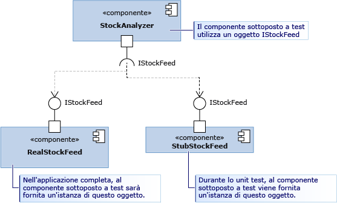

# <a name="using-stubs-to-isolate-parts-of-your-application-from-each-other-for-unit-testing"></a>Uso di stub per isolare le parti dell'applicazione tra loro per gli unit test
I *tipi stub* costituiscono una delle due tecnologie offerte dal framework Microsoft Fakes per isolare con facilità un componente sottoposto a test dagli altri componenti chiamati. Uno stub è una piccola parte di codice che sostituisce un componente durante il test. Il vantaggio dello stub consiste nel fatto che restituisce risultati coerenti e quindi semplifica la scrittura del test. Inoltre, è possibile eseguire i test anche se gli altri componenti non sono ancora in funzione.  
  
 Per una panoramica e una guida introduttiva su Fakes, vedere [Isolamento del codice sottoposto a test con Microsoft Fakes](../test/isolating-code-under-test-with-microsoft-fakes.md).  
  
 Per usare gli stub, è necessario scrivere il componente in modo che per fare riferimento ad altre parti dell'applicazione si utilizzino solo interfacce e non classi. Si tratta di una buona pratica di progettazione perché le modifiche apportate a una parte con meno probabilità richiedono di modificare un'altra parte. Per il test, consente di sostituire uno stub con un componente reale.  
  
 Nel diagramma, si desidera testare il componente StockAnalyzer. In genere StockAnalyzer usa un altro componente, RealStockFeed, il quale tuttavia restituisce risultati diversi ogni volta che ne vengono chiamati i metodi, rendendo difficile il test di StockAnalyzer.  Durante il test, il componente viene sostituito con una classe diversa, StubStockFeed.  
  
   
  
 Poiché gli stub si basano sulla possibilità di strutturare il codice in questo modo, in genere si usano gli stub per isolare una parte dell'applicazione da un'altra. Per isolarlo da altri assembly che non sono sotto controllo, ad esempio System.dll, è di solito consigliabile usare gli shim. Vedere [Uso di shim per isolare l'applicazione da altri assembly per gli unit test](../test/using-shims-to-isolate-your-application-from-other-assemblies-for-unit-testing.md).  
  
 **Requisiti**  
  
-   Visual Studio Enterprise  
  
## <a name="in-this-topic"></a>Contenuto dell'argomento  
  
-   [Come usare gli stub](#how)  
  
    -   [Progettare l'inserimento di dipendenze](#Dependency)  
  
    -   [Generare stub](#GeneratingStubs)  
  
    -   [Scrivere il test con stub](#WriteTest)  
  
    -   [Verifica dei valori dei parametri](#mocks)  
  
-   [Stub per tipi di membri di tipo differenti](../test/using-stubs-to-isolate-parts-of-your-application-from-each-other-for-unit-testing.md#BKMK_Stub_basics)  
  
    -   [Metodi](../test/using-stubs-to-isolate-parts-of-your-application-from-each-other-for-unit-testing.md#BKMK_Methods)  
  
    -   [Proprietà](../test/using-stubs-to-isolate-parts-of-your-application-from-each-other-for-unit-testing.md#BKMK_Properties)  
  
    -   [Eventi](../test/using-stubs-to-isolate-parts-of-your-application-from-each-other-for-unit-testing.md#BKMK_Events)  
  
    -   [Metodi generici](../test/using-stubs-to-isolate-parts-of-your-application-from-each-other-for-unit-testing.md#BKMK_Generic_methods)  
  
    -   [Stub di classi virtuali](../test/using-stubs-to-isolate-parts-of-your-application-from-each-other-for-unit-testing.md#BKMK_Partial_stubs)  
  
-   [Stub di debug](../test/using-stubs-to-isolate-parts-of-your-application-from-each-other-for-unit-testing.md#BKMK_Debugging_stubs)  
  
-   [Limitazioni degli stub](../test/using-stubs-to-isolate-parts-of-your-application-from-each-other-for-unit-testing.md#BKMK_Stub_limitation)  
  
-   [Modifica del comportamento predefinito degli stub](../test/using-stubs-to-isolate-parts-of-your-application-from-each-other-for-unit-testing.md#BKMK_Changing_the_default_behavior_of_stubs)  
  
##  <a name="How"></a> Come usare gli stub  
  
###  <a name="Dependency"></a> Progettare l'inserimento di dipendenze  
 Per usare gli stub, è necessario progettare l'applicazione in modo che i diversi componenti non dipendano l'uno dall'altro, ma siano dipendenti solo dalle definizioni di interfaccia. Anziché essere accoppiati in fase di compilazione, i componenti vengono connessi in fase di esecuzione. Questo modello consente di progettare software affidabile e facile da aggiornare perché le modifiche non tendono a propagarsi oltre i limiti dei componenti. È consigliabile usarlo anche in assenza di stub. Se si scrive nuovo codice, è facile seguire il criterio per l'[inserimento di dipendenze](http://en.wikipedia.org/wiki/Dependency_injection). Se si scrivono test per un software esistente, potrebbe essere necessario eseguire il refactoring. Se l'operazione è poco pratica, prendere in considerazione l'utilizzo degli shim.  
  
 Questa discussione si apre con un esempio di motivazione, riportato nel diagramma. La classe StockAnalyzer legge i prezzi delle azioni e genera alcuni risultati significativi. Dispone di alcuni metodi pubblici che si desidera vengano testati. Per semplificare le operazioni, verrà esaminato un solo metodo, molto semplice, che restituisce il prezzo corrente di un'azione particolare. Si desidera scrivere uno unit test del metodo. Ecco la prima bozza di un test:  
  
```csharp  
[TestMethod]  
public void TestMethod1()  
{  
    // Arrange:  
    var analyzer = new StockAnalyzer();  
    // Act:  
    var result = analyzer.GetContosoPrice();  
    // Assert:  
    Assert.AreEqual(123, result); // Why 123?  
}  
```  
  
```vb  
<TestMethod()> Public Sub TestMethod1()  
    ' Arrange:  
    Dim analyzer = New StockAnalyzer()  
    ' Act:  
    Dim result = analyzer.GetContosoPrice()  
    ' Assert:  
    Assert.AreEqual(123, result) ' Why 123?  
End Sub  
```  
  
 Si nota immediatamente un problema evidente: i prezzi delle azioni variano e pertanto generalmente l'asserzione non è corretta.  
  
 Inoltre, probabilmente il componente di StockFeed, usato da StockAnalyzer, è ancora in fase di sviluppo. Ecco la prima bozza del codice del metodo sottoposto a test:  
  
```csharp  
public int GetContosoPrice()  
{  
    var stockFeed = new StockFeed(); // NOT RECOMMENDED  
    return stockFeed.GetSharePrice("COOO");  
}  
```  
  
```vb  
Public Function GetContosoPrice()  
    Dim stockFeed = New StockFeed() ' NOT RECOMMENDED  
    Return stockFeed.GetSharePrice("COOO")  
End Function  
```  
  
 Così com'è, questo metodo potrebbe non essere compilato o potrebbe generare un'eccezione perché il lavoro sulla classe StockFeed non è ancora completo.  
  
 L'inserimento dell'interfaccia è destinato a entrambi i problemi.  
  
 L'inserimento dell'interfaccia applica la regola seguente:  
  
-   Il codice di un componente dell'applicazione non deve mai esplicitamente fare riferimento a una classe di un altro componente né in una dichiarazione né in un'istruzione `new`. Diversamente, le variabili e i parametri devono essere dichiarati con le interfacce. Le istanze dei componenti devono essere create solo dal contenitore dei componenti.  
  
     Per "componente" in questo caso si intende una classe o un gruppo di classi che si sviluppa e aggiorna contemporaneamente. In genere, un componente rappresenta il codice di un progetto di Visual Studio. È meno importante separare le classi all'interno di un componente, perché vengono aggiornate contemporaneamente.  
  
     Non è pertanto importante separare i componenti dalle classi di una piattaforma relativamente stabile, ad esempio System.dll. La scritture delle interfacce per tutte queste classi creerebbero confusioni nel codice.  
  
 Il codice di StockAnalyzer può pertanto essere migliorato se lo si separa da StockFeed usando un'interfaccia simile alla seguente:  
  
```csharp  
public interface IStockFeed  
{  
    int GetSharePrice(string company);  
}  
  
public class StockAnalyzer  
{  
    private IStockFeed stockFeed;  
    public Analyzer(IStockFeed feed)  
    {  
        stockFeed = feed;  
    }  
    public int GetContosoPrice()  
    {  
        return stockFeed.GetSharePrice("COOO");  
    }  
}  
```  
  
```vb  
Public Interface IStockFeed  
    Function GetSharePrice(company As String) As Integer  
End Interface  
  
Public Class StockAnalyzer  
    ' StockAnalyzer can be connected to any IStockFeed:  
    Private stockFeed As IStockFeed  
    Public Sub New(feed As IStockFeed)  
        stockFeed = feed  
    End Sub    
    Public Function GetContosoPrice()  
        Return stockFeed.GetSharePrice("COOO")  
    End Function  
End Class  
  
```  
  
 In questo esempio, a StockAnalyzer viene passata un'implementazione di IStockFeed quando viene costruito. Nell'applicazione completata, il codice di inizializzazione esegue la connessione:  
  
```  
analyzer = new StockAnalyzer(new StockFeed())  
```  
  
 Sono disponibili modi più flessibili per l'esecuzione della connessione. Ad esempio, StockAnalyzer potrebbe accettare un oggetto factory in grado di creare istanze delle diverse implementazioni di IStockFeed in condizioni differenti.  
  
###  <a name="GeneratingStubs"></a> Generare stub  
 La classe da testare è stata separata dagli altri componenti che usa. Oltre che a rendere l'applicazione più affidabile e flessibile, la separazione consente la connessione al componente sottoposto a test alle implementazioni stub delle interfacce per scopi di test.  
  
 È possibile scrivere gli stub normalmente come classi. Tuttavia, Microsoft Fakes fornisce una modalità più dinamica per creare lo stub più appropriato per ciascun test.  
  
 Per usare gli stub, è innanzitutto necessario generare i tipi stub dalle definizioni di interfaccia.  
  
##### <a name="adding-a-fakes-assembly"></a>Aggiunta di un assembly Fakes  
  
1.  In Esplora soluzioni espandere l'elenco **Riferimenti** del progetto di unit test.  
  
    -   Se si usa Visual Basic, per visualizzare l'elenco Riferimenti, è necessario selezionare **Mostra tutti i file** sulla barra degli strumenti di Esplora soluzioni.  
  
2.  Selezionare l'assembly contenente le definizioni di interfaccia per cui si desiderano creare gli stub.  
  
3.  Scegliere **Aggiungi assembly Fakes** dal menu di scelta rapida.  
  
###  <a name="WriteTest"></a> Scrivere il test con stub  
  
```csharp  
[TestClass]  
class TestStockAnalyzer  
{  
    [TestMethod]  
    public void TestContosoStockPrice()  
    {  
      // Arrange:  
  
        // Create the fake stockFeed:  
        IStockFeed stockFeed =   
             new StockAnalysis.Fakes.StubIStockFeed() // Generated by Fakes.  
                 {  
                     // Define each method:  
                     // Name is original name + parameter types:  
                     GetSharePriceString = (company) => { return 1234; }  
                 };  
  
        // In the completed application, stockFeed would be a real one:  
        var componentUnderTest = new StockAnalyzer(stockFeed);  
  
      // Act:  
        int actualValue = componentUnderTest.GetContosoPrice();  
  
      // Assert:  
        Assert.AreEqual(1234, actualValue);  
    }  
    ...  
}  
```  
  
```vb  
<TestClass()> _  
Class TestStockAnalyzer  
  
    <TestMethod()> _  
    Public Sub TestContosoStockPrice()  
        ' Arrange:  
        ' Create the fake stockFeed:  
        Dim stockFeed As New StockAnalysis.Fakes.StubIStockFeed  
        With stockFeed  
            .GetSharePriceString = Function(company)  
                                       Return 1234  
                                   End Function  
        End With  
        ' In the completed application, stockFeed would be a real one:  
        Dim componentUnderTest As New StockAnalyzer(stockFeed)  
        ' Act:  
        Dim actualValue As Integer = componentUnderTest.GetContosoPrice  
        ' Assert:  
        Assert.AreEqual(1234, actualValue)  
    End Sub  
End Class  
  
```  
  
 Il particolare speciale qui è la classe `StubIStockFeed`. Per ogni tipo pubblico nell'assembly di riferimento, il meccanismo Microsoft Fakes genera una classe stub. Il nome della classe stub è derivato dal nome dell'interfaccia, con "`Fakes.Stub`" come prefisso, e i nomi dei tipi di parametro accodati.  
  
 Gli stub vengono generati per i metodi GET e SET di proprietà, per gli eventi e per i metodi generici.  
  
###  <a name="mocks"></a> Verifica dei valori dei parametri  
 È possibile verificare che quando il componente effettua una chiamata a un altro componente vengano passati i valori corretti. È possibile inserire un'asserzione nello stub oppure memorizzare il valore e verificarlo nella parte principale del test. Ad esempio:  
  
```csharp  
[TestClass]  
class TestMyComponent  
{  
  
    [TestMethod]  
    public void TestVariableContosoPrice()  
    {  
     // Arrange:  
        int priceToReturn;  
        string companyCodeUsed;  
        var componentUnderTest = new StockAnalyzer(new StubIStockFeed()  
            {  
               GetSharePriceString = (company) =>   
                  {   
                     // Store the parameter value:  
                     companyCodeUsed = company;  
                     // Return the value prescribed by this test:  
                     return priceToReturn;  
                  };  
            };  
        // Set the value that will be returned by the stub:  
        priceToReturn = 345;  
  
     // Act:  
        int actualResult = componentUnderTest.GetContosoPrice();  
  
     // Assert:  
        // Verify the correct result in the usual way:  
        Assert.AreEqual(priceToReturn, actualResult);  
  
        // Verify that the component made the correct call:  
        Assert.AreEqual("COOO", companyCodeUsed);  
    }  
...}  
  
```  
  
```vb  
<TestClass()> _  
Class TestMyComponent  
    <TestMethod()> _  
    Public Sub TestVariableContosoPrice()  
        ' Arrange:  
        Dim priceToReturn As Integer  
        Dim companyCodeUsed As String = ""  
        Dim stockFeed As New StockAnalysis.Fakes.StubIStockFeed()  
        With stockFeed  
            ' Implement the interface's method:  
            .GetSharePriceString = _  
                Function(company)  
                    ' Store the parameter value:  
                    companyCodeUsed = company  
                    ' Return a fixed result:  
                    Return priceToReturn  
                End Function  
        End With  
        ' Create an object to test:  
        Dim componentUnderTest As New StockAnalyzer(stockFeed)  
        ' Set the value that will be returned by the stub:  
        priceToReturn = 345  
  
        ' Act:  
        Dim actualResult As Integer = componentUnderTest.GetContosoPrice()  
  
        ' Assert:  
        ' Verify the correct result in the usual way:  
        Assert.AreEqual(priceToReturn, actualResult)  
        ' Verify that the component made the correct call:  
        Assert.AreEqual("COOO", companyCodeUsed)  
    End Sub  
...  
End Class  
```  
  
##  <a name="BKMK_Stub_basics"></a> Stub per tipi di membri di tipo differenti  
  
###  <a name="BKMK_Methods"></a> Metodi  
 Come descritto nell'esempio, i metodi possono essere sottoposti a stub associando un delegato a un'istanza della classe stub. Il nome del tipo stub è derivato dai nomi del metodo e dei parametri. Ad esempio, data la seguente interfaccia `IMyInterface` e il metodo `MyMethod`:  
  
```csharp  
// application under test  
interface IMyInterface   
{  
    int MyMethod(string value);  
}  
```  
  
 Viene associato uno stub a `MyMethod` che restituisce sempre 1:  
  
```csharp  
// unit test code  
  var stub = new StubIMyInterface ();  
  stub.MyMethodString = (value) => 1;  
  
```  
  
 Se non viene fornito uno stub per una funzione, Fakes genererà una funzione che restituisce il valore predefinito del tipo restituito. Per i numeri, il valore predefinito è 0 e per i tipi di classe è `null` (C#) o `Nothing` (Visual Basic).  
  
###  <a name="BKMK_Properties"></a> Proprietà  
 Le proprietà GET e SET vengono esposte come delegati separati e possono essere sottoposte a stub separatamente. Ad esempio, si consideri la proprietà `Value` di `IMyInterface`:  
  
```csharp  
// code under test  
interface IMyInterface   
{  
    int Value { get; set; }  
}  
  
```  
  
 Vengono associati i delegati a GET e SET di `Value` per simulare una proprietà automatica:  
  
```csharp  
// unit test code  
int i = 5;  
var stub = new StubIMyInterface();  
stub.ValueGet = () => i;  
stub.ValueSet = (value) => i = value;  
  
```  
  
 Se non si fornisce i metodi stub per GET o SET di una proprietà, Fakes genererà uno stub per l'archiviazione dei valori in modo che la proprietà stub funzioni come una variabile semplice.  
  
###  <a name="BKMK_Events"></a> Eventi  
 Gli eventi sono esposti come campi delegati. Pertanto, qualsiasi evento sottoposto a stub può essere generato chiamando il campo di supporto evento. Si consideri la seguente interfaccia da sottoporre a stub:  
  
```csharp  
// code under test  
interface IWithEvents   
{  
    event EventHandler Changed;  
}  
```  
  
 Per generare l'evento `Changed`, viene chiamato semplicemente il delegato di supporto:  
  
```csharp  
// unit test code  
  var withEvents = new StubIWithEvents();  
  // raising Changed  
  withEvents.ChangedEvent(withEvents, EventArgs.Empty);  
  
```  
  
###  <a name="BKMK_Generic_methods"></a> Metodi generici  
 È possibile sottoporre a stub i metodi generici fornendo un delegato per la creazione di ogni istanza desiderata del metodo. Ad esempio, data la seguente interfaccia contenente un metodo generico:  
  
```csharp  
// code under test  
interface IGenericMethod   
{  
    T GetValue<T>();  
}  
```  
  
 È possibile scrivere un test che sottopone a stub la creazione dell'istanza `GetValue<int>`:  
  
```csharp  
// unit test code  
[TestMethod]  
public void TestGetValue()   
{  
    var stub = new StubIGenericMethod();  
    stub.GetValueOf1<int>(() => 5);  
  
    IGenericMethod target = stub;  
    Assert.AreEqual(5, target.GetValue<int>());  
}  
```  
  
 Se il codice deve chiamare `GetValue<T>` con qualsiasi altra creazione dell'istanza, lo stub chiama semplicemente il comportamento.  
  
###  <a name="BKMK_Partial_stubs"></a> Stub di classi virtuali  
 Negli esempi precedenti gli stub sono stati generati dalle interfacce. È anche possibile generare gli stub da una classe che contiene membri virtuali o astratti. Ad esempio:  
  
```csharp  
// Base class in application under test  
    public abstract class MyClass  
    {  
        public abstract void DoAbstract(string x);  
        public virtual int DoVirtual(int n)  
        { return n + 42; }  
        public int DoConcrete()  
        { return 1; }  
    }  
```  
  
 Nello stub generato da questa classe è possibile impostare i metodi delegati per DoAbstract() e DoVirtual(), ma non per DoConcrete().  
  
```csharp  
// unit test  
  var stub = new Fakes.MyClass();  
  stub.DoAbstractString = (x) => { Assert.IsTrue(x>0); };  
  stub.DoVirtualInt32 = (n) => 10 ;  
  
```  
  
 Se non viene fornito un delegato per un metodo virtuale, Fakes può fornire il comportamento predefinito o chiamare il metodo della classe base. Per effettuare la chiamata al metodo di base, impostare la proprietà `CallBase`:  
  
```csharp  
// unit test code  
var stub = new Fakes.MyClass();  
stub.CallBase = false;  
// No delegate set - default delegate:  
Assert.AreEqual(0, stub.DoVirtual(1));  
  
stub.CallBase = true;  
//No delegate set - calls the base:  
Assert.AreEqual(43,stub.DoVirtual(1));  
```  
  
##  <a name="BKMK_Debugging_stubs"></a> Stub di debug  
 I tipi stub sono progettati per fornire un'esperienza di debug semplificata. Per impostazione predefinita, il debugger elabora qualsiasi codice generato e pertanto deve accedere direttamente alle implementazioni personalizzate del membro allegate allo stub.  
  
##  <a name="BKMK_Stub_limitation"></a> Limitazioni degli stub  
  
1.  Le firme di metodo con puntatori non sono supportate.  
  
2.  Le classi sealed o i metodi statici non possono essere sottoposti a stub perché i tipi stub si basano sull'invio di metodi virtuali. Per questi casi, usare i tipi shim come descritto in [Uso di shim per isolare l'applicazione dagli altri assembly per gli unit test](../test/using-shims-to-isolate-your-application-from-other-assemblies-for-unit-testing.md).  
  
##  <a name="BKMK_Changing_the_default_behavior_of_stubs"></a> Modifica del comportamento predefinito degli stub  
 Ogni tipo stub generato mantiene un'istanza dell'interfaccia `IStubBehavior` tramite la proprietà `IStub.InstanceBehavior`. Il comportamento viene chiamato ogni volta che un client chiama un membro senza delegato personalizzato associato. Se il comportamento non è stato impostato, verrà usata l'istanza restituita dalla proprietà `StubsBehaviors.Current`. Per impostazione predefinita, questa proprietà restituisce un comportamento che genera un'eccezione `NotImplementedException`.  
  
 Il comportamento può essere modificato in qualsiasi momento impostando la proprietà `InstanceBehavior` su qualsiasi istanza dello stub. Ad esempio, il seguente frammento modifica un comportamento che non esegue alcuna operazione o restituisce il valore predefinito del tipo restituito: `default(T)`:  
  
```csharp  
// unit test code  
var stub = new StubIFileSystem();  
// return default(T) or do nothing  
stub.InstanceBehavior = StubsBehaviors.DefaultValue;  
```  
  
 Il comportamento può anche essere modificato a livello globale per tutti gli oggetti stub per il quale il comportamento non è stato configurato impostando la proprietà `StubsBehaviors.Current`:  
  
```csharp  
// unit test code  
//change default behavior for all stub instances  
//where the behavior has not been set  
StubBehaviors.Current =   
    BehavedBehaviors.DefaultValue;  
```  
  
## <a name="external-resources"></a>Risorse esterne  
  
### <a name="guidance"></a>Materiale sussidiario  
 [Testing for Continuous Delivery with Visual Studio 2012 - Chapter 2: Unit Testing: Testing the Inside](http://go.microsoft.com/fwlink/?LinkID=255188) (Test per la distribuzione continua con Visual Studio 2012 - Capitolo 2: Testing unità: Test interni)  
  
## <a name="see-also"></a>Vedere anche  
 [Isolamento del codice sottoposto a test con Microsoft Fakes](../test/isolating-code-under-test-with-microsoft-fakes.md)
