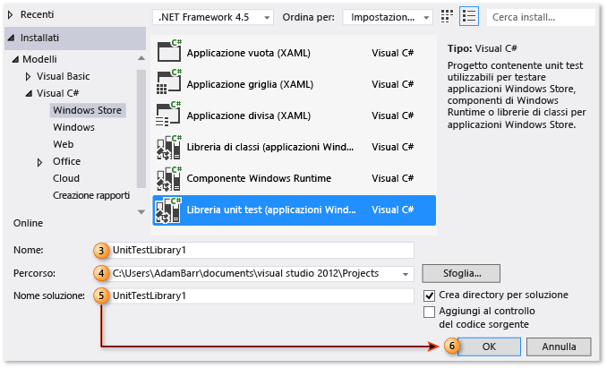
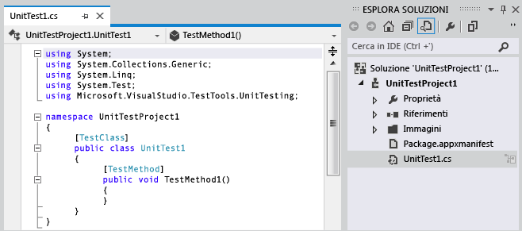
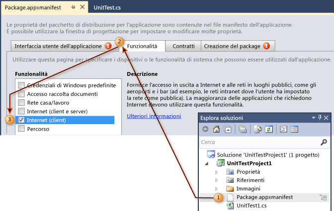
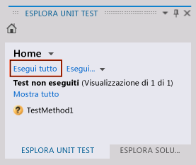
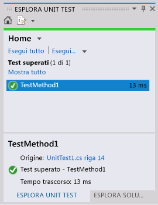

# Procedura dettagliata: creazione ed esecuzione di unit test per le applicazioni Windows Store
[!INCLUDE[vs2017banner](../code-quality/includes/vs2017banner.md)]

In Visual Studio sono inclusi il supporto per gli unit test di app di [!INCLUDE[win8_appname_long](../debugger/includes/win8_appname_long_md.md)] gestite e i modelli della libreria di unit test per Visual C\#, Visual Basic e Visual C\+\+.  
  
> [!TIP]
>  Per altre informazioni sullo sviluppo di app di [!INCLUDE[win8_appname_long](../debugger/includes/win8_appname_long_md.md)], vedere [Introduzione alle app di Windows Store](http://go.microsoft.com/fwlink/?LinkID=241410).  
  
 In Visual Studio sono disponibili le funzionalità di testing unità seguenti:  
  
-   [Creare progetti di unit test](#CreateAndRunUnitTestWin8Tailored_Create)  
  
-   [Modificare il manifesto per il progetto di unit test](#CreateAndRunUnitTestWin8Tailored_Manifest)  
  
-   [Scrivere il codice dello unit test](#CreateAndRunUnitTestWin8Tailored_Code)  
  
-   [Eseguire unit test](#CreateAndRunUnitTestWin8Tailored_Run)  
  
 Le procedure riportate di seguito descrivono i passaggi per creare, eseguire ed effettuare il debug di unit test per app di [!INCLUDE[win8_appname_long](../debugger/includes/win8_appname_long_md.md)] gestite.  
  
## Prerequisiti  
 Visual Studio  
  
##   Creare progetti di unit test  
  
#### Per creare un progetto di unit test per un'app di Windows Store  
  
1.  Scegliere **Nuovo progetto** dal menu **File**.  
  
     Verrà visualizzata la finestra di dialogo Nuovo progetto.  
  
2.  In Modelli, scegliere il linguaggio di programmazione con cui si desidera creare gli unit test, quindi scegliere la libreria di unit test per [!INCLUDE[win8_appname_long](../debugger/includes/win8_appname_long_md.md)] associata. Ad esempio, scegliere **Visual C\#**, quindi scegliere **Windows Store** e infine selezionare **Libreria unit test \(applicazioni Windows Store\)**.  
  
    > [!NOTE]
    >  In Visual Studio sono inclusi i modelli della libreria di unit test per Visual C\#, Visual Basic e Visual C\+\+.  
  
3.  \(Facoltativo\) Nella casella di testo **Nome** immettere il nome che si desidera usare per il progetto di unit test per [!INCLUDE[win8_appname_long](../debugger/includes/win8_appname_long_md.md)].  
  
4.  \(Facoltativo\) Modificare il percorso in cui si desidera creare il progetto immettendolo nella casella di testo **Percorso** oppure scegliendo il pulsante **Sfoglia**.  
  
5.  \(Facoltativo\) Nella casella di testo del nome **Soluzione** immettere il nome che si desidera usare per la soluzione.  
  
6.  Lasciare selezionata l'opzione **Crea directory per soluzione** e scegliere il pulsante **OK**.  
  
       
  
     Esplora soluzioni verrà popolato con il nuovo progetto di unit test per [!INCLUDE[win8_appname_long](../debugger/includes/win8_appname_long_md.md)]e l'editor di codice visualizzerà lo unit test predefinito denominato UnitTest1.  
  
       
  
##   Modificare il manifesto per il progetto di unit test  
 Può essere necessario modificare il manifesto per il progetto di unit test per fornire le funzionalità necessarie per eseguire l'app.  
  
#### Per modificare il file manifesto dell'applicazione di Windows Store del progetto di unit test  
  
1.  In Esplora soluzioni, nel nuovo progetto di unit test per [!INCLUDE[win8_appname_long](../debugger/includes/win8_appname_long_md.md)], fare clic con il pulsante destro del mouse sul file Package.appxmanifest e scegliere **Apri**.  
  
     Verrà visualizzata la finestra Progettazione manifesto nella quale sarà possibile apportare le modifiche al manifesto.  
  
2.  In Progettazione manifesto scegliere la scheda **Funzionalità**.  
  
3.  Nell'elenco in **Funzionalità** selezionare le funzionalità necessarie per lo unit test e il codice per il test. Ad esempio, selezionare la casella di controllo **Internet** se lo unit test e il codice di cui si sta eseguendo il test necessitano della funzionalità di accesso a Internet.  
  
    > [!NOTE]
    >  Le funzionalità selezionate devono includere solo quelle necessarie affinché lo unit test per [!INCLUDE[win8_appname_long](../debugger/includes/win8_appname_long_md.md)] funzioni correttamente. Non si devono mai includere funzionalità che non fanno parte dell'app di [!INCLUDE[win8_appname_long](../debugger/includes/win8_appname_long_md.md)] sottoposta a test e in genere devono essere un sottoinsieme di funzionalità specificate per l'app di [!INCLUDE[win8_appname_long](../debugger/includes/win8_appname_long_md.md)] sottoposta a test.  
  
     Per altre informazioni su Progettazione manifesto, vedere [Configurare un pacchetto di app Windows 8.1 utilizzando la finestra di progettazione del manifesto](../Topic/Configure%20a%20Windows%208.1%20app%20package%20by%20using%20the%20manifest%20designer.md).  
  
       
  
##   Scrivere il codice dello unit test  
  
#### Per scrivere il codice per lo unit test di un'app di Windows Store.  
  
1.  Nell'Editor di codice modificare lo unit test e aggiungere le asserzioni e la logica richieste per il test.  
  
     Per altre informazioni, vedere [Utilizzo di classi Assert](http://go.microsoft.com/fwlink/?LinkID=224991) in MSDN Library.  
  
##   Eseguire unit test  
  
#### Per compilare la soluzione ed eseguire lo unit test usando Esplora test  
  
1.  Dal menu **Test** scegliere **Finestre**, quindi scegliere **Esplora test**.  
  
     Verrà visualizzato Esplora senza il test elencato.  
  
2.  Scegliere **Compila soluzione** dal menu **Compila**.  
  
     Lo unit test viene elencato.  
  
    > [!NOTE]
    >  È necessario compilare la soluzione per aggiornare l'elenco degli unit test in Esplora test.  
  
    > [!WARNING]
    >  Problema noto di Visual Studio: è necessario aprire Esplora test prima di compilare il progetto di test.  
  
3.  In Esplora test, scegliere lo unit test creato.  
  
    > [!TIP]
    >  In Esplora test viene fornito un collegamento al codice sorgente accanto a **Origine:**.  
  
4.  Scegliere **Esegui tutto**.  
  
       
  
    > [!TIP]
    >  È possibile selezionare uno o più unit test elencati in Esplora test, quindi fare clic con il pulsante destro del mouse e scegliere **Esegui test selezionati**.  
    >   
    >  Inoltre, è possibile scegliere di **eseguire il debug dei test selezionati**, di **aprire il test** e di usare l'opzione **Proprietà**.  
    >   
    >    
  
     Lo unit test viene eseguito. Al termine, in Esplora test viene visualizzato lo stato del test, il tempo trascorso e viene fornito un collegamento all'origine.  
  
       
  
## Risorse esterne  
  
### Video  
 [Channel 9: Unit testing your Windows Store apps built using XAML \(Testing unità delle app di Windows Store scritte in XAML\)](http://go.microsoft.com/fwlink/?LinkId=226285)  
  
### Forum  
 [Visual Studio Unit Testing \(Testing unità con Visual Studio\)](http://go.microsoft.com/fwlink/?LinkId=224477)  
  
### MSDN Library  
 [MSDN Library \- Creazione ed esecuzione di unit test per il codice esistente \(Visual Studio 2010\)](http://go.microsoft.com/fwlink/?LinkID=223683)  
  
## Vedere anche  
 [Test delle applicazioni Store con Visual Studio](../test/testing-store-apps-with-visual-studio.md)   
 [Eseguire la compilazione e il test di un'applicazione Windows Store mediante Team Foundation Build](../Topic/Build%20and%20test%20a%20Windows%20Store%20app%20using%20Team%20Foundation%20Build.md)