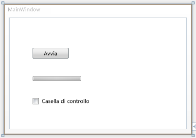
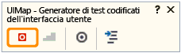
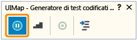

# <a name="walkthrough-creating-editing-and-maintaining-a-coded-ui-test"></a>Procedura dettagliata: Creazione, modifica e gestione di un test codificato dell'interfaccia utente
In questa procedura dettagliata verrà creata una semplice applicazione Windows Presentation Foundation (WPF) per dimostrare come creare, modificare e gestire un test codificato dell'interfaccia utente. Nella procedura dettagliata vengono fornite le soluzioni per correggere i test interrotti da vari problemi di temporizzazione e dal refactoring del controllo.  
  
## <a name="prerequisites"></a>Prerequisiti  
 Per la procedura dettagliata è necessario il seguente componente:  
  
-   Visual Studio Enterprise  
  
### <a name="create-a-simple-wpf-application"></a>Creare una semplice applicazione WPF  
  
1.  Nel menu **FILE** scegliere **Nuovo** e quindi selezionare **Progetto**.  
  
     Verrà visualizzata la finestra di dialogo **Nuovo progetto**.  
  
2.  Nel riquadro **Installato** espandere **Visual C#** e quindi selezionare **Windows Desktop**.  
  
3.  Sopra il riquadro centrale verificare che l'elenco a discesa del framework di destinazione sia impostato su **.NET Framework 4.5**.  
  
4.  Nel riquadro centrale selezionare il modello **Applicazione WPF**.  
  
5.  Nella casella di testo **Nome** digitare **SimpleWPFApp**.  
  
6.  Scegliere una cartella in cui verrà salvato il progetto. Nella casella di testo **Percorso** digitare il nome della cartella.  
  
7.  Scegliere **OK**.  
  
     Verrà aperto WPF Designer per Visual Studio e la finestra principale del progetto.  
  
8.  Aprire la casella degli strumenti, se non è già aperta. Scegliere il menu **VISUALIZZA** e quindi **Casella degli strumenti**.  
  
9. Nella sezione **Tutti i controlli di WPF** trascinare i controlli **Button**, **CheckBox** e **ProgressBar** su MainWindow nell'area di progettazione.  
  
10. Selezionare il controllo Button. Nella finestra Proprietà modificare il valore della proprietà **Name** da \<No Name> a button1. Modificare quindi il valore della proprietà **Content** da Button a Start.  
  
11. Selezionare il controllo ProgressBar. Nella finestra Proprietà modificare il valore della proprietà **Name** da \<No Name> a progressBar1. Modificare quindi il valore della proprietà **Maximum** da **100** a **10000**.  
  
12. Selezionare il controllo Checkbox. Nella finestra Proprietà modificare il valore della proprietà **Name** da \<No Name> a checkBox1 e quindi deselezionare la proprietà **IsEnabled**.  
  
       
  
13. Fare doppio clic sul pulsante per aggiungere un gestore eventi Click.  
  
     MainWindow.xmal.cs viene visualizzato nell'editor del codice con il cursore nel nuovo metodo button1_Click.  
  
14. Nella parte superiore della classe MainWindow aggiungere un delegato, che verrà usato per l'indicatore di stato. Per aggiungere il delegato, aggiungere il codice seguente:  
  
    ```csharp  
    public partial class MainWindow : Window  
    {  
            private delegate void ProgressBarDelegate(System.Windows.DependencyProperty dp, Object value);          
  
        public MainWindow()  
        {  
  
            InitializeComponent();  
        }  
  
    ```  
  
15. Nel metodo button1_Click aggiungere il codice seguente:  
  
    ```csharp  
    private void button1_Click(object sender, RoutedEventArgs e)  
    {  
        double progress = 0;  
  
        ProgressBarDelegate updatePbDelegate =  
            new ProgressBarDelegate(progressBar1.SetValue);  
  
        do  
        {  
            progress ++;  
  
            Dispatcher.Invoke(updatePbDelegate,  
                System.Windows.Threading.DispatcherPriority.Background,  
                new object[] { ProgressBar.ValueProperty, progress });  
            progressBar1.Value = progress;  
        }  
        while (progressBar1.Value != progressBar1.Maximum);  
  
        checkBox1.IsEnabled = true;  
    }  
  
    ```  
  
16. Salvare il file.  
  
### <a name="verify-the-wpf-application-runs-correctly"></a>Verificare che l'applicazione WPF venga eseguita correttamente  
  
1.  Nel menu **DEBUG** scegliere **Avvia debug** o premere **F5**.  
  
2.  Si noti che il controllo CheckBox è disabilitato. Scegliere **Avvia**.  
  
     L'indicatore di stato dovrebbe essere completato al 100% in pochi secondi.  
  
3.  È ora possibile selezionare il controllo CheckBox.  
  
4.  Chiudere SimpleWPFApp.  
  
### <a name="create-and-run-a-coded-ui-test-for-simplewpfapp"></a>Creare ed eseguire un test codificato dell'interfaccia utente per SimpleWPFApp  
  
1.  Individuare l'applicazione SimpleWPFApp creata precedentemente. Per impostazione predefinita, l'applicazione viene salvata in C:\Users\\\<nomeutente\>\Documenti\Visual Studio \<versione>\Projects\SimpleWPFApp\SimpleWPFApp\bin\Debug\SimpleWPFApp.exe  
  
2.  Creare un collegamento sul desktop all'applicazione SimpleWPFApp. Fare clic con il pulsante destro del mouse su SimpleWPFApp.exe e scegliere **Copia**. Sul desktop fare clic con il pulsante destro del mouse e scegliere **Incolla collegamento**.  
  
    > [!TIP]
    >  Un collegamento all'applicazione rende più facile aggiungere o modificare i test codificati dell'interfaccia utente per l'applicazione, perché consente di avviare rapidamente l'applicazione.  
  
3.  In Esplora soluzioni fare clic con il pulsante destro del mouse sulla soluzione, scegliere **Aggiungi** e quindi **Nuovo progetto**.  
  
     Verrà visualizzata la finestra di dialogo **Aggiungi nuovo progetto**.  
  
4.  Nel riquadro **Installato** espandere **Visual C#** e quindi selezionare **Test**.  
  
5.  Nel riquadro centrale selezionare il modello **Progetto di test codificato dell'interfaccia utente**.  
  
6.  Scegliere **OK**.  
  
     In Esplora soluzioni il nuovo progetto di test codificato dell'interfaccia utente denominato **CodedUITestProject1** viene aggiunto alla soluzione.  
  
     Viene visualizzata la finestra di dialogo **Genera codice per test codificato dell'interfaccia utente**.  
  
7.  Selezionare l'opzione **Registra azioni, modifica mappa dell'interfaccia utente o aggiungi asserzioni** e fare clic su **OK**.  
  
     Viene visualizzata la finestra UIMap – Generatore di test codificati dell'interfaccia utente e Visual Studio è ridotto a icona.  
  
     Per altre informazioni sulle opzioni disponibili nella finestra di dialogo, vedere [Creazione di test codificati dell'interfaccia utente](../test/use-ui-automation-to-test-your-code.md#VerifyingCodeUsingCUITCreate).  
  
8.  Scegliere **Avvia registrazione** in UIMap - Generatore di test codificati dell'interfaccia utente.  
  
       
  
     Se necessario, è possibile sospendere la registrazione, ad esempio per controllare la posta elettronica in arrivo.  
  
       
  
    > [!WARNING]
    >  Tutte le azioni eseguite sul desktop verranno registrate. Sospendere la registrazione se si eseguono azioni che possono comportare l'inserimento di dati sensibili nella registrazione.  
  
9. Avviare SimpleWPFApp usando il collegamento sul desktop.  
  
     Anche in questo caso, si noti che il controllo CheckBox è disabilitato.  
  
10. In SimpleWPFApp scegliere **Avvia**.  
  
     L'indicatore di stato dovrebbe essere completato al 100% in pochi secondi.  
  
11. Selezionare il controllo CheckBox, ora abilitato.  
  
12. Chiudere l'applicazione SimpleWPFApp.  
  
13. In UIMap - Generatore di test codificati dell'interfaccia utente scegliere **Genera codice**.  
  
14. In Nome metodo digitare **SimpleAppTest** e scegliere **Aggiungi e genera**. Entro pochi secondi il test codificato dell'interfaccia utente verrà visualizzato e aggiunto alla soluzione.  
  
15. Chiudere UIMap - Generatore di test codificati dell'interfaccia utente.  
  
     Il file CodedUITest1.cs verrà visualizzato nell'editor del codice.  
  
16. Salvare il progetto.  
  
### <a name="run-the-coded-ui-test"></a>Eseguire il test codificato dell'interfaccia utente  
  
1.  Nel menu **TEST** scegliere **Finestre** e quindi **Esplora test**.  
  
2.  Nel menu **COMPILA** scegliere **Compila soluzione**.  
  
3.  Nel file CodedUITest1.cs individuare il metodo **CodedUITestMethod**, fare clic con il pulsante destro del mouse e scegliere **Esegui test** oppure eseguire i test da Esplora test.  
  
     Durante l'esecuzione del test codificato dell'interfaccia utente, SimpleWPFApp rimane visibile. Vengono eseguiti i passaggi effettuati nella procedura precedente. Tuttavia, quando nel test è effettuato il tentativo di selezionare la casella di controllo relativa al controllo CheckBox, nella finestra Risultati test viene indicato che il test non è stato completato. Ciò è dovuto al fatto che durante l'esecuzione del test è effettuato il tentativo di selezionare la casella di controllo, senza considerare che il controllo CheckBox rimane disabilitato finché l'indicatore di stato non sarà completato al 100%. È possibile correggere questo e problemi analoghi usando i diversi metodi `UITestControl.WaitForControlXXX()` disponibili per il test codificato dell'interfaccia utente. Nella procedura seguente verrà descritto l'uso del metodo `WaitForControlEnabled()` per correggere il problema che ha impedito il corretto funzionamento di questo test. Per altre informazioni, vedere [Impostazione dei test codificati dell'interfaccia utente per l'attesa di eventi specifici durante la riproduzione](../test/making-coded-ui-tests-wait-for-specific-events-during-playback.md).  
  
### <a name="edit-and-rerun-the-coded-ui-test"></a>Modificare ed eseguire di nuovo il test codificato dell'interfaccia utente  
  
1.  Nella finestra Esplora test selezionare il test non riuscito e quindi nella sezione **StackTrace** scegliere il primo collegamento a **UIMap.SimpleAppTest()**.  
  
2.  Il file UIMap.Designer.cs verrà aperto con il punto di errore evidenziato nel codice:  
  
    ```csharp  
  
    // Select 'CheckBox' check box  
    uICheckBoxCheckBox.Checked = this.SimpleAppTestParams.UICheckBoxCheckBoxChecked;  
    ```  
  
3.  Per correggere questo problema, è possibile fare in modo che il test codificato dell'interfaccia utente attenda che il controllo CheckBox sia abilitato prima di continuare fino a questa riga usando il metodo `WaitForControlEnabled()`.  
  
    > [!WARNING]
    >  Il file UIMap.Designer.cs non deve essere modificato. Qualsiasi modifica del codice apportata nel file UIMapDesigner.cs verrà sovrascritta ogni volta che si genera codice usando UIMap - Generatore di test codificati dell'interfaccia utente. Se è necessario modificare un metodo registrato, copiarlo nel file UIMap.cs e rinominarlo. Il file UIMap.cs può essere usato per eseguire l'override dei metodi e delle proprietà contenuti nel file UIMapDesigner.cs. È necessario rimuovere il riferimento al metodo originale nel file Coded UITest.cs e sostituirlo con il nome del metodo rinominato.  
  
4.  In Esplora soluzioni individuare **UIMap.uitest** nel progetto di test codificato dell'interfaccia utente.  
  
5.  Aprire il menu di scelta rapida per **UIMap.uitest** e scegliere **Apri**.  
  
     Il test codificato dell'interfaccia utente viene visualizzato nell'Editor test codificati dell'interfaccia utente. È quindi possibile visualizzare e modificare il test codificato dell'interfaccia utente.  
  
6.  Nel riquadro **Azioni dell'interfaccia utente** selezionare il metodo di test (SimpleAppTest) da spostare nel file di UIMap.cs o UIMap.vb per facilitare la funzionalità di codice personalizzato che non sarà sovrascritta quando il codice di test viene ricompilato.  
  
7.  Scegliere il pulsante **Sposta codice** sulla barra degli strumenti dell'Editor di test codificati dell'interfaccia utente.  
  
8.  Verrà visualizzata una finestra di dialogo di Microsoft Visual Studio Si tratta di un avviso indicante che il metodo verrà spostato dal file UIMap.uitest al file UIMap.cs e che non sarà più possibile modificare il metodo usando l'Editor test codificati dell'interfaccia utente. Scegliere **Sì**.  
  
     Il metodo di test verrà rimosso dal file UIMap.uitest e non verrà più visualizzato nel riquadro delle azioni dell'interfaccia utente. Per modificare il file di test spostato, aprire il file UIMap.cs da Esplora soluzioni.  
  
9. Sulla barra degli strumenti di [!INCLUDE[vsprvs](../code-quality/includes/vsprvs_md.md)] scegliere **Salva**.  
  
     Gli aggiornamenti al metodo di test vengono salvati nel file UIMap.Designer.  
  
    > [!CAUTION]
    >  Una volta che è stato spostato il metodo, non è più possibile modificarlo tramite l'Editor test codificati dell'interfaccia utente. È necessario aggiungere il codice personalizzato e gestirlo usando l'editor del codice.  
  
10. Rinominare il metodo `SimpleAppTest()` in `ModifiedSimpleAppTest()`.  
  
11. Aggiungere al file l'istruzione using seguente:  
  
    ```csharp  
  
    using Microsoft.VisualStudio.TestTools.UITesting.WpfControls;  
  
    ```  
  
12. Aggiungere il metodo `WaitForControlEnabled()` seguente prima della riga di codice che causa il problema identificato precedentemente:  
  
    ```csharp  
  
              uICheckBoxCheckBox.WaitForControlEnabled();  
  
    // Select 'CheckBox' check box  
    uICheckBoxCheckBox.Checked = this.SimpleAppTestParams.UICheckBoxCheckBoxChecked;  
  
    ```  
  
13. Nel file CodedUITest1.cs individuare il metodo **CodedUITestMethod** e impostare come commento o rinominare il riferimento al metodo SimpleAppTest() originale e quindi sostituirlo con il nuovo metodo ModifiedSimpleAppTest():  
  
    ```csharp  
    [TestMethod]  
            public void CodedUITestMethod1()  
            {  
                // To generate code for this test, select "Generate Code for Coded UI Test" from the shortcut menu and select one of the menu items.  
                // For more information on generated code, see http://go.microsoft.com/fwlink/?LinkId=179463  
                //this.UIMap.SimpleAppTest();  
                this.UIMap.ModifiedSimpleAppTest();  
            }  
  
    ```  
  
14. Scegliere **Compila soluzione** dal menu **Compila**.  
  
15. Fare clic con il pulsante destro del mouse sul metodo **CodedUITestMethod** e selezionare **Esegui test**.  
  
16. Questa volta tutti i passaggi del test codificato dell'interfaccia utente vengono completati e nella finestra Esplora test è visualizzato **Superato**.  
  
### <a name="refactor-a-control-in-the-simplewpfapp"></a>Effettuare il refactoring di un controllo in SimpleWPFApp  
  
1.  Nel file MainWindow.xaml selezionare il pulsante nella finestra di progettazione.  
  
2.  Nella parte superiore della finestra Proprietà modificare il valore della proprietà **Name** da button1 a buttonA.  
  
3.  Scegliere **Compila soluzione** dal menu **Compila**.  
  
4.  In Esplora test eseguire **CodedUITestMethod1**.  
  
     Il test non funziona perché il test codificato dell'interfaccia utente non è in grado di individuare il pulsante mappato in origine come button1 in UIMap. Il refactoring può influire in questo modo sui test codificati dell'interfaccia utente.  
  
5.  Nella sezione **StackTrace** della finestra Esplora test scegliere il primo collegamento accanto a **UIMpa.ModifiedSimpleAppTest()**.  
  
     Verrà aperto il file UIMap.cs. Il punto di errore è evidenziato nel codice:  
  
    ```csharp  
  
    // Click 'Start' button  
    Mouse.Click(uIStartButton, new Point(27, 10));  
    ```  
  
     Si noti che nella riga di codice precedente di questa procedura viene usato `UiStartButton`, che corrisponde al nome di UIMap prima del refactoring.  
  
     Per correggere il problema, è possibile aggiungere il controllo di cui è stato effettuato il refactoring a UIMap tramite il Generatore di test codificati dell'interfaccia utente. È possibile aggiornare il codice del test in modo che venga usato il codice, come illustrato nella procedura seguente.  
  
### <a name="map-refactored-control-and-edit-and-rerun-the-coded-ui-test"></a>Mappare il controllo di cui è stato effettuato il refactoring e modificare ed eseguire di nuovo il test codificato dell'interfaccia utente  
  
1.  Nel file CodedUITest1.cs fare clic con il pulsante destro del mouse sul metodo **CodedUITestMethod1()**, scegliere **Genera codice per test codificato dell'interfaccia utente** e quindi fare clic su **Usa il generatore di test codificati dell'interfaccia utente**.  
  
     Verrà visualizzato UIMap - Generatore di test codificati dell'interfaccia utente.  
  
2.  Usando il collegamento del desktop creato in precedenza, eseguire l'applicazione SimpleWPFApp creata precedentemente.  
  
3.  In UIMap - Generatore di test codificati dell'interfaccia utente trascinare il selettore di precisione sul pulsante **Start** in SimpleWPFApp.  
  
     Il pulsante **Start** è racchiuso in una casella blu. Generatore di test codificati dell'interfaccia utente richiede alcuni secondi per elaborare i dati relativi al controllo selezionato e visualizza le proprietà dei controlli. Si noti che il nome di **AutomationUId** è **buttonA**.  
  
4.  Nelle proprietà del controllo scegliere la freccia nell'angolo superiore sinistro per espandere la mappa del controllo dell'interfaccia utente. Si noti che **UIStartButton1** è selezionato.  
  
5.  Sulla barra degli strumenti scegliere **Aggiungi controllo alla mappa del controllo dell'interfaccia utente**.  
  
     Lo stato nella parte inferiore della finestra consente di verificare l'azione visualizzando il messaggio **Il controllo selezionato è stato aggiunto alla mappa del controllo dell'interfaccia utente**.  
  
6.  In UIMap - Generatore di test codificati dell'interfaccia utente scegliere **Genera codice**.  
  
     Viene visualizzato Generatore di test codificati dell'interfaccia utente - Genera codice con una nota in cui è indicato che non è richiesto alcun nuovo metodo e che il codice sarà generato solo per le modifiche alla mappa del controllo dell'interfaccia utente.  
  
7.  Scegliere **Genera**.  
  
8.  Chiudere SimpleWPFApp.exe.  
  
9. Chiudere UIMap - Generatore di test codificati dell'interfaccia utente.  
  
     UIMap - Generatore di test codificati dell'interfaccia utente richiede alcuni secondi per elaborare le modifiche alla mappa di controllo dell'interfaccia utente.  
  
10. In Esplora soluzioni aprire il file UIMap.Designer.cs.  
  
11. Nel file UIMap.Designer.cs individuare la proprietà UIStartButton1. Si noti che `SearchProperties` è impostato su `"buttonA"`:  
  
    ```csharp  
  
    public WpfButton UIStartButton1  
            {  
                get  
                {  
                    if ((this.mUIStartButton1 == null))  
                    {  
                        this.mUIStartButton1 = new WpfButton(this);  
                        #region Search Criteria  
                        this.mUIStartButton1.SearchProperties[WpfButton.PropertyNames.AutomationId] = "buttonA";  
                        this.mUIStartButton1.WindowTitles.Add("MainWindow");  
                        #endregion  
                    }  
                    return this.mUIStartButton1;  
                }  
            }  
  
    ```  
  
     A questo punto è possibile modificare il test codificato dell'interfaccia utente in modo che venga usato il controllo appena mappato. Come evidenziato nella procedura precedente, se si desidera eseguire l'override di metodi o proprietà nel test codificato dell'interfaccia utente, è necessario effettuare questa operazione nel file UIMap.cs.  
  
12. Nel file UIMap.cs aggiungere un costruttore e specificare la proprietà `SearchProperties` della proprietà `UIStartButton` per usare la proprietà `AutomationID` con un valore `"buttonA":`  
  
    ```csharp  
  
    public UIMap()  
            {  
                this.UIMainWindowWindow.UIStartButton.SearchProperties[WpfButton.PropertyNames.AutomationId] = "buttonA";  
            }  
  
    ```  
  
13. Scegliere **Compila soluzione** dal menu **Compila**.  
  
14. In Esplora test eseguire CodedUITestMethod1.  
  
     Questa volta tutti i passaggi del test codificato dell'interfaccia utente vengono completati.  Nella finestra Risultati test viene visualizzato **Superato**.  
  
## <a name="external-resources"></a>Risorse esterne  
  
### <a name="videos"></a>Video  
  [Coded UI Tests-DeepDive-Episode1-GettingStarted](http://go.microsoft.com/fwlink/?LinkID=230573)  
  
  [Coded UI Tests-DeepDive-Episode2-MaintainenceAndDebugging](http://go.microsoft.com/fwlink/?LinkID=230574)  
  
  [Coded UI Tests-DeepDive-Episode3-HandCoding](http://go.microsoft.com/fwlink/?LinkID=230575)  
  
### <a name="hands-on-lab"></a>Lab pratico  
 [Lab virtuale MSDN: Introduzione alla creazione di test codificati dell'interfaccia utente con Visual Studio 2010](http://go.microsoft.com/fwlink/?LinkID=22508)  
  
### <a name="faq"></a>Domande frequenti  
 [Domande frequenti sui test codificati dell'interfaccia utente - 1](http://go.microsoft.com/fwlink/?LinkID=230576)  
  
 [Domande frequenti sui test codificati dell'interfaccia utente - 2](http://go.microsoft.com/fwlink/?LinkID=230578)  
  
### <a name="forum"></a>Forum  
 [Test di automazione dell'interfaccia utente di Visual Studio (include CodedUI)](http://go.microsoft.com/fwlink/?LinkID=224497)  
  
## <a name="see-also"></a>Vedere anche  
 [Usare l'automazione dell'interfaccia utente per testare il codice](../test/use-ui-automation-to-test-your-code.md)   
 [Guida introduttiva a Progettazione WPF](http://msdn.microsoft.com/en-us/18e61d03-b96a-4058-a166-8ec6b3f6116b)   
 [Configurazioni e piattaforme supportate per i test codificati dell'interfaccia utente e le registrazioni delle azioni](../test/supported-configurations-and-platforms-for-coded-ui-tests-and-action-recordings.md)   
 [Modifica di test codificati dell'interfaccia utente con l'editor di test codificato dell'interfaccia utente](../test/editing-coded-ui-tests-using-the-coded-ui-test-editor.md)

