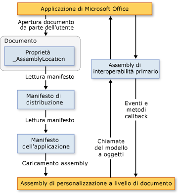

# Architettura delle personalizzazioni a livello di documento
  [!INCLUDE[vs_dev12](../vsto/includes/vs-dev12-md.md)] include progetti per la creazione di personalizzazioni a livello di documento per Microsoft Office Word e Microsoft Office Excel. Questo argomento descrive gli aspetti seguenti delle personalizzazioni a livello di documento:  
  
-   [Informazioni sulle personalizzazioni](#UnderstandingCustomizations)  
  
-   [Componenti delle personalizzazioni](#Components)  
  
-   [Funzionamento delle personalizzazioni con le applicazioni di Microsoft Office](#HowCustomizationsWork)  
  
 [!INCLUDE[appliesto_alldoc](../vsto/includes/appliesto-alldoc-md.md)]  
  
 Per informazioni generali sulla creazione di personalizzazioni a livello di documento, vedere [Cenni preliminari sullo sviluppo di soluzioni Office &#40; VSTO &#41; ](../vsto/office-solutions-development-overview-vsto.md), [Introduzione programmazione delle personalizzazioni a livello di documento per Word](../vsto/getting-started-programming-document-level-customizations-for-word.md), e [introduzione programmazione delle personalizzazioni a livello di documento per Excel](../vsto/getting-started-programming-document-level-customizations-for-excel.md).  
  
##   Understanding Customizations  
 Quando si usano gli strumenti di sviluppo per Office in Visual Studio per aggiungere una personalizzazione a livello di documento, si crea un assembly di codice gestito associato a un determinato documento. Una cartella di lavoro o un documento dispone di estensioni di codice gestito quando include un assembly collegato. Per altre informazioni, vedere [Designing and Creating Office Solutions](../vsto/designing-and-creating-office-solutions.md).  
  
 Quando un utente apre il documento, l'assembly viene caricato dall'applicazione di Microsoft Office. Dopo il caricamento dell'assembly, la personalizzazione può rispondere agli eventi mentre il documento è aperto. Può anche eseguire chiamate nel modello a oggetti per automatizzare ed estendere l'applicazione mentre il documento è aperto e può usare qualsiasi classe di [!INCLUDE[dnprdnshort](../sharepoint/includes/dnprdnshort-md.md)].  
  
 L'assembly comunica con i componenti COM dell'applicazione tramite l'assembly di interoperabilità primario dell'applicazione. Per ulteriori informazioni, vedere [assembly di interoperabilità primari di Office](../vsto/office-primary-interop-assemblies.md) e [Cenni preliminari sullo sviluppo di soluzioni Office &#40; VSTO &#41; ](../vsto/office-solutions-development-overview-vsto.md).  
  
 Se un utente apre contemporaneamente più personalizzazioni a livello di documento, ogni assembly viene caricato in un dominio dell'applicazione diverso. Questo significa che una soluzione che si comporta in modo non corretto non può causare l'errato funzionamento delle altre soluzioni. Le personalizzazioni a livello di documento sono progettate per funzionare con un solo documento in un solo dominio di applicazione e non per la comunicazione tra documenti. Per ulteriori informazioni sui domini dell'applicazione, vedere [domini applicazione](/dotnet/framework/app-domains/application-domains).  
  
> [!NOTE]  
>  Le personalizzazioni a livello di documento create mediante gli strumenti di sviluppo per Office disponibili in Visual Studio sono progettate per essere usate solo quando l'applicazione viene avviata da un utente finale. Se l'applicazione viene avviata a livello di codice, ad esempio usando l'automazione, il componente aggiuntivo potrebbe non funzionare nel modo previsto.  
  
### Informazioni sulle fasi di progettazione ed esecuzione  
 Per comprendere l'architettura delle personalizzazioni a livello di documento è utile conoscere le procedure di progettazione ed esecuzione di una soluzione.  
  
#### Fase di progettazione  
 L'esperienza in fase di progettazione include i passaggi seguenti:  
  
1.  Lo sviluppatore crea un progetto a livello di documento in [!INCLUDE[vsprvs](../sharepoint/includes/vsprvs-md.md)]. Il progetto include il documento e l'assembly sottostante il documento. È possibile usare un documento già esistente, ad esempio creato da un progettista, oppure un nuovo documento creato con il progetto.  
  
2.  Il progettista (lo sviluppatore che crea il progetto o un'altra persona) determina quale aspetto avrà il documento per l'utente finale.  
  
#### Fase di esecuzione  
 L'esperienza in fase di esecuzione include i passaggi seguenti:  
  
1.  L'utente finale apre un documento o una cartella di lavoro dotata di estensioni con codice gestito.  
  
2.  Il documento o la cartella di lavoro carica l'assembly compilato.  
  
3.  L'assembly risponde agli eventi mentre l'utente usa il documento o la cartella di lavoro.  
  
#### Punto di vista dello sviluppatore e dell'utente finale  
 Dato che lo sviluppatore usa principalmente [!INCLUDE[vsprvs](../sharepoint/includes/vsprvs-md.md)]mentre l'utente finale usa Word o Excel, le personalizzazioni a livello di documento possono essere considerate da due prospettive diverse.  
  
|Punto di vista dello sviluppatore|Punto di vista dell'utente finale|  
|-----------------------------|----------------------------|  
|Lo sviluppatore usa [!INCLUDE[vsprvs](../sharepoint/includes/vsprvs-md.md)]per scrivere codice accessibile da Word ed Excel.   Sebbene venga apparentemente creato un file eseguibile in grado di eseguire Word o Excel, il processo presenta in realtà il funzionamento opposto. Il documento viene associato a un assembly e contiene un puntatore a tale assembly. All'apertura del documento, Word o Excel individua l'assembly ed esegue il codice in risposta a tutti gli eventi gestiti.|Chi usa la soluzione, apre semplicemente il documento o la cartella di lavoro oppure crea un nuovo documento da un modello, come per qualsiasi altro file di Microsoft Office.   L'assembly fornisce le personalizzazioni all'interno del documento o della cartella di lavoro, ad esempio popolandolo automaticamente con dati correnti o visualizzando una finestra di dialogo in cui vengono richieste informazioni.|  
  
### Formati di documento supportati per le personalizzazioni a livello di documento  
 Quando si crea un progetto di personalizzazione, è possibile scegliere il formato di documento da usare nel progetto. Per altre informazioni, vedere [How to: Create Office Projects in Visual Studio](../vsto/how-to-create-office-projects-in-visual-studio.md).  
  
 Nella tabella seguente sono elencati i formati di documento che è possibile usare nelle personalizzazioni a livello di documento per Excel e Word.  
  
|Excel|Word|  
|-----------|----------|  
|Cartella di lavoro di Excel (*.xlsx)   Cartella di lavoro con attivazione macro di Excel (*.xlsm)   Cartella di lavoro binaria di Excel (*.xlsb)   Cartella di lavoro di Excel 97-2003 (*.xls)   Modello di Excel (*.xltx)   Modello con attivazione macro di Excel (*.xltm)   Modello di Excel 97-2003 (*.xlt)|Documento di Word (*.docx)   Documento di Word con attivazione macro (*.docm)   Documento di Word 97-2003 (*.doc)   Modello di Word (*.dotx)   Modello di Word con attivazione macro (*.dotm)   Modello di Word 97-2003 (*.dot)|  
  
 Si consiglia di progettare le estensioni di codice gestito solo per documenti nei formati supportati. In caso contrario, è possibile che alcuni eventi non vengano generati all'apertura del documento nell'applicazione. Ad esempio, l'evento <xref:Microsoft.Office.Tools.Excel.Workbook.Open> non viene generato quando si usano le estensioni di codice gestito con cartelle di lavoro salvate nel formato foglio di calcolo XML di Excel o nel formato pagina Web (con estensione htm o html).  
  
### Supporto dei documenti di Word con estensione xml  
 I modelli di progetto a livello di documento non consentono di creare progetti basati sui formati di file seguenti:  
  
-   Documento XML di Word (*.xml)  
  
-   Documento XML di Word 2003 (*.xml)  
  
 Se si vuole che gli utenti finali usino le personalizzazioni in questi formati di file, compilare e distribuire una personalizzazione che usi uno dei formati di file supportati specificati nella tabella precedente. Dopo aver installato la personalizzazione, gli utenti finali possono salvare il documento nel documento XML di Word (* xml) formato o il documento XML di Word 2003 (\*xml), formato e la personalizzazione continuerà a funzionare come previsto.  
  
##   Components of Customizations  
 I componenti principali di una personalizzazione sono il documento e l'assembly. Oltre a questi componenti, anche alcune altre parti svolgono un ruolo importante nel modo in cui le applicazioni di Microsoft Office individuano e caricano le personalizzazioni.  
  
### Manifesto della distribuzione e manifesto dell'applicazione  
 Le personalizzazioni usano i manifesti della distribuzione e dell'applicazione per identificare e caricare la versione più recente dell'assembly di personalizzazione. Il manifesto della distribuzione fa riferimento al manifesto dell'applicazione corrente. Il manifesto dell'applicazione fa riferimento all'assembly di personalizzazione e specifica la classe o le classi del punto di ingresso da eseguire nell'assembly. Per altre informazioni, vedere [Application and Deployment Manifests in Office Solutions](../vsto/application-and-deployment-manifests-in-office-solutions.md).  
  
### Runtime di Visual Studio Tools per Office  
 Per eseguire le personalizzazioni a livello di documento create mediante gli strumenti di sviluppo per Office disponibili in Visual Studio, è necessario che nei computer degli utenti finali sia installato [!INCLUDE[vsto_runtime](../vsto/includes/vsto-runtime-md.md)] . [!INCLUDE[vsto_runtime](../vsto/includes/vsto-runtime-md.md)] include componenti non gestiti che caricano l'assembly di personalizzazione e un set di assembly gestiti. Questi assembly gestiti forniscono il modello a oggetti usato dal codice della personalizzazione per automatizzare ed estendere l'applicazione host.  
  
 Per altre informazioni, vedere [Visual Studio Tools for Office Runtime Overview](../vsto/visual-studio-tools-for-office-runtime-overview.md).  
  
##   How Customizations Work with Microsoft Office Applications  
 Quando un utente apre un documento che fa parte di una personalizzazione per Microsoft Office, l'applicazione usa il manifesto della distribuzione collegato al documento per trovare e caricare la versione più recente dell'assembly di personalizzazione. Il percorso del manifesto della distribuzione è archiviato in una proprietà di documento personalizzato denominata AssemblyLocation. La stringa che identifica questo percorso viene inserita nella proprietà quando si compila la soluzione.  
  
 Il manifesto della distribuzione punta al manifesto dell'applicazione, che a sua volta punta all'assembly più recente. Per altre informazioni, vedere [Application and Deployment Manifests in Office Solutions](../vsto/application-and-deployment-manifests-in-office-solutions.md).  
  
 La figura seguente mostra l'architettura di base di una personalizzazione a livello di documento.  
  
   
  
> [!NOTE]  
>  Nelle soluzioni Office destinate a [!INCLUDE[net_v40_short](../sharepoint/includes/net-v40-short-md.md)], le soluzioni effettuano chiamate nel modello a oggetti dell'applicazione host usando le informazioni sul tipo di assembly di interoperabilità primario incorporate nell'assembly della soluzione, anziché chiamare direttamente l'assembly di interoperabilità primario. Per altre informazioni, vedere [Designing and Creating Office Solutions](../vsto/designing-and-creating-office-solutions.md).  
  
### Processo di caricamento  
 I passaggi seguenti si verificano quando un utente apre un documento che fa parte di una soluzione Microsoft Office.  
  
1.  L'applicazione di Microsoft Office controlla le proprietà personalizzate per verificare se sono presenti estensioni di codice gestito associate al documento. Per altre informazioni, vedere [Custom Document Properties Overview](../vsto/custom-document-properties-overview.md).  
  
2.  Se sono presenti estensioni di codice gestito, l'applicazione carica VSTOEE.dll, che a sua volta carica VSTOLoader.dll. Si tratta di DLL non gestite che sono i componenti del caricatore di Visual Studio 2010 Tools per Office Runtime. Per altre informazioni, vedere [Visual Studio Tools for Office Runtime Overview](../vsto/visual-studio-tools-for-office-runtime-overview.md).  
  
3.  VSTOLoader.dll carica [!INCLUDE[dnprdnshort](../sharepoint/includes/dnprdnshort-md.md)] e avvia la parte gestita di [!INCLUDE[vsto_runtime](../vsto/includes/vsto-runtime-md.md)].  
  
4.  Se il documento viene aperto da un percorso diverso dal computer locale, [!INCLUDE[vsto_runtime](../vsto/includes/vsto-runtime-md.md)] verifica che il percorso del documento sia incluso nell'elenco **Percorsi attendibili** in **Impostazioni Centro protezione** per la specifica applicazione di Office. Se il percorso del documento non è attendibile, la personalizzazione non è considerata attendibile e il processo di caricamento si arresta.  
  
5.  [!INCLUDE[vsto_runtime](../vsto/includes/vsto-runtime-md.md)] installa la soluzione se non è ancora stata installata, scarica i manifesti dell'applicazione e della distribuzione più recenti ed esegue una serie di controlli di sicurezza. Per altre informazioni, vedere [Securing Office Solutions](../vsto/securing-office-solutions.md).  
  
6.  Se la personalizzazione è considerata attendibile per l'esecuzione, [!INCLUDE[vsto_runtime](../vsto/includes/vsto-runtime-md.md)] usa i manifesti di distribuzione e dell'applicazione per verificare la disponibilità di aggiornamenti dell'assembly. Se è disponibile una nuova versione dell'assembly, il runtime scarica la nuova versione dell'assembly nella cache di [!INCLUDE[ndptecclick](../vsto/includes/ndptecclick-md.md)] nel computer client. Per ulteriori informazioni, vedere [distribuisce una soluzione Office](../vsto/deploying-an-office-solution.md).  
  
7.  [!INCLUDE[vsto_runtime](../vsto/includes/vsto-runtime-md.md)] crea un nuovo dominio dell'applicazione in cui caricare l'assembly di personalizzazione.  
  
8.  [!INCLUDE[vsto_runtime](../vsto/includes/vsto-runtime-md.md)] carica l'assembly di personalizzazione nel dominio dell'applicazione.  
  
9. Il [!INCLUDE[vsto_runtime](../vsto/includes/vsto-runtime-md.md)] chiamate di **avvio** gestore di eventi nell'assembly di personalizzazione. Per altre informazioni, vedere [Events in Office Projects](../vsto/events-in-office-projects.md).  
  
## Vedere anche  
 [Architettura delle soluzioni Office in Visual Studio](../vsto/architecture-of-office-solutions-in-visual-studio.md)   
 [Architettura dei componenti aggiuntivi VSTO](../vsto/architecture-of-vsto-add-ins.md)   
 [Visual Studio Tools for Office Runtime Overview](../vsto/visual-studio-tools-for-office-runtime-overview.md)   
 [Sicurezza delle soluzioni Office](../vsto/securing-office-solutions.md)   
 [Progettazione e creazione di soluzioni Office](../vsto/designing-and-creating-office-solutions.md)   
 [Cenni preliminari sulle proprietà personalizzate dei documenti](../vsto/custom-document-properties-overview.md)   
 [Dati memorizzati nella cache nelle personalizzazioni a livello di documento](../vsto/cached-data-in-document-level-customizations.md)  
  
  