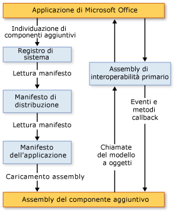

# Architettura dei componenti aggiuntivi VSTO
  I componenti aggiuntivi VSTO creati mediante gli strumenti di sviluppo per Office disponibili in Visual Studio hanno caratteristiche correlate all'architettura che accentuano stabilità e sicurezza e che ne permettono l'integrazione con Microsoft Office. Questo argomento descrive gli aspetti seguenti dei componenti aggiuntivi VSTO:  
  
-   [Informazioni sui componenti aggiuntivi VSTO](#UnderstandingAddIns)  
  
-   [Elementi dei componenti aggiuntivi VSTO](#AddinComponents)  
  
-   [Funzionamento dei componenti aggiuntivi VSTO con applicazioni di Microsoft Office](#HowAddinsWork)  
  
 [!INCLUDE[appliesto_allapp](../vsto/includes/appliesto-allapp-md.md)]  
  
 Per informazioni generali sulla creazione di componenti aggiuntivi VSTO, vedere [Panoramica dello sviluppo di soluzioni Office &#40;VSTO&#41;](../vsto/office-solutions-development-overview-vsto.md) e [Introduzione alla programmazione di componenti aggiuntivi VSTO](../vsto/getting-started-programming-vsto-add-ins.md).  
  
##   Informazioni sui componenti aggiuntivi VSTO  
 Quando si usano gli strumenti di sviluppo di Office in Visual Studio per compilare un componente aggiuntivo VSTO, viene creato un assembly di codice gestito che viene caricato da un'applicazione Microsoft Office. Dopo il caricamento dell'assembly, il componente aggiuntivo VSTO può rispondere agli eventi generati nell'applicazione, ad esempio quando un utente fa clic su una voce di menu. Il componente aggiuntivo VSTO può anche effettuare chiamate nel modello a oggetti per automatizzare ed estendere l'applicazione e può usare una qualsiasi delle classi in [!INCLUDE[dnprdnshort](../sharepoint/includes/dnprdnshort-md.md)].  
  
 L'assembly comunica con i componenti COM dell'applicazione tramite l'assembly di interoperabilità primario dell'applicazione. Per altre informazioni, vedere [Assembly di interoperabilità primari di Office](../vsto/office-primary-interop-assemblies.md) e [Panoramica dello sviluppo di soluzioni Office &#40;VSTO&#41;](../vsto/office-solutions-development-overview-vsto.md).  
  
 Se sono installati più componenti aggiuntivi VSTO per un'applicazione, ognuno viene caricato in un dominio dell'applicazione diverso. Questo significa che il comportamento errato di un componente aggiuntivo VSTO non può causare errori in altri componenti aggiuntivi VSTO. In tal modo, viene inoltre garantito che, alla chiusura dell'applicazione, tutti gli assembly del componente aggiuntivo VSTO vengono scaricati dalla memoria. Per altre informazioni sui domini dell'applicazione, vedere [Domini applicazione](http://msdn.microsoft.com/library/113a8bbf-6875-4a72-a49d-ca2d92e19cc8).  
  
> [!NOTE]  
>  I componenti aggiuntivi VSTO creati mediante gli strumenti di sviluppo per Office disponibili in Visual Studio sono progettati per essere usati solo quando l'applicazione di Microsoft Office host viene avviata da un utente finale. Se l'applicazione viene avviata a livello di codice, ad esempio usando l'automazione, il componente aggiuntivo VSTO potrebbe non funzionare nel modo previsto.  
  
##   Elementi dei componenti aggiuntivi VSTO  
 Anche se l'assembly del componente aggiuntivo VSTO è l'elemento principale, esistono numerosi altri elementi che svolgono un ruolo importante in relazione al modo in cui le applicazioni di Microsoft Office individuano e caricano componenti aggiuntivi VSTO.  
  
### Voci del Registro di sistema  
 Le applicazioni di Microsoft Office individuano i componenti aggiuntivi VSTO cercando un set di voci del Registro di sistema. Per un elenco completo delle voci del Registro di sistema usate dai componenti aggiuntivi VSTO, vedere [Voci del Registro di sistema per i componenti aggiuntivi VSTO](../vsto/registry-entries-for-vsto-add-ins.md).  
  
 Quando si compila la soluzione, Visual Studio crea tutte le voci del Registro di sistema nel computer di sviluppo così da poter eseguire il componente aggiuntivo VSTO ed effettuarne il debug. Per altre informazioni, vedere [Compilazione di soluzioni Office](../vsto/building-office-solutions.md).  
  
 Se si usa ClickOnce per distribuire la soluzione, il programma di installazione generato automaticamente dal processo di pubblicazione crea le chiavi del Registro di sistema nel computer dell'utente finale. Per altre informazioni, vedere [Distribuzione di una soluzione Office utilizzando ClickOnce](../vsto/deploying-an-office-solution-by-using-clickonce.md).  
  
### Manifesto della distribuzione e manifesto dell'applicazione  
 I componenti aggiuntivi VSTO usano manifesti di distribuzione e dell'applicazione per identificare e caricare la versione più aggiornata dell'assembly del componente aggiuntivo VSTO. Il manifesto della distribuzione fa riferimento al manifesto dell'applicazione corrente. Il manifesto dell'applicazione fa riferimento all'assembly del componente aggiuntivo VSTO e specifica la classe del punto di ingresso da eseguire nell'assembly. Per altre informazioni, vedere [Manifesti dell'applicazione e di distribuzione nelle soluzioni Office](../vsto/application-and-deployment-manifests-in-office-solutions.md).  
  
### Runtime di Visual Studio Tools per Office  
 Per eseguire i componenti aggiuntivi VSTO creati mediante gli strumenti di sviluppo per Office disponibili in Visual Studio, è necessario che nei computer degli utenti finali sia installato [!INCLUDE[vsto_runtime](../vsto/includes/vsto-runtime-md.md)]. Il runtime include componenti non gestiti e un set di assembly gestiti. I componenti non gestiti caricano l'assembly del componente aggiuntivo VSTO. Questi assembly gestiti forniscono il modello a oggetti usato dal codice del componente aggiuntivo VSTO per automatizzare ed estendere l'applicazione host.  
  
 Per altre informazioni, vedere [Panoramica di Visual Studio Tools per Office Runtime](../vsto/visual-studio-tools-for-office-runtime-overview.md).  
  
##   Funzionamento dei componenti aggiuntivi VSTO con applicazioni di Microsoft Office  
 Quando un utente avvia un'applicazione di Microsoft Office, questa usa i manifesti della distribuzione e dell'applicazione per individuare e caricare la versione più recente dell'assembly del componente aggiuntivo VSTO. La figura seguente mostra l'architettura di base di questi componenti aggiuntivi VSTO.  
  
   
  
> [!NOTE]  
>  Nelle soluzioni Office destinate a [!INCLUDE[net_v40_short](../sharepoint/includes/net-v40-short-md.md)] o [!INCLUDE[net_v45](../vsto/includes/net-v45-md.md)], le soluzioni effettuano chiamate nel modello a oggetti dell'applicazione host usando le informazioni sul tipo di assembly di interoperabilità primario incorporato nell'assembly della soluzione, anziché chiamare direttamente l'assembly di interoperabilità primario. Per altre informazioni, vedere [Progettazione e creazione di soluzioni Office](../vsto/designing-and-creating-office-solutions.md).  
  
### Processo di caricamento  
 Quando un utente avvia un'applicazione, vengono eseguite le operazioni seguenti:  
  
1.  L'applicazione cerca nel Registro di sistema le voci che identificano i componenti aggiuntivi VSTO creati mediante gli strumenti di sviluppo per Office in Visual Studio.  
  
2.  Se l'applicazione rileva queste voci del Registro di sistema, l'applicazione carica VSTOEE. dll, che carica VSTOLoader. dll. Si tratta di DLL non gestite che sono i componenti del caricatore di Visual Studio 2010 Tools per Office Runtime. Per altre informazioni, vedere [Panoramica di Visual Studio Tools per Office Runtime](../vsto/visual-studio-tools-for-office-runtime-overview.md).  
  
3.  VSTOLoader.dll carica [!INCLUDE[dnprdnshort](../sharepoint/includes/dnprdnshort-md.md)] e avvia la parte gestita di [!INCLUDE[vsto_runtime](../vsto/includes/vsto-runtime-md.md)].  
  
4.  [!INCLUDE[vsto_runtime](../vsto/includes/vsto-runtime-md.md)] verifica la presenza di aggiornamenti del manifesto e scarica i manifesti della distribuzione e dell'applicazione più recenti.  
  
5.  [!INCLUDE[vsto_runtime](../vsto/includes/vsto-runtime-md.md)] esegue una serie di controlli di sicurezza. Per altre informazioni, vedere [Sicurezza delle soluzioni Office](../vsto/securing-office-solutions.md).  
  
6.  Se il componente aggiuntivo VSTO è considerato attendibile per l'esecuzione, [!INCLUDE[vsto_runtime](../vsto/includes/vsto-runtime-md.md)] usa i manifesti di distribuzione e dell'applicazione per verificare la disponibilità di aggiornamenti dell'assembly. Se è disponibile una nuova versione dell'assembly, il runtime scarica la nuova versione dell'assembly nella cache di [!INCLUDE[ndptecclick](../vsto/includes/ndptecclick-md.md)] nel computer client. Per altre informazioni, vedere [Distribuzione di una soluzione Office](../vsto/deploying-an-office-solution.md).  
  
7.  [!INCLUDE[vsto_runtime](../vsto/includes/vsto-runtime-md.md)] crea un nuovo dominio dell'applicazione in cui caricare l'assembly del componente aggiuntivo VSTO.  
  
8.  [!INCLUDE[vsto_runtime](../vsto/includes/vsto-runtime-md.md)] carica quindi l'assembly del componente aggiuntivo VSTO nel dominio dell'applicazione.  
  
9. [!INCLUDE[vsto_runtime](../vsto/includes/vsto-runtime-md.md)] chiama il metodo <xref:Microsoft.Office.Tools.AddInBase.RequestComAddInAutomationService%2A> nel componente aggiuntivo VSTO, se ne è stato eseguito l'override.  
  
     Facoltativamente, è possibile eseguire l'override di questo metodo per esporre un oggetto nel componente aggiuntivo VSTO ad altre soluzioni Microsoft Office. Per altre informazioni, vedere [Chiamata di codice nei componenti aggiuntivi VSTO da altre soluzioni Office](../vsto/calling-code-in-vsto-add-ins-from-other-office-solutions.md).  
  
10. [!INCLUDE[vsto_runtime](../vsto/includes/vsto-runtime-md.md)] chiama il metodo <xref:Microsoft.Office.Tools.AddInBase.RequestService%2A> nel componente aggiuntivo VSTO, se ne è stato eseguito l'override.  
  
     È facoltativamente possibile eseguire l'override di questo metodo per estendere una funzionalità di Microsoft Office restituendo un oggetto che implementa un'interfaccia di estensibilità. Per altre informazioni, vedere [Personalizzazione delle funzionalità dell'interfaccia utente usando le interfacce di estensibilità](../vsto/customizing-ui-features-by-using-extensibility-interfaces.md).  
  
    > [!NOTE]  
    >  [!INCLUDE[vsto_runtime](../vsto/includes/vsto-runtime-md.md)] effettua una chiamata a specifica al metodo <xref:Microsoft.Office.Tools.AddInBase.RequestService%2A> per ogni interfaccia di estensibilità supportata dall'applicazione host. Anche se la prima chiamata al metodo <xref:Microsoft.Office.Tools.AddInBase.RequestService%2A> viene effettuata prima di quella al metodo `ThisAddIn_Startup`, il componente aggiuntivo VSTO non deve formulare ipotesi in merito a quando verrà chiamato il metodo <xref:Microsoft.Office.Tools.AddInBase.RequestService%2A> o al numero di volte in cui verrà chiamato.  
  
11. [!INCLUDE[vsto_runtime](../vsto/includes/vsto-runtime-md.md)] chiama il metodo `ThisAddIn_Startup` nel componente aggiuntivo VSTO. Questo metodo è il gestore eventi predefinito per l'evento <xref:Microsoft.Office.Tools.AddInBase.Startup>. Per altre informazioni, vedere [Eventi nei progetti di Office](../vsto/events-in-office-projects.md).  
  
## Vedere anche  
 [Architettura delle soluzioni Office in Visual Studio](../vsto/architecture-of-office-solutions-in-visual-studio.md)   
 [Architettura delle personalizzazioni a livello di documento](../vsto/architecture-of-document-level-customizations.md)   
 [Panoramica di Visual Studio Tools per Office Runtime](../vsto/visual-studio-tools-for-office-runtime-overview.md)   
 [Programmazione di componenti aggiuntivi VSTO](../vsto/programming-vsto-add-ins.md)   
 [Sviluppo di soluzioni Office](../vsto/developing-office-solutions.md)   
 [Sicurezza delle soluzioni Office](../vsto/securing-office-solutions.md)   
 [Distribuzione di una soluzione Office](../vsto/deploying-an-office-solution.md)  
  
  