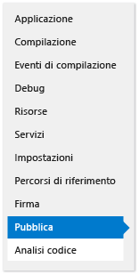
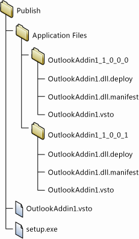
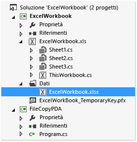
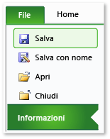
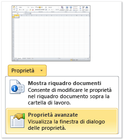
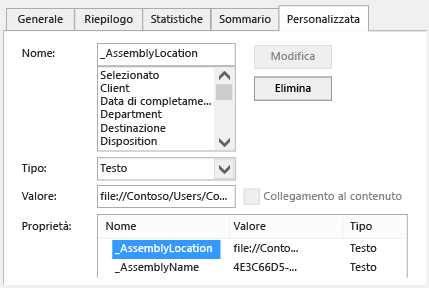

# Distribuzione di una soluzione Office utilizzando ClickOnce
  L'uso di ClickOnce consente di distribuire una soluzione Office in un minor numero di passaggi.  Eventuali aggiornamenti alla soluzione pubblicati vengono rilevati e installati automaticamente.  Tuttavia, ClickOnce richiede che la soluzione venga installata separatamente per ciascun utente di un computer.  Pertanto, se la soluzione sarà eseguita da più utenti nello stesso computer, si consiglia di usare Windows Installer \(MSI\).  
  
## Contenuto dell'argomento  
  
-   [Pubblicare la soluzione](#Publish)  
  
-   [Scegliere come si desidera concedere l'attendibilità alla soluzione](#Trust)  
  
-   [Aiutare gli utenti a installare la soluzione](#Helping)  
  
-   [Inserire il documento di una soluzione nel computer dell'utente finale (solo personalizzazioni a livello di documento)](#Put)  
  
-   [Inserire il documento di una soluzione in un server in cui è eseguito SharePoint (solo personalizzazioni a livello di documento)](#SharePoint)  
  
-   [Creare un programma di installazione personalizzato](#Custom)  
  
-   [Pubblicare un aggiornamento](#Update)  
  
-   [Modificare il percorso di installazione di una soluzione](#Location)  
  
-   [Eseguire il rollback di una soluzione a una versione precedente](#Roll)  
  
 Per altre informazioni su come distribuire una soluzione Office creando un file Windows Installer, vedere [Distribuzione di una soluzione Office tramite Windows Installer](../vsto/deploying-an-office-solution-by-using-windows-installer.md).  
  
##  <a name="Publish"></a> Pubblicare la soluzione  
 È possibile pubblicare la soluzione usando **Pubblicazione guidata** o **Progettazione progetti**.  In questa procedura sarà usato **Progettazione progetti** in quanto offre il set completo di opzioni per la pubblicazione.  Vedere [Pubblicazione guidata &#40;sviluppo per Office in Visual Studio&#41;](../vsto/publish-wizard-office-development-in-visual-studio.md).  
  
#### Per pubblicare la soluzione  
  
1.  In **Esplora soluzioni** scegliere il nodo con il nome del progetto.  
  
2.  Nella barra dei menu scegliere **Progetto**, *Proprietà***NomeProgetto**.  
  
3.  In **Progettazione progetti** scegliere la scheda **Pubblica**, illustrata nella figura seguente.  
  
       
  
4.  Nella casella **Posizione cartella di pubblicazione \(server FTP o percorso file\)** immettere il percorso della cartella in cui si vuole che vengano copiati i file della soluzione da **Progettazione progetti**.  
  
     È possibile fornire uno dei seguenti tipi di percorso.  
  
    -   Un percorso locale, ad esempio *C:\\FolderName\\FolderName*.  
  
    -   Un percorso UNC \(Uniform Naming Convention\) a una cartella sulla rete, ad esempio *\\\\ServerName\\FolderName*.  
  
    -   Un percorso relativo, ad esempio *PublishFolder\\*, ovvero la cartella in cui il progetto viene pubblicato per impostazione predefinita.  
  
5.  Nella casella **URL cartella di installazione** immettere il percorso completo della cartella in cui gli utenti finali troveranno la soluzione.  
  
     Se non si conosce ancora la posizione, lasciare vuoto questo campo.  Per impostazione predefinita, quando si usa ClickOnce, gli aggiornamenti vengono cercati nella cartella da cui gli utenti installano la soluzione.  
  
6.  Scegliere il pulsante **Prerequisiti**.  
  
7.  Nella finestra di dialogo **Prerequisiti** assicurarsi che la casella di controllo **Crea programma di installazione per installare componenti dei prerequisiti** sia selezionata.  
  
8.  Nell'elenco **Scegli i prerequisiti da installare** selezionare le caselle di controllo per **Windows Installer 4.5** e il package appropriato di .NET Framework.  
  
     Ad esempio, se la soluzione è destinata a [!INCLUDE[net_v45](../vsto/includes/net-v45-md.md)], selezionare le caselle di controllo per **Windows Installer 4.5** e **Microsoft .NET Framework 4.5 Full**.  
  
9. Se la soluzione è destinata a .NET Framework 4.5, selezionare anche la casella di controllo **Visual Studio 2010 Tools per Office Runtime**.  
  
    > [!NOTE]  
    >  Per impostazione predefinita, questa casella di controllo non viene visualizzata.  Per visualizzarla, è necessario creare un pacchetto di programma di avvio automatico.  Vedere l'articolo relativo alla [creazione di un pacchetto di programma di avvio automatico per un componente aggiuntivo di Office 2013 VSTO con Visual Studio 2012](http://blogs.msdn.com/b/vsto/archive/2012/12/21/creating-a-bootstrapper-package-for-an-office-2013-vsto-add-in-with-visual-studio-2012.aspx).  
  
10. In **Specificare il percorso di installazione dei prerequisiti** scegliere una delle opzioni visualizzate, quindi scegliere **OK**.  
  
     Nella tabella seguente viene descritta ciascuna opzione.  
  
    |Opzione|Descrizione|  
    |-------------|-----------------|  
    |**Scaricare i prerequisiti dal sito Web del fornitore del componente**|All'utente viene chiesto di scaricare e installare questi prerequisiti dal fornitore.|  
    |**Scaricare i prerequisiti dallo stesso percorso dell'applicazione**|Il software prerequisito viene installato insieme alla soluzione.  Se si seleziona questa opzione, tutti i pacchetti di prerequisiti vengono copiati automaticamente da Visual Studio nel percorso di pubblicazione.  Per il corretto funzionamento di questa opzione, i pacchetti di prerequisiti devono essere presenti nel computer di sviluppo.|  
    |**Scarica prerequisiti dal seguente percorso**|Tutti i pacchetti di prerequisiti vengono copiati da Visual Studio nella posizione specificata e vengono installati insieme alla soluzione.|  
  
     Vedere [Finestra di dialogo Prerequisiti](../ide/reference/prerequisites-dialog-box.md).  
  
11. Scegliere il pulsante **Aggiornamenti**, specificare la frequenza con cui dovrà essere verificata la presenza di aggiornamenti da parte del componente aggiuntivo VSTO o della personalizzazione di ogni utente finale, quindi scegliere **OK**.  
  
    > [!NOTE]  
    >  Se la distribuzione viene eseguita tramite un CD o un'unità rimovibile, selezionare l'opzione **Non controllare mai**.  
  
     Per informazioni su come pubblicare un aggiornamento, vedere [Pubblicare un aggiornamento](#Update).  
  
12. Scegliere il pulsante **Opzioni**, esaminare le opzioni nella finestra di dialogo **Opzioni** e scegliere **OK**.  
  
13. Scegliere il pulsante **Pubblica**.  
  
     Le cartelle e i file seguenti vengono aggiunti automaticamente da Visual Studio nella cartella di pubblicazione specificata precedentemente in questa procedura.  
  
    -   Cartella **File applicazione**.  
  
    -   Programma di installazione.  
  
    -   Manifesto di distribuzione che punta al manifesto di distribuzione della versione più recente.  
  
     La cartella **File applicazione** contiene una sottocartella per ogni versione che viene pubblicata.  Ogni sottocartella relativa a una versione specifica contiene i file indicati di seguito.  
  
    -   Un manifesto dell'applicazione.  
  
    -   Un manifesto di distribuzione.  
  
    -   Assembly di personalizzazione.  
  
     Nell'illustrazione seguente viene mostrata la struttura della cartella di pubblicazione di un componente aggiuntivo VSTO di Outlook.  
  
       
  
    > [!NOTE]  
    >  Con ClickOnce viene aggiunta l'estensione .deploy in coda agli assembly. In questo modo, un'installazione protetta di Internet Information Services \(IIS\) non bloccherà i file a causa di un'estensione non sicura.  Quando l'utente installa la soluzione, l'estensione .deploy viene automaticamente rimossa da ClickOnce.  
  
14. Copiare i file della soluzione nel percorso di installazione specificato precedentemente in questa procedura.  
  
##  <a name="Trust"></a> Scegliere come si desidera concedere l'attendibilità alla soluzione  
 Prima che una soluzione possa essere eseguita nei computer degli utenti, è necessario concedere l'attendibilità oppure gli utenti devono rispondere a una richiesta di attendibilità quando installano la soluzione.  Per concedere l'attendibilità alla soluzione, firmare i manifesti usando un certificato che identifichi un editore conosciuto e attendibile.  Vedere [Attendibili di soluzione la firma dei manifesti di applicazione e di distribuzione](../vsto/granting-trust-to-office-solutions.md#Signing).  
  
 Se si distribuisce una personalizzazione a livello di documento e si desidera inserire il documento in una cartella nel computer dell'utente o si desidera rendere il documento disponibile su un sito di SharePoint, assicurarsi che in Office la posizione del documento sia considerata attendibile.  Vedere [Concessione dell'attendibilità ai documenti](../vsto/granting-trust-to-documents.md).  
  
##  <a name="Helping"></a> Aiutare gli utenti a installare la soluzione  
 Gli utenti possono installare la soluzione eseguendo il programma di installazione, aprendo il manifesto di distribuzione oppure, nel caso di una personalizzazione a livello di documento, aprendo direttamente il documento.  Come procedura consigliata, gli utenti devono installare la soluzione usando il programma di installazione.  Gli altri due approcci non garantiscono l'installazione del software prerequisito.  Se gli utenti desiderano aprire il documento dal percorso di installazione, devono aggiungerlo all'elenco dei percorsi attendibili nel Centro protezione dell'applicazione di Office.  
  
### Apertura del documento di una personalizzazione a livello di documento  
 Gli utenti possono aprire il documento di una personalizzazione a livello di documento direttamente dal percorso di installazione oppure copiando il documento nei propri computer locali e aprendo quindi la copia.  
  
 Come procedura consigliata, gli utenti devono aprire una copia del documento nei computer locali per evitare che più utenti tentino di aprire la stessa copia contemporaneamente.  Per applicare questo approccio, è possibile configurare il programma di installazione in modo da copiare il documento nei computer degli utenti.  Vedere [Inserire il documento di una soluzione nel computer dell'utente finale (solo personalizzazioni a livello di documento)](#Put).  
  
### Installazione della soluzione tramite apertura del manifesto di distribuzione da un sito Web IIS  
 Gli utenti possono installare una soluzione Office aprendo il manifesto di distribuzione dal Web.  Tuttavia, un'installazione protetta di Internet Information Services \(IIS\) bloccherà i file con estensione .vsto.  Il tipo MIME deve essere definito in IIS prima di poter distribuire una soluzione Office tramite IIS.  
  
##### Per aggiungere il tipo MIME .vsto a IIS 6.0  
  
1.  Sul server in cui è eseguito IIS 6.0, scegliere **Start**, **Tutti i programmi**, **Strumenti di amministrazione**, quindi scegliere **Gestione Internet Information Services \(IIS\)**.  
  
2.  Scegliere il nome del computer, la cartella **Siti Web** o il sito Web che si sta configurando.  
  
3.  Nella barra dei menu scegliere **Azione**, **Proprietà**.  
  
4.  Nella scheda **Intestazioni HTTP** scegliere il pulsante **Tipi MIME**.  
  
5.  Nella finestra **Tipi MIME** scegliere il pulsante **Nuovo**.  
  
6.  Nella finestra **Tipo MIME** immettere **.vsto** come estensione, immettere **application\/x\-ms\-vsto** come tipo MIME, quindi applicare le nuove impostazioni.  
  
    > [!NOTE]  
    >  Per rendere effettive le modifiche è necessario riavviare il servizio Pubblicazione sul Web o attendere il riciclo del processo di lavoro.  Occorre a questo punto svuotare la cache del disco del browser e provare nuovamente ad aprire il file .vsto.  
  
##### Per aggiungere il tipo MIME .vsto a IIS 7,0  
  
1.  Nel server in cui è eseguito IIS 7.0, scegliere **Avvia**, **Tutti i programmi**, **Accessori**.  
  
2.  Aprire il menu di scelta rapida per **Prompt dei comandi**, quindi scegliere **Esegui come amministratore**.  
  
3.  Nella casella **Apri** immettere il percorso seguente, quindi scegliere **OK**.  
  
    ```  
    %windir%\system32\inetsrv   
    ```  
  
4.  Immettere il seguente comando, quindi applicare le nuove impostazioni.  
  
    ```  
    set config /section:staticContent /+[fileExtension='.vsto',mimeType='application/x-ms-vsto']  
    ```  
  
    > [!NOTE]  
    >  Per rendere effettive le modifiche è necessario riavviare il servizio Pubblicazione sul Web o attendere il riciclo del processo di lavoro.  Occorre a questo punto svuotare la cache del disco del browser e provare nuovamente ad aprire il file .vsto.  
  
##  <a name="Put"></a> Inserire il documento di una soluzione nel computer dell'utente finale \(solo personalizzazioni a livello di documento\)  
 È possibile copiare il documento della soluzione nel computer dell'utente finale creando un'azione post\-distribuzione.  In tal modo, l'utente non dovrà più copiare manualmente il documento dal percorso di installazione nel proprio computer dopo aver eseguito l'installazione della soluzione.  Sarà necessario creare una classe che definisca l'azione post\-distribuzione, compilare e pubblicare la soluzione, modificare il manifesto dell'applicazione e firmare nuovamente i manifesti di distribuzione e dell'applicazione.  
  
 Nelle procedure riportate di seguito si presuppone che il nome del progetto sia **ExcelWorkbook** e che la soluzione venga pubblicata nella directory **C:\\publish** nel computer locale.  
  
### Creare una classe che definisca l'azione post\-distribuzione  
  
1.  Nella barra dei menu scegliere **File**, **Aggiungi**, **Nuovo progetto**.  
  
2.  Nella finestra di dialogo **Aggiungi nuovo progetto**, nel riquadro **Modelli installati**, scegliere la cartella **Windows**.  
  
3.  Nel riquadro **Modelli** scegliere il modello **Libreria di classi**.  
  
4.  Nel campo **Nome** immettere **FileCopyPDA**, quindi scegliere **OK**.  
  
5.  In **Esplora soluzioni** scegliere il progetto **FileCopyPDA**.  
  
6.  Nella barra dei menu scegliere **Progetto**, **Aggiungi riferimento**.  
  
7.  Nella scheda **.NET** aggiungere i riferimenti a Microsoft.VisualStudio.Tools.Applications.Runtime e Microsoft.VisualStudio.Tools.Applications.ServerDocument.  
  
8.  Rinominare la classe in `FileCopyPDA`, quindi sostituire il contenuto del file con il codice.  Mediante il codice vengono effettuate le seguenti attività:  
  
    -   Copia del documento sul desktop dell'utente.  
  
    -   Modifica della proprietà \_AssemblyLocation da un percorso relativo a un percorso completo per il manifesto di distribuzione.  
  
    -   Eliminazione del file se l'utente disinstalla la soluzione.  
  
     [!code-csharp[Trin_ExcelWorkbookPDA#7](../snippets/csharp/VS_Snippets_OfficeSP/trin_excelworkbookpda/cs/filecopypda/class1.cs#7)]
     [!code-vb[Trin_ExcelWorkbookPDA#7](../snippets/visualbasic/VS_Snippets_OfficeSP/trin_excelworkbookpda/vb/filecopypda/class1.vb#7)]  
  
### Compilare e pubblicare la soluzione  
  
1.  In **Esplora soluzioni** aprire il menu di scelta rapida per il progetto **FileCopyPDA**, quindi scegliere **Compila**.  
  
2.  Aprire il menu di scelta rapida per il progetto **ExcelWorkbook**, quindi scegliere **Compila**.  
  
3.  Aprire il menu di scelta rapida per il progetto **ExcelWorkbook**, quindi scegliere **Aggiungi riferimento**.  
  
4.  Nella finestra di dialogo **Aggiungi riferimento** scegliere la scheda **Progetti**, scegliere **FileCopyPDA**, quindi scegliere **OK**.  
  
5.  In **Esplora soluzioni** scegliere il progetto **ExcelWorkbook**.  
  
6.  Nella barra dei menu scegliere **Progetto**, **Nuova cartella**.  
  
7.  Immettere i dati e premere INVIO.  
  
8.  In **Esplora soluzioni** scegliere la cartella **Dati**.  
  
9. Nella barra dei menu scegliere **Progetto**, **Aggiungi elemento esistente**.  
  
10. Nella finestra di dialogo **Aggiungi elemento esistente** passare alla directory di output del progetto **ExcelWorkbook**, scegliere il file **ExcelWorkbook.xlsx**, quindi scegliere **Aggiungi**.  
  
11. In **Esplora soluzioni** scegliere il file **ExcelWorkbook.xlsx**.  
  
12. Nella finestra **Proprietà** impostare la proprietà **Operazione di compilazione** su **Contenuto** e la proprietà **Copia in directory di output** su **Copia se più recente**.  
  
     Una volta completata questa procedura, il progetto avrà un aspetto simile alla figura seguente.  
  
       
  
13. Pubblicare il progetto **ExcelWorkbook**.  
  
### Modificare il manifesto dell'applicazione  
  
1.  Aprire la directory **c:\\publish** tramite **Esplora file**.  
  
2.  Aprire la cartella **File applicazione** quindi aprire la cartella corrispondente alla versione pubblicata più recente della soluzione.  
  
3.  Aprire il file **ExcelWorkbook.dll.manifest** in un editor di testo, ad esempio il Blocco note.  
  
4.  Dopo l'elemento `</vstav3:update>` aggiungere il codice seguente.  Per l'attributo di classe dell'elemento `<vstav3:entryPoint>` usare la sintassi seguente: *NamespaceName.ClassName*.  Nell'esempio riportato di seguito il nome dello spazio dei nomi è uguale a quello della classe. Pertanto, il nome del punto di ingresso risultante è `FileCopyPDA.FileCopyPDA`.  
  
    ```  
    <vstav3:postActions>  
      <vstav3:postAction>  
        <vstav3:entryPoint  
          class="FileCopyPDA.FileCopyPDA">  
          <assemblyIdentity  
            name="FileCopyPDA"  
            version="1.0.0.0"  
            language="neutral"  
            processorArchitecture="msil" />  
        </vstav3:entryPoint>  
        <vstav3:postActionData>  
        </vstav3:postActionData>  
      </vstav3:postAction>  
    </vstav3:postActions>  
    ```  
  
### Firmare nuovamente i manifesti dell'applicazione e di distribuzione  
  
1.  Nel percorso **%USERPROFILE%\\Documents\\Visual Studio 2013\\Projects\\ExcelWorkbook\\ExcelWorkbook** copiare il file di certificato **ExcelWorkbook\_TemporaryKey.pfx**, quindi incollarlo nella cartella *PublishFolder* **\\Application Files\\ExcelWorkbook***MostRecentPublishedVersion*  
  
2.  Aprire il prompt dei comandi di Visual Studio e cambiare directory fino alla cartella **c:\\publish\\Application Files\\ExcelWorkbook***MostRecentPublishedVersion* \(ad esempio, **c:\\publish\\Application Files\\ExcelWorkbook\_1\_0\_0\_4**\).  
  
3.  Firmare il manifesto dell'applicazione modificato usando il comando seguente:  
  
    ```  
    mage -sign ExcelWorkbook.dll.manifest -certfile ExcelWorkbook_TemporaryKey.pfx  
    ```  
  
     Verrà visualizzato il messaggio "ExcelWorkbook.dll.manifest firmato correttamente".  
  
4.  Passare alla cartella **c:\\publish**, quindi aggiornare e firmare il manifesto di distribuzione usando il comando seguente:  
  
    ```  
    mage -update ExcelWorkbook.vsto -appmanifest "Application Files\Ex  
    celWorkbookMostRecentVersionNumber>\ExcelWorkbook.dll.manifest" -certfile "Application Files\ExcelWorkbookMostRecentVersionNumber>\ExcelWorkbook_TemporaryKey.pfx"  
    ```  
  
    > [!NOTE]  
    >  Nell'esempio precedente, sostituire MostRecentVersionNumber con il numero di versione della versione pubblicata più di recente della soluzione \(ad esempio, **1\_0\_0\_4**\).  
  
     Verrà visualizzato il messaggio "ExcelWorkbook.vsto firmato correttamente".  
  
5.  Copiare il file ExcelWorkbook.vsto nella directory **c:\\publish\\Application Files\\ExcelWorkbook***MostRecentVersionNumber*.  
  
##  <a name="SharePoint"></a> Inserire il documento di una soluzione in un server in cui è eseguito SharePoint \(solo personalizzazioni a livello di documento\)  
 È possibile pubblicare la personalizzazione a livello di documento agli utenti finali tramite SharePoint.  Quando gli utenti visitano il sito di SharePoint e aprono il documento, la soluzione viene automaticamente installata dalla cartella di rete condivisa nei computer locali degli utenti.  Una volta che la soluzione è installata localmente, la personalizzazione continuerà a essere valida anche se il documento viene copiato in un'altra posizione, ad esempio sul desktop.  
  
#### Per inserire il documento in un server in cui è eseguito SharePoint  
  
1.  Aggiungere il documento della soluzione a una raccolta documenti su un sito di SharePoint.  
  
2.  Effettuare i passaggi per uno degli approcci indicati di seguito:  
  
    -   Usare lo strumento di configurazione di Office per aggiungere il server in cui è eseguito SharePoint al Centro protezione in Word o Excel in tutti i computer degli utenti.  
  
         Vedere [Criteri e impostazioni di sicurezza di Office 2010](http://go.microsoft.com/fwlink/?LinkId=99227).  
  
    -   Assicurarsi che ogni utente esegua i passaggi indicati di seguito.  
  
        1.  Nel computer locale, aprire Word o Excel, scegliere la scheda **File**, quindi scegliere il pulsante **Opzioni**.  
  
        2.  Nella finestra di dialogo **Centro protezione** scegliere il pulsante **Percorsi attendibili**.  
  
        3.  Selezionare la casella di controllo **Consenti percorsi attendibili di questa rete \(scelta non consigliata\)** quindi scegliere il pulsante **Aggiungi nuovo percorso**.  
  
        4.  Nella casella **Percorso** immettere l'URL della raccolta di documenti di SharePoint contenente il documento precedentemente caricato, ad esempio *http:\/\/SharePointServerName\/TeamName\/ProjectName\/DocumentLibraryName*.  
  
             Non aggiungere il nome della pagina Web predefinita, ad esempio default.aspx o AllItems.aspx.  
  
        5.  Selezionare la casella di controllo **Considera attendibili anche le sottocartelle di questo percorso**, quindi scegliere **OK**.  
  
             Nel momento in cui gli utenti aprono il documento dal sito di SharePoint, il documento viene aperto e la personalizzazione viene installata.  Gli utenti possono copiare il documento sul proprio desktop.  L'esecuzione della personalizzazione continuerà perché le proprietà nel documento puntano al percorso di rete del documento.  
  
##  <a name="Custom"></a> Creare un programma di installazione personalizzato  
 È possibile creare un programma di installazione personalizzato per la soluzione Office, anziché usare il programma di installazione già presente quando si pubblica la soluzione.  Ad esempio, è possibile usare uno script di accesso per avviare l'installazione oppure usare un file batch per installare la soluzione senza alcuna interazione da parte dell'utente.  Questi scenari offrono i risultati migliori se i prerequisiti sono già installati nei computer degli utenti finali.  
  
 Come parte del processo di installazione personalizzato, chiamare lo strumento del programma di installazione delle soluzioni Office \(VSTOInstaller.exe\). Per impostazione predefinita, lo strumento è installato nel percorso seguente:  
  
 %commonprogramfiles%\\microsoft shared\\VSTO\\10.0\\VSTOInstaller.exe  
  
 Se lo strumento non si trova in questa posizione, è possibile usare la chiave del Registro di sistema HKEY\_LOCAL\_MACHINE\\SOFTWARE\\Microsoft\\VSTO Runtime Setup\\v4\\InstallerPath o HKEY\_LOCAL\_MACHINE\\SOFTWARE\\Wow6432Node\\Microsoft\\VSTO Runtime Setup\\v4\\InstallerPath per individuare il percorso dello strumento.  
  
 È possibile usare i seguenti parametri con VSTOinstaller.exe.  
  
|Parametro|Definizione|  
|---------------|-----------------|  
|\/Install o \/I|Installa la soluzione.  È necessario seguire questa opzione con il percorso di un manifesto di distribuzione.  È possibile specificare un percorso sul computer locale o di una condivisione file UNC \(Universal Naming Convention\).  È possibile specificare un percorso locale \(*C:\\FolderName\\PublishFolder*\), un percorso relativo \(*Publish\\*\) o un percorso completo \(*\\\\ServerName\\FolderName* o http:\/\/*ServerName\/FolderName*\).|  
|\/Uninstall o \/U|Disinstalla la soluzione.  È necessario seguire questa opzione con il percorso di un manifesto di distribuzione.  È possibile specificare che un percorso che può essere nel computer locale o in una condivisione file UNC.  È possibile specificare un percorso locale \(*C:\\FolderName\\PublishFolder*\), un percorso relativo \(*Publish\\*\) o un percorso completo \(*\\\\ServerName\\FolderName* o http:\/\/*ServerName\/FolderName*\).|  
|\/Silent o \/S|Installa o disinstalla senza richiedere input da parte dell'utente o visualizzare un messaggio.  Se è necessaria la richiesta di attendibilità, la personalizzazione non viene installata o aggiornata.|  
|\/Help o \/?|Visualizza le informazioni della Guida.|  
  
 Durante l'esecuzione di VSTOinstaller.exe è possibile che vengano visualizzati i seguenti codici di errore.  
  
|Codice di errore|Definizione|  
|----------------------|-----------------|  
|0|La soluzione è stata installata o disinstallata correttamente oppure è stata visualizzata la Guida di VSTOInstaller.|  
|\-100|Una o più opzioni della riga di comando non sono valide o sono state impostate più volte.  Per altre informazioni, immettere "vstoinstaller \/?" oppure vedere [Creazione di un programma di installazione personalizzato per una soluzione Office ClickOnce](http://msdn.microsoft.com/it-it/3e5887ed-155f-485d-b8f6-3c02c074085e).|  
|\-101|Una o più opzioni della riga di comando non sono valide.  Per altre informazioni, immettere "vstoinstaller \/?".|  
|\-200|L'URI del manifesto di distribuzione non è valido.  Per altre informazioni, immettere "vstoinstaller \/?".|  
|\-201|Impossibile installare la soluzione perché il manifesto di distribuzione non è valido.  Vedere [Manifesti di distribuzione per le soluzioni Office](../vsto/deployment-manifests-for-office-solutions.md).|  
|\-202|Impossibile installare la soluzione perché la sezione relativa a Visual Studio Tools per Office del manifesto dell'applicazione non è valida.  Vedere [Manifesti di applicazione per le soluzioni Office](../vsto/application-manifests-for-office-solutions.md).|  
|\-203|Impossibile installare la soluzione a causa di un errore di download.  Controllare l'URI o il percorso del file di rete del manifesto di distribuzione, quindi provare di nuovo.|  
|\-300|Impossibile installare la soluzione a causa di un'eccezione di sicurezza.  Vedere [Sicurezza delle soluzioni Office](../vsto/securing-office-solutions.md).|  
|\-400|Impossibile installare la soluzione.|  
|\-401|Impossibile disinstallare la soluzione.|  
|\-500|L'operazione è stata annullata perché non è stato possibile installare o disinstallare la soluzione o scaricare il manifesto di distribuzione.|  
  
##  <a name="Update"></a> Pubblicare un aggiornamento  
 Per aggiornare una soluzione, occorre pubblicarla nuovamente usando **Progettazione progetti** o **Pubblicazione guidata** e successivamente copiare la soluzione aggiornata nel percorso di installazione.  Quando si copiano i file nel percorso di installazione, assicurarsi di sovrascrivere i file precedenti.  
  
 La volta successiva che la soluzione controllerà la disponibilità di un aggiornamento, la nuova versione verrà rilevata e caricata automaticamente.  
  
##  <a name="Location"></a> Modificare il percorso di installazione di una soluzione  
 È possibile aggiungere o modificare il percorso di installazione dopo la pubblicazione di una soluzione.  È possibile che si desideri modificare il percorso di installazione per uno o più dei seguenti motivi:  
  
-   Il percorso di installazione non era noto quando il programma di installazione è stato compilato.  
  
-   I file della soluzione sono stati copiati in un percorso diverso.  
  
-   Il server che ospita i file di installazione ha un nome o un percorso nuovo.  
  
 Per modificare il percorso di installazione di una soluzione, è necessario aggiornare il programma di installazione e successivamente gli utenti devono eseguirlo.  Per le personalizzazioni a livello di documento, gli utenti devono aggiornare anche una proprietà nel proprio documento in modo che punti al nuovo percorso.  
  
> [!NOTE]  
>  Se non si desidera chiedere agli utenti di aggiornare le proprietà del documento, è possibile chiedere loro di copiare il documento aggiornato dal percorso di installazione.  
  
#### Per modificare il percorso di installazione nel programma di installazione  
  
1.  Aprire la finestra **Prompt dei comandi** e cambiare le directory fino alla cartella di installazione.  
  
2.  Eseguire il programma di installazione e includere il parametro `/url`, che assumerà come stringa il nuovo percorso di installazione.  
  
     Nell'esempio seguente viene illustrato come modificare il percorso di installazione in un percorso sul sito Web di Fabrikam, ma è possibile sostituire tale URL con il percorso desiderato:  
  
    ```  
    setup.exe /url="http://www.fabrikam.com/newlocation"  
    ```  
  
    > [!NOTE]  
    >  Se viene visualizzato un messaggio per segnalare che la firma dell'eseguibile sarà invalidata, il certificato usato per firmare la soluzione non è più valido e l'editore è sconosciuto.  Di conseguenza, gli utenti dovranno confermare l'attendibilità dell'origine della soluzione prima di poterla installare.  
  
    > [!NOTE]  
    >  Per visualizzare il valore corrente dell'URL, eseguire `setup.exe /url`.  
  
 Per le personalizzazioni a livello di documento, gli utenti devono aprire il documento e aggiornare la proprietà \_AssemblyLocation.  Di seguito viene descritta la procedura che gli utenti devono seguire per effettuare questa operazione.  
  
#### Per aggiornare la proprietà \_AssemblyLocation in un documento  
  
1.  Nella scheda **File** scegliere **Informazioni**, come illustrato di seguito.  
  
       
  
2.  Nell'elenco **Proprietà** scegliere **Proprietà avanzate**, come illustrato di seguito.  
  
       
  
3.  Nella scheda **Personalizzato** dell'elenco **Proprietà** scegliere \_AssemblyLocation, come illustrato di seguito.  
  
       
  
     La casella **Valore** contiene l'identificatore del manifesto di distribuzione.  
  
4.  Prima dell'identificatore immettere il percorso completo del documento seguito da una barra, nel formato *Path* |*Identifier* \(ad esempio, *File:\/\/ServerName\/FolderName\/FileName|74744e4b\-e4d6\-41eb\-84f7\-ad20346fe2d9*.  
  
     Per altre informazioni sul formato dell'identificatore, vedere [Cenni preliminari sulle proprietà personalizzate dei documenti](../vsto/custom-document-properties-overview.md).  
  
5.  Scegliere **OK**, quindi salvare e chiudere il documento.  
  
6.  Eseguire il programma di installazione senza il parametro \/url per installare la soluzione nel percorso specificato.  
  
##  <a name="Roll"></a> Eseguire il rollback di una soluzione a una versione precedente  
 Eseguire il rollback di una soluzione significa riportare gli utenti a una versione precedente di tale soluzione.  
  
#### Per eseguire il rollback di una soluzione  
  
1.  Aprire il percorso di installazione della soluzione.  
  
2.  Nella cartella di pubblicazione di primo livello, eliminare il manifesto di distribuzione \(ovvero il file con estensione VSTO\).  
  
3.  Individuare la sottocartella della versione che si desidera ripristinare.  
  
4.  Copiare il manifesto di distribuzione da tale sottocartella alla cartella di pubblicazione di primo livello.  
  
     Ad esempio, per eseguire il rollback di una soluzione denominata **OutlookAddIn1** dalla versione 1.0.0.1 alla versione 1.0.0.0, copiare il file **OutlookAddIn1.vsto** dalla cartella **OutlookAddIn1\_1\_0\_0\_0**.  Incollare il file nella cartella di pubblicazione di primo livello, sovrascrivendo il manifesto di distribuzione specifico della versione per **OutlookAddIn1\_1\_0\_0\_1** che era già presente.  
  
     Nell'illustrazione seguente viene mostrata la struttura della cartella di pubblicazione di questo esempio.  
  
       
  
     Alla successiva apertura del documento personalizzato o dell'applicazione da parte dell'utente, verrà rilevata la modifica al manifesto di distribuzione.  La versione precedente della soluzione Office viene eseguita dalla cache ClickOnce.  
  
> [!NOTE]  
>  I dati locali vengono salvati soltanto per una versione precedente di una soluzione.  Se si esegue il rollback di due versioni, i dati locali non vengono conservati.  Per altre informazioni sui dati locali, vedere [Accesso a dati locali e remoti in applicazioni ClickOnce](../deployment/accessing-local-and-remote-data-in-clickonce-applications.md).  
  
## Vedere anche  
 [Distribuzione di una soluzione Office](../vsto/deploying-an-office-solution.md)   
 [Pubblicazione di soluzioni Office](../vsto/deploying-an-office-solution-by-using-clickonce.md)   
 [Procedura: pubblicare una soluzione Office utilizzando ClickOnce](http://msdn.microsoft.com/it-it/2b6c247e-bc04-4ce4-bb64-c4e79bb3d5b8)   
 [Procedura: installare una soluzione Office ClickOnce](http://msdn.microsoft.com/it-it/14702f48-9161-4190-994c-78211fe18065)   
 [Procedura: pubblicare una soluzione Office a livello di documento in un server SharePoint tramite ClickOnce](http://msdn.microsoft.com/it-it/2408e809-fb78-42a1-9152-00afa1522e58)   
 [Creazione di un programma di installazione personalizzato per una soluzione Office ClickOnce](http://msdn.microsoft.com/it-it/3e5887ed-155f-485d-b8f6-3c02c074085e)  
  
  