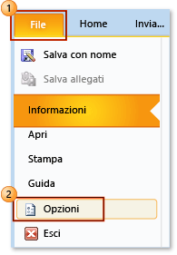
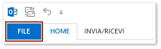
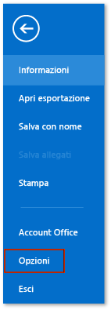
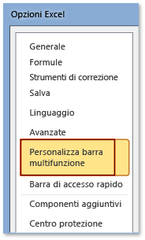
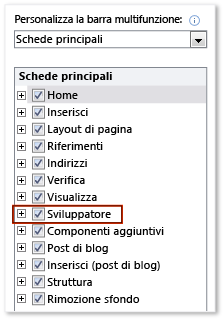

# Procedura: visualizzare la scheda Sviluppo nella barra multifunzione
  Per l'accesso di **Developer** scheda della barra multifunzione di un'applicazione di Office, è necessario configurare in modo da visualizzare tale scheda, appare per impostazione predefinita. Ad esempio, è necessario visualizzare tale scheda per aggiungere un oggetto <xref:Microsoft.Office.Tools.Word.GroupContentControl> a una personalizzazione a livello di documento per Word.  
  
> [!NOTE]  
>  Questo materiale sussidiario si applica solo alle applicazioni di Office 2010 o versioni successive. Se si desidera visualizzare questa scheda in Microsoft Office System 2007, vedere la seguente versione di questo argomento [procedura: visualizzare la scheda sviluppatore nella barra multifunzione](http://msdn.microsoft.com/library/bb608625(v=vs.90).aspx).  
  
 [!INCLUDE[appliesto_ribbon](../vsto/includes/appliesto-ribbon-md.md)]  
  
> [!NOTE]  
>  Access non ha un **Developer** scheda.  
  
### Per visualizzare la scheda Sviluppo  
  
1.  Avviare un'applicazione Office supportata da questo argomento. Vedere il **si applica a:** nota in precedenza in questo argomento.  
  
2.  Nel **File** scheda, scegliere il **opzioni** pulsante.  
  
     La figura seguente mostra il **File** scheda e **opzioni** pulsante in Office 2010.  
  
       
  
     La figura seguente mostra il **File** scheda in Office 2013.  
  
       
  
     La figura seguente mostra il **opzioni** pulsante in Office 2013.  
  
       
  
3.  Nel *ApplicationName***opzioni** finestra di dialogo scegliere la **Personalizzazione barra multifunzione** pulsante.  
  
     La figura seguente mostra il **opzioni** la finestra di dialogo e **Personalizzazione barra multifunzione** pulsante in Excel 2010. La posizione di questo pulsante è simile in tutte le altre applicazioni elencate nella sezione "Applica a" quasi all'inizio di questo argomento.  
  
       
  
4.  Nell'elenco di schede principali selezionare la **Developer** casella di controllo.  
  
     La figura seguente mostra il **Developer** casella di controllo in Word 2010 e [!INCLUDE[Word_15_short](../vsto/includes/word-15-short-md.md)]. La posizione di questa casella di controllo è simile in tutte le altre applicazioni elencate nella sezione "Si applica a" quasi all'inizio di questo argomento.  
  
       
  
5.  Scegliere il **OK** per chiudere la **opzioni** la finestra di dialogo.  
  
## Vedere anche  
 [Personalizzazione dell'interfaccia utente di Office](../vsto/office-ui-customization.md)  
  
  