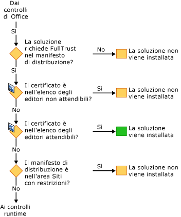

# Sicurezza delle soluzioni Office
  Il modello di sicurezza per le soluzioni Office comprende diverse tecnologie: [!INCLUDE[vsto_runtime](../vsto/includes/vsto-runtime-md.md)], [!INCLUDE[ndptecclick](../vsto/includes/ndptecclick-md.md)], il Centro protezione di Microsoft Office e l'area dei siti con restrizioni di Internet Explorer. Le sezioni seguenti descrivono il funzionamento delle diverse funzionalità di sicurezza:  
  
-   [Concessione dell'attendibilità alle soluzioni Office](#GrantingTrustToSolutions)  
  
-   [Concessione dell'attendibilità ai documenti](#GrantingTrustToDocuments)  
  
-   [Concessione dell'attendibilità quando si usa Windows Installer](#GrantingTrustWindowsInstaller)  
  
-   [Considerazioni specifiche sulla sicurezza per le soluzioni Office](#Security)  
  
-   [Sicurezza durante lo sviluppo](#SecurityDuringDeployment)  
  
-   [Runtime di Visual Studio Tools per Office](#VisualStudioToolsForOfficeRuntime)  
  
 [!INCLUDE[appliesto_all](../vsto/includes/appliesto-all-md.md)]  
  
##   Concessione dell'attendibilità alle soluzioni Office  
 La concessione dell'attendibilità alle soluzioni Office prevede la modifica dei criteri di sicurezza di tutti gli utenti finali in modo che la soluzione Office venga considerata attendibile in base alla seguente evidenza:  
  
-   Il certificato usato per firmare il manifesto della distribuzione.  
  
-   L'URL del manifesto della distribuzione.  
  
 Per altre informazioni, vedere [Concessione dell'attendibilità alle soluzioni Office](../vsto/granting-trust-to-office-solutions.md).  
  
##   Concessione dell'attendibilità ai documenti  
 Una personalizzazione a livello di documento richiede che il documento si trovi in una directory progettata come percorso attendibile.  Per altre informazioni, vedere [Concessione dell'attendibilità ai documenti](../vsto/granting-trust-to-documents.md).  
  
##   Concessione dell'attendibilità quando si usa Windows Installer  
 È possibile usare Windows Installer per creare un file MSI per installare le soluzioni Office nella directory Programmi, che richiede diritti di amministratore.  Per le soluzioni Office nella directory Programmi, Runtime di Visual Studio Tools per Office 2010 considera le soluzioni Office come attendibili e non mostra la richiesta relativa all'attendibilità di ClickOnce.  
  
##   Considerazioni specifiche sulla sicurezza per le soluzioni Office  
 Le funzionalità di sicurezza fornite da [!INCLUDE[net_v40_short](../sharepoint/includes/net-v40-short-md.md)], [!INCLUDE[net_v45](../vsto/includes/net-v45-md.md)] e Microsoft Office possono contribuire alla protezione contro diverse possibili minacce alla sicurezza nelle soluzioni Office.  Per altre informazioni, vedere [Considerazioni specifiche sulla sicurezza per le soluzioni Office](../vsto/specific-security-considerations-for-office-solutions.md).  
  
##   Sicurezza durante lo sviluppo  
 Per semplificare il processo di sviluppo, Visual Studio imposta i criteri di sicurezza necessari per eseguire ed eseguire il debug della soluzione nel computer ogni volta che si compila un progetto.  In alcuni scenari, è necessario aggiungere altri passaggi di sicurezza per sviluppare il progetto.  
  
### Soluzioni a livello di documento  
 Il percorso completo di un documento deve essere aggiunto all'elenco di percorsi attendibili nell'applicazione Microsoft Office se si stanno sviluppando i seguenti tipi di progetti:  
  
-   Soluzioni a livello di documento che si trovano in una condivisione file di rete come *\\\\servername\\sharename*.  
  
-   Soluzioni a livello di documento per Word che usano file doc o docm.  
  
 Includere le sottodirectory quando si aggiunge il percorso del documento all'elenco di percorsi attendibili oppure includere le cartelle di debug e di compilazione specifiche.  Per altre informazioni, vedere l'articolo della guida di Microsoft Office Online [Creazione, rimozione o modifica di un percorso attendibile per i file](https://support.office.com/en-au/article/Create-remove-or-change-a-trusted-location-for-your-files-f5151879-25ea-4998-80a5-4208b3540a62).  
  
### Certificati temporanei  
 Se non è disponibile un certificato di firma, Visual Studio crea un certificato temporaneo.  Usare questo certificato temporaneo solo durante lo sviluppo e acquistare un certificato ufficiale per la distribuzione.  
  
 Il certificato temporaneo viene generato dopo la prima compilazione di un progetto Office.  Quando si preme di nuovo F5, il progetto viene ricompilato perché viene contrassegnato come modificato durante l'aggiunta del certificato.  
  
 Cancellare regolarmente i certificati temporanei poiché potrebbero accumularsi nel tempo.  
  
##   Runtime di Visual Studio Tools per Office  
 [!INCLUDE[vsto_runtime](../vsto/includes/vsto-runtime-md.md)] dispone di funzionalità per verificare l'identità dell'editore e le autorizzazioni concesse a una personalizzazione.  Verifica le autorizzazioni mediante una sequenza di controlli di sicurezza.  
  
### Sicurezza durante il caricamento della personalizzazione  
 Quando viene caricata una personalizzazione a livello di documento, [!INCLUDE[vsto_runtime](../vsto/includes/vsto-runtime-md.md)] verifica sempre se il documento si trova nell'elenco di percorsi attendibili.  Inoltre, il runtime controlla se la soluzione richiede FullTrust nel manifesto dell'applicazione. Non esegue controlli di sicurezza aggiuntivi durante il caricamento della personalizzazione.  
  
### Sequenza di controlli di sicurezza durante l'installazione  
 Quando una soluzione Office viene installata o aggiornata, [!INCLUDE[vsto_runtime](../vsto/includes/vsto-runtime-md.md)] esegue un set di controlli di sicurezza in una sequenza specifica per prendere una decisione di attendibilità.  Una soluzione viene installata o aggiornata solo se il runtime ne determina l'attendibilità.  
  
 È possibile avviare il processo di installazione in uno dei seguenti quattro modi: eseguendo il programma di installazione, aprendo il manifesto della distribuzione, aprendo l'host applicazioni di Microsoft Office o eseguendo VSTOInstaller.exe.  
  
 Il primo controllo di sicurezza si applica solo alle soluzioni a livello di documento.  Il documento di una soluzione a livello di documento deve trovarsi in un percorso attendibile.  Se il documento si trova in una condivisione file di rete remota oppure ha un'estensione di file doc o docm, il percorso del documento deve essere aggiunto all'elenco di percorsi attendibili.  Per altre informazioni, vedere [Concessione dell'attendibilità ai documenti](../vsto/granting-trust-to-documents.md).  
  
   
  
 Il set di controlli di sicurezza successivo è quello di [!INCLUDE[vsto_runtime](../vsto/includes/vsto-runtime-md.md)] e ClickOnce.  Per superare questi controlli, le soluzioni Office devono richiedere le autorizzazioni FullTrust, essere firmate da un certificato non compreso nell'elenco degli editori non attendibili e trovarsi in un percorso non incluso nell'area con restrizioni di Internet Explorer.  Se il certificato si trova nell'elenco degli editori attendibili, la soluzione viene installata immediatamente.  In caso contrario, se ha superato i controlli, la soluzione continua con l'ultimo set di controlli.  
  
   
  
 Se la richiesta relativa all'attendibilità di [!INCLUDE[ndptecclick](../vsto/includes/ndptecclick-md.md)] è consentita e non è stata ancora concessa l'attendibilità alla soluzione, il runtime consente all'utente finale di prendere la decisione di attendibilità.  Se l'utente concede l'attendibilità alla soluzione, viene aggiunta una voce all'elenco di inclusione dell'utente.  Tutte le soluzioni nell'elenco di inclusione dell'utente hanno l'attendibilità totale e possono essere installate ed eseguite.  
  
 A partire da Visual Studio 2010, l'elenco di inclusione viene ignorato se la soluzione Office viene installata usando Windows Installer \(MSI\) nella directory Programmi.  Per altre informazioni, vedere [Concessione dell'attendibilità alle soluzioni Office mediante gli elenchi di inclusione](../vsto/trusting-office-solutions-by-using-inclusion-lists.md).  
  
   
  
## Vedere anche  
 [Concessione dell'attendibilità alle soluzioni Office](../vsto/granting-trust-to-office-solutions.md)   
 [Concessione dell'attendibilità ai documenti](../vsto/granting-trust-to-documents.md)   
 [Concessione dell'attendibilità alle soluzioni Office mediante gli elenchi di inclusione](../vsto/trusting-office-solutions-by-using-inclusion-lists.md)   
 [Procedura: configurare la sicurezza dell'elenco di inclusione](../vsto/how-to-configure-inclusion-list-security.md)   
 [Procedura: firmare soluzioni Office](../vsto/how-to-sign-office-solutions.md)   
 [Risoluzione dei problemi relativi alla sicurezza delle soluzioni Office](../vsto/troubleshooting-office-solution-security.md)   
 [Manifesti di applicazione per le soluzioni Office](../vsto/application-manifests-for-office-solutions.md)   
 [Manifesti di distribuzione per le soluzioni Office](../vsto/deployment-manifests-for-office-solutions.md)   
 [ClickOnce Reference](../deployment/clickonce-reference.md)   
 [Distribuzione di una soluzione Office](../vsto/deploying-an-office-solution.md)  
  
  