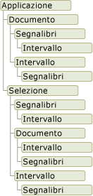

# Panoramica del modello a oggetti di Word
  Quando si sviluppano soluzioni Word in Visual Studio, si interagisce con il modello a oggetti di Word. Questo modello a oggetti è costituito da classi e interfacce fornite nell'assembly di interoperabilità primario per Word ed è definito nello spazio dei nomi <xref:Microsoft.Office.Interop.Word>.  
  
 [!INCLUDE[appliesto_wdalldocapp](../vsto/includes/appliesto-wdalldocapp-md.md)]  
  
 In questo argomento viene fornita una breve panoramica del modello a oggetti di Word. Per risorse contenenti altre informazioni sull'intero modello a oggetti di Word, vedere [Uso della documentazione sul modello a oggetti di Word](#WordOMDocumentation).  
  
 Per informazioni sull'uso del modello a oggetti di Word per eseguire attività specifiche, vedere gli argomenti seguenti:  
  
-   [Utilizzo dei documenti](../vsto/working-with-documents.md)  
  
-   [Utilizzo del testo nei documenti](../vsto/working-with-text-in-documents.md)  
  
-   [Uso delle tabelle](../vsto/working-with-tables.md)  
  
##   Informazioni sul modello a oggetti di Word  
 In Word sono disponibili centinaia di oggetti con cui interagire. Questi oggetti sono organizzati in una gerarchia che corrisponde strettamente all'interfaccia utente. All'inizio della gerarchia vi è l'oggetto <xref:Microsoft.Office.Interop.Word.Application>. Questo oggetto rappresenta l'istanza corrente di Word. L'oggetto <xref:Microsoft.Office.Interop.Word.Application> contiene gli oggetti <xref:Microsoft.Office.Interop.Word.Document>, <xref:Microsoft.Office.Interop.Word.Selection>, <xref:Microsoft.Office.Interop.Word.Bookmark> e <xref:Microsoft.Office.Interop.Word.Range>. Ciascuno di questi oggetti dispone di numerosi metodi e proprietà che è possibile modificare e usare con l'oggetto.  
  
 La figura seguente mostra una visualizzazione di questi oggetti nella gerarchia del modello a oggetti di Word.  
  
   
  
 A prima vista, gli oggetti sembrano essere sovrapposti. Ad esempio, gli oggetti <xref:Microsoft.Office.Interop.Word.Document>e <xref:Microsoft.Office.Interop.Word.Selection> sono entrambi membri dell'oggetto <xref:Microsoft.Office.Interop.Word.Application>, ma l'oggetto <xref:Microsoft.Office.Interop.Word.Document> è anche membro dell'oggetto <xref:Microsoft.Office.Interop.Word.Selection>. Entrambi gli oggetti <xref:Microsoft.Office.Interop.Word.Document> e <xref:Microsoft.Office.Interop.Word.Selection> contengono oggetti <xref:Microsoft.Office.Interop.Word.Bookmark> e <xref:Microsoft.Office.Interop.Word.Range>. La sovrapposizione esiste in quanto sono disponibili diversi modi per accedere allo stesso tipo di oggetto. Ad esempio, si applica la formattazione a un oggetto <xref:Microsoft.Office.Interop.Word.Range>, ma è possibile accedere all'intervallo della selezione corrente, di un particolare paragrafo, di una sezione o dell'intero documento.  
  
 Le sezioni riportate di seguito forniscono una breve descrizione degli oggetti di livello superiore e della loro reciproca interazione. Tali oggetti comprendono i cinque seguenti:  
  
-   Oggetto Application  
  
-   Oggetto Document  
  
-   Oggetto Selection  
  
-   Oggetto Range  
  
-   Oggetto Bookmark  
  
 Oltre al modello a oggetti di Word, i progetti di Office in Visual Studio forniscono *elementi host* e *controlli host* che estendono alcuni oggetti nel modello a oggetti di Word. Gli elementi e i controlli host si comportano come gli oggetti di Word che vengono estesi, ma dispongono anche di funzionalità aggiuntive, ad esempio funzionalità di data binding ed eventi aggiuntivi. Per altre informazioni, vedere [Automazione di Word usando oggetti estesi](../vsto/automating-word-by-using-extended-objects.md) e [Panoramica degli elementi e dei controlli host](../vsto/host-items-and-host-controls-overview.md).  
  
### Oggetto Application  
 L'oggetto <xref:Microsoft.Office.Interop.Word.Application> rappresenta l'applicazione Word e costituisce l'elemento padre di tutti gli altri oggetti.  I membri vengono in genere applicati a Word nel suo complesso. È possibile usare le proprietà e i metodi di questo oggetto per controllare l'ambiente Word.  
  
 Nei progetti di componente aggiuntivo VSTO è possibile accedere all'oggetto <xref:Microsoft.Office.Interop.Word.Application> usando il campo `Application` della classe `ThisAddIn`. Per altre informazioni, vedere [Programmazione di componenti aggiuntivi VSTO](../vsto/programming-vsto-add-ins.md).  
  
 Nei progetti a livello di documento è possibile accedere all'oggetto <xref:Microsoft.Office.Interop.Word.Application> usando la proprietà <xref:Microsoft.Office.Tools.Word.Document.Application%2A> della classe `ThisDocument`.  
  
### Oggetto Document  
 L'oggetto <xref:Microsoft.Office.Interop.Word.Document> svolge un ruolo centrale nell'ambito della programmazione di Word. Rappresenta un documento e tutto il relativo contenuto. Quando si apre un documento o se ne crea uno nuovo, viene creato un nuovo oggetto <xref:Microsoft.Office.Interop.Word.Document>, che viene aggiunto alla raccolta <xref:Microsoft.Office.Interop.Word.Documents> dell'oggetto <xref:Microsoft.Office.Interop.Word.Application>. Il documento con lo stato attivo è definito documento attivo. È rappresentato dalla proprietà <xref:Microsoft.Office.Interop.Word._Application.ActiveDocument%2A> dell'oggetto <xref:Microsoft.Office.Interop.Word.Application>.  
  
 Gli strumenti di sviluppo di Office in Visual Studio estendono l'oggetto <xref:Microsoft.Office.Interop.Word.Document> fornendo il tipo <xref:Microsoft.Office.Tools.Word.Document>. Questo tipo è un *elemento host* che consente di accedere a tutte le funzionalità di un oggetto <xref:Microsoft.Office.Interop.Word.Document>, che aggiunge eventi aggiuntivi e che offre la possibilità di aggiungere controlli gestiti.  
  
 Quando si crea un progetto a livello di documento, è possibile accedere ai membri <xref:Microsoft.Office.Tools.Word.Document> tramite la classe `ThisDocument` generata nel progetto. È possibile accedere ai membri dell'elemento host <xref:Microsoft.Office.Tools.Word.Document> usando le parole chiave **Me** o **this** del codice della classe `ThisDocument` oppure usando l'oggetto `Globals.ThisDocument` del codice esterno alla classe `ThisDocument`. Per altre informazioni, vedere [Programmazione delle personalizzazioni a livello di documento](../vsto/programming-document-level-customizations.md). Ad esempio, per selezionare il primo paragrafo del documento, usare il codice seguente.  
  
 [!code-csharp[Trin_VstcoreWordAutomation#120](../snippets/csharp/VS_Snippets_OfficeSP/Trin_VstcoreWordAutomation/CS/ThisDocument.cs#120)]
 [!code-vb[Trin_VstcoreWordAutomation#120](../snippets/visualbasic/VS_Snippets_OfficeSP/Trin_VstcoreWordAutomation/VB/ThisDocument.vb#120)]  
  
 Nei progetti di componente aggiuntivo VSTO è possibile generare elementi host <xref:Microsoft.Office.Tools.Word.Document> in fase di esecuzione. È possibile usare l'elemento host generato per aggiungere controlli al documento associato. Per altre informazioni, vedere [Estensione in fase di esecuzione di documenti di Word e di cartelle di lavoro di Excel in componenti aggiuntivi VSTO](../vsto/extending-word-documents-and-excel-workbooks-in-vsto-add-ins-at-run-time.md).  
  
### Oggetto Selection  
 L'oggetto <xref:Microsoft.Office.Interop.Word.Selection> rappresenta l'area attualmente selezionata. Quando si esegue un'operazione nell'interfaccia utente di Word, ad esempio l'applicazione di grassetto a un testo, si seleziona o si evidenzia il testo e quindi si applica la formattazione. L'oggetto <xref:Microsoft.Office.Interop.Word.Selection> è sempre presente in un documento. Se non è selezionato alcun elemento, rappresenta il punto di inserimento. Inoltre, una selezione può includere più blocchi di testo non contigui.  
  
### Oggetto Range  
 L'oggetto <xref:Microsoft.Office.Interop.Word.Range> rappresenta un'area contigua in un documento e viene definito mediante una posizione di carattere iniziale e una posizione di carattere finale. Non sono presenti limiti che impongono l'uso di un singolo oggetto <xref:Microsoft.Office.Interop.Word.Range>. È possibile definire più oggetti <xref:Microsoft.Office.Interop.Word.Range> nello stesso documento. Un oggetto <xref:Microsoft.Office.Interop.Word.Range> presenta le caratteristiche seguenti:  
  
-   Può essere costituito dal solo punto di inserimento, da un intervallo di testo o dall'intero documento.  
  
-   Comprende caratteri non stampabili come spazi, caratteri di tabulazione e segni di paragrafo.  
  
-   Può essere l'area rappresentata dalla selezione corrente o può rappresentare un'area diversa dalla selezione corrente.  
  
-   Non è visibile in un documento, a differenza di una selezione, che è sempre visibile.  
  
-   Non viene salvato con un documento ed è disponibile solo durante l'esecuzione del codice.  
  
 In caso di inserimento di testo alla fine dell'intervallo, in Word l'intervallo viene automaticamente espanso in modo da includere il testo inserito.  
  
### Oggetti di controllo del contenuto  
 Un oggetto <xref:Microsoft.Office.Interop.Word.ContentControl> rappresenta un modo per controllare l'input e la presentazione del testo nonché di altri tipi di contenuto nei documenti di Word. Un oggetto <xref:Microsoft.Office.Interop.Word.ContentControl> può visualizzare vari tipi diversi di interfaccia utente ottimizzati per l'uso nei documenti di Word, ad esempio un controllo RTF, una selezione data o una casella combinata.  Inoltre è possibile usare un oggetto <xref:Microsoft.Office.Interop.Word.ContentControl> per impedire agli utenti di modificare le sezioni del documento o del modello.  
  
 Visual Studio estende l'oggetto <xref:Microsoft.Office.Interop.Word.ContentControl> in numerosi controlli host diversi. Mentre l'oggetto <xref:Microsoft.Office.Interop.Word.ContentControl> è in grado di visualizzare uno qualsiasi dei vari tipi di interfaccia utente disponibili per i controlli del contenuto, in Visual Studio è disponibile un tipo diverso per ogni controllo del contenuto. È ad esempio possibile usare un oggetto <xref:Microsoft.Office.Tools.Word.RichTextContentControl> per creare un controllo RTF o un oggetto <xref:Microsoft.Office.Tools.Word.DatePickerContentControl> per creare una selezione data.  Questi controlli host funzionano come oggetti <xref:Microsoft.Office.Interop.Word.ContentControl> nativi, ma sono dotati di eventi e funzionalità di data binding aggiuntive. Per altre informazioni, vedere [Controlli del contenuto](../vsto/content-controls.md).  
  
### Oggetto Bookmark  
 L'oggetto <xref:Microsoft.Office.Interop.Word.Bookmark> rappresenta un'area contigua in un documento, con una posizione di carattere iniziale e una posizione di carattere finale. I segnalibri possono essere usati per contrassegnare una posizione in un documento o come contenitori di testo in un documento. Un oggetto <xref:Microsoft.Office.Interop.Word.Bookmark> può essere costituito dal punto di inserimento o avere le stesse dimensioni dell'intero documento. Un oggetto <xref:Microsoft.Office.Interop.Word.Bookmark> presenta le seguenti caratteristiche distintive rispetto all'oggetto <xref:Microsoft.Office.Interop.Word.Range>:  
  
-   È possibile assegnare un nome al segnalibro in fase di progettazione.  
  
-   Gli oggetti <xref:Microsoft.Office.Interop.Word.Bookmark> vengono salvati con il documento, pertanto non vengono eliminati al termine dell'esecuzione del codice o dopo la chiusura del documento.  
  
-   È possibile nascondere o rendere visibili i segnalibri impostando la proprietà <xref:Microsoft.Office.Interop.Word.View.ShowBookmarks%2A> dell'oggetto <xref:Microsoft.Office.Interop.Word.View> su **false** o **true**.  
  
 In Visual Studio l'oggetto <xref:Microsoft.Office.Interop.Word.Bookmark> viene esteso fornendo il controllo host <xref:Microsoft.Office.Tools.Word.Bookmark>. Il controllo host <xref:Microsoft.Office.Tools.Word.Bookmark> si comporta come un oggetto <xref:Microsoft.Office.Interop.Word.Bookmark> nativo, ma dispone di ulteriori eventi e funzionalità di data binding. È possibile associare dati a un controllo Bookmark contenuto in un documento nello stesso modo in cui si associano dati a un controllo casella di testo di un Windows Form. Per altre informazioni, vedere [Controllo Bookmark](../vsto/bookmark-control.md).  
  
##   Uso della documentazione del modello a oggetti di Word  
 Per informazioni complete sul modello a oggetti di Word, è possibile usare il riferimento dell'assembly di interoperabilità primario \(PIA\) di Word e il riferimento del modello a oggetti Visual Basic, Applications Edition \(VBA\).  
  
### Riferimento dell'assembly di interoperabilità primario  
 Nella documentazione di riferimento dell'assembly di interoperabilità primario dell'assembly di interoperabilità primario \(PIA\) di Word vengono descritti i tipi dell'assembly di interoperabilità primario per Word. Questa documentazione è disponibile nel percorso seguente: [Riferimento all'assembly di interoperabilità primario di Word 2010](http://go.microsoft.com/fwlink/?LinkId=189588).  
  
 Per altre informazioni sulla progettazione dell'assembly di interoperabilità primario di Word, ad esempio sulle differenze tra classi e interfacce nell'assembly di interoperabilità primario e sull'implementazione degli eventi nell'assembly di interoperabilità primario, vedere [Panoramica di classi e interfacce negli assembly di interoperabilità primari di Office](http://go.microsoft.com/fwlink/?LinkId=189592).  
  
### Riferimento del modello a oggetti VBA  
 Nel riferimento del modello a oggetti VBA è illustrato il modello a oggetti di Word esposto al codice VBA. Per altre informazioni, vedere [Riferimento del modello a oggetti di Word 2010](http://go.microsoft.com/fwlink/?LinkId=199772).  
  
 Tutti gli oggetti e i membri nel riferimento del modello a oggetti VBA corrispondono a tipi e membri nell'assembly di interoperabilità primario \(PIA\) di Word. Ad esempio, l'oggetto Document nel riferimento del modello a oggetti VBA corrisponde all'oggetto <xref:Microsoft.Office.Interop.Word.Document> nell'assembly di interoperabilità primario \(PIA\) di Word. Sebbene il riferimento del modello a oggetti VBA fornisca esempi di codice per la maggior parte delle proprietà, dei metodi e degli eventi, è necessario convertire il codice VBA di questo riferimento per Visual Basic o Visual C\# se si vuole usarlo in un progetto di Word che è possibile creare tramite Visual Studio.  
  
## Vedere anche  
 [Assembly di interoperabilità primari di Office](../vsto/office-primary-interop-assemblies.md)   
 [Automazione di Word usando oggetti estesi](../vsto/automating-word-by-using-extended-objects.md)   
 [Utilizzo dei documenti](../vsto/working-with-documents.md)   
 [Utilizzo del testo nei documenti](../vsto/working-with-text-in-documents.md)   
 [Uso delle tabelle](../vsto/working-with-tables.md)   
 [Panoramica degli elementi e dei controlli host](../vsto/host-items-and-host-controls-overview.md)   
 [Limitazioni a livello di codice degli elementi e dei controlli host](../vsto/programmatic-limitations-of-host-items-and-host-controls.md)   
 [Parametri facoltativi nelle soluzioni Office](../vsto/optional-parameters-in-office-solutions.md)  
  
  