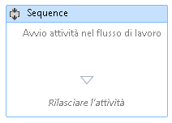
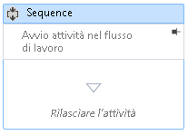

# Procedura: aggiungere commenti a un flusso di lavoro in Progettazione del flusso di lavoro
Per facilitare la creazione di flussi di lavoro più ampi e complessi, [!INCLUDE[net_v45](../ide/includes/net_v45_md.md)] consente allo sviluppatore di aggiungere annotazioni ai seguenti tipi di elementi nella finestra di progettazione:  
  
-   <xref:System.Activities.Activity>  
  
-   <xref:System.Activities.Statements.State>  
  
-   <xref:System.Activities.Statements.Transition>  
  
-   Classi derivate da <xref:System.Activities.Statements.FlowNode>  
  
-   <xref:System.Activities.Variable>  
  
-   <xref:System.Activities.Argument>  
  
> [!IMPORTANT]
>  Il contenuto di un'annotazione viene salvato come testo normale nel file XAML associato al flusso di lavoro e potrebbe potenzialmente essere letto da altri.Prestare attenzione quando vengono fornite informazioni riservate in un'unica annotazione.  
  
### Aggiunta di un'annotazione a un'attività nella finestra di progettazione  
  
1.  In Progettazione flussi di lavoro, fare clic con il pulsante destro del mouse su un elemento in Progettazione flussi di lavoro e selezionare **Annotazioni**, **Aggiungi annotazione**.  
  
2.  Aggiungere il testo dell'annotazione nello spazio disponibile.  
  
3.  Nell'elemento verrà visualizzata un'icona dell'annotazione.Passare il mouse sull'icona di annotazione per visualizzare il testo dell'annotazione.  
  
       
  
### Visualizzazione di un'annotazione della finestra di progettazione dell'attività  
  
1.  Con un ActivityDesigner che dispone di un'annotazione che verrà visualizzata all'esterno dell'attività, fare clic sull'icona **Blocca** nello strumento decorativo visuale dell'annotazione.  
  
2.  Le annotazioni vengono visualizzati nella finestra di progettazione dell'attività.Nella schermata riportata di seguito, l'annotazione "inizia attività nel flusso di lavoro" viene visualizzata nella finestra di progettazione dell'attività.  
  
       
  
3.  Per visualizzare l'annotazione all'esterno della finestra di progettazione dell'attività, passare il mouse sull'area dell'annotazione nella finestra di progettazione dell'attività e fare clic sull'icona **Sblocca**  
  
       
  
### Mostra o nascondi tutte le annotazioni  
  
1.  Fare clic con il pulsante destro del mouse su un'attività che dispone di annotazione.Selezionare **Annotazioni**, **Visualizza tutte le annotazioni**.  
  
2.  Tutte le annotazioni verranno visualizzate nelle finestre di progettazione dell'attività.  
  
3.  Per visualizzare tutte le annotazioni al di fuori delle finestre di progettazione dell'attività, fare clic con il pulsante destro del mouse sull'attività e selezionare **Annotazioni**, **Nascondi tutte le annotazioni**.  
  
### Modifica o eliminazione di un'annotazione per un'attività  
  
1.  Fare clic con il pulsante destro del mouse su un'attività che dispone di un'annotazione.  
  
2.  Seleziona **Annotazioni**, **Modifica annotazione** o **Elimina annotazione**.  
  
3.  L'annotazione verrà aperta per la modifica o l'eliminazione.  
  
4.  Per eliminare tutte le annotazioni immediatamente, fare clic con il pulsante destro del mouse su Progettazione flussi di lavoro e selezionare **Annotazione**, **Elimina tutte le annotazioni**.  
  
### Aggiunta, modifica ed eliminazione di un'annotazione per una variabile o un argomento  
  
1.  Fare clic con il pulsante destro del mouse su una variabile o un argomento e selezionare Aggiungi annotazione.  
  
2.  Immettere il testo dell'annotazione.Nella variabile o nell'argomento verrà visualizzata un'icona dell'annotazione.  
  
3.  Fare clic con il pulsante destro del mouse su una variabile o un argomento che dispone di un'annotazione.Selezionare Modifica annotazione.  
  
4.  L'annotazione verrà aperta per la modifica.  
  
5.  Fare clic con il pulsante destro del mouse su una variabile o un argomento che dispone di un'annotazione.Selezionare Elimina annotazione.  
  
6.  L'annotazione verrà eliminata.