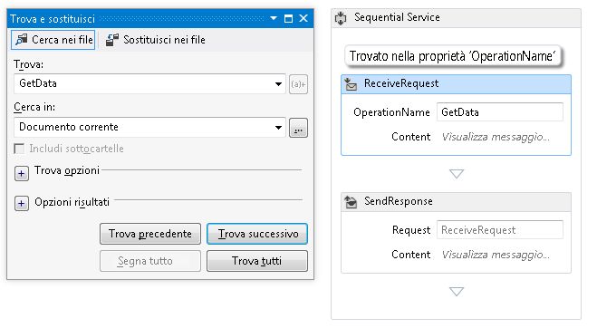

# Procedura: utilizzare la ricerca in Progettazione del flusso di lavoro
Per facilitare la creazione di flussi di lavoro più ampi e complessi, è possibile utilizzare la ricerca in Progettazione flussi di lavoro per trovare gli elementi per parola chiave.Notare che la finestra di progettazione non supporta la sostituzione.La ricerca nella finestra di progettazione verrà trovato quanto segue:  
  
## Ricerca veloce  
 La ricerca rapida troverà nella finestra di progettazione quanto segue:  
  
-   Proprietà degli oggetti <xref:System.Activities.Activity>, <xref:System.Activities.Statements.FlowNode>, <xref:System.Activities.Statements.State>, delle transizioni e di altri elementi di controllo del flusso personalizzati.  
  
-   Variabili  
  
-   Argomenti  
  
-   Espressioni  
  
#### Utilizzo di Ricerca veloce  
  
1.  Con la Progettazione flussi di lavoro aperta, premere **CTRL\+F**, o selezionare **Modifica**, **Trova e sostituisci**, **Ricerca veloce**.  
  
2.  Fornire il termine di ricerca nella casella di testo **Trova** e fare clic **Trova successivo**.  
  
3.  Il termine di ricerca è posizionato nel flusso di lavoro corrente.Nella schermata seguente viene illustrato un nome visualizzato dell'attività che si trova nella finestra di progettazione.  
  
       
  
## Cerca nei file  
 Tramite l'utilizzo di Cerca nei file è possibile trovare le stringhe nei file del flusso di lavoro, inclusi i file XAML.  
  
#### Utilizzo di Cerca nei file  
  
1.  In Visual Studio, premere **CTRL \+ MAIUSC \+ F** oppure selezionare **Modifica**, **Trova e sostituisci**, **Cerca nei file**.  
  
2.  Fornire l'elemento di ricerca nella casella di testo **Trova** e fare clic **Trova tutto**.  
  
3.  Il risultato di ricerca verrà visualizzato nella visualizzazione di [!INCLUDE[vs_current_short](../code-quality/includes/vs_current_short_md.md)]**Risultati di ricerca**.Facendo doppio clic su un elemento del risultato verrà visualizzata l'attività contenente la corrispondenza nella finestra di progettazione del flusso di lavoro.