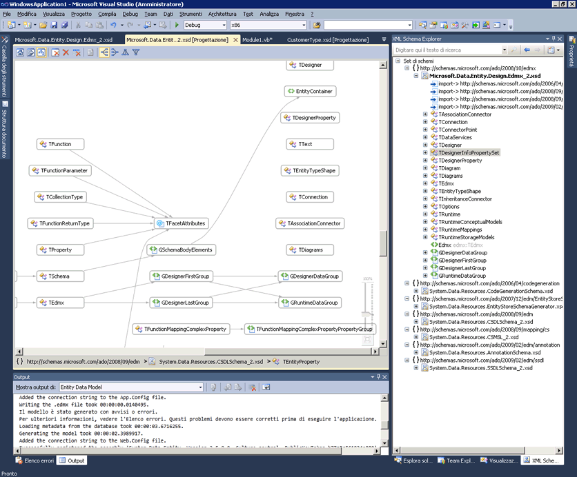
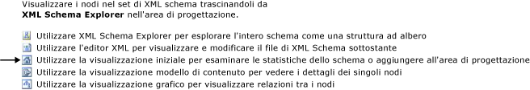

# Visualizzazione grafico
Visualizzazione grafico fornisce una rappresentazione grafica dei nodi dello schema globali e delle relazioni tra i nodi. Si noti che la visualizzazione grafico non consente di modificare il layout del set di schemi nell'area di progettazione. Visualizzazione grafico include anche la barra degli strumenti Progettazione XML Schema e la barra di navigazione.  
  
 Nell'immagine seguente viene illustrata la visualizzazione grafico con sei nodi globali sulla relativa area di progettazione.  
  
   
  
## Area di progettazione  
 Finestra di progettazione della visualizzazione grafico consente di visualizzare il contenuto del [area di lavoro Progettazione XML Schema](../xml-tools/xml-schema-designer-workspace.md). Se l'area di lavoro contiene eventuali nodi globali del set di schemi, i nodi vengono mostrati nell'area di progettazione della visualizzazione grafico e vengono tracciate frecce tra i nodi tra cui intercorrono relazioni.  
  
 Facendo doppio clic su un nodo nella visualizzazione grafico verrà visualizzato l'editor XML.  
  
 Per eliminare i nodi selezionati dall'area di lavoro, usare la barra degli strumenti Progettazione XSD o il tasto CANC.  
  
 Se l'area di progettazione è vuota, vengono visualizzati l'editor XML, XML Schema Explorer e la filigrana. Il *filigrana* è un elenco di collegamenti a tutte le visualizzazioni di progettazione XSD.  
  
   
  
 Se il set di schemi contiene errori, alla fine dell'elenco viene visualizzato il testo: "Usare l'elenco degli errori per visualizzare e correggere gli errori nel set di schemi".  
  
## Barra di navigazione  
 Tramite la barra di navigazione nella parte inferiore della visualizzazione grafico viene mostrato dove si trova il nodo selezionato nel set di schemi. Se vengono selezionati più elementi, la barra di navigazione sarà vuota.  
  
## Menu di scelta rapida  
 Nella tabella seguente vengono descritte le opzioni disponibili per tutti i nodi nell'area di progettazione della visualizzazione grafico.  
  
|Opzione|Descrizione|  
|------------|-----------------|  
|**Mostra in XML Schema Explorer**|Inserisce lo stato attivo su Schema Explorer ed evidenzia il nodo del set di schemi.|  
|**Mostra in visualizzazione grafico**|Passa alla visualizzazione grafico (visualizzato in grigio).|  
|**Genera XML di esempio**|Disponibile solo per elementi globali. Consente di generare un file XML di esempio per l'elemento globale.|  
|**Cancella area di lavoro**|Cancella l'area di lavoro e l'area di progettazione.|  
|**Rimuovere dall'area di lavoro**|Rimuove i nodi selezionati dall'area di lavoro e dall'area di progettazione.|  
|**Rimuovere tutto tranne gli elementi selezionati dall'area di lavoro**|Rimuove i nodi non selezionati dall'area di lavoro e dall'area di progettazione.|  
|**Esporta diagramma come immagine...**|Salva l'area di progettazione in un file XPS.|  
|**Seleziona tutto**|Seleziona tutti i nodi nell'area di progettazione.|  
|**Visualizza codice**|Consente di aprire il file che contiene il nodo selezionato nell'editor XML. L'elemento selezionato in XML Schema Explorer sarà selezionato anche nell'editor XML.|  
|**Finestra Proprietà**|Apre il **proprietà** finestra (se non è già aperto). In questa finestra verranno visualizzate le informazioni sul nodo.|  
  
 Oltre alle opzioni comuni descritte in precedenza, nel menu di scelta rapida per gli elementi globali sono disponibili anche le opzioni seguenti:  
  
|Opzione|Descrizione|  
|------------|-----------------|  
|**Aggiungi definizione di tipo**|Aggiunge il tipo base al diagramma.|  
|**Aggiungere tutti i riferimenti**|Aggiunge tutti i nodi che fanno riferimento all'elemento e disegna frecce che indicano le relazioni tra loro.|  
|**Aggiungere i membri del gruppo di sostituzione**|Aggiunge tutti i membri del gruppo di sostituzione. Questa opzione viene visualizzata se l'elemento è l'intestazione o il membro di un gruppo di sostituzione.|  
|**Genera XML di esempio**|Consente di generare un file XML di esempio per l'elemento globale.|  
  
 Oltre alle opzioni comuni descritte in precedenza, nel menu di scelta rapida per i tipi semplici e complessi globali sono disponibili anche le opzioni seguenti:  
  
|Opzione|Descrizione|  
|------------|-----------------|  
|**Aggiungere il tipo di Base**|Se il tipo selezionato è derivato da un tipo globale, aggiunge il tipo di base del tipo selezionato.|  
|**Aggiungere tutti i riferimenti**|Aggiunge tutti i riferimenti del tipo selezionato, inclusi gli elementi e attributi del tipo selezionato e i tipi derivati dal tipo selezionato.|  
|**Aggiungere tutti i tipi derivati**|Aggiunge tutti i tipi direttamente e indirettamente derivati dal tipo selezionato.|  
|**Aggiungere tutti i predecessori**|Aggiunge tutti i tipi padre (di base).|  
  
 Oltre alle opzioni comuni descritte in precedenza, nel menu di scelta rapida per i gruppi di attributi e globali sono disponibili anche le opzioni seguenti:  
  
|Opzione|Descrizione|  
|------------|-----------------|  
|**Aggiungere tutti i riferimenti**|Aggiunge tutti i nodi che fanno riferimento al gruppo e disegna frecce che indicano le relazioni tra loro.|  
|**Aggiungere tutti i membri**|Aggiunge tutti i membri del gruppo e disegna frecce che indicano le relazioni tra loro.|  
  
 Oltre alle opzioni comuni descritte in precedenza, nel menu di scelta rapida per gli attributi globali sono disponibili anche le opzioni seguenti:  
  
|Opzione|Descrizione|  
|------------|-----------------|  
|**Aggiungere tutti i riferimenti**|Aggiunge tutti i nodi che fanno riferimento al gruppo e disegna frecce che indicano le relazioni tra loro.|  
  
## Finestra Proprietà  
 Utilizzare il menu di scelta rapida per aprire inizialmente la **proprietà** finestra. Per impostazione predefinita, il **proprietà** finestra viene visualizzata nell'angolo inferiore destro di Visual Studio. Quando si fa clic su un nodo che viene eseguito il rendering nella visualizzazione modello di contenuto, le proprietà di tale nodo verranno visualizzate nel **proprietà** finestra.  
  
## Barra degli strumenti XSD  
 I seguenti pulsanti della barra degli strumenti XSD sono abilitati quando la visualizzazione grafico è attiva.  
  
   
  
|Opzione|Descrizione|  
|------------|-----------------|  
|**Mostra visualizzazione iniziale**|Consente di attivare il [vista](../xml-tools/start-view.md). Questa vista è possibile accedere tramite il tasto di scelta rapida: **CTRL + 1**.|  
|**Mostra visualizzazione modello di contenuto**|Consente di attivare il [visualizzazione modello di contenuto](../xml-tools/content-model-view.md). Questa vista è possibile accedere tramite il tasto di scelta rapida: **CTRL + 2**.|  
|**Mostra visualizzazione grafico**|Consente di attivare il [visualizzazione grafica](../xml-tools/graph-view.md). Questa vista è possibile accedere tramite il tasto di scelta rapida: **CTRL + 3**.|  
|**Cancella area di lavoro**|Cancella l'area di lavoro e l'area di progettazione.|  
|**Rimuovere dall'area di lavoro**|Rimuove i nodi selezionati dall'area di lavoro e dall'area di progettazione.|  
|**Rimuovere tutto tranne gli elementi selezionati dall'area di lavoro**|Rimuove i nodi non selezionati dall'area di lavoro e dall'area di progettazione. Questa opzione è abilitata nella visualizzazione modello di contenuto e nella visualizzazione grafico.|  
|**Sinistra a destra**|Modifica il layout nella visualizzazione grafico in una rappresentazione gerarchica da sinistra a destra dei nodi. Questa opzione è possibile accedere tramite il tasto di scelta rapida: **Alt + freccia destra**.|  
|**Da destra a sinistra**|Modifica il layout nella visualizzazione grafico in una rappresentazione gerarchica da destra a sinistra dei nodi. Questa opzione è possibile accedere tramite il tasto di scelta rapida: **Alt + freccia sinistra**.|  
|**Dall'alto in basso**|Modifica il layout nella visualizzazione grafico in una rappresentazione gerarchica dall'alto in basso dei nodi. Questa opzione è possibile accedere tramite il tasto di scelta rapida: **Alt + freccia giù**.|  
|**Dal basso in alto**|Modifica il layout nella visualizzazione grafico in una rappresentazione gerarchica dal basso in alto dei nodi. Questa opzione è possibile accedere tramite il tasto di scelta rapida: **Alt + freccia**.|  
  
## Panoramica/scorrimento  
 È possibile eseguire una panoramica dell'area di progettazione tramite le barre di scorrimento o tenendo premuto il tasto CTRL mentre si fa clic e si trascina il mouse. Quando si esegue una panoramica dell'area di progettazione tramite selezione e trascinamento, il cursore sarà modificato in quattro frecce incrociate che puntano in quattro direzioni.  
  
## Annullamento/ripristino  
 La funzionalità di annullamento/ripristino è abilitata nella visualizzazione grafico per le seguenti azioni:  
  
-   Aggiunta di un singolo nodo tramite trascinamento.  
  
-   Aggiunta di più nodi dalla finestra dei risultati della ricerca nelle query relative a Schema Explorer o alla visualizzazione iniziale.  
  
-   Eliminazione di uno o più nodi.  
  
## Zoom  
 Lo zoom è disponibile nell'angolo inferiore destro della visualizzazione grafico.  
  
 È possibile controllare lo zoom nei seguenti modi:  
  
-   Tenendo premuto il tasto CTRL e ruotando la rotellina del mouse quando il mouse si trova sull'area di visualizzazione grafico.  
  
-   Tramite il dispositivo di scorrimento. Il dispositivo di scorrimento mostra il livello di zoom corrente.  
  
Il dispositivo di scorrimento dello zoom è opaco quando lo si seleziona, si posiziona il mouse su di esso o si usa il tasto CTRL insieme alla rotellina del mouse per ingrandire; altrimenti è trasparente.  
  
## Integrazione dell'editor XML  
 È possibile passare dalla visualizzazione grafico all'editor XML facendo clic su un nodo e usando il menu di scelta rapida Visualizza codice.  
  
 Se si apportano modifiche al set di schemi nell'editor XML, le modifiche saranno sincronizzate nella visualizzazione grafico. Per ulteriori informazioni, vedere [integrazione con l'Editor XML](../xml-tools/integration-with-xml-editor.md).  
  
## Vedere anche  
 [Area di progettazione](../xml-tools/xml-schema-designer-workspace.md)