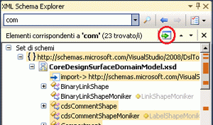

# Procedura: aggiungere nodi dei risultati di ricerca del set di schemi all&#39;area di lavoro
[!INCLUDE[vs2017banner](../code-quality/includes/vs2017banner.md)]

In questo argomento viene illustrato come aggiungere nodi evidenziati in XML Schema Explorer come risultato di una ricerca per parole chiave nell'area di lavoro.  
  
> [!NOTE]
>  È possibile aggiungere solo nodi globali all'[area di lavoro](../xml-tools/xml-schema-designer-workspace.md).  
  
 In questo esempio viene utilizzato lo [Schema di ordine di acquisto](../xml-tools/sample-xsd-file-purchase-order-schema.md) di esempio.  
  
### Per aggiungere nodi dei risultati del set di schemi  
  
1.  Seguire la procedura indicata in [Procedura: creare e modificare un file di schema XSD](../xml-tools/how-to-create-and-edit-an-xsd-schema-file.md).  
  
2.  Digitare "purchaseOrder" nella casella di testo di ricerca della barra degli strumenti di [XML Explorer](../xml-tools/xml-schema-explorer.md) e fare clic sul pulsante di ricerca.  
  
       
  
     I risultati della ricerca sono evidenziati in XML Schema Explorer e contrassegnati con un segno di spunta sulla barra di scorrimento verticale.  
  
3.  Aggiungere i risultati della ricerca all'area di lavoro facendo clic sul pulsante **Aggiungi nodi evidenziati all'area di lavoro** nel riquadro dei risultati di riepilogo.  
  
       
  
     I nodi `purchaseOrder` e `PurchaseOrderType` sono visualizzati uno accanto all'altro nell'area di progettazione della [visualizzazione grafico](../xml-tools/graph-view.md).Poiché i due nodi sono correlati \(l'elemento `purchaseOrder` è di tipo `PurchaseOrderType`\), viene tracciata una freccia tra loro.