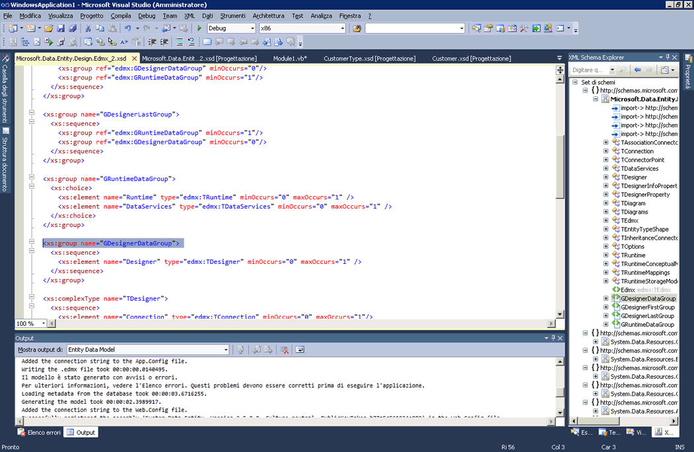

# Integrazione di valori letterali XML con XML Schema Explorer
[!INCLUDE[vs2017banner](../code-quality/includes/vs2017banner.md)]

Visual Basic supporta valori letterali XML; ciò significa che è possibile incorporare direttamente frammenti XML nel codice Visual Basic.Per ulteriori informazioni, vedere [Panoramica sui valori letterali XML](http://go.microsoft.com/fwlink/?LinkId=140325) \(la pagina potrebbe essere in inglese\).  
  
 Se un file XSD nel progetto di Visual Basic include un valore letterale XML, è possibile visualizzare il set di schemi XML in XML Schema Explorer.Per visualizzare il set di schemi associato a un valore letterale XML, fare clic con il pulsante destro del mouse su un nodo XML in un'importazione di valore letterale XML o spazio dei nomi XML e selezionare **Mostra in Schema Explorer**.  
  
   
  
 Ciò consente di aprire XML Schema Explorer affiancato al file di Visual Basic.  
  
   
  
 Questa funzionalità è stata introdotta in Visual Studio 2008 SP1.Per vedere un'intervista in cui questa funzionalità viene spiegata in dettaglio, vedere [Intervista di Canale 9 : XML Schema Explorer in Visual Studio 2008 SP1](http://go.microsoft.com/fwlink/?LinkId=140183) \(la pagina potrebbe essere in inglese\).  
  
## Vedere anche  
 [Procedura: utilizzare Progettazione XML Schema con i valori letterali XML](../xml-tools/how-to-use-the-xml-schema-designer-with-xml-literals.md)