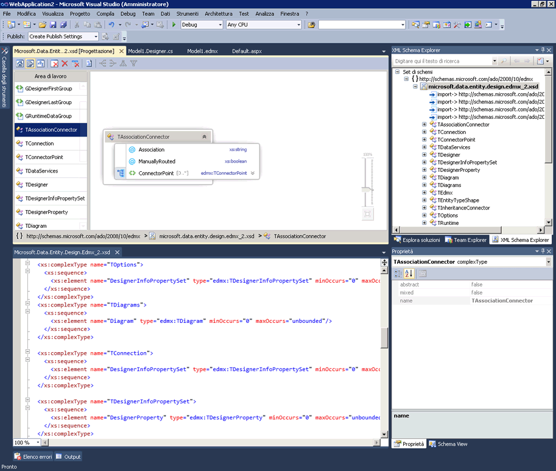

# Integrazione con l&#39;editor XML
[!INCLUDE[vs2017banner](../code-quality/includes/vs2017banner.md)]

Progettazione XML Schema è integrato con l'editor XML.Se si modifica un file XSD nell'editor XML, la modifica si rifletterà anche in [XML Schema Explorer](../xml-tools/xml-schema-explorer.md).La modifica si rifletterà anche nella [visualizzazione grafico](../xml-tools/graph-view.md) o nella [visualizzazione modello di contenuto](../xml-tools/content-model-view.md), qualora sia aperta.È possibile spostarsi tra Progettazione XML Schema e l'editor XML nei seguenti modi:  
  
-   Nell'editor XML fare clic con il pulsante destro del mouse su un nodo e selezionare **Mostra in XML Schema Explorer**.  
  
-   Nella visualizzazione grafico e in XML Schema Explorer fare doppio clic o fare clic con il pulsante destro del mouse su un nodo e selezionare **Visualizza codice**.Nella visualizzazione modello di contenuto, fare clic con il pulsante destro del mouse su un nodo e selezionare **Visualizza codice**.  
  
 Nella schermata seguente è mostrato uno schema XML aperto in XML Schema Explorer.In XML Schema Explorer il set di schemi viene visualizzato con una struttura ad albero.Nell'editor XML viene visualizzato il testo del nodo attualmente attivo in XML Schema Explorer.  
  
   
  
 Qualche volta è utile visualizzare il codice nell'editor XML e la finestra di progettazione grafica uno accanto all'altro.Per visualizzare entrambi i file contemporaneamente, fare clic con il pulsante destro del mouse in un punto qualsiasi dell'editor XML e selezionare **Progettazione visualizzazioni**.Nel menu Finestre di Visual Studio, selezionare **Nuovo gruppo di schede orizzontali \(o verticali\)**.  
  
   
  
## Vedere anche  
 [XML Schema Explorer](../xml-tools/xml-schema-explorer.md)