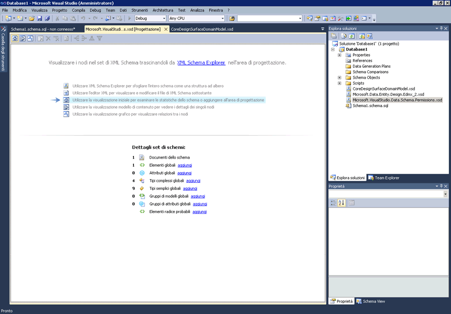

# Visualizzazione iniziale
[!INCLUDE[vs2017banner](../code-quality/includes/vs2017banner.md)]

La visualizzazione iniziale è il punto di avvio per Progettazione XML Schema \(XSD\).Quando si crea un nuovo file XSD, inizialmente verrà visualizzata la visualizzazione iniziale.  
  
 La visualizzazione iniziale contiene due sezioni principali, la *filigrana* e il riquadro **Dettagli set di schemi**.Include anche la barra degli strumenti, disponibile in tutte le visualizzazioni di Progettazione XSD.  
  
   
  
## Filigrana  
 Il riquadro della filigrana contiene un elenco di collegamenti a tutte le visualizzazioni di Progettazione XSD, Editor XML e XML Schema Explorer.Se il set di schemi contiene errori, alla fine dell'elenco viene visualizzato il testo: "Utilizzare l'elenco degli errori per visualizzare e correggere gli errori nel set di schemi".  
  
## Dettagli set di schemi  
 Nel riquadro **Dettagli set di schemi** sono elencati i tipi di nodo dello schema globali ed è visualizzato il numero di istanze di ogni tipo che si trova nello schema.È possibile utilizzare i collegamenti di **aggiunta** accanto ai tipi di nodo per aggiungere nuovi nodi all'area di lavoro.  
  
## Barra degli strumenti  
 È possibile spostarsi tra la visualizzazione iniziale, la [visualizzazione modello di contenuto](../xml-tools/content-model-view.md) e la [visualizzazione grafico](../xml-tools/graph-view.md) dalla barra degli strumenti di Progettazione XML Schema.  
  
   
  
 I seguenti pulsanti sono abilitati nella barra degli strumenti di Progettazione XSD quando è attiva la visualizzazione iniziale:  
  
|Opzione|Descrizione|  
|-------------|-----------------|  
|**Mostra visualizzazione iniziale**|Passa alla visualizzazione iniziale.È possibile accedere a questa visualizzazione tramite i tasti di scelta rapida: **CTRL \+ 1**.|  
|**Mostra visualizzazione modello di contenuto**|Passa alla visualizzazione modello di contenuto.È possibile accedere a questa visualizzazione tramite i tasti di scelta rapida: **CTRL \+ 2**.|  
|**Mostra visualizzazione grafico**|Passa alla visualizzazione grafico.È possibile accedere a questa visualizzazione tramite i tasti di scelta rapida: **CTRL \+ 3**.|  
  
## Vedere anche  
 [XML Schema Explorer](../xml-tools/xml-schema-explorer.md)   
 [Visualizzazione grafico](../xml-tools/graph-view.md)   
 [Visualizzazione modello di contenuto](../xml-tools/content-model-view.md)   
 [Editor XML](../xml-tools/xml-editor.md)