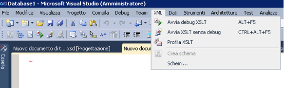

# Profiler XSLT
Il Profiler XSLT è uno strumento di profiler di analisi delle prestazioni che consente di sviluppare ed eseguire debug di documenti XSLT. Il Profiler XSLT consente agli sviluppatori di misurare e valutare i problemi correlati alle prestazioni nel codice XSLT creando rapporti dettagliati sulle prestazioni XSLT. Il Profiler XSLT include utili suggerimenti per l'ottimizzazione dei fogli di stile XSLT e XSL, essenziale per le applicazioni XSLT che richiedono massime prestazioni.  
  
Il Profiler XSLT è parte di Visual Studio ed è disponibile dal **XML** menu.  
  

  
> [!NOTE]
>  Alcuni schermi potrebbero essere diversi nella versione di Visual Studio rispetto a questi argomenti, alcuni elementi visivi sono state modificate dopo che sono state acquisite queste schermate.  
  
## Vedere anche  
[Procedura dettagliata: Profiler XSLT](../xml-tools/walkthrough-xslt-profiler.md)