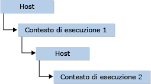

# <a name="hosting-the-javascript-runtime"></a>Hosting del runtime di JavaScript
Le API del runtime JavaScript (JsRT) forniscono un modo, per le applicazioni desktop, di Windows Store e lato server in esecuzione nel sistema operativo Windows, per aggiungere funzionalità di script all'applicazione usando il motore JavaScript Chakra basato su standard usato anche da Microsoft Edge e Internet Explorer. Queste API sono disponibili in Windows 10 e in qualsiasi versione del sistema operativo Windows con Internet Explorer versione 11.0 installato nel computer. Per altre informazioni, vedi [Reference (JavaScript Runtime)](../chakra-hosting/reference-javascript-runtime.md). Per informazioni sull'uso di JsRT nelle app di Windows Store, vedere [JsRT and the Universal Windows Platform](#Windows).  
  
> [!NOTE]
>  In questa documentazione si presuppone una conoscenza generale del funzionamento del linguaggio JavaScript.  
  
## <a name="concepts"></a>Concetti  
 La comprensione della modalità di ospitare il motore JavaScript utilizzando le API JsRT dipende da due concetti chiave: i runtime e i contesti di esecuzione.  
  
 Un *runtime* rappresenta un ambiente di esecuzione JavaScript completo. A ogni runtime creato vengono associati il proprio heap isolato sottoposto a Garbage Collection e, per impostazione predefinita, il relativo thread del compilatore JIT (Just-In-Time) e il thread GC (Garbage Collector). Un *contesto di esecuzione* rappresenta un ambiente JavaScript a cui è associato un proprio oggetto globale JavaScript distinto da tutti gli altri contesti di esecuzione. In un runtime possono essere contenuti più contesti di esecuzione e, in questi casi, da tutti i contesti di esecuzione vengono condivisi il compilatore JIT e il thread GC associati al runtime.  
  
 I runtime rappresentano un singolo thread di esecuzione. In un determinato thread può essere attivo un solo runtime alla volta e quest'ultimo può essere attivo in un solo thread alla volta. I runtime sono a disposizione dei thread, pertanto un runtime che non è attualmente attivo in un thread, cioè tramite esso non viene eseguito alcun codice JavaScript né vengono fornite risposte alle chiamate dall'host, può essere usato in qualsiasi thread che non disponga già di un runtime attivo.  
  
 I contesti di esecuzione sono vincolati a un runtime particolare e tramite essi viene eseguito il codice nel runtime in questione. A differenza dei runtime, in un thread possono essere attivi contemporaneamente più contesti di esecuzione. Pertanto, tramite un host è possibile effettuare una chiamata in un contesto di esecuzione, in questo contesto di esecuzione è possibile richiamare l'host e tramite l'host è possibile effettuare una chiamata in un contesto di esecuzione diverso.  
  
   
  
 In pratica, a meno che in un host non sia necessario eseguire del codice in ambienti separati, può essere usato un unico contesto di esecuzione. Analogamente, a meno che in un host non sia necessario eseguire più parti di codice contemporaneamente, sarà sufficiente un singolo runtime.  
  
## <a name="memory-management"></a>Gestione della memoria  
 JavaScript è un linguaggio sottoposto a Garbage Collection e, pertanto, vi sono diverse considerazioni di cui tener conto quando si utilizzano le API JsRT di un altro linguaggio.  
  
 La considerazione principale è che tramite il Garbage Collector di JavaScript è possibile visualizzare i riferimenti ai valori solo in due posizioni: l'heap del runtime e lo stack. Di conseguenza, un riferimento a un valore JavaScript archiviato in un altro valore JavaScript o in una variabile locale nello stack verrà sempre visualizzato dal Garbage Collector. Tuttavia, i riferimenti archiviati in altre posizioni, ad esempio gli heap gestiti dall'host o dal sistema, non verranno visualizzati dal Garbage Collector e potrebbero causare una raccolta prematura di valori ancora in uso dall'host.  
  
> [!IMPORTANT]
>  Tramite alcuni compilatori di linguaggio, ad esempio quello di Visual Studio C++, sarà possibile ottimizzare le variabili locali presenti, laddove possibile. È necessario prestare particolare attenzione per assicurarsi che le variabili locali tramite cui viene fatto riferimento a valori JavaScript siano nello stack se si prevede di mantenere questi valori attivi.  
  
 Se un riferimento a un valore JavaScript verrà archiviato in una posizione non visibile al Garbage Collector, nell'host sarà necessario aggiungere e rimuovere manualmente i riferimenti utilizzando le API JsRT.  
  
## <a name="exception-handling"></a>Gestione delle eccezioni  
 In caso di eccezione JavaScript durante l'esecuzione di script, il runtime contenitore viene posto in uno stato di eccezione. Durante uno stato di eccezione, nessun codice potrà essere eseguito e tutte le chiamate API avranno esito negativo con il codice di errore `JsErrorInExceptionState` fino a quando non verrà recuperata ed eliminata l'eccezione da parte dell'host tramite l'API `JsGetAndClearException` . Se l'host restituisce un valore tramite un callback JavaScript senza rimuovere lo stato di eccezione dal runtime, l'eccezione JavaScript verrà generata ancora una volta non appena il controllo passa di nuovo al motore JavaScript. Questo consente inoltre ai callback dell'host di generare un'eccezione JavaScript impostando il runtime in uno stato di eccezione e restituendo quindi un valore tramite un callback dell'host.  
  
 A un host non è consentito propagare le proprie eccezioni interne attraverso un relativo callback; tutte le eccezioni host devono essere rilevate da tutti i metodi di callback prima della restituzione del controllo al runtime.  
  
## <a name="runtime-resource-usage"></a>Utilizzo delle risorse di runtime  
 Le API JsRT forniscono varie possibilità di monitorare e modificare la modalità di utilizzo di risorse da parte del runtime. Generalmente si suddividono nelle seguenti categorie:  
  
-   **Utilizzo di thread**. Per impostazione predefinita, in ogni runtime verranno creati un thread del compilatore JIT dedicato e un thread GC dedicato che verranno utilizzati dal runtime in questione. Se un runtime viene creato con il flag `JsRuntimeAttributeDisableBackgroundWork` , il lavoro di GC e di JIT verrà eseguito nel thread del runtime stesso, anziché nei rispettivi thread separati in background. Un host può inoltre fornire un callback di servizio del thread alla chiamata `JsCreateRuntime` , in modo che nell'host sia possibile pianificare il lavoro di JIT e del GC in maniera appropriata.  
  
-   **Utilizzo memoria**. Sono disponibili diversi modi per monitorare e modificare l'utilizzo della memoria di un runtime. Se il runtime sarà in esecuzione a lungo, nell'host si potrà specificare il flag `JsRuntimeAttributeEnableIdleProcessing` quando si crea il runtime e quindi chiamare `JsIdle` quando l'host passa a uno stato di inattività. In questo modo, tramite il motore sarà possibile rinviare alcune operazioni di pulizia e di gestione della memoria fino alla fase di inattività.  
  
     Tramite l'host è possibile monitorare le operazioni di Garbage Collection chiamando `JsSetRuntimeBeforeCollectCallback`. È inoltre possibile monitorare le allocazioni effettuate dall'heap chiamando `JsSetRuntimeMemoryAllocationCallback`. Si noti che tramite questa API viene eseguita una richiamata su ogni allocazione JavaScript solo quando per l'heap del runtime sarà necessario più spazio da allocare. Al callback di allocazione della memoria è consentito negare la richiesta, mediante la quale verrà attivata un'operazione di Garbage Collection e, se non vi è memoria disponibile, verrà generato un errore di memoria insufficiente nel runtime.  
  
     Tramite l'host è inoltre possibile chiamare `JsSetRuntimeMemoryLimit` per impostare un limite per la quantità di memoria utilizzabile da un runtime. Quando viene raggiunto il limite dal runtime, viene avviata un'operazione di Garbage Collection e, se non vi è memoria disponibile, verrà generato un errore di memoria insufficiente dal runtime.  
  
-   **Interruzione e valutazione di script**. Tramite l'host è possibile chiamare `JsDisableRuntimeExecution` per terminare l'esecuzione in un runtime. Questa chiamata può essere effettuata in qualsiasi momento e da qualsiasi thread. Dal momento che l'interruzione di uno script dipende dal raggiungimento dei punti guard inseriti nel codice, questa interruzione potrebbe non verificarsi al momento esatto, bensì poco dopo. Per impostazione predefinita, i punti guard di interruzione vengono inseriti nel codice generato in maniera conservativa e non sono adeguati a ogni situazione, ad esempio un ciclo infinito. La creazione del runtime con il flag `JsRuntimeAttributeAllowScriptInterrupt` determina l'inserimento di controlli aggiuntivi per i cicli infiniti da parte del runtime, spesso al costo di un leggero sovraccarico delle prestazioni.  
  
     Se con un host si desidera impedire la generazione di codice nativo dal compilatore JIT, è possibile specificare il flag `JsRuntimeAttributeDisableNativeCodeGeneration` . Tramite un host è inoltre possibile impedire l'esecuzione dinamica degli script stessi specificando il flag `JsRuntimeAttributeDisableEval` .  
  
## <a name="debugging-and-profiling"></a>Debug e profilatura  
 Le API JsRT supportano il debug e la profilazione tramite la tecnologia di scripting.  
  
 A partire da Windows 10, il motore JavaScript Chakra supporta un motore legacy e un motore Edge e JsRT consente di sceglierli entrambi come destinazione (vedere [Edge come destinazione vs. Motori Legacy](../chakra-hosting/targeting-edge-vs-legacy-engines-in-jsrt-apis.md) per informazioni dettagliate). Il debug di uno script in Visual Studio funziona in modo diverso tra motore legacy ed Edge. Con il motore legacy, l'host deve fornire un puntatore [Interfaccia IDebugApplication](../winscript/reference/idebugapplication-interface.md), che può essere ottenuto da un istanza di [Interfaccia IProcessDebugManager](../winscript/reference/iprocessdebugmanager-interface.md). Con il motore Edge `IDebugApplication` è deprecato e il motore Chakra offre funzionalità di debug nativo e di script tramite il debugger di Visual Studio senza richiedere un'implementazione di `IDebugApplication` da parte dell'utente.  
  
 Per consentire il debug degli script in un contesto di esecuzione, il motore Chakra deve passare all'uso di metodi di esecuzione del codice meno efficienti. Di conseguenza, il codice di cui è possibile eseguire il debug viene eseguito in genere più lentamente rispetto al codice di cui non è possibile eseguire il debug. Per questo motivo, con il motore legacy, un host può scegliere di avviare il debug in un contesto di esecuzione dall'inizio, fornendo il puntatore `IDebugApplication` all'inizio tramite `JsCreateContext`, oppure di attendere che il debug sia necessario e quindi chiamare `JsStartDebugging`. Con il motore Edge, `JsCreateContext` non accetta più un parametro `IDebugApplication` e, di conseguenza, il debug dello script è possibile solo dopo la chiamata di `JsStartDebugging` . Per eseguire il debug usando Visual Studio, l'opzione del debugger "Script" deve essere abilitata.  
  
 Il codice JavaScript in un contesto di esecuzione può essere profilato in due modi. Il profiler di Visual Studio da riga di comando (vsperf.exe) può essere usato in Windows 8.1 e versioni successive con l'opzione /js per generare un report destinato al codice JavaScript eseguito nell'applicazione. In alternativa, tramite l'host è possibile chiamare direttamente `JsStartProfiling` e `JsStopProfiling` e fornire un callback per la relativa profilatura. L'host può anche esaminare lo stato dell'heap sottoposto a Garbage Collection chiamando `JsEnumerateHeap`. La profilatura in JsRT funziona nello stesso modo nel motore legacy ed Edge. Tuttavia, le API di profilatura JsRT (`JsStartProfiling`, `JsStopProfiling`, `JsEnumerateHeap`e `JsIsEnumeratingHeap`) non sono disponibili per le app di Windows universale.  
  
<a name="Windows"></a>   
## <a name="jsrt-and-the-universal-windows-platform"></a>JsRT and the Universal Windows Platform  
 È possibile usare le API JsRT per aggiungere funzionalità di script a un'app di Windows universale. Un'app di Windows universale che usa le APIs JsRT dovrà usare come destinazione le API JSRT Edge, che a loro volta usano come destinazione il motore Chakra Edge. Per altre informazioni vedere l'articolo relativo al [confronto tra la scelta del motore Edge o del motore Legacy](../chakra-hosting/targeting-edge-vs-legacy-engines-in-jsrt-apis.md). L'API JsRT completa è disponibile per le app di Windows universale, ad eccezione del supporto per profilatura ed enumerazione dell'heap (`JsStartProfiling`, `JsStopProfiling`, `JsEnumerateHeap`e `JsIsEnumeratingHeap` non sono supportati).  
  
 JsRT consente inoltre l'accesso nativo degli script a qualsiasi [API della piattaforma UWP (Universal Windows Platform)](https://msdn.microsoft.com/en-us/library/windows/apps/br211377.aspx) dopo l'esposizione dello spazio dei nomi dell'API tramite l'API JsRT Edge `JsProjectWinRTNamespace`. Mentre un'applicazione Windows universale non richiede alcuna configurazione oltre alla proiezione degli spazi dei nomi necessari, in un'applicazione Windows classica (Win32) è necessario abilitare un meccanismo di distribuzione delegata con inizializzazione COM tramite `JsSetProjectionEnqueueCallback` per abilitare gli eventi e le API asincrone. L'esempio Win32 seguente usa le API UWP asincrone per creare un client http per ottenere i contenuti da un URI:  
  
```cpp  
typedef struct _jsCall {  
    JsProjectionCallback jsCallback;  
    JsProjectionCallbackContext jsContext;  
    HANDLE event;  
} jsCall;  
  
// Set up delegated pumping mechanism; not necessary in UWP applications.  
jsCall outstandingCall = {};  
CoInitializeEx(nullptr, COINIT_MULTITHREADED);  
JsSetProjectionEnqueueCallback([](JsProjectionCallback jsCallback,   
JsProjectionCallbackContext jsContext, void *callbackState) {  
    jsCall* call = (jsCall*)callbackState;  
    call->jsCallback = jsCallback;  
    call->jsContext = jsContext;  
    SetEvent(call->event);  
    },  
&outstandingCall);  
HANDLE event = CreateEventEx(NULL, NULL, CREATE_EVENT_MANUAL_RESET, EVENT_ALL_ACCESS);  
outstandingCall.event = event;  
  
// Project necessary namespaces.  
JsProjectWinRTNamespace(L"Windows.Foundation");  
JsProjectWinRTNamespace(L"Windows.Web");  
  
// Get content from an Uri.  
JsRunScript(L"var uri = new Windows.Foundation.Uri(\"http://somedatasource.com\"); " \  
    L"var httpClient = new Windows.Web.Http.HttpClient();" \  
    L"httpClient.getStringAsync(uri).done(function (content) { " \  
    L"    // do something with the string content " \    
    L"}, onError); " \  
    L"function onError(reason) { " \  
    L"    // error handling " \        
    L"}",   
    currentSourceContext, L"", &result);  
  
// Wait for async call to come in and then execute; not necessary in UWP applications.  
WaitForSingleObjectEx(outstandingCall.event, 10000, FALSE) == WAIT_OBJECT_0;  
outstandingCall.jsCallback(outstandingCall.jsContext);  
  
```  
  
## <a name="see-also"></a>Vedere anche  
 [App di esempio del runtime JavaScript](http://go.microsoft.com/fwlink/p/?LinkID=306674&clcid=0x409)   
 [Riferimento (JavaScript Runtime)](../chakra-hosting/reference-javascript-runtime.md)   
 [Runtime JavaScript - Hosting](../chakra-hosting/javascript-runtime-hosting.md)